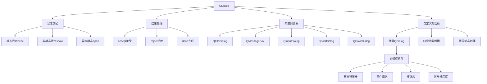
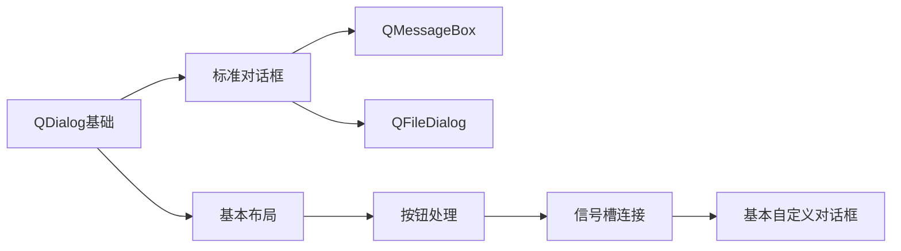
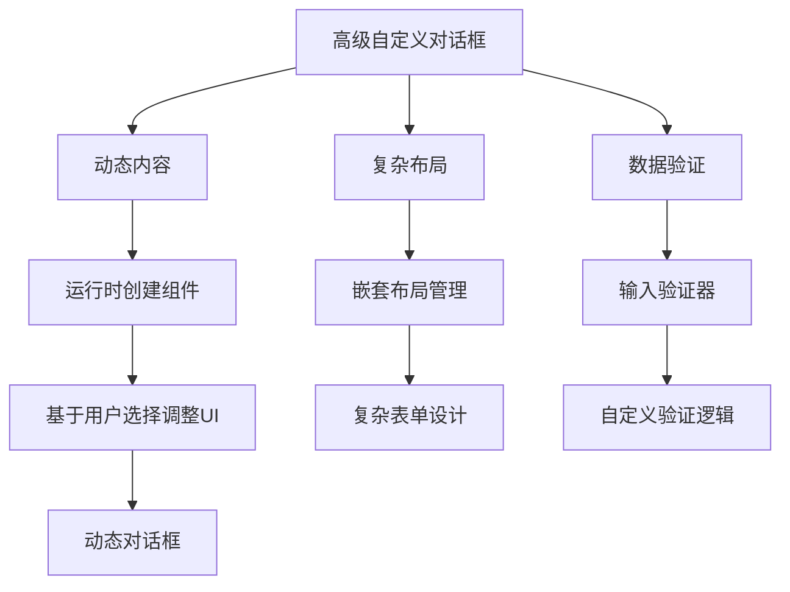
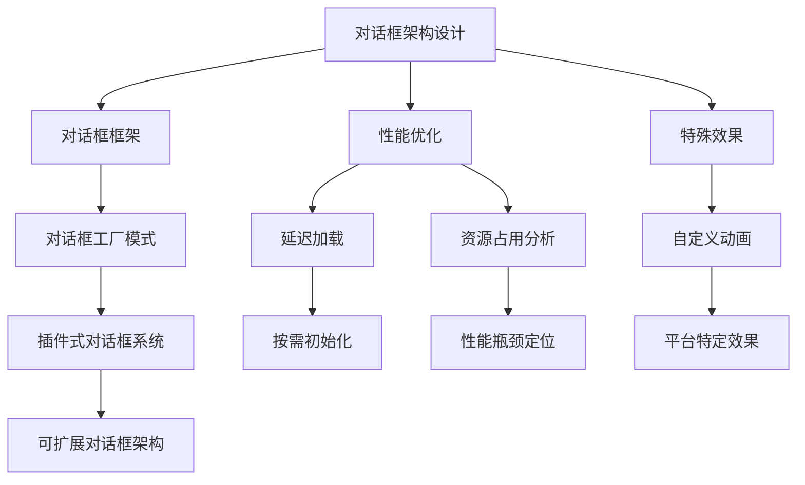
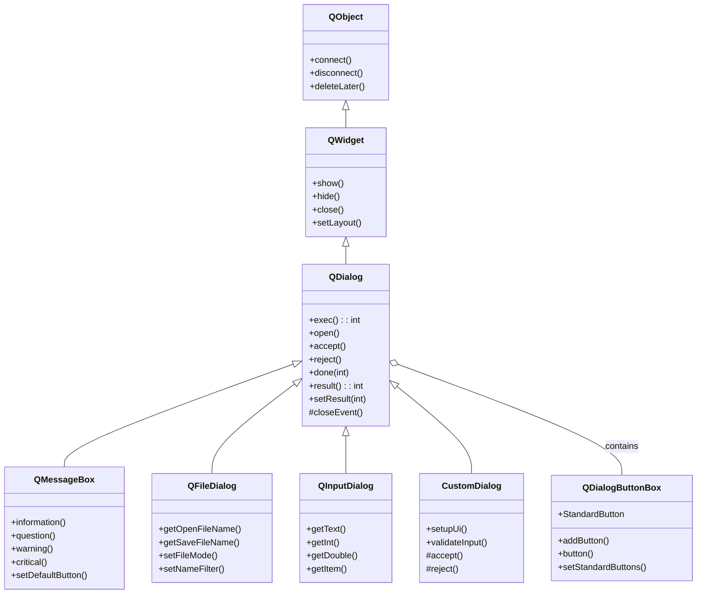

# QDialog 全维度学习笔记

<details> <summary><h2>1️⃣ 原理深度解构层</h2></summary>

### ▌三线解析法

#### **运行时行为**

- **生命周期**：QDialog 创建→显示(exec()/show())→用户交互→返回结果→销毁
- **模态性机制**：模态对话框(exec())阻塞事件循环，非模态对话框(show())不阻塞
- **内存管理**：如同所有 QWidget 子类，使用对象树层次结构，隶属父对象管理
- **事件处理顺序**：closeEvent→reject()/accept()→返回结果→完成或隐藏对话框

#### **源码线索**

- **核心类定义**：QDialog 在 `qdialog.h` 和 `qdialog.cpp` 中实现
- **继承体系**：QDialog ← QWidget ← QObject ← QObjectPrivate
- **关键私有类**：`QDialogPrivate` 在 `qdialog_p.h` 中定义，管理内部状态
- **事件处理**：重写了 `closeEvent()`, `keyPressEvent()`, `showEvent()` 等方法

#### **计算机科学映射**

- **状态机模型**：对话框作为有限状态机(Accepted/Rejected/Exec/Done)
- **栈式调用模型**：exec() 调用类似程序栈调用，LIFO 结构(后进先出)
- **事件-响应模式**：遵循 GUI 程序的事件驱动编程范式
- **结果返回设计**：采用类似函数返回值设计，返回对话框处理结果(accept/reject)

### ▌对象关系可视化

```
// QDialog 继承结构与对话框层次关系
QDialog (继承自 QWidget)
├── QColorDialog       // 颜色选择对话框 
├── QFileDialog        // 文件操作对话框
├── QFontDialog        // 字体选择对话框
├── QInputDialog       // 输入请求对话框
├── QMessageBox        // 消息提示对话框
├── QPrintDialog       // 打印设置对话框
└── QWizard            // 向导式对话框

// 典型对话框组件层次
CustomDialog (QDialog)
├── mainLayout (QVBoxLayout)
│   ├── contentWidget (QWidget)    // 内容区域
│   │   └── contentLayout (QFormLayout)
│   │       ├── nameField (QLineEdit)
│   │       └── ageField (QSpinBox)
│   └── buttonBox (QDialogButtonBox)  // 标准按钮区
└── m_data (CustomDataClass)       // 非窗口对象数据成员
```

### ▌核心机制分解

#### **模态性实现机制** 🧠

- **完全模态(exec())**：在内部创建本地事件循环，阻塞主事件循环直到对话框关闭
- **窗口模态**：阻塞其父窗口及所有祖先窗口
- **应用模态**：阻塞整个应用程序的所有窗口
- **非模态(show())**：不阻塞，与主窗口并行运行

#### **按钮处理机制**

- **标准按钮**：通过 QDialogButtonBox 实现，自动连接 accept()/reject() 槽
- **默认和自动默认按钮**：按下 Enter 键时触发默认按钮
- **Escape 键行为**：默认映射到 reject() 槽，可通过设置 Qt::Key_Escape 快捷键修改

</details> <details> <summary><h2>2️⃣ 代码多维训练场</h2></summary>

### ▌基础层示例

```cpp
// 最简单的模态对话框 - Qt 5/6 通用
#include <QApplication>
#include <QDialog>
#include <QPushButton>
#include <QVBoxLayout>

int main(int argc, char *argv[]) {
    QApplication app(argc, argv);
    
    QDialog dialog;                                 // 创建对话框
    dialog.setWindowTitle("简单对话框");              // 设置标题
    
    QVBoxLayout *layout = new QVBoxLayout(&dialog); // 创建布局管理器
    QPushButton *button = new QPushButton("确定");   // 创建按钮
    layout->addWidget(button);                      // 添加到布局
    
    QObject::connect(button, &QPushButton::clicked, // 线程安全的连接方式 🔒
                    &dialog, &QDialog::accept);     // 点击时接受对话框
    
    int result = dialog.exec();                     // 显示模态对话框，阻塞直到关闭
    qDebug() << "对话框返回结果:" << result;         // 0 = Rejected, 1 = Accepted
    
    return 0;  // 应用程序不会到达这里，直到对话框关闭
}
```

### ▌进阶层示例

```cpp
// 自定义数据对话框 - 包含错误处理和验证 - Qt 5.12+
#include <QDialog>
#include <QDialogButtonBox>
#include <QFormLayout>
#include <QLineEdit>
#include <QSpinBox>
#include <QMessageBox>
#include <QRegularExpression>  // 🔥 Qt 5.12+ 推荐使用 QRegularExpression 而非 QRegExp

class UserInfoDialog : public QDialog {
    Q_OBJECT
public:
    UserInfoDialog(QWidget *parent = nullptr) : QDialog(parent) {
        setWindowTitle("用户信息");
        
        // 创建表单布局
        QFormLayout *formLayout = new QFormLayout;
        
        // 姓名输入框
        m_nameEdit = new QLineEdit(this);
        // 使用正则表达式验证器确保姓名格式正确
        QRegularExpression nameRegex("^[\\p{L} .'-]+$");  // 允许Unicode字母和常见名字符号
        m_nameEdit->setValidator(new QRegularExpressionValidator(nameRegex, this));
        formLayout->addRow("姓名:", m_nameEdit);
        
        // 年龄输入框
        m_ageSpinBox = new QSpinBox(this);
        m_ageSpinBox->setRange(0, 120);
        formLayout->addRow("年龄:", m_ageSpinBox);
        
        // 按钮盒子
        QDialogButtonBox *buttonBox = new QDialogButtonBox(
            QDialogButtonBox::Ok | QDialogButtonBox::Cancel, this);
        connect(buttonBox, &QDialogButtonBox::accepted, this, &UserInfoDialog::validateAndAccept);
        connect(buttonBox, &QDialogButtonBox::rejected, this, &QDialog::reject);
        
        // 主布局
        QVBoxLayout *mainLayout = new QVBoxLayout(this);
        mainLayout->addLayout(formLayout);
        mainLayout->addWidget(buttonBox);
        
        setLayout(mainLayout);
        resize(300, 150);  // 设置合理的初始大小
        
        // 焦点设置到姓名字段
        m_nameEdit->setFocus();
    }
    
    QString name() const { return m_nameEdit->text().trimmed(); }
    int age() const { return m_ageSpinBox->value(); }
    
private slots:
    void validateAndAccept() {
        // 错误处理：验证姓名非空
        if (name().isEmpty()) {
            QMessageBox::warning(this, "验证错误", "请输入姓名");
            m_nameEdit->setFocus();
            return;  // 不关闭对话框
        }
        
        accept();  // 数据有效，接受对话框
    }
    
private:
    QLineEdit *m_nameEdit;
    QSpinBox *m_ageSpinBox;
};

// 使用示例
int main(int argc, char *argv[]) {
    QApplication app(argc, argv);
    
    UserInfoDialog dialog;
    if (dialog.exec() == QDialog::Accepted) {
        qDebug() << "用户信息:" << dialog.name() << dialog.age();
    } else {
        qDebug() << "用户取消了操作";
    }
    
    return app.exec();
}
```

### ▌专家层示例

```cpp
// 高级异步对话框 - 支持取消操作的进度对话框 - Qt 5.15+/Qt 6
#include <QDialog>
#include <QProgressBar>
#include <QPushButton>
#include <QVBoxLayout>
#include <QTimer>
#include <QThread>
#include <QFutureWatcher>
#include <QtConcurrent>
#include <QLabel>
#include <QCloseEvent>
#include <QSettings>
#include <QScreen>

class ProgressDialog : public QDialog {
    Q_OBJECT
public:
    ProgressDialog(const QString &title, int taskCount, QWidget *parent = nullptr)
        : QDialog(parent), m_taskCount(taskCount), m_isRunning(false), m_isCancelled(false) {
        setWindowTitle(title);
        // 防止关闭按钮 💀 - 自行控制对话框关闭
        setWindowFlags(windowFlags() & ~Qt::WindowCloseButtonHint | Qt::CustomizeWindowHint);
        
        // 创建UI组件
        m_statusLabel = new QLabel(tr("准备开始..."), this);
        m_progressBar = new QProgressBar(this);
        m_progressBar->setRange(0, taskCount);
        m_progressBar->setValue(0);
        
        m_timeElapsedLabel = new QLabel(tr("耗时: 0秒"), this);
        m_timeRemainingLabel = new QLabel(tr("剩余: 计算中..."), this);
        
        m_cancelButton = new QPushButton(tr("取消"), this);
        connect(m_cancelButton, &QPushButton::clicked, this, &ProgressDialog::requestCancel);
        
        // 布局
        QVBoxLayout *layout = new QVBoxLayout(this);
        layout->addWidget(m_statusLabel);
        layout->addWidget(m_progressBar);
        
        QHBoxLayout *timeLayout = new QHBoxLayout;
        timeLayout->addWidget(m_timeElapsedLabel);
        timeLayout->addWidget(m_timeRemainingLabel);
        layout->addLayout(timeLayout);
        
        layout->addWidget(m_cancelButton);
        
        // 调整大小并居中显示
        resize(400, 150);
        centerDialog();
        
        // 计时器更新界面
        m_elapsedTimer = new QElapsedTimer();
        m_updateTimer = new QTimer(this);
        connect(m_updateTimer, &QTimer::timeout, this, &ProgressDialog::updateTimeInfo);
        
        // 设置Future观察器 
        connect(&m_watcher, &QFutureWatcher<void>::finished, this, &ProgressDialog::onTaskFinished);
        connect(&m_watcher, &QFutureWatcher<void>::progressValueChanged, 
                this, &ProgressDialog::onProgressChanged);
        
        // 从QSettings恢复窗口位置 (如果有)
        loadSettings();
    }
    
    ~ProgressDialog() {
        // 保存窗口位置到QSettings
        saveSettings();
        
        // 确保任务正确停止
        if (m_isRunning) {
            m_isCancelled = true;
            m_watcher.waitForFinished();
        }
    }
    
    // 启动任务处理
    void startTask(std::function<void(int, const std::atomic<bool>&)> taskFunction) {
        if (m_isRunning) return;
        
        m_isRunning = true;
        m_isCancelled = false;
        m_updateTimer->start(500); // 每500ms更新一次UI
        m_elapsedTimer->start();
        
        // 启动并发任务 - 注意使用QFuture和atomic变量实现安全取消 🔒
        m_future = QtConcurrent::run([this, taskFunction]() {
            for (int i = 0; i < m_taskCount && !m_isCancelled; ++i) {
                taskFunction(i, m_isCancelled);
                // 报告进度
                emit m_progressReporter.progressValueChanged(i+1);
                
                // 避免过多的信号发送，可提高性能 ⚡
                if (m_isCancelled || QThread::currentThread()->isInterruptionRequested()) {
                    break;
                }
            }
        });
        
        m_watcher.setFuture(m_future);
    }
    
    // 是否被取消
    bool wasCancelled() const {
        return m_isCancelled;
    }
    
protected:
    void closeEvent(QCloseEvent *event) override {
        // 如果任务正在运行，则阻止关闭
        if (m_isRunning) {
            requestCancel();
            event->ignore();
        } else {
            event->accept();
        }
    }
    
    // 禁止Escape键导致对话框关闭 💀
    void keyPressEvent(QKeyEvent *event) override {
        if (event->key() == Qt::Key_Escape) {
            // 如果任务正在运行，转为取消请求
            if (m_isRunning) {
                requestCancel();
                event->accept();
                return;
            }
        }
        QDialog::keyPressEvent(event);
    }
    
private slots:
    void requestCancel() {
        if (!m_isRunning) {
            reject();
            return;
        }
        
        m_isCancelled = true;
        m_cancelButton->setEnabled(false);
        m_statusLabel->setText(tr("正在取消..."));
        // 不立即关闭，等待任务完成
    }
    
    void onProgressChanged(int value) {
        m_progressBar->setValue(value);
        
        // 避免频繁更新UI，仅当值变化时 ⚡
        float percent = value * 100.0f / m_taskCount;
        m_statusLabel->setText(tr("处理中... %.1f%%").arg(percent));
    }
    
    void onTaskFinished() {
        m_isRunning = false;
        m_updateTimer->stop();
        
        if (m_isCancelled) {
            m_statusLabel->setText(tr("已取消"));
            QTimer::singleShot(1000, this, &QDialog::reject);
        } else {
            m_statusLabel->setText(tr("已完成"));
            m_progressBar->setValue(m_taskCount);
            QTimer::singleShot(500, this, &QDialog::accept);
        }
    }
    
    void updateTimeInfo() {
        // 计算耗时和预计剩余时间
        qint64 elapsed = m_elapsedTimer->elapsed() / 1000; // 转换为秒
        m_timeElapsedLabel->setText(tr("耗时: %1秒").arg(elapsed));
        
        int currentProgress = m_progressBar->value();
        if (currentProgress > 0 && currentProgress < m_taskCount) {
            // 根据当前进度估算剩余时间
            double timePerTask = elapsed / (double)currentProgress;
            int tasksRemaining = m_taskCount - currentProgress;
            int timeRemaining = qRound(timePerTask * tasksRemaining);
            
            m_timeRemainingLabel->setText(tr("剩余: ~%1秒").arg(timeRemaining));
        }
    }
    
private:
    void centerDialog() {
        // 居中显示在父窗口或屏幕中央
        if (parentWidget()) {
            QRect parentRect = parentWidget()->geometry();
            QRect dialogRect = geometry();
            int x = parentRect.x() + (parentRect.width() - dialogRect.width()) / 2;
            int y = parentRect.y() + (parentRect.height() - dialogRect.height()) / 2;
            move(x, y);
        } else {
            // 居中显示在屏幕上
            QRect screenRect = QGuiApplication::primaryScreen()->availableGeometry();
            QRect dialogRect = geometry();
            int x = screenRect.x() + (screenRect.width() - dialogRect.width()) / 2;
            int y = screenRect.y() + (screenRect.height() - dialogRect.height()) / 2;
            move(x, y);
        }
    }
    
    void saveSettings() {
        QSettings settings("MyCompany", "MyApp");
        settings.beginGroup("ProgressDialog");
        settings.setValue("geometry", saveGeometry());
        settings.endGroup();
    }
    
    void loadSettings() {
        QSettings settings("MyCompany", "MyApp");
        settings.beginGroup("ProgressDialog");
        if (settings.contains("geometry")) {
            restoreGeometry(settings.value("geometry").toByteArray());
        }
        settings.endGroup();
    }
    
    QLabel *m_statusLabel;
    QProgressBar *m_progressBar;
    QLabel *m_timeElapsedLabel;
    QLabel *m_timeRemainingLabel;
    QPushButton *m_cancelButton;
    
    int m_taskCount;
    bool m_isRunning;
    std::atomic<bool> m_isCancelled;  // 线程安全的取消标志 🔒
    
    QElapsedTimer *m_elapsedTimer;
    QTimer *m_updateTimer;
    
    QFutureWatcher<void> m_watcher;
    QFuture<void> m_future;
    QFutureInterface<void> m_progressReporter;
};

// 使用示例
int main(int argc, char *argv[]) {
    QApplication app(argc, argv);
    
    const int TASK_COUNT = 100;
    ProgressDialog dialog("长时间操作", TASK_COUNT);
    
    // 启动任务，传入任务执行函数
    dialog.startTask([](int taskIndex, const std::atomic<bool> &cancelled) {
        // 模拟耗时操作
        for (int i = 0; i < 10 && !cancelled; ++i) {
            QThread::msleep(20); // 模拟工作负载
        }
    });
    
    // 显示对话框并等待完成
    int result = dialog.exec();
    
    // 处理结果
    if (result == QDialog::Accepted) {
        qDebug() << "操作成功完成";
    } else {
        qDebug() << "操作被取消或失败";
        if (dialog.wasCancelled()) {
            qDebug() << "操作被用户取消";
        }
    }
    
    return app.exec();
}
```

### ▌错误案例库

#### **案例1：模态对话框中嵌套事件循环导致的死锁** 💀

```cpp
// 错误代码 - 导致死锁的嵌套事件循环
void MainWindow::onButtonClicked() {
    QDialog dialog(this);
    dialog.setModal(true);
    
    // 在对话框内部连接信号到启动另一个事件循环的槽
    QPushButton *btn = new QPushButton("执行操作", &dialog);
    connect(btn, &QPushButton::clicked, [&]() {
        // 💀 错误：在模态对话框的事件循环中再次启动事件循环
        QEventLoop loop;
        QTimer::singleShot(1000, &loop, &QEventLoop::quit);
        loop.exec();  // 嵌套事件循环
    });
    
    dialog.exec();  // 模态对话框已经有自己的事件循环
}
```

**症状**：UI 冻结，点击按钮后应用程序无响应
 **原因**：模态对话框使用 exec() 已经创建一个本地事件循环，在其中再创建事件循环会导致嵌套事件循环问题
 **检测方法**：使用调试器查看调用栈，或启用 Qt 的调试输出
 **解决方案**：

```cpp
// 修复方法：使用信号/槽或其他异步方法代替嵌套事件循环
void MainWindow::onButtonClicked() {
    QDialog dialog(this);
    dialog.setModal(true);
    
    QPushButton *btn = new QPushButton("执行操作", &dialog);
    connect(btn, &QPushButton::clicked, [&]() {
        // ✅ 正确：使用单次计时器执行延迟操作，不阻塞事件循环
        QTimer::singleShot(1000, this, [this]() {
            // 执行需要的操作
        });
    });
    
    dialog.exec();
}
```

#### **案例2：对话框内存泄漏** 💀

```cpp
// 错误代码 - 内存泄漏
void MainWindow::showSettings() {
    // 💀 错误：创建动态对话框但未指定父对象，也未管理其内存
    QDialog *dialog = new QDialog;  // 没有父对象
    dialog->setWindowTitle("设置");
    dialog->show();  // 非模态显示
    
    // 对话框关闭后不会自动删除，造成内存泄漏
}
```

**症状**：内存占用随着功能使用次数增加，对话框关闭后资源未释放
 **原因**：创建了动态对话框却没有设置父对象或手动管理生命周期
 **检测方法**：使用内存分析工具如 Valgrind 或 Visual Leak Detector
 **解决方案**：

```cpp
// 修复方法1：设置父对象，利用Qt对象树自动管理内存
void MainWindow::showSettings() {
    // ✅ 正确：指定this为父对象
    QDialog *dialog = new QDialog(this);
    dialog->setWindowTitle("设置");
    dialog->setAttribute(Qt::WA_DeleteOnClose);  // 确保关闭时删除
    dialog->show();
}

// 修复方法2：使用智能指针
void MainWindow::showSettings() {
    // ✅ 正确：使用std::unique_ptr自动管理内存
    std::unique_ptr<QDialog> dialog(new QDialog);
    dialog->setWindowTitle("设置");
    
    // 使用release()释放智能指针的所有权，并设置DeleteOnClose标志
    QDialog *rawDialog = dialog.release();
    rawDialog->setAttribute(Qt::WA_DeleteOnClose);
    rawDialog->show();
}
```

#### **案例3：信号槽连接错误导致按钮无响应** 🔒

```cpp
// 错误代码 - 信号槽连接出错
void CustomDialog::setupUi() {
    buttonBox = new QDialogButtonBox(QDialogButtonBox::Ok | QDialogButtonBox::Cancel);
    
    // 💀 错误：使用旧式连接语法但参数不匹配
    connect(buttonBox, SIGNAL(accepted()), this, SLOT(accept()));
    connect(buttonBox, SIGNAL(rejected()), this, SLOT(reject()));
    
    // 或者使用新式连接语法但信号或槽写错
    connect(buttonBox, &QDialogButtonBox::accept, this, &QDialog::accept);  // 错误的信号名
}
```

**症状**：点击对话框按钮没有响应，对话框不关闭
 **原因**：信号槽连接有误，信号名称错误或参数不匹配
 **检测方法**：使用 `QT_DEBUG_PLUGINS=1` 环境变量或启用调试输出可以看到连接错误
 **解决方案**：

```cpp
// 修复方法：使用正确的新式连接语法
void CustomDialog::setupUi() {
    buttonBox = new QDialogButtonBox(QDialogButtonBox::Ok | QDialogButtonBox::Cancel);
    
    // ✅ 正确：使用新式连接语法，类型安全
    connect(buttonBox, &QDialogButtonBox::accepted, this, &QDialog::accept);
    connect(buttonBox, &QDialogButtonBox::rejected, this, &QDialog::reject);
}
```

</details> <details> <summary><h2>3️⃣ 知识拓扑网络</h2></summary>

### ▌三维关联系统

#### **纵向维度：Qt版本演进**

```
QDialog 在 Qt 版本中的演进:

Qt 4.x
├── 基础 QDialog 功能设定
├── 简单模态与非模态机制
└── 标准按钮使用 QDialogButtonBox

Qt 5.x 
├── 改进的高DPI支持
├── 模态机制优化  
├── QML 集成增强
└── 使用 lambda 连接信号槽简化代码

Qt 6.x
├── 使用 C++17/20 新特性
├── 重新实现字体渲染
├── 改进的触摸屏支持
└── 更深入集成 QML
```

#### **横向维度：跨模块依赖关系**

```
QDialog 与其他模块关系:

QtCore
├── QObject (提供信号槽机制)
└── QEventLoop (支持对话框模态事件循环)

QtGui (依赖于 QtCore)
├── QWindow (提供窗口系统集成)
└── QPainter (提供绘制功能)

QtWidgets (依赖于 QtGui)
├── QDialog (对话框基类)
│   ├── 内置对话框 (QFileDialog, QMessageBox 等)
│   └── 自定义对话框
└── QWidget (提供基础窗口功能)

应用层
└── 用户自定义对话框
```

#### **深度维度：与标准库的对比**

```
对话框概念的实现对比:

传统 C API (X11/Win32)
├── 纯C接口，需手动管理生命周期
└── 回调机制处理事件

C++ STL
├── 无直接对应GUI功能
└── 需配合其他库实现

Qt QDialog
├── 对象树自动内存管理
├── 信号槽事件处理
└── 跨平台能力
```

### ▌版本差异对照表

| 功能       | Qt 5实现                | Qt 6实现/替代方案              | 迁移成本 | 向后兼容性          |
| ---------- | ----------------------- | ------------------------------ | -------- | ------------------- |
| 布局调整   | adjustSize()            | adjustSize()                   | ★☆☆☆☆    | 完全兼容            |
| 按钮盒实现 | QDialogButtonBox        | QDialogButtonBox               | ★☆☆☆☆    | 完全兼容            |
| 高DPI支持  | devicePixelRatio()      | devicePixelRatio() + 增强支持  | ★★☆☆☆    | 部分兼容，Qt6更先进 |
| 信号槽连接 | QMetaObject::Connection | QMetaObject::Connection        | ★☆☆☆☆    | 完全兼容            |
| 样式表支持 | QSS直接支持             | QSS继续支持，但推荐QML         | ★★☆☆☆    | 大部分兼容          |
| 模态性机制 | 三种模态类型            | 同Qt5，但实现细节有改进        | ★☆☆☆☆    | 完全兼容            |
| QML集成    | QtQuick.Dialogs         | QtQuick.Dialogs V2，布局有变化 | ★★★☆☆    | 需少量调整          |
| 输入法处理 | 基础输入法支持          | 增强的输入法支持               | ★★☆☆☆    | 完全兼容            |

### ▌关键API速查表

| 方法            | 用途                      | 线程安全性     | 注意事项                    |
| --------------- | ------------------------- | -------------- | --------------------------- |
| **exec()**      | 显示模态对话框            | 🔒 仅主线程     | 阻塞调用线程的事件循环      |
| **show()**      | 显示非模态对话框          | 🔒 仅主线程     | 不阻塞，立即返回            |
| **open()**      | 异步显示模态对话框        | 🔒 仅主线程     | Qt 5.4+ 新增，推荐用法      |
| **accept()**    | 接受对话框并返回 Accepted | 🔒 仅主线程     | 通常由"确定"按钮触发        |
| **reject()**    | 拒绝对话框并返回 Rejected | 🔒 仅主线程     | 通常由"取消"按钮或Esc键触发 |
| **setResult()** | 设置对话框结果码          | 🔒 仅主线程     | 可自定义返回值              |
| **result()**    | 获取对话框结果码          | 🔒 多线程可调用 | 在对话框关闭前可能不准确    |
| **done(int)**   | 完成对话框并设置结果      | 🔒 仅主线程     | 内部调用accept()或reject()  |
| **setModal()**  | 设置模态性                | 🔒 仅主线程     | 在show()前调用有效          |
| **sizeHint()**  | 获取建议大小              | 🔒 仅主线程     | 可重写自定义默认大小        |

</details> <details> <summary><h2>4️⃣ 认知强化体系</h2></summary>

### ▌对比学习表

#### **QDialog 与其他对话框实现比较**

| 特性         | QDialog (Qt) | JDialog (Java Swing) | Modal Dialog (WPF) | 推荐场景        |
| ------------ | ------------ | -------------------- | ------------------ | --------------- |
| 跨平台一致性 | ★★★★★        | ★★★☆☆                | ★☆☆☆☆              | 多平台部署      |
| 原生外观集成 | ★★★☆☆        | ★★☆☆☆                | ★★★★☆              | Windows特定应用 |
| 自定义样式   | ★★★★☆        | ★★★☆☆                | ★★★★★              | 品牌化界面      |
| 内存消耗     | ★★★☆☆        | ★★☆☆☆                | ★★★☆☆              | 嵌入式设备      |
| 响应速度     | ★★★★☆        | ★★★☆☆                | ★★★★☆              | 性能敏感应用    |
| 开发效率     | ★★★★★        | ★★★★☆                | ★★★☆☆              | 快速原型开发    |

#### **对话框模态类型对比**

| 模态类型 | API                                              | 阻塞范围     | 事件处理         | 应用场景                 |
| -------- | ------------------------------------------------ | ------------ | ---------------- | ------------------------ |
| 非模态   | show()                                           | 不阻塞       | 并行处理所有事件 | 信息提示、长时间运行任务 |
| 窗口模态 | setWindowModality(Qt::WindowModal) + show()      | 阻塞父窗口   | 仅阻塞父窗口事件 | 多文档界面的确认对话框   |
| 应用模态 | setWindowModality(Qt::ApplicationModal) + show() | 阻塞整个应用 | 阻塞所有窗口事件 | 关键操作确认             |
| 同步模态 | exec()                                           | 阻塞调用线程 | 创建本地事件循环 | 需要立即用户决策的场景   |

### ▌记忆助手

#### **速查口诀**

- **模态三步法**：『创建对象，设置内容，调用exec()』
- **生命周期**：『对话创建，模态开启，用户交互，结果返回』
- **内存管理**：『对象有父，内存无忧；对象无父，记得释放』
- **按钮连接**：『QDialogButtonBox，连接自动；自定按钮，手动连接』
- **结果处理**：『Accepted成功，执行后续；Rejected取消，立即返回』
- **线程安全**：『UI主线程，事件安全；工作线程，信号传递』

#### **概念思维导图**



### ▌关键概念卡片

#### **模态性 Modal**

- **定义**：阻塞事件处理直到对话框关闭的特性
- **类型**：应用模态、窗口模态、非模态
- **实现机制**：本地事件循环（exec）或窗口属性（modality）
- **常见问题**：嵌套模态对话框可能导致死锁，需谨慎使用
- **最佳实践**：简单确认使用exec()，复杂交互使用非模态或异步模态

#### **对话框生命周期**

- **创建**：构造函数设置属性和内容
- **显示**：exec()、show()或open()
- **交互**：用户操作、事件响应
- **验证**：输入验证（可重写虚函数）
- **结果**：accept()、reject()或done()
- **销毁**：关闭时释放资源，~QDialog()析构

#### **QDialogButtonBox**

- **用途**：标准化按钮布局和行为
- **优势**：自动平台适配、本地化、键盘快捷键
- **按钮类型**：OK、Cancel、Apply、Help等预定义类型
- **信号**：accepted()、rejected()、clicked()等
- **布局**：水平或垂直方向，右对齐或居中
- **集成**：通常作为对话框底部的标准按钮区域

</details> <details> <summary><h2>5️⃣ 工程化实践框架</h2></summary>

### ▌开发阶段指南

#### **设计期**

```
[对话框层次规划]
1. 确定对话框的类型和目的：
   - 输入型：收集用户数据
   - 选择型：让用户做出选择
   - 进度型：显示操作进度
   - 信息型：提供反馈或警告

2. 对话框层次结构设计：
   - 主对话框与子对话框的关系
   - 模态对话框的嵌套层次（避免超过2层）
   - 与主窗口的关系

3. 模态性选择决策树：
   └─ 需要立即用户响应？
      ├─ 是 → 需要阻塞整个应用？
      │    ├─ 是 → 应用模态 (ApplicationModal)
      │    └─ 否 → 窗口模态 (WindowModal)
      └─ 否 → 使用非模态对话框 (show())

4. 对话框布局草图：
   ├─ 内容区域 (标签、输入控件等)
   ├─ 中间按钮区域 (可选)
   └─ 底部按钮区域 (通常使用QDialogButtonBox)
```

#### **编码期**

**QA/QC检查表**

- [ ] 是否设置了合适的窗口标题和图标
- [ ] 是否正确处理了默认按钮（setDefaultButton）
- [ ] Esc键是否正确映射到reject()或自定义处理
- [ ] Tab键顺序是否符合逻辑（setTabOrder）
- [ ] 是否处理了输入验证逻辑
- [ ] 对话框大小是否合理（非必要不超过主窗口的2/3）
- [ ] 是否保存/恢复对话框位置和大小（必要时）
- [ ] 按钮文本是否符合平台惯例
- [ ] 是否使用了正确的父对象防止内存泄漏
- [ ] 模态对话框中是否避免了长时间操作

**标准按钮布局指南**

```cpp
// Windows风格
QDialogButtonBox *buttonBox = new QDialogButtonBox(
    QDialogButtonBox::Ok | QDialogButtonBox::Cancel);

// macOS风格 - 注意按钮顺序相反
QDialogButtonBox *buttonBox = new QDialogButtonBox(
    QDialogButtonBox::Cancel | QDialogButtonBox::Ok);
// 在macOS上，Qt会自动调整为正确的平台顺序
```

#### **调试期**

**调试工具集**

```cpp
// 1. 对话框内部状态转储
qDebug() << "Dialog state:";
qDebug() << "- Modal:" << isModal();
qDebug() << "- Result:" << result();
qDebug() << "- Visible:" << isVisible();
qDebug() << "- Size:" << size();

// 2. 追踪对话框事件
bool CustomDialog::event(QEvent *event) {
    qDebug() << "Dialog event:" << event->type();
    return QDialog::event(event);
}

// 3. 检查按钮盒连接
QDialogButtonBox *buttonBox = findChild<QDialogButtonBox*>();
if (buttonBox) {
    qDebug() << "Button box has connections:";
    qDebug() << "- accepted():" << buttonBox->receivers(SIGNAL(accepted()));
    qDebug() << "- rejected():" << buttonBox->receivers(SIGNAL(rejected()));
}

// 4. 模态对话框性能监测
QElapsedTimer timer;
timer.start();
dialog.exec();
qDebug() << "Dialog execution took" << timer.elapsed() << "ms";
```

#### **优化期**

**性能优化清单**

- [ ] 延迟创建复杂控件（按需初始化）
- [ ] 使用Qt::WA_DeleteOnClose避免手动内存管理
- [ ] 预缓存频繁使用的对话框（非模态）
- [ ] 使用setResult()而非多次调用accept()/reject()
- [ ] 避免在模态对话框中执行长时间操作
- [ ] 使用异步API替代同步操作
- [ ] 对话框数据与UI分离，使用数据模型模式

**内存优化技术**

```cpp
// 1. 静态单例对话框模式
QFileDialog* MainWindow::getFileDialog() {
    static QFileDialog *dialog = nullptr;
    if (!dialog) {
        dialog = new QFileDialog(this);
        dialog->setOption(QFileDialog::DontUseNativeDialog);
        dialog->setFileMode(QFileDialog::ExistingFile);
    }
    return dialog;
}

// 2. 延迟初始化对话框内容
void CustomDialog::showEvent(QShowEvent *event) {
    if (!m_initialized) {
        initializeExpensiveWidgets();
        m_initialized = true;
    }
    QDialog::showEvent(event);
}
```

### ▌安全红线清单

1. **模态性危险** 🔒
   - 💀 禁止在模态对话框的事件循环中再次调用exec()（可能导致死锁）
   - 💀 禁止在模态对话框中执行UI阻塞操作（超过100ms）
   - 💀 禁止从非主线程调用exec()/show()（会导致未定义行为）
2. **内存管理危险** 🔒
   - 💀 禁止创建没有父对象的QDialog却不管理其生命周期
   - 💀 禁止在栈上创建对话框后调用show()（函数返回时对话框会被销毁）
   - 💀 禁止手动删除已设置Qt::WA_DeleteOnClose的对话框
3. **线程安全危险** 🔒
   - 💀 禁止从非UI线程直接更新对话框内容（必须使用信号槽）
   - 💀 禁止多线程并发访问同一对话框实例
   - 💀 禁止在工作线程中创建和显示对话框
4. **结果处理危险** 🔒
   - 💀 禁止在done()/accept()/reject()后访问对话框控件
   - 💀 禁止依赖关闭对话框时的信号顺序
   - 💀 禁止对非模态对话框依赖返回值（它们立即返回）
5. **UI交互危险** 🔒
   - 💀 禁止禁用对话框的所有关闭方式（必须至少保留一种）
   - 💀 禁止强制固定对话框大小却不考虑内容溢出
   - 💀 禁止在对话框关闭时执行复杂清理逻辑（使用deleteLater()）

### ▌最佳实践模式

#### **模式1：异步非阻塞对话框**

```cpp
// 异步处理对话框结果的最佳实践（Qt 5.4+）
void MainWindow::showSettingsDialog() {
    // 创建对话框并设置属性
    QDialog *dialog = new QDialog(this);
    dialog->setWindowTitle(tr("设置"));
    
    // 设置UI...
    setupDialogContent(dialog);
    
    // 使用Qt::DeleteOnClose自动管理内存
    dialog->setAttribute(Qt::WA_DeleteOnClose);
    
    // 连接信号到槽函数处理结果
    connect(dialog, &QDialog::accepted, this, [this, dialog]() {
        // 处理接受操作
        applySettings(dialog);
    });
    
    connect(dialog, &QDialog::finished, this, [this, dialog](int result) {
        // 无论如何关闭都会调用
        dialogFinished(result);
    });
    
    // 使用open()而非exec()，避免阻塞UI
    dialog->open();
}
```

#### **模式2：单例对话框模式**

```cpp
// 单例对话框模式（适用于反复使用的配置对话框）
class SingletonDialog : public QDialog {
    Q_OBJECT
public:
    static SingletonDialog *instance(QWidget *parent = nullptr) {
        static QPointer<SingletonDialog> inst;
        
        if (inst.isNull()) {
            inst = new SingletonDialog(parent);
            inst->setAttribute(Qt::WA_DeleteOnClose, false); // 不要自动删除
        }
        
        return inst;
    }
    
protected:
    SingletonDialog(QWidget *parent) : QDialog(parent) {
        // 初始化对话框
    }
};

// 使用
void MainWindow::showSingletonDialog() {
    SingletonDialog *dialog = SingletonDialog::instance(this);
    dialog->show();
    dialog->raise();
    dialog->activateWindow();
}
```

#### **模式3：数据分离模式**

```cpp
// 数据与UI分离的对话框模式
class SettingsData {
public:
    QString username;
    bool enableFeatureX = false;
    int timeout = 30;
    // ...更多设置数据
};

class SettingsDialog : public QDialog {
    Q_OBJECT
public:
    SettingsDialog(const SettingsData &data, QWidget *parent = nullptr)
        : QDialog(parent), m_data(data) {
        setupUi();
        loadDataToUi();
    }
    
    // 获取对话框中的数据
    SettingsData data() const {
        saveUiToData();
        return m_data;
    }
    
private:
    void setupUi() {
        // 创建UI控件
    }
    
    void loadDataToUi() {
        // 将数据加载到UI
        m_usernameEdit->setText(m_data.username);
        m_featureXCheckbox->setChecked(m_data.enableFeatureX);
        m_timeoutSpinBox->setValue(m_data.timeout);
    }
    
    void saveUiToData() const {
        // 将UI数据保存到数据模型
        m_data.username = m_usernameEdit->text();
        m_data.enableFeatureX = m_featureXCheckbox->isChecked();
        m_data.timeout = m_timeoutSpinBox->value();
    }
    
    // UI控件
    QLineEdit *m_usernameEdit;
    QCheckBox *m_featureXCheckbox;
    QSpinBox *m_timeoutSpinBox;
    
    // 数据模型
    mutable SettingsData m_data;
};

// 使用
void MainWindow::editSettings() {
    SettingsData currentSettings = loadSettings();
    SettingsDialog dialog(currentSettings, this);
    
    if (dialog.exec() == QDialog::Accepted) {
        SettingsData newSettings = dialog.data();
        saveSettings(newSettings);
        applySettings(newSettings);
    }
}
```

</details> <details> <summary><h2>6️⃣ 学习路径导航</h2></summary>

### ▌阶段式进阶地图

#### **入门阶段** (0-2周)



**学习重点**：

1. QDialog 类的基本概念和API
2. 模态与非模态对话框区别
3. 标准对话框的使用（QMessageBox, QFileDialog等）
4. 简单自定义对话框创建
5. 对话框结果的获取和处理

**示例项目**：

- 创建简单的登录对话框
- 实现基本的偏好设置对话框
- 使用标准对话框实现文件操作

#### **进阶阶段** (3-6周)



**学习重点**：

1. 复杂布局和控件组织
2. 输入验证和错误处理
3. 动态调整对话框内容
4. 模型视图与对话框结合
5. 自定义按钮和信号处理
6. 特效与动画

**示例项目**：

- 多页表单对话框
- 带实时验证的数据输入对话框
- 基于用户选择动态变化的配置对话框

#### **专家阶段** (7-12周)



**学习重点**：

1. 对话框框架设计
2. 性能优化和资源管理
3. 工作线程与对话框交互
4. 特殊效果和自定义绘制
5. 平台特定功能集成
6. 架构模式应用

**示例项目**：

- 实现可插拔式对话框系统
- 带进度反馈的长时间操作对话框
- 自定义外观和动画效果对话框
- 高性能大数据表单

### ▌学习资源路径图

#### **官方文档**

1. [QDialog 类文档](https://doc.qt.io/qt-6/qdialog.html)
2. [对话框示例](https://doc.qt.io/qt-6/qtwidgets-dialogs-extension-example.html)
3. [Qt 对话框类概述](https://doc.qt.io/qt-6/dialogs.html)

#### **教程进阶路径**

1. **基础教程**
   - Qt Widgets 入门
   - 标准对话框使用
   - 简单自定义对话框
2. **中级教程**
   - 复杂布局设计
   - 表单验证
   - 数据模型绑定
   - 对话框生命周期管理
3. **高级教程**
   - 自定义外观和动画
   - 多线程与对话框
   - 高性能大型对话框
   - 架构设计模式

#### **项目复杂度递进**

| 项目阶段 | 项目类型         | 核心学习点              | 估计时间 |
| -------- | ---------------- | ----------------------- | -------- |
| 初级     | 简单登录对话框   | 基本QDialog API, 信号槽 | 1天      |
| 初级+    | 用户注册表单     | 表单布局，数据验证      | 2-3天    |
| 中级     | 多步骤向导对话框 | QWizard, 状态管理       | 1周      |
| 中级+    | 实时搜索对话框   | 线程，异步处理          | 1-2周    |
| 高级     | 可插拔对话框框架 | 设计模式，架构          | 2-4周    |
| 专家     | 企业级设置中心   | 性能，可扩展性          | 4-8周    |

</details> <details> <summary><h2>7️⃣ 问题诊断与解决框架</h2></summary>

### ▌系统化调试方法

#### **症状分类表**

| 症状类型               | 可能原因                                                     | 诊断工具                                            | 解决方案                                                     |
| ---------------------- | ------------------------------------------------------------ | --------------------------------------------------- | ------------------------------------------------------------ |
| 对话框不显示           | 1. 父对象已销毁<br>2. 显示在屏幕外<br>3. 大小为零            | 调试输出<br>`qDebug() << dialog->isVisible()`       | 1. 检查父对象<br>2. 检查位置与大小<br>3. 调用adjustSize()    |
| 按钮无响应             | 1. 信号槽连接错误<br>2. 事件过滤器阻断<br>3. 按钮被禁用      | `QDebug::QObjectPrivate`<br>打印连接情况            | 1. 检查连接语法<br>2. 检查eventFilter<br>3. 检查isEnabled()  |
| 对话框无法关闭         | 1. closeEvent被重写且忽略<br>2. 事件循环嵌套<br>3. 长时间操作阻塞UI | 调试器检查调用栈<br>追踪事件传递                    | 1. 检查closeEvent实现<br>2. 避免嵌套事件循环<br>3. 使用工作线程 |
| 对话框总是返回Rejected | 1. Esc键被按下<br>2. 窗口关闭按钮被点击<br>3. reject()在某处被调用 | 事件监视器<br>添加eventFilter                       | 1. 检查keyPressEvent<br>2. 设置closeEvent<br>3. 添加断点查找reject调用 |
| 内存泄漏               | 1. 动态创建无父对象<br>2. 未设置WA_DeleteOnClose<br>3. 循环引用 | Valgrind/VLD<br>对象计数器                          | 1. 设置父对象<br>2. 添加属性或手动删除<br>3. 打破循环引用    |
| 性能问题               | 1. 对话框过大<br>2. 过多控件<br>3. 显示时执行耗时操作        | Qt性能分析器<br>QTime测量响应时间                   | 1. 延迟加载<br>2. 使用模型/视图<br>3. 移至线程或预加载       |
| 渲染错误               | 1. 布局问题<br>2. 样式表错误<br>3. 绘制事件错误              | 设置环境变量<br>QT_LAYOUT_DEBUG=1                   | 1. 检查布局层次<br>2. 验证样式表语法<br>3. 检查paintEvent    |
| 焦点问题               | 1. 焦点策略设置错误<br>2. Tab顺序不正确<br>3. 禁用或隐藏控件 | 添加代码监控焦点变化<br>QApplication::focusWidget() | 1. 检查FocusPolicy<br>2. 设置正确的setTabOrder<br>3. 确保控件状态 |

#### **调试指令集**

```cpp
// 1. 事件传递跟踪
class EventSpy : public QObject {
public:
    EventSpy(QObject *watched) : QObject(watched) {
        watched->installEventFilter(this);
    }
    
    bool eventFilter(QObject *obj, QEvent *event) override {
        qDebug() << "Event:" << event->type() << "for" << obj->metaObject()->className();
        return false; // 不阻止事件继续传递
    }
};

// 使用：
EventSpy *spy = new EventSpy(dialog);

// 2. 对话框状态检查
void debugDialog(QDialog *dialog) {
    qDebug() << "Dialog:" << dialog->objectName();
    qDebug() << "- Visible:" << dialog->isVisible();
    qDebug() << "- Modal:" << dialog->isModal();
    qDebug() << "- WindowModality:" << dialog->windowModality();
    qDebug() << "- Size:" << dialog->size();
    qDebug() << "- Pos:" << dialog->pos();
    qDebug() << "- Result:" << dialog->result();
    qDebug() << "- WindowFlags:" << dialog->windowFlags();
    
    // 检查按钮框
    QDialogButtonBox *buttonBox = dialog->findChild<QDialogButtonBox*>();
    if (buttonBox) {
        qDebug() << "- ButtonBox:";
        qDebug() << "  - StandardButtons:" << buttonBox->standardButtons();
        qDebug() << "  - CenterButtons:" << buttonBox->centerButtons();
        
        // 检查默认按钮
        QPushButton *defaultButton = buttonBox->button(QDialogButtonBox::Ok);
        if (defaultButton) {
            qDebug() << "  - Default button is enabled:" << defaultButton->isEnabled();
        }
    }
}

// 3. 信号槽连接检查
void checkConnections(QDialog *dialog) {
    QDialogButtonBox *buttonBox = dialog->findChild<QDialogButtonBox*>();
    if (buttonBox) {
        QMetaObject::Connection con1 = QObject::connect(
            buttonBox, &QDialogButtonBox::accepted, dialog, &QDialog::accept);
        QMetaObject::Connection con2 = QObject::connect(
            buttonBox, &QDialogButtonBox::rejected, dialog, &QDialog::reject);
            
        qDebug() << "Connection to accept():" << bool(con1);
        qDebug() << "Connection to reject():" << bool(con2);
        
        // 断开测试连接
        QObject::disconnect(con1);
        QObject::disconnect(con2);
    }
}

// 4. 性能测量
void measureDialogPerformance(QDialog *dialog) {
    QElapsedTimer timer;
    
    // 测量创建时间
    timer.start();
    QDialog *newDialog = new QDialog(dialog->parentWidget());
    setupDialogContent(newDialog); // 与目标对话框相同的设置
    qint64 createTime = timer.elapsed();
    
    // 测量显示时间
    timer.restart();
    newDialog->show();
    qint64 showTime = timer.elapsed();
    
    // 测量关闭时间
    timer.restart();
    newDialog->close();
    qint64 closeTime = timer.elapsed();
    
    newDialog->deleteLater();
    
    qDebug() << "Performance:";
    qDebug() << "- Create time:" << createTime << "ms";
    qDebug() << "- Show time:" << showTime << "ms";
    qDebug() << "- Close time:" << closeTime << "ms";
}
```

### ▌常见问题解决模板

#### **问题1：模态对话框阻塞但不显示**

**症状**：

- 调用dialog->exec()后程序阻塞
- 对话框界面不显示，但程序无法继续操作
- 调试显示对话框对象已创建且isVisible()返回true

**原因**：

1. 可能是对话框显示在屏幕可见区域之外
2. 可能是窗口管理器/系统问题导致对话框被最小化或隐藏
3. 可能是对话框没有有效的大小（宽或高为0）

**解决步骤**：

1. 在显示前手动设置位置：`dialog->move(x, y)`

2. 确保对话框大小合理：`dialog->resize(width, height)`

3. 或直接使用屏幕居中：

   ```cpp
   // 在exec()调用前居中显示QRect screenGeometry = QGuiApplication::primaryScreen()->availableGeometry();int x = (screenGeometry.width() - dialog->width()) / 2;int y = (screenGeometry.height() - dialog->height()) / 2;dialog->move(x, y);
   ```

4. 使用adjustSize()确保基于内容的合理大小：`dialog->adjustSize()`

**预防措施**：

- 总是在对话框显示前检查和设置合理的大小
- 考虑使用sizeHint()提供有效的尺寸建议
- 在创建自定义对话框时实现有效的sizeHint()方法

#### **问题2：对话框关闭后访问内部控件崩溃**

**症状**：

- 对话框成功显示并关闭
- 尝试获取对话框中控件的值时，应用程序崩溃
- 错误消息通常指向空指针或已删除对象

**原因**：

1. 对话框设置了Qt::WA_DeleteOnClose属性，关闭后自动删除
2. 对话框是栈变量，函数返回后被销毁
3. 对话框的父对象被删除，导致对话框一并删除

**解决步骤**：

1. 在关闭前获取所需值：

   ```cpp
   // 正确的处理方式
   void MainWindow::showSettings() {
       SettingsDialog dialog(this);
       
       // 在执行前连接信号，在对话框关闭前获取值
       connect(&dialog, &QDialog::accepted, [&]() {
           QString username = dialog.findChild<QLineEdit*>("usernameEdit")->text();
           // 立即处理数据
           saveUsername(username);
       });
       
       dialog.exec();
       // 此时对话框可能已被删除，不要再访问其内部控件
   }
   ```

2. 如需在对话框关闭后访问，确保对话框不被自动删除：

   ```cpp
   // 使用成员变量保存对话框
   class MainWindow : public QMainWindow {
       // ...
   private:
       QDialog *m_settingsDialog;
   };
   
   void MainWindow::showSettings() {
       if (!m_settingsDialog) {
           m_settingsDialog = new SettingsDialog(this);
           // 不设置Qt::WA_DeleteOnClose
       }
       
       if (m_settingsDialog->exec() == QDialog::Accepted) {
           // 安全：对话框仍然存在
           QString username = m_settingsDialog->findChild<QLineEdit*>("usernameEdit")->text();
           saveUsername(username);
       }
   }
   ```

**预防措施**：

- 优先使用对话框的公共接口获取值，而非直接访问内部控件
- 实现清晰的数据交换API：`QString username = dialog.username();`
- 明确对话框的所有权和生命周期管理策略

#### **问题3：在工作线程中创建对话框导致应用崩溃**

**症状**：

- 从非主线程调用对话框的create/show/exec方法
- 应用程序不稳定、随机崩溃或挂起
- 错误消息通常与GUI操作不在主线程有关

**原因**：

1. Qt的GUI操作必须在主线程中执行
2. 从工作线程创建或操作GUI对象违反了Qt线程模型
3. 事件循环交叉导致死锁或竞态条件

**解决步骤**：

1. 使用信号槽机制在主线程中创建和显示对话框：

   ```cpp
   // 工作线程中
   class WorkerThread : public QThread {
       Q_OBJECT
   public:
       // ...
   signals:
       void showDialogRequested(const QString &message);
   
   protected:
       void run() override {
           // 处理工作...
           
           // 需要显示对话框时
           emit showDialogRequested("操作完成");
       }
   };
   
   // 主窗口类
   class MainWindow : public QMainWindow {
       Q_OBJECT
   public:
       MainWindow() {
           WorkerThread *thread = new WorkerThread(this);
           connect(thread, &WorkerThread::showDialogRequested,
                   this, &MainWindow::showDialogInMainThread);
           thread->start();
       }
       
   private slots:
       void showDialogInMainThread(const QString &message) {
           // 在主线程中安全创建和显示对话框
           QMessageBox::information(this, "通知", message);
       }
   };
   ```

2. 使用Qt::QueuedConnection确保跨线程信号安全处理：

   ```cpp
   // 明确指定连接类型为Qt::QueuedConnection
   connect(thread, &WorkerThread::showDialogRequested,
           this, &MainWindow::showDialogInMainThread,
           Qt::QueuedConnection);
   ```

3. 对于需要工作线程等待用户响应的情况，使用事件同步机制：

   ```cpp
   class WorkerThread : public QThread {
       // ...
   protected:
       void run() override {
           // ...
           
           // 需要用户确认才能继续
           QMetaObject::invokeMethod(mainWindow, "askUserConfirmation",
                                     Qt::BlockingQueuedConnection,
                                     Q_RETURN_ARG(bool, userConfirmed),
                                     Q_ARG(QString, "继续操作?"));
           
           if (userConfirmed) {
               // 继续处理...
           }
       }
   };
   ```

**预防措施**：

- 遵循Qt线程模型：GUI操作只在主线程执行
- 使用信号槽或事件系统进行线程间通信
- 设计将业务逻辑与UI层分离的架构

</details> <details> <summary><h2>8️⃣ 设计模式与Qt实现映射</h2></summary>

### ▌框架设计思想解析

#### **QDialog 中的设计模式**

| 设计模式       | Qt实现机制                  | 源码实现关键点                 | 应用场景           |
| -------------- | --------------------------- | ------------------------------ | ------------------ |
| **命令模式**   | QDialogButtonBox/标准按钮   | 按钮连接到accept()/reject()槽  | 标准化操作响应     |
| **模板方法**   | 虚函数重写(exec/done)       | QDialog::exec()定义骨架流程    | 自定义对话框行为   |
| **中介者模式** | 信号槽连接机制              | QObject::connect()实现组件通信 | 复杂对话框内部通信 |
| **策略模式**   | 对话框显示策略(模态/非模态) | show() vs exec()               | 灵活控制对话框行为 |
| **工厂模式**   | 静态创建函数                | QInputDialog::getText()等      | 便捷创建标准对话框 |
| **组合模式**   | 布局管理器                  | QLayout层次结构                | 构建复杂UI层次     |
| **外观模式**   | 简化的API                   | QMessageBox::information()等   | 简化常见对话框使用 |
| **观察者模式** | 信号槽系统                  | finished()/accepted()信号      | 对话框结果响应     |

#### **Qt对话框架构原则**

1. **分层架构**
   - 将对话框分为核心行为(QDialog)和专门用途(QFileDialog等)
   - 基类处理通用逻辑，派生类实现特殊行为
   - 使用私有实现(d-pointer)隔离实现细节
2. **状态与行为分离**
   - 对话框状态(模态性/结果码)与UI展现分离
   - 使用结果码(Accepted/Rejected)表达状态
   - done()方法将状态和行为关联
3. **统一事件处理流程**
   - 标准化按键处理(Esc/Enter)
   - 统一的关闭行为(closeEvent)
   - 一致的生命周期管理
4. **平台适应性**
   - 支持原生和自绘对话框(QPA插件系统)
   - 自动适应平台样式和行为
   - 跨平台保持API一致

### ▌设计架构图解



### ▌设计思想对比分析

#### **Qt对话框与其他框架的设计对比**

| 设计方面     | Qt QDialog                            | MFC Dialog                   | Java Swing JDialog          | WPF Dialog                     |
| ------------ | ------------------------------------- | ---------------------------- | --------------------------- | ------------------------------ |
| **基本理念** | 对象树内存管理<br>信号槽通信          | 消息映射<br>资源模板         | 监听器模式<br>JavaBean规范  | 数据绑定<br>MVVM模式           |
| **模态实现** | 本地事件循环<br>三级模态性            | DoModal()<br>二级模态性      | Dialog模态<br>Frame模态     | ShowDialog()<br>Window模态     |
| **布局管理** | 布局管理器<br>QSizePolicy             | 对话框单位<br>锚定规则       | 布局管理器<br>GridBagLayout | XAML布局<br>Grid系统           |
| **结果传递** | accept()/reject()<br>QDialogButtonBox | IDOK/IDCANCEL<br>EndDialog() | OK_OPTION<br>CANCEL_OPTION  | DialogResult<br>Window.Close() |
| **扩展性**   | 继承与组合<br>元对象系统              | 模板资源<br>虚函数重写       | 继承与接口<br>委托模式      | 样式与模板<br>行为模式         |
| **国际化**   | Qt国际化框架<br>动态文本调整          | 资源字符串<br>固定布局       | ResourceBundle<br>动态布局  | 资源字典<br>FlowDirection      |
| **可访问性** | 基础可访问性<br>不完善                | 基于Win32<br>部分支持        | 完整可访问性<br>原生支持    | 完整MSAA支持<br>原生集成       |

#### **QDialog设计的优缺点分析**

**优点**:

1. **统一的API**：跨平台一致的行为和接口
2. **灵活的模态控制**：提供模态、窗口模态和应用模态选项
3. **信号槽机制**：简化了事件处理和组件通信
4. **对象树内存管理**：自动化的资源管理
5. **内置标准对话框**：减少常见任务的代码量
6. **布局系统**：支持复杂界面和自动调整

**缺点**:

1. **初始学习曲线**：信号槽和元对象系统需要理解
2. **模态对话框性能**：在大型应用中可能导致responsiveness问题
3. **嵌套模态的危险**：容易导致事件循环死锁
4. **内存管理注意点**：父对象删除和生命周期需要特别注意
5. **线程安全问题**：只能在UI线程中操作
6. **原生外观集成度**：不总是完美匹配系统原生对话框

</details> <details> <summary><h2>9️⃣ 交互式学习实验</h2></summary>

### ▌概念可视化

#### **QDialog 生命周期与事件流**


#### **QDialog 模态机制原理**

