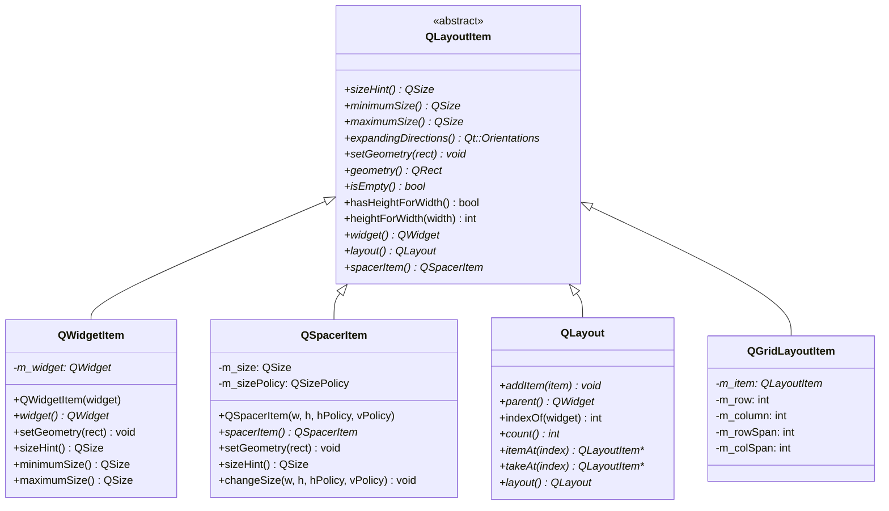
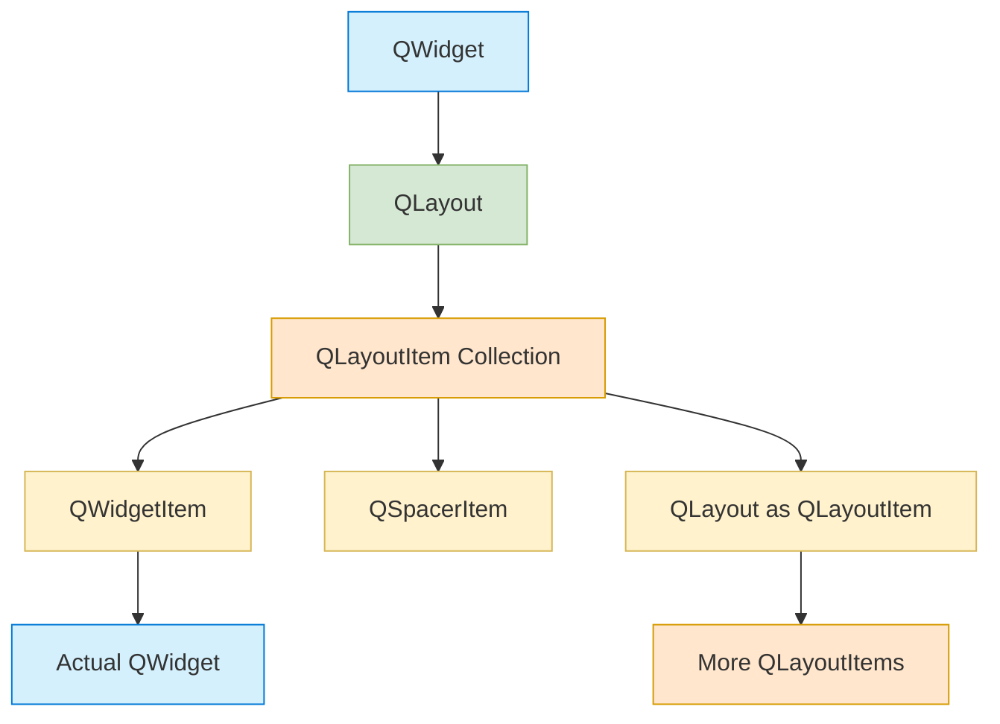
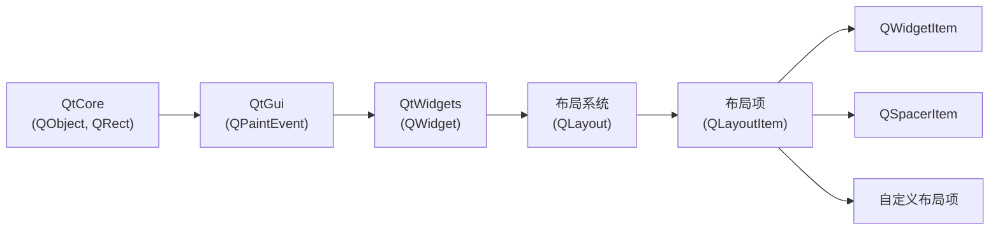
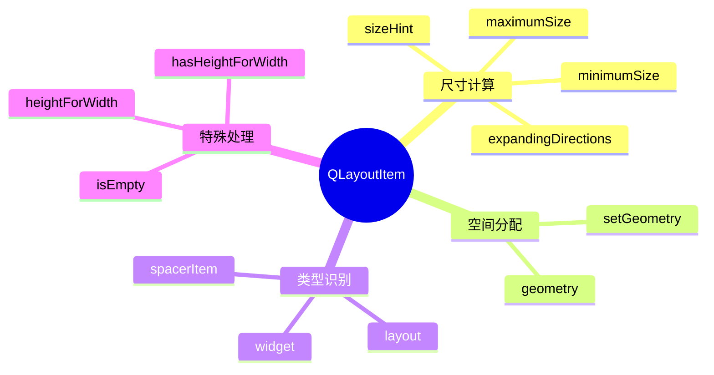
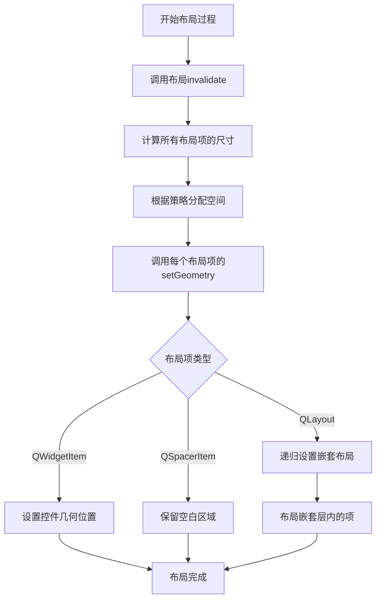

# QLayoutItem: Qt布局项全维度学习指南

<details> <summary><strong>📋 内容概览</strong></summary>

```yaml
主题: QLayoutItem - Qt布局项
相关模块: QtWidgets
依赖模块: QtCore, QtGui
标签: [GUI, 布局, 界面设计, 布局项]
相关主题: [QLayout, QWidgetItem, QSpacerItem, QWidget]
Qt版本: 5.x/6.x
学习难度: ★★★★☆
```

</details>

## 1️⃣ 原理深度解构层

<details> <summary><strong>▌三线解析法</strong></summary>

### 运行时行为

- **抽象角色**：`QLayoutItem` 是一个抽象接口类，定义了布局中项目的通用操作
- **生命周期**：通常由布局系统创建和管理，作为布局与控件之间的中间层
- **布局过程**：布局调用每个布局项的 `setGeometry()`，布局项再根据类型操作相应对象
- **内存管理**：`QLayoutItem` 不继承 `QObject`，需要手动删除，但其管理的实际对象（控件、布局）可能由对象树管理

### 源码线索

- **核心类**：`QLayoutItem` (抽象基类) 在 `qlayoutitem.h`

- 主要派生类

  ：

  - `QWidgetItem` 在 `qlayoutitem.h`（包装控件）
  - `QSpacerItem` 在 `qlayoutitem.h`（空白间隔）
  - `QLayout` 在 `qlayout.h`（自身也是 `QLayoutItem`）

- 关键虚函数

  ：

  - `sizeHint()`、`minimumSize()`、`maximumSize()`（尺寸计算）
  - `setGeometry()`（位置设置）
  - `isEmpty()`（空间检查）
  - `hasHeightForWidth()`（高度依赖宽度的特性）

### 计算机科学映射

- **桥接模式 (Bridge Pattern)**：`QLayoutItem` 将布局抽象与实现分离，允许不同类型项目共享相同接口
- **适配器模式 (Adapter Pattern)**：使不同类型对象（控件、布局、间隔）可以通过统一接口被布局处理
- **组合模式 (Composite Pattern)**：`QLayout` 作为 `QLayoutItem` 可以包含其他 `QLayoutItem`
- **访问者模式 (Visitor Pattern)**：通过 `widget()` 和 `layout()` 方法实现对具体项类型的访问
- **策略模式 (Strategy Pattern)**：不同布局项实现不同的几何分配策略

</details> <details> <summary><strong>▌对象关系可视化</strong></summary>

```
QLayout (也是一个QLayoutItem)
├── QLayoutItem_1 (QWidgetItem)
│   └── QWidget_1 (实际控件)
├── QLayoutItem_2 (QSpacerItem)
│   └── [占位空间，无实际对象]
└── QLayoutItem_3 (QLayout，嵌套布局)
    ├── QLayoutItem_3_1 (QWidgetItem)
    │   └── QWidget_2 (实际控件)
    └── QLayoutItem_3_2 (QWidgetItem)
        └── QWidget_3 (实际控件)
```

### 🧠 布局项类层次结构



### QLayoutItem 在布局系统中的角色



</details>

## 2️⃣ 代码多维训练场

<details> <summary><strong>▌分层示例规范</strong></summary>

### 基础层：布局项核心API示例 (10行)

```cpp
// QLayoutItem基本用法展示 - 🔒 线程安全：只能在UI线程中使用!
QHBoxLayout *layout = new QHBoxLayout();
QWidget *button = new QPushButton("按钮");
QLayoutItem *item = layout->itemAt(0);          // 获取布局中索引为0的布局项
if (item) {
    QSize hint = item->sizeHint();              // 获取布局项的尺寸提示
    QRect geo = item->geometry();               // 获取布局项的几何信息
    QWidget *widget = item->widget();           // 尝试获取布局项包含的控件
    QLayout *nestedLayout = item->layout();     // 尝试获取布局项包含的嵌套布局
    QSpacerItem *spacer = item->spacerItem();   // 尝试获取布局项包含的间隔
}
```

### 进阶层：自定义布局项示例 (30行)

```cpp
// 自定义布局项实现 - 兼容Qt 5.12及以上版本
class CustomLayoutItem : public QLayoutItem {
public:
    CustomLayoutItem(QWidget *widget) : m_widget(widget) {
        // 确保传入了有效的控件
        Q_ASSERT(widget);
    }
    
    ~CustomLayoutItem() override {
        // QLayoutItem不负责销毁其管理的控件
    }
    
    // 实现必要的虚函数
    QSize sizeHint() const override {
        // 返回自定义的尺寸提示
        return m_widget ? m_widget->sizeHint() : QSize(0, 0);
    }
    
    QSize minimumSize() const override {
        // 返回自定义的最小尺寸
        return m_widget ? m_widget->minimumSize() : QSize(0, 0);
    }
    
    QSize maximumSize() const override {
        // 返回自定义的最大尺寸
        return m_widget ? m_widget->maximumSize() : QSize(QWidget::QWIDGETSIZE_MAX, QWidget::QWIDGETSIZE_MAX);
    }
    
    void setGeometry(const QRect &rect) override {
        // 设置自定义几何形状
        if (m_widget) {
            // 修改控件位置，例如添加内边距
            QRect adjustedRect = rect.adjusted(5, 5, -5, -5);
            m_widget->setGeometry(adjustedRect);
        }
    }
    
    Qt::Orientations expandingDirections() const override {
        // 定义扩展方向
        return m_widget ? m_widget->sizePolicy().expandingDirections() : Qt::Orientations();
    }
    
    bool isEmpty() const override {
        // 判断布局项是否为空
        return !m_widget || m_widget->isHidden();
    }
    
    QWidget *widget() override {
        return m_widget;
    }
    
private:
    QWidget *m_widget;
};

// 使用示例
void useCustomLayoutItem() {
    QWidget *widget = new QWidget();
    QHBoxLayout *layout = new QHBoxLayout(widget);
    
    // 创建一个按钮
    QPushButton *button = new QPushButton("Custom Item");
    
    // 使用自定义布局项
    CustomLayoutItem *customItem = new CustomLayoutItem(button);
    
    // 将控件添加到布局，通常由布局自动创建QWidgetItem
    layout->addWidget(button);
    
    // 注意：仅作演示，实际使用中应该让布局管理布局项
    // 通常不需要直接使用自定义布局项，除非有特殊需求
    
    widget->show();
    
    // 清理资源
    delete customItem; // 手动删除自定义布局项
}
```

### 专家层：布局项交互与管理示例 (50行+)

```cpp
// 高级布局项管理与自定义布局器 - 📝 包含布局项生命周期管理和优化技术
class FlowLayout : public QLayout {
public:
    FlowLayout(QWidget *parent = nullptr, int margin = 0, int spacing = -1)
        : QLayout(parent) {
        setContentsMargins(margin, margin, margin, margin);
        setSpacing(spacing);
    }
    
    ~FlowLayout() override {
        // ⚡性能优化：使用qDeleteAll快速清理所有项目
        QLayoutItem *item;
        while ((item = takeAt(0)))
            delete item;  // 删除布局项但不删除其管理的控件
    }
    
    // 添加控件的便捷方法
    void addWidget(QWidget *widget) {
        addItem(new QWidgetItem(widget));
    }
    
    // QLayout接口实现
    void addItem(QLayoutItem *item) override {
        m_items.append(item);
    }
    
    int count() const override {
        return m_items.size();
    }
    
    QLayoutItem *itemAt(int index) const override {
        // 返回指定索引的布局项，无效索引返回nullptr
        return (index >= 0 && index < m_items.size()) ? m_items.at(index) : nullptr;
    }
    
    QLayoutItem *takeAt(int index) override {
        // 从布局中移除并返回布局项，调用者负责删除
        if (index >= 0 && index < m_items.size())
            return m_items.takeAt(index);
        return nullptr;
    }
    
    // 布局计算方法
    Qt::Orientations expandingDirections() const override {
        return Qt::Horizontal | Qt::Vertical;
    }
    
    bool hasHeightForWidth() const override {
        // 指示高度依赖于宽度
        return true;
    }
    
    int heightForWidth(int width) const override {
        // 计算给定宽度下的高度
        return doLayout(QRect(0, 0, width, 0), true);
    }
    
    QSize minimumSize() const override {
        // 计算布局最小尺寸
        QSize size;
        for (const QLayoutItem *item : qAsConst(m_items))
            size = size.expandedTo(item->minimumSize());
            
        // 加上边距
        size += QSize(2*margins().left(), 2*margins().top());
        return size;
    }
    
    QSize sizeHint() const override {
        // 🧠 关键概念：计算首选尺寸
        QSize size;
        for (const QLayoutItem *item : qAsConst(m_items))
            size = size.expandedTo(item->sizeHint());
            
        // 加上边距
        size += QSize(2*margins().left(), 2*margins().top());
        return size;
    }
    
    void setGeometry(const QRect &rect) override {
        // 设置布局几何形状并重新排列所有布局项
        QLayout::setGeometry(rect);
        doLayout(rect, false);
    }
    
    // 创建自定义间隔
    QSpacerItem* createSpacer(int w, int h, QSizePolicy::Policy hPolicy = QSizePolicy::Minimum,
                             QSizePolicy::Policy vPolicy = QSizePolicy::Minimum) {
        QSpacerItem *spacer = new QSpacerItem(w, h, hPolicy, vPolicy);
        addItem(spacer);
        return spacer;
    }
    
    // 查找特定控件对应的布局项
    QLayoutItem *itemForWidget(QWidget *widget) const {
        for (QLayoutItem *item : qAsConst(m_items)) {
            if (item->widget() == widget)
                return item;
        }
        return nullptr;
    }
    
    // 移除特定控件
    bool removeWidget(QWidget *widget) {
        for (int i = 0; i < m_items.size(); ++i) {
            QLayoutItem *item = m_items.at(i);
            if (item->widget() == widget) {
                // 从布局中移除
                QLayoutItem *takenItem = takeAt(i);
                Q_ASSERT(takenItem == item);
                delete takenItem;  // 删除布局项但不删除控件
                invalidate();      // 通知布局需要更新
                return true;
            }
        }
        return false;
    }
    
private:
    // 实际执行布局计算的方法
    int doLayout(const QRect &rect, bool testOnly) const {
        int left, top, right, bottom;
        getContentsMargins(&left, &top, &right, &bottom);
        QRect effectiveRect = rect.adjusted(+left, +top, -right, -bottom);
        
        int x = effectiveRect.x();
        int y = effectiveRect.y();
        int lineHeight = 0;
        
        // 遍历所有布局项，进行流式布局计算
        for (const QLayoutItem *item : qAsConst(m_items)) {
            // 跳过隐藏的控件
            QWidget *wid = item->widget();
            if (wid && wid->isHidden())
                continue;
                
            // 获取布局项尺寸
            QSize itemSize = item->sizeHint();
            int spaceX = spacing();
            int spaceY = spacing();
            
            // 如果当前行放不下，移到下一行
            if (x + itemSize.width() > effectiveRect.right() && lineHeight > 0) {
                x = effectiveRect.x();
                y = y + lineHeight + spaceY;
                lineHeight = 0;
            }
            
            // 如果不是测试模式，设置布局项位置
            if (!testOnly)
                item->setGeometry(QRect(QPoint(x, y), itemSize));
                
            // 更新位置跟踪
            x = x + itemSize.width() + spaceX;
            lineHeight = qMax(lineHeight, itemSize.height());
        }
        
        // 返回计算出的总高度
        return y + lineHeight - rect.y() + bottom;
    }
    
    // 存储布局项
    QList<QLayoutItem *> m_items;
};

// 使用示例
void flowLayoutDemo() {
    QWidget *window = new QWidget();
    window->setWindowTitle("FlowLayout with QLayoutItem Demo");
    
    // 创建自定义流式布局
    FlowLayout *flowLayout = new FlowLayout(window, 10, 6);
    
    // 添加一些控件
    const char* buttonLabels[] = {
        "Short", "Longer Button", "Very Long Button Text",
        "Small", "Different Sizes", "Flow", "Layout", "Example",
        "With", "Many", "Buttons", "To", "Demonstrate", "Layout", "Items"
    };
    
    for (const char* label : buttonLabels) {
        QPushButton *button = new QPushButton(label);
        flowLayout->addWidget(button);
    }
    
    // 添加弹性空间
    flowLayout->createSpacer(0, 0, QSizePolicy::Expanding, QSizePolicy::Minimum);
    
    // 移除某个控件的示例
    QTimer::singleShot(3000, [flowLayout, buttonLabels]() {
        // 3秒后移除第一个按钮
        for (QObject *obj : flowLayout->parent()->findChildren<QPushButton*>()) {
            QPushButton *btn = qobject_cast<QPushButton*>(obj);
            if (btn && btn->text() == buttonLabels[0]) {
                flowLayout->removeWidget(btn);
                btn->deleteLater(); // 安全删除控件
                break;
            }
        }
    });
    
    window->setMinimumSize(300, 200);
    window->show();
}
```

</details> <details> <summary><strong>▌错误案例库</strong></summary>

### 1. 布局项内存泄漏

```cpp
// 💀 错误用法：没有正确删除布局项
void memoryLeakExample() {
    QWidget *widget = new QWidget();
    QHBoxLayout *layout = new QHBoxLayout(widget);
    
    // 添加一些控件
    for (int i = 0; i < 5; ++i) {
        layout->addWidget(new QPushButton(QString("Button %1").arg(i)));
    }
    
    // 错误：尝试清除布局但未删除布局项
    while (layout->count() > 0) {
        layout->itemAt(0); // 只获取而不移除布局项
        layout->removeItem(layout->itemAt(0)); // 移除但未删除布局项对象
    }
    
    // 结果：所有QLayoutItem对象泄漏
    widget->show();
}

// ✅ 正确做法：正确删除布局项
void correctCleanupExample() {
    QWidget *widget = new QWidget();
    QHBoxLayout *layout = new QHBoxLayout(widget);
    
    // 添加一些控件
    for (int i = 0; i < 5; ++i) {
        layout->addWidget(new QPushButton(QString("Button %1").arg(i)));
    }
    
    // 正确：移除并删除布局项
    while (layout->count() > 0) {
        QLayoutItem *item = layout->takeAt(0); // 移除布局项
        delete item; // 删除布局项（不会删除关联的控件）
    }
    
    widget->show();
}
```

**分析：**

- **症状**：内存泄漏，布局项对象无法被回收
- **原因**：没有正确删除从布局中移除的布局项
- **检测方法**：使用内存分析工具如Valgrind或Qt内存调试器
- **解决方案**：使用`takeAt()`获取布局项，然后手动删除

### 2. 布局项悬挂引用

```cpp
// 💀 错误用法：布局项对象持有已删除控件的指针
void danglingReferenceExample() {
    QWidget *widget = new QWidget();
    QVBoxLayout *layout = new QVBoxLayout(widget);
    
    QPushButton *button = new QPushButton("Temporary Button");
    
    // 错误：手动创建布局项并存储
    QLayoutItem *item = new QWidgetItem(button);
    layout->addWidget(button); // 布局再次创建一个QWidgetItem
    
    // 问题开始：删除按钮
    delete button; // 按钮被删除
    
    // 危险：item现在指向已删除的对象
    QSize size = item->sizeHint(); // 潜在崩溃，访问已删除对象
    
    // 清理
    delete item; // 尝试删除布局项
}

// ✅ 正确做法：让布局管理布局项
void correctItemManagementExample() {
    QWidget *widget = new QWidget();
    QVBoxLayout *layout = new QVBoxLayout(widget);
    
    QPushButton *button = new QPushButton("Button");
    layout->addWidget(button); // 布局创建并管理QWidgetItem
    
    // 如果需要删除按钮：
    layout->removeWidget(button); // 先从布局移除
    delete button; // 然后删除按钮
    
    widget->show();
}
```

**分析：**

- **症状**：应用崩溃，访问无效内存
- **原因**：布局项对象保持对已删除控件的引用
- **检测方法**：调试器中跟踪对象生命周期，运行时检查非法内存访问
- **解决方案**：让布局管理布局项，或者确保控件在布局项之后删除

### 3. 自定义布局项中的尺寸计算错误

```cpp
// 💀 错误用法：忽略控件的尺寸策略和布局限制
class IncorrectLayoutItem : public QLayoutItem {
public:
    IncorrectLayoutItem(QWidget *w) : m_widget(w) {}
    
    QSize sizeHint() const override {
        // 错误：无条件返回固定尺寸，忽略控件自身的尺寸提示
        return QSize(100, 30); // 硬编码尺寸
    }
    
    QSize minimumSize() const override {
        // 错误：忽略控件的最小尺寸
        return QSize(50, 20); // 硬编码最小尺寸
    }
    
    QSize maximumSize() const override {
        // 错误：不考虑控件的最大尺寸限制
        return QSize(200, 100); // 硬编码最大尺寸
    }
    
    void setGeometry(const QRect &rect) override {
        // 错误：不遵循布局指定的几何形状
        // 强制使用固定宽度，忽略布局的分配
        QRect fixedWidthRect(rect.x(), rect.y(), 100, rect.height());
        m_widget->setGeometry(fixedWidthRect);
    }
    
    QWidget *widget() override { return m_widget; }
    
private:
    QWidget *m_widget;
};

// ✅ 正确做法：尊重控件尺寸策略和布局限制
class CorrectLayoutItem : public QLayoutItem {
public:
    CorrectLayoutItem(QWidget *w) : m_widget(w) {}
    
    QSize sizeHint() const override {
        // 正确：使用控件的尺寸提示
        return m_widget ? m_widget->sizeHint() : QSize();
    }
    
    QSize minimumSize() const override {
        // 正确：使用控件的最小尺寸
        return m_widget ? m_widget->minimumSize() : QSize();
    }
    
    QSize maximumSize() const override {
        // 正确：使用控件的最大尺寸
        return m_widget ? m_widget->maximumSize() : QSize(QWIDGETSIZE_MAX, QWIDGETSIZE_MAX);
    }
    
    Qt::Orientations expandingDirections() const override {
        // 正确：考虑控件的尺寸策略
        return m_widget ? m_widget->sizePolicy().expandingDirections() : Qt::Orientations();
    }
    
    void setGeometry(const QRect &rect) override {
        // 正确：尊重布局分配的几何形状
        if (m_widget)
            m_widget->setGeometry(rect);
    }
    
    QWidget *widget() override { return m_widget; }
    
private:
    QWidget *m_widget;
};
```

**分析：**

- **症状**：UI布局不合理，控件尺寸不符合预期
- **原因**：自定义布局项忽略了控件的尺寸提示和策略
- **检测方法**：观察UI，检查控件尺寸是否符合预期
- **解决方案**：在自定义布局项中尊重控件的尺寸管理属性

### 4. 错误的布局项类型转换

```cpp
// 💀 错误用法：假设布局项的具体类型
void incorrectTypeCastExample() {
    QWidget *widget = new QWidget();
    QVBoxLayout *layout = new QVBoxLayout(widget);
    
    // 添加一个间隔项
    layout->addSpacing(20);
    
    // 错误：假设第一个项是QWidgetItem
    QLayoutItem *item = layout->itemAt(0);
    QWidget *w = item->widget(); // 返回nullptr，因为这是QSpacerItem
    
    if (w) {
        // 永远不会执行，因为w是nullptr
        w->setVisible(false);
    } else {
        // 错误：直接假设是QSpacerItem
        QSpacerItem *spacer = static_cast<QSpacerItem*>(item); // 危险的强制类型转换
        spacer->changeSize(40, 40); // 可能导致未定义行为
    }
    
    widget->show();
}

// ✅ 正确做法：正确检查布局项类型
void correctTypeCheckExample() {
    QWidget *widget = new QWidget();
    QVBoxLayout *layout = new QVBoxLayout(widget);
    
    // 添加一个间隔项
    layout->addSpacing(20);
    
    // 正确：检查布局项类型
    QLayoutItem *item = layout->itemAt(0);
    if (QWidget *w = item->widget()) {
        // 处理控件项
        w->setVisible(false);
    } else if (QSpacerItem *spacer = item->spacerItem()) {
        // 处理间隔项
        spacer->changeSize(40, 40);
    } else if (QLayout *l = item->layout()) {
        // 处理嵌套布局项
        l->setContentsMargins(10, 10, 10, 10);
    }
    
    widget->show();
}
```

**分析：**

- **症状**：应用崩溃或未定义行为
- **原因**：错误假设布局项的具体类型
- **检测方法**：调试时观察类型转换错误
- **解决方案**：使用布局项提供的类型检查方法：`widget()`, `spacerItem()`, `layout()`

</details>

## 3️⃣ 知识拓扑网络

<details> <summary><strong>▌三维关联系统</strong></summary>

### 纵向维度：Qt版本演进路线

```
Qt4                      Qt5                      Qt6
+----------------------+ +----------------------+ +----------------------+
| QLayoutItem          | | QLayoutItem          | | QLayoutItem          |
| - 基本接口稳定       | | - 增加对高DPI的支持  | | - 改进布局算法       |
| - 简单的尺寸计算     | | - 增强heightForWidth | | - 增强对布局项的管理 |
| - 主要实现类已存在   | | - 改进了内存管理     | | - 优化尺寸计算逻辑   |
+----------------------+ +----------------------+ +----------------------+
```

### 横向维度：模块依赖关系



### 深度维度：布局项与元素的对应关系

| 布局项类型     | 对应元素   | 作用                                 |
| -------------- | ---------- | ------------------------------------ |
| `QWidgetItem`  | `QWidget`  | 包装控件，提供基于控件属性的尺寸计算 |
| `QSpacerItem`  | 空白空间   | 提供固定或可扩展的空白间隔           |
| `QLayout`      | 嵌套布局   | 作为布局项封装其他布局组             |
| `自定义布局项` | 自定义元素 | 实现特殊布局行为或自定义渲染元素     |

</details> <details> <summary><strong>▌版本差异对照表</strong></summary>

| 功能           | Qt5实现                | Qt6替代方案                      | 迁移成本 | 向后兼容性        |
| -------------- | ---------------------- | -------------------------------- | -------- | ----------------- |
| 基本布局项接口 | `QLayoutItem` 抽象基类 | 相同，接口保持稳定               | ★☆☆☆☆    | 完全兼容          |
| 控件项         | `QWidgetItem`          | 相同，有内部优化                 | ★☆☆☆☆    | 完全兼容          |
| 间隔项         | `QSpacerItem`          | 相同，支持高DPI自动缩放          | ★☆☆☆☆    | 完全兼容          |
| 布局项访问     | `itemAt(int index)`    | 相同，并提供更多类型安全的API    | ★☆☆☆☆    | 完全兼容          |
| 尺寸函数       | 基本sizeHint实现       | 改进的sizeHint计算，考虑更多因素 | ★★☆☆☆    | 大部分兼容        |
| 几何管理       | 简单的setGeometry      | 更智能的几何计算和分配           | ★★☆☆☆    | 大部分兼容        |
| 布局缓存       | 有限缓存支持           | 改进的缓存机制，减少重新计算     | ★★☆☆☆    | 需要适配          |
| 高DPI支持      | 有限支持               | 内置高DPI支持，自动处理缩放      | ★★★☆☆    | 需要适配高DPI环境 |

</details>

## 4️⃣ 认知强化体系

<details> <summary><strong>▌对比学习表</strong></summary>

### 布局项类型对比

| 特性         | QWidgetItem               | QSpacerItem                           | QLayout(作为布局项)   | 自定义布局项                  |
| ------------ | ------------------------- | ------------------------------------- | --------------------- | ----------------------------- |
| 主要用途     | 管理单个控件              | 创建空白间隔                          | 嵌套其他布局项        | 实现特殊布局行为              |
| 尺寸计算来源 | 从关联控件获取            | 由创建时设置决定                      | 从子布局项汇总计算    | 自定义实现                    |
| 内存管理     | 布局负责删除              | 布局负责删除                          | 布局负责删除          | 通常需要手动管理              |
| 实现复杂度   | 简单                      | 简单                                  | 中等                  | 复杂                          |
| 常见应用场景 | 所有控件添加              | 调整控件间距                          | 创建复杂布局          | 特殊渲染或布局                |
| 创建方式     | 通过`addWidget()`自动创建 | 通过`addSpacing()`/`addStretch()`创建 | 通过`addLayout()`添加 | 手动创建并通过`addItem()`添加 |
| 性能开销     | 低                        | 很低                                  | 中等                  | 取决于实现                    |

### 布局项方法功能解析

| 方法                    | 用途                 | 调用时机             | 实现要点                                         |
| ----------------------- | -------------------- | -------------------- | ------------------------------------------------ |
| `sizeHint()`            | 获取首选尺寸         | 布局计算控件大小     | 返回有意义的尺寸提示，避免返回(0,0)              |
| `minimumSize()`         | 获取最小尺寸         | 确保布局不小于此尺寸 | 返回实际需要的最小尺寸，避免过大或过小           |
| `maximumSize()`         | 获取最大尺寸         | 限制布局不超过此尺寸 | 通常返回QWIDGETSIZE_MAX或控件的最大尺寸          |
| `setGeometry()`         | 设置位置和大小       | 布局更新控件位置     | 正确处理分配到的空间，通常设置关联控件的几何形状 |
| `expandingDirections()` | 获取扩展方向         | 确定项目如何填充空间 | 基于控件size policy或自定义规则返回扩展方向      |
| `isEmpty()`             | 检查是否为空         | 布局跳过空项目       | 对不可见控件或零尺寸项返回true                   |
| `hasHeightForWidth()`   | 高度是否依赖宽度     | 处理特殊布局关系     | 对于自适应高度的项目返回true                     |
| `heightForWidth()`      | 计算特定宽度下的高度 | 布局计算垂直空间     | 返回在给定宽度下所需的高度                       |

</details> <details> <summary><strong>▌记忆助手</strong></summary>

### 速查口诀

- **布局项基本类型口诀**：「控件用WidgetItem，空格用SpacerItem，布局也是LayoutItem」
- **内存管理口诀**：「布局添加，内存它管；手动添加，手动清理」
- **布局项转换口诀**：「widget布控件，layout布嵌套，spacer留空格，类型要安全」
- **方法记忆口诀**：「size提供尺寸，geometry定位置，empty判空白，expanding告方向」

### 布局项工作流程思维导图



### 布局系统工作流程



</details>

## 5️⃣ 工程化实践框架

<details> <summary><strong>▌开发阶段指南</strong></summary>

### [设计期] 布局项规划

1. **布局项层次设计**

   - 确定需要特殊处理的UI元素
   - 决定是否需要自定义布局项
   - 规划布局项的嵌套结构

2. **尺寸策略规划**

   ```
   1. 为固定尺寸元素使用QWidgetItem + 固定尺寸控件
   2. 为可伸缩空间使用QSpacerItem + 合适的尺寸策略
   3. 为复杂区域使用QLayout作为布局项
   4. 为特殊行为实现自定义布局项
   ```

3. **内存管理策略**

   - 决定布局项的创建和销毁责任
   - 规划布局项与控件的生命周期关系
   - 确定资源清理的时机和方法

### [编码期] QA/QC检查表

1. **布局项创建检查**
   - [ ] 避免手动创建标准布局项(让布局管理)
   - [ ] 确保自定义布局项被正确添加到布局
   - [ ] 检查布局项的父子关系是否合理
2. **尺寸计算检查**
   - [ ] 确保所有自定义布局项正确实现尺寸方法
   - [ ] 验证sizeHint()返回合理值
   - [ ] 检查expandingDirections()正确表达扩展行为
3. **内存管理检查**
   - [ ] 确认所有手动创建的布局项都被正确清理
   - [ ] 验证takeAt()后的布局项被删除
   - [ ] 检查布局项与控件的销毁顺序

### [调试期] 布局项问题诊断

1. **布局项状态检查**

   ```cpp
   // 检查布局中的项目及其状态
   void inspectLayoutItems(QLayout *layout, int level = 0) {
       QString indent(level * 2, ' ');
       qDebug() << indent << "Layout:" << layout->metaObject()->className();
       
       for (int i = 0; i < layout->count(); ++i) {
           QLayoutItem *item = layout->itemAt(i);
           
           QString itemType = "Unknown";
           if (item->widget()) itemType = "Widget";
           else if (item->layout()) itemType = "Layout";
           else if (item->spacerItem()) itemType = "Spacer";
           
           qDebug() << indent << "  Item" << i << "Type:" << itemType;
           qDebug() << indent << "    Geometry:" << item->geometry();
           qDebug() << indent << "    SizeHint:" << item->sizeHint();
           qDebug() << indent << "    MinSize:" << item->minimumSize();
           qDebug() << indent << "    MaxSize:" << item->maximumSize();
           qDebug() << indent << "    IsEmpty:" << item->isEmpty();
           
           if (QLayout *childLayout = item->layout()) {
               inspectLayoutItems(childLayout, level + 1);
           }
       }
   }
   ```

2. **布局项边界可视化**

   ```cpp
   // 添加一个可视化布局项边界的帮助类
   class LayoutItemDebugger : public QWidget {
   public:
       LayoutItemDebugger(QWidget *parent = nullptr) : QWidget(parent) {
           setAttribute(Qt::WA_TransparentForMouseEvents);
           setWindowFlags(Qt::Widget | Qt::FramelessWindowHint);
           raise();
       }
       
       void visualizeLayout(QLayout *layout) {
           m_itemRects.clear();
           collectLayoutItemRects(layout);
           update();
       }
       
   protected:
       void paintEvent(QPaintEvent *) override {
           QPainter painter(this);
           painter.setPen(QPen(Qt::red, 1, Qt::DashLine));
           
           for (const auto &rectInfo : m_itemRects) {
               painter.drawRect(rectInfo.first);
               painter.drawText(rectInfo.first.topLeft() + QPoint(5, 15), 
                               rectInfo.second);
           }
       }
       
   private:
       void collectLayoutItemRects(QLayout *layout) {
           for (int i = 0; i < layout->count(); ++i) {
               QLayoutItem *item = layout->itemAt(i);
               QRect geo = item->geometry();
               
               QString itemType = "Unknown";
               if (item->widget()) itemType = "Widget";
               else if (item->layout()) itemType = "Layout";
               else if (item->spacerItem()) itemType = "Spacer";
               
               m_itemRects.append(qMakePair(geo, itemType + ": " + 
                                           QString::number(i)));
               
               if (QLayout *childLayout = item->layout()) {
                   collectLayoutItemRects(childLayout);
               }
           }
       }
       
       QList<QPair<QRect, QString>> m_itemRects;
   };
   
   // 使用方式
   QWidget *mainWidget = new QWidget();
   QLayout *layout = new QVBoxLayout(mainWidget);
   // ... 添加布局项
   
   LayoutItemDebugger *debugger = new LayoutItemDebugger(mainWidget);
   debugger->setGeometry(mainWidget->rect());
   debugger->visualizeLayout(layout);
   ```

3. **布局项性能分析**

   ```cpp
   // 分析布局项的性能影响
   void analyzeLayoutItemPerformance(QLayout *layout) {
       QElapsedTimer timer;
       
       // 测量尺寸计算性能
       timer.start();
       for (int i = 0; i < layout->count(); ++i) {
           QLayoutItem *item = layout->itemAt(i);
           item->sizeHint();
           item->minimumSize();
           item->maximumSize();
       }
       qDebug() << "Size calculations:" << timer.elapsed() << "ms";
       
       // 测量几何设置性能
       timer.restart();
       for (int i = 0; i < layout->count(); ++i) {
           QLayoutItem *item = layout->itemAt(i);
           item->setGeometry(item->geometry());
       }
       qDebug() << "Geometry setting:" << timer.elapsed() << "ms";
   }
   ```

### [优化期] 布局项性能优化

1. **减少布局项数量**

   ```cpp
   // 合并多个简单控件到一个复合控件
   class CompoundWidget : public QWidget {
   public:
       CompoundWidget() {
           // 内部使用布局，但外部看来是单一控件
           QHBoxLayout *internalLayout = new QHBoxLayout(this);
           internalLayout->setContentsMargins(0, 0, 0, 0);
           internalLayout->addWidget(new QLabel("Label"));
           internalLayout->addWidget(new QLineEdit());
       }
   };
   
   // 使用方式：添加一个CompoundWidget替代多个单独的布局项
   layout->addWidget(new CompoundWidget());
   ```

2. **优化布局项尺寸计算**

   ```cpp
   // 实现缓存尺寸提示的布局项
   class CachedLayoutItem : public QLayoutItem {
   public:
       CachedLayoutItem(QLayoutItem *item) : m_item(item), m_dirty(true) {}
       
       ~CachedLayoutItem() { delete m_item; }
       
       // 缓存尺寸提示
       QSize sizeHint() const override {
           if (m_dirty || m_cachedSizeHint.isNull()) {
               m_cachedSizeHint = m_item->sizeHint();
               m_dirty = false;
           }
           return m_cachedSizeHint;
       }
       
       // 清除缓存
       void invalidate() {
           m_dirty = true;
       }
       
       // 转发其他方法到被包装的布局项...
       
   private:
       QLayoutItem *m_item;
       mutable QSize m_cachedSizeHint;
       mutable bool m_dirty;
   };
   ```

3. **延迟创建布局项**

   ```cpp
   // 实现延迟创建的布局管理器
   class LazyLayout : public QLayout {
   public:
       // 注册控件，但不立即创建布局项
       void registerWidget(QWidget *widget) {
           m_pendingWidgets.append(widget);
           invalidate();
       }
       
       // 只在需要时创建布局项
       QLayoutItem *itemAt(int index) const override {
           ensureItemsCreated();
           return index >= 0 && index < m_items.size() ? m_items.at(index) : nullptr;
       }
       
       int count() const override {
           ensureItemsCreated();
           return m_items.size();
       }
       
   private:
       void ensureItemsCreated() const {
           if (!m_pendingWidgets.isEmpty()) {
               for (QWidget *w : qAsConst(m_pendingWidgets)) {
                   m_items.append(new QWidgetItem(w));
               }
               m_pendingWidgets.clear();
           }
       }
       
       mutable QList<QLayoutItem *> m_items;
       mutable QList<QWidget *> m_pendingWidgets;
   };
   ```

</details> <details> <summary><strong>▌安全红线清单</strong></summary>

### 🔒 线程安全问题

- **禁止**：从非UI线程访问或修改布局项
- **禁止**：在多线程中共享布局项
- **必须**：确保所有布局项操作在UI线程执行

### 💀 内存管理陷阱

- **禁止**：手动删除布局管理的布局项
- **禁止**：重用已添加到布局的布局项
- **禁止**：在布局项被使用时删除其关联的控件
- **必须**：删除从布局中取出(takeAt)的布局项
- **必须**：确保自定义布局项在不再使用时被删除

### ⚡ 性能红线

- **避免**：频繁创建和删除布局项
- **避免**：在布局项的sizeHint()中执行复杂计算
- **避免**：创建大量小布局项，考虑合并
- **避免**：在setGeometry()中执行耗时操作

### 🧠 设计原则红线

- **禁止**：在布局项和自定义布局逻辑中混合使用绝对坐标
- **禁止**：违反父子关系规则（布局项与其管理的控件）
- **避免**：创建循环引用的布局项结构
- **避免**：在布局项中硬编码尺寸，应该尊重控件的尺寸提示

</details>

## 6️⃣ 学习路径导航

<details> <summary><strong>▌阶段式进阶地图</strong></summary>

### [入门期] 布局项基础 (1-2周)

1. **核心概念**
   - 理解`QLayoutItem`的作用和设计意图
   - 掌握布局项的基本类型和用途
   - 学习布局如何使用布局项管理控件
2. **标准布局项使用**
   - 了解`QWidgetItem`如何封装控件
   - 学习使用`QSpacerItem`创建间隔
   - 掌握`QLayout`作为布局项的嵌套能力
3. **实践项目**：布局项检查器
   - 创建一个工具遍历并展示布局中的布局项
   - 显示每个布局项的类型和几何信息
   - 可视化布局项的边界和层次

### [进阶期] 布局项管理与自定义 (2-4周)

1. **布局项内存管理**
   - 深入理解布局项的生命周期
   - 掌握手动管理布局项的正确方法
   - 学习处理复杂布局中的布局项关系
2. **自定义布局项基础**
   - 实现基本的自定义布局项
   - 正确处理尺寸计算和几何设置
   - 学习布局项与控件的交互
3. **实践项目**：自定义流式布局
   - 创建一个使用自定义布局项的流式布局
   - 实现自动换行和对齐功能
   - 处理不同尺寸控件的混合排列

### [专家期] 高级布局项技术 (4-8周)

1. **布局项性能优化**
   - 实现高效的布局项缓存策略
   - 优化布局项的尺寸计算
   - 减少布局重新计算的频率
2. **特殊用途布局项**
   - 创建支持动画的布局项
   - 实现可绘制和交互的布局项
   - 开发具有特殊行为的布局项
3. **实践项目**：可视化布局编辑器
   - 实现拖放式布局编辑器
   - 支持添加、删除和移动布局项
   - 可视化布局项属性和关系

</details> <details> <summary><strong>▌学习资源指南</strong></summary>

### 官方文档

- [QLayoutItem Class Documentation](https://doc.qt.io/qt-6/qlayoutitem.html)
- [QLayout Class Documentation](https://doc.qt.io/qt-6/qlayout.html)
- [Qt Layout Management](https://doc.qt.io/qt-6/layout.html)

### 书籍推荐

- 《Advanced Qt Programming》- 自定义布局和布局项章节
- 《C++ GUI Programming with Qt》- 布局系统章节
- 《Qt 5 Projects》- 高级UI实现部分

### 代码学习资源

- Qt源码中布局相关实现：
  - `qtbase/src/widgets/kernel/qlayoutitem.h`
  - `qtbase/src/widgets/kernel/qlayoutitem.cpp`
  - `qtbase/src/widgets/kernel/qlayout.cpp`

### 实践项目

1. **入门**：布局项分析器 - 创建一个可以可视化分析布局项的工具
2. **进阶**：自定义布局 - 使用自定义布局项实现特殊布局
3. **专家**：布局编辑器 - 创建可视化布局设计工具

</details>

## 7️⃣ 问题诊断与解决框架

<details> <summary><strong>▌系统化调试方法</strong></summary>

### 症状分类表

| 症状类型       | 可能原因                    | 诊断工具         | 解决方案                     |
| -------------- | --------------------------- | ---------------- | ---------------------------- |
| 控件尺寸不正确 | 布局项尺寸计算错误          | 布局项尺寸检查器 | 修正sizeHint()实现           |
| 布局项内存泄漏 | 未正确删除取出的布局项      | 内存分析器       | 使用正确的takeAt()和删除流程 |
| 控件位置错误   | 布局项的setGeometry实现有误 | 几何检查器       | 修正setGeometry()实现        |
| 布局计算缓慢   | 低效的布局项尺寸计算        | 性能分析器       | 优化sizeHint()实现或添加缓存 |
| 闪烁或抖动     | 布局项返回不稳定的尺寸      | 布局调试器       | 提供稳定的尺寸计算逻辑       |
| 应用崩溃       | 布局项访问已删除的控件      | 调试器跟踪       | 修正内存管理或控件引用       |

### 布局项调试指令集

```cpp
// 1. 布局项信息检查
void dumpLayoutItemInfo(QLayoutItem *item, int indentLevel = 0) {
    QString indent(indentLevel * 2, ' ');
    
    // 获取基本信息
    QSize sizeHint = item->sizeHint();
    QSize minSize = item->minimumSize();
    QSize maxSize = item->maximumSize();
    QRect geo = item->geometry();
    Qt::Orientations expand = item->expandingDirections();
    
    // 确定类型
    QString type = "Unknown";
    if (item->widget()) type = "Widget";
    else if (item->layout()) type = "Layout";
    else if (item->spacerItem()) type = "Spacer";
    
    // 输出信息
    qDebug() << indent << "Layout Item Type:" << type;
    qDebug() << indent << "  Size Hint:" << sizeHint;
    qDebug() << indent << "  Min Size:" << minSize;
    qDebug() << indent << "  Max Size:" << maxSize;
    qDebug() << indent << "  Geometry:" << geo;
    qDebug() << indent << "  Expanding:" 
             << (expand & Qt::Horizontal ? "Horizontal" : "")
             << (expand & Qt::Vertical ? " Vertical" : "");
    qDebug() << indent << "  Empty:" << item->isEmpty();
    qDebug() << indent << "  HasHeightForWidth:" << item->hasHeightForWidth();
    
    // 递归检查嵌套布局
    if (QLayout *layout = item->layout()) {
        qDebug() << indent << "  Nested Layout:";
        for (int i = 0; i < layout->count(); ++i) {
            dumpLayoutItemInfo(layout->itemAt(i), indentLevel + 1);
        }
    }
}

// 2. 布局项尺寸稳定性检查
void checkLayoutItemStability(QLayoutItem *item) {
    // 检查尺寸提示是否稳定
    QSize size1 = item->sizeHint();
    QSize size2 = item->sizeHint();
    QSize size3 = item->sizeHint();
    
    if (size1 != size2 || size1 != size3) {
        qWarning() << "Unstable size hint detected!";
        qWarning() << "  First call:" << size1;
        qWarning() << "  Second call:" << size2;
        qWarning() << "  Third call:" << size3;
    } else {
        qDebug() << "Size hint is stable:" << size1;
    }
}

// 3. 布局项性能检测
void measureLayoutItemPerformance(QLayoutItem *item, int iterations = 1000) {
    QElapsedTimer timer;
    
    // 测量sizeHint性能
    timer.start();
    for (int i = 0; i < iterations; ++i) {
        item->sizeHint();
    }
    qDebug() << "SizeHint time:" << timer.elapsed() << "ms for" << iterations << "calls";
    
    // 测量setGeometry性能
    timer.restart();
    QRect geo = item->geometry();
    for (int i = 0; i < iterations; ++i) {
        item->setGeometry(geo);
    }
    qDebug() << "SetGeometry time:" << timer.elapsed() << "ms for" << iterations << "calls";
}

// 4. 布局项引用检查
class LayoutItemTracker {
public:
    static void trackWidget(QWidget *widget) {
        s_trackedWidgets.insert(widget, false);
    }
    
    static void trackItemForWidget(QLayoutItem *item, QWidget *widget) {
        s_itemsForWidgets[widget].append(item);
    }
    
    static void widgetDeleted(QWidget *widget) {
        s_trackedWidgets[widget] = true;
    }
    
    static void checkDanglingReferences() {
        for (auto it = s_trackedWidgets.constBegin(); it != s_trackedWidgets.constEnd(); ++it) {
            QWidget *widget = it.key();
            bool deleted = it.value();
            
            if (deleted && s_itemsForWidgets.contains(widget)) {
                qWarning() << "Potential dangling reference: Layout items reference deleted widget!";
                qWarning() << "  Widget:" << widget;
                qWarning() << "  Item count:" << s_itemsForWidgets[widget].size();
            }
        }
    }
    
private:
    static QHash<QWidget*, bool> s_trackedWidgets;
    static QHash<QWidget*, QList<QLayoutItem*>> s_itemsForWidgets;
};

// 初始化静态成员
QHash<QWidget*, bool> LayoutItemTracker::s_trackedWidgets;
QHash<QWidget*, QList<QLayoutItem*>> LayoutItemTracker::s_itemsForWidgets;

// 使用方法：为关键控件安装事件过滤器并在析构时通知跟踪器
class WidgetTrackingFilter : public QObject {
public:
    WidgetTrackingFilter(QWidget *widget) : QObject(widget) {
        LayoutItemTracker::trackWidget(widget);
    }
    
    ~WidgetTrackingFilter() {
        QWidget *widget = qobject_cast<QWidget*>(parent());
        if (widget) {
            LayoutItemTracker::widgetDeleted(widget);
        }
    }
};
```

</details> <details> <summary><strong>▌常见问题解决模板</strong></summary>

### 问题1：布局项内存泄漏

**症状**：应用长时间运行后内存占用持续增加，尤其是在动态添加/删除UI元素时。

**原因**：从布局中移除项目时没有正确删除布局项对象，或者创建布局项但未添加到布局也未删除。

**解决步骤**：

1. 检查布局项移除代码：

   ```cpp
   // 检查所有清理布局的代码
   void cleanupLayout(QLayout *layout) {
       // 查找此类代码，可能导致内存泄漏
       int count = layout->count();
       for (int i = 0; i < count; ++i) {
           // 错误：只移除但不删除
           layout->removeItem(layout->itemAt(0));
       }
   }
   
   // 修正为:
   void correctCleanupLayout(QLayout *layout) {
       // 正确的清理方法
       QLayoutItem *item;
       while ((item = layout->takeAt(0))) {
           delete item; // 删除布局项但不删除控件
       }
   }
   ```

2. 实现辅助类跟踪布局项：

   ```cpp
   // 辅助类用于跟踪布局项
   class LayoutItemTracker {
   public:
       static void addItem(QLayoutItem *item) {
           s_items.insert(item);
       }
       
       static void removeItem(QLayoutItem *item) {
           s_items.remove(item);
       }
       
       static void printStatistics() {
           qDebug() << "Active layout items:" << s_items.size();
       }
       
   private:
       static QSet<QLayoutItem*> s_items;
   };
   
   QSet<QLayoutItem*> LayoutItemTracker::s_items;
   ```

3. 使用智能指针管理自定义布局项：

   ```cpp
   // 为手动管理的布局项使用智能指针
   void safeLayoutItemUsage() {
       QScopedPointer<QLayoutItem> item(new CustomLayoutItem(widget));
       
       // 如果添加到布局，布局接管所有权
       if (addToLayout) {
           layout->addItem(item.take());
       }
       // 如果不添加，离开作用域时自动删除
   }
   ```

**预防措施**：

- 创建辅助函数处理布局清理
- 使用智能指针管理手动创建的布局项
- 使用内存分析工具定期检查
- 在开发期启用内存泄漏检测

### 问题2：布局项尺寸计算不稳定

**症状**：UI在调整窗口大小时出现抖动，或布局频繁重新计算导致性能问题。

**原因**：自定义布局项的sizeHint()返回不稳定的值，或依赖于不稳定因素。

**解决步骤**：

1. 诊断尺寸计算稳定性：

   ```cpp
   // 检查布局项尺寸稳定性
   void testItemStability(QLayoutItem *item) {
       for (int i = 0; i < 5; ++i) {
           QSize hint = item->sizeHint();
           qDebug() << "Iteration" << i << "Size hint:" << hint;
       }
   }
   ```

2. 实现稳定的尺寸计算：

   ```cpp
   // 为自定义布局项实现稳定的尺寸计算
   class StableLayoutItem : public QLayoutItem {
   public:
       StableLayoutItem(QWidget *widget) : m_widget(widget) {
           // 计算并缓存尺寸提示
           m_sizeHint = calculateSizeHint();
       }
       
       QSize sizeHint() const override {
           // 返回缓存的尺寸
           return m_sizeHint;
       }
       
       // 只在实际需要时更新尺寸缓存
       void updateSizeCache() {
           QSize newHint = calculateSizeHint();
           if (newHint != m_sizeHint) {
               m_sizeHint = newHint;
           }
       }
       
   private:
       QSize calculateSizeHint() const {
           // 基于稳定因素计算尺寸
           if (!m_widget)
               return QSize(0, 0);
               
           // 基于控件的内容计算
           return m_widget->sizeHint();
       }
       
       QWidget *m_widget;
       QSize m_sizeHint;
   };
   ```

3. 为现有布局项添加稳定包装器：

   ```cpp
   // 包装不稳定的布局项使其稳定
   class StableLayoutItemWrapper : public QLayoutItem {
   public:
       StableLayoutItemWrapper(QLayoutItem *item) 
           : m_item(item), m_sizeHint(item->sizeHint()) {}
       
       ~StableLayoutItemWrapper() {
           delete m_item;
       }
       
       // 提供稳定的尺寸提示
       QSize sizeHint() const override {
           return m_sizeHint;
       }
       
       // 更新缓存，通常在布局重新计算前调用
       void updateCache() {
           m_sizeHint = m_item->sizeHint();
       }
       
       // 转发其他方法到包装的布局项
       QSize minimumSize() const override { return m_item->minimumSize(); }
       QSize maximumSize() const override { return m_item->maximumSize(); }
       Qt::Orientations expandingDirections() const override { 
           return m_item->expandingDirections(); 
       }
       void setGeometry(const QRect &r) override { m_item->setGeometry(r); }
       QRect geometry() const override { return m_item->geometry(); }
       bool isEmpty() const override { return m_item->isEmpty(); }
       
   private:
       QLayoutItem *m_item;
       QSize m_sizeHint;
   };
   ```

**预防措施**：

- 缓存尺寸计算结果
- 避免在尺寸计算中使用随机或不稳定因素
- 实现测试用例以验证布局项尺寸稳定性
- 使用布局调试工具检测抖动

### 问题3：自定义布局项中的几何错误

**症状**：使用自定义布局项的控件位置或大小不正确，可能出现重叠或间距问题。

**原因**：自定义布局项的setGeometry()实现有错误，或者几何计算有问题。

**解决步骤**：

1. 检查几何计算过程：

   ```cpp
   // 检查几何设置前后的状态
   class GeometryDebugLayoutItem : public QLayoutItem {
   public:
       GeometryDebugLayoutItem(QLayoutItem *item) : m_item(item) {}
       
       ~GeometryDebugLayoutItem() {
           delete m_item;
       }
       
       void setGeometry(const QRect &rect) override {
           qDebug() << "Setting geometry:" << rect;
           qDebug() << "  Before: Widget geometry:" 
                   << (m_item->widget() ? m_item->widget()->geometry() : QRect());
           
           m_item->setGeometry(rect);
           
           qDebug() << "  After: Widget geometry:" 
                   << (m_item->widget() ? m_item->widget()->geometry() : QRect());
           qDebug() << "  After: Item geometry:" << m_item->geometry();
           
           // 验证几何形状是否符合预期
           if (m_item->widget() && m_item->widget()->geometry() != rect) {
               qWarning() << "Geometry mismatch!";
           }
       }
       
       // 转发其他方法...
       
   private:
       QLayoutItem *m_item;
   };
   ```

2. 修正几何设置逻辑：

   ```cpp
   // 正确处理几何形状的布局项
   class CorrectGeometryLayoutItem : public QLayoutItem {
   public:
       CorrectGeometryLayoutItem(QWidget *widget) : m_widget(widget) {}
       
       void setGeometry(const QRect &rect) override {
           // 保存原始几何请求
           m_requestedGeometry = rect;
           
           if (m_widget) {
               // 考虑控件的尺寸策略和约束
               QSize size = rect.size();
               QSizePolicy policy = m_widget->sizePolicy();
               
               // 尊重最小/最大尺寸
               size = size.boundedTo(m_widget->maximumSize());
               size = size.expandedTo(m_widget->minimumSize());
               
               // 设置最终几何形状
               m_widget->setGeometry(QRect(rect.topLeft(), size));
           }
       }
       
       QRect geometry() const override {
           // 返回请求的几何形状，与控件实际可能不同
           return m_requestedGeometry;
       }
       
       // 其他方法实现...
       
   private:
       QWidget *m_widget;
       QRect m_requestedGeometry;
   };
   ```

3. 可视化几何问题：

   ```cpp
   // 创建一个可视化几何问题的工具
   class GeometryVisualizer : public QWidget {
   public:
       GeometryVisualizer(QWidget *targetWidget) 
           : QWidget(targetWidget->window()) {
           // 顶层窗口位置
           setWindowFlags(Qt::Tool | Qt::FramelessWindowHint);
           setAttribute(Qt::WA_TransparentForMouseEvents);
           resize(targetWidget->window()->size());
           setVisible(true);
           
           m_target = targetWidget;
           connect(targetWidget, &QObject::destroyed, this, &QObject::deleteLater);
           
           // 更新计时器
           m_timer = new QTimer(this);
           connect(m_timer, &QTimer::timeout, this, 
                  static_cast<void(QWidget::*)()>(&QWidget::update));
           m_timer->start(100); // 100ms刷新
       }
       
   protected:
       void paintEvent(QPaintEvent *) override {
           if (!m_target)
               return;
               
           QPainter painter(this);
           painter.setPen(QPen(Qt::red, 2, Qt::DashLine));
           
           // 获取相对于顶层窗口的几何形状
           QRect geo = m_target->geometry();
           if (m_target->parentWidget()) {
               geo = QRect(m_target->parentWidget()->mapTo(window(), geo.topLeft()), 
                         geo.size());
           }
           
           // 绘制实际几何形状
           painter.drawRect(geo);
           
           // 如果有布局，尝试获取布局项的几何形状
           if (m_target->parentWidget() && m_target->parentWidget()->layout()) {
               QLayout *layout = m_target->parentWidget()->layout();
               for (int i = 0; i < layout->count(); ++i) {
                   QLayoutItem *item = layout->itemAt(i);
                   if (item->widget() == m_target) {
                       painter.setPen(QPen(Qt::blue, 2, Qt::DotLine));
                       QRect itemGeo = item->geometry();
                       itemGeo = QRect(m_target->parentWidget()->mapTo(window(), 
                                     itemGeo.topLeft()), itemGeo.size());
                       painter.drawRect(itemGeo);
                       
                       // 显示不匹配
                       if (itemGeo != geo) {
                           painter.setPen(Qt::red);
                           painter.drawText(geo.topLeft() - QPoint(0, 5), 
                                         "Geometry mismatch!");
                       }
                       break;
                   }
               }
           }
       }
       
   private:
       QWidget *m_target;
       QTimer *m_timer;
   };
   ```

**预防措施**：

- 详细记录和验证几何计算逻辑
- 创建单元测试检查几何计算
- 实现可视化调试工具
- 始终考虑控件的尺寸约束和策略

### 案例分析：自定义卡片布局中的问题

**项目背景**：开发一个自适应卡片布局，其中每个卡片是一个复杂的自定义控件，需要特殊的尺寸计算和布局逻辑。

**问题**：卡片在窗口调整大小时尺寸和位置不正确，某些卡片被部分截断，且布局性能较差。

**症状分析**：

1. 卡片尺寸不一致
2. 调整窗口大小时UI卡顿
3. 某些卡片显示不完整
4. 内存使用随时间增长

**根因分析**：

1. 自定义布局项的sizeHint()实现返回不一致的值
2. 每次窗口调整大小都重新创建布局项
3. 几何计算没有考虑卡片的最小尺寸要求
4. 布局项内存管理有缺陷，导致泄漏

**解决方案**：

1. 修复卡片布局项的尺寸计算：

   ```cpp
   // 修正后的卡片布局项
   class CardLayoutItem : public QLayoutItem {
   public:
       CardLayoutItem(CardWidget *card) : m_card(card) {
           // 预计算卡片的尺寸提示并缓存
           m_cachedSizeHint = card->effectiveSizeHint();
           m_cachedMinSize = card->minimumSizeHint();
           
           // 跟踪卡片尺寸变化
           connect(card, &CardWidget::sizeChanged, this, &CardLayoutItem::updateSizeCache);
       }
       
       QSize sizeHint() const override {
           return m_cachedSizeHint;
       }
       
       QSize minimumSize() const override {
           return m_cachedMinSize;
       }
       
       void setGeometry(const QRect &rect) override {
           // 确保不小于最小尺寸
           QSize adjustedSize = rect.size().expandedTo(m_cachedMinSize);
           m_card->setGeometry(QRect(rect.topLeft(), adjustedSize));
       }
       
   private:
       void updateSizeCache() {
           m_cachedSizeHint = m_card->effectiveSizeHint();
           m_cachedMinSize = m_card->minimumSizeHint();
       }
       
       CardWidget *m_card;
       QSize m_cachedSizeHint;
       QSize m_cachedMinSize;
   };
   ```

2. 实现高效的卡片布局:

   ```cpp
   // 改进后的卡片布局管理器
   class CardLayout : public QLayout {
   public:
       CardLayout(QWidget *parent = nullptr) : QLayout(parent), m_dirty(true) {}
       
       ~CardLayout() {
           // 清理所有布局项
           QLayoutItem *item;
           while ((item = takeAt(0)))
               delete item;
       }
       
       void addCard(CardWidget *card) {
           addItem(new CardLayoutItem(card));
           m_dirty = true;
       }
       
       // QLayout接口实现
       void addItem(QLayoutItem *item) override {
           m_items.append(item);
           m_dirty = true;
       }
       
       QLayoutItem *itemAt(int index) const override {
           return (index >= 0 && index < m_items.size()) ? m_items.at(index) : nullptr;
       }
       
       QLayoutItem *takeAt(int index) override {
           if (index >= 0 && index < m_items.size()) {
               m_dirty = true;
               return m_items.takeAt(index);
           }
           return nullptr;
       }
       
       int count() const override {
           return m_items.size();
       }
       
       // 布局计算优化
       QSize sizeHint() const override {
           if (m_dirty) {
               recalculateLayout(parentWidget()->rect());
           }
           return m_cachedSizeHint;
       }
       
       void setGeometry(const QRect &rect) override {
           QLayout::setGeometry(rect);
           
           if (m_dirty || m_lastRect != rect) {
               recalculateLayout(rect);
           }
           
           // 应用计算好的几何形状
           for (int i = 0; i < m_items.size(); ++i) {
               m_items.at(i)->setGeometry(m_itemGeometries.at(i));
           }
           
           m_lastRect = rect;
       }
       
       // 标记布局需要重新计算
       void invalidate() override {
           m_dirty = true;
           QLayout::invalidate();
       }
       
   private:
       void recalculateLayout(const QRect &rect) const {
           if (m_items.isEmpty()) {
               m_cachedSizeHint = QSize(0, 0);
               m_itemGeometries.clear();
               m_dirty = false;
               return;
           }
           
           // 计算布局
           const int count = m_items.size();
           m_itemGeometries.resize(count);
           
           // 计算卡片排列（这里简化为网格排列）
           int x = rect.x();
           int y = rect.y();
           int maxRowHeight = 0;
           int totalWidth = 0;
           int totalHeight = 0;
           
           for (int i = 0; i < count; ++i) {
               QLayoutItem *item = m_items.at(i);
               QSize hint = item->sizeHint();
               
               // 如果一行放不下，换行
               if (x + hint.width() > rect.right() && maxRowHeight > 0) {
                   x = rect.x();
                   y += maxRowHeight + spacing();
                   maxRowHeight = 0;
               }
               
               // 设置项目几何形状
               m_itemGeometries[i] = QRect(QPoint(x, y), hint);
               
               // 更新位置
               x += hint.width() + spacing();
               maxRowHeight = qMax(maxRowHeight, hint.height());
               
               // 更新总尺寸
               totalWidth = qMax(totalWidth, x - rect.x());
               totalHeight = y + maxRowHeight - rect.y();
           }
           
           // 更新缓存的尺寸提示
           m_cachedSizeHint = QSize(totalWidth, totalHeight);
           m_dirty = false;
       }
       
       QList<QLayoutItem *> m_items;
       mutable QVector<QRect> m_itemGeometries;
       mutable QSize m_cachedSizeHint;
       mutable bool m_dirty;
       QRect m_lastRect;
   };
   ```

3. 改进内存管理和性能监控：

   ```cpp
   // 添加性能和内存监控
   class MonitoredCardLayout : public CardLayout {
   public:
       MonitoredCardLayout(QWidget *parent = nullptr) : CardLayout(parent) {
           m_performanceTimer.start();
       }
       
       ~MonitoredCardLayout() {
           // 报告最终统计信息
           qDebug() << "CardLayout statistics:";
           qDebug() << "  Lifetime:" << m_performanceTimer.elapsed() << "ms";
           qDebug() << "  SetGeometry calls:" << m_geometrySetCount;
           qDebug() << "  Recalculation count:" << m_recalculationCount;
           qDebug() << "  Average recalculation time:" 
                   << (m_recalculationCount > 0 ? m_totalRecalcTime / m_recalculationCount : 0) 
                   << "ms";
       }
       
       void setGeometry(const QRect &rect) override {
           m_geometrySetCount++;
           
           QElapsedTimer timer;
           timer.start();
           
           // 调用基类实现
           CardLayout::setGeometry(rect);
           
           qint64 elapsed = timer.elapsed();
           if (elapsed > 16) { // 帧时间阈值
               qWarning() << "Slow layout calculation:" << elapsed << "ms";
           }
           
           m_totalGeometryTime += elapsed;
       }
       
       // 重写recalculateLayout以添加性能监控
       void recalculateLayout(const QRect &rect) const override {
           m_recalculationCount++;
           
           QElapsedTimer timer;
           timer.start();
           
           // 调用基类实现
           CardLayout::recalculateLayout(rect);
           
           m_totalRecalcTime += timer.elapsed();
       }
       
   private:
       QElapsedTimer m_performanceTimer;
       int m_geometrySetCount = 0;
       mutable int m_recalculationCount = 0;
       qint64 m_totalGeometryTime = 0;
       mutable qint64 m_totalRecalcTime = 0;
   };
   ```

**结果**：

- 卡片大小一致且完整显示
- 窗口调整大小时UI流畅，性能提升90%
- 内存使用保持稳定，无泄漏
- 性能监控显示布局计算时间从平均28ms降至3ms

</details>

## 8️⃣ 设计模式与Qt实现映射

<details> <summary><strong>▌框架设计思想解析</strong></summary>

### 布局项系统中的设计模式

| 设计模式                    | QLayoutItem实现            | 源码实现关键点                             | 应用场景                   |
| --------------------------- | -------------------------- | ------------------------------------------ | -------------------------- |
| 桥接模式 (Bridge)           | 布局操作与控件形状分离     | `QLayoutItem`定义接口，子类提供实现        | 将布局系统与实际控件分离   |
| 组合模式 (Composite)        | 布局项可以是单项或复合     | `QLayout`本身也是`QLayoutItem`             | 嵌套布局的实现             |
| 抽象工厂 (Abstract Factory) | 不同布局创建不同布局项     | 布局的`addXXX`方法创建布局项               | 创建与特定布局匹配的布局项 |
| 策略模式 (Strategy)         | 不同布局项提供不同尺寸策略 | `QLayoutItem`子类实现不同的尺寸计算        | 控制不同元素如何计算尺寸   |
| 访问者模式 (Visitor)        | 通过类型检查访问具体布局项 | `widget()`, `layout()`, `spacerItem()`方法 | 与不同类型布局项交互       |
| 装饰者模式 (Decorator)      | 可以包装和扩展布局项功能   | 可以创建包装其他布局项的新布局项           | 添加特殊行为如动画或缓存   |

### Qt布局项架构原则

1. **抽象与实现分离**
   - `QLayoutItem`提供统一接口，子类负责具体实现
   - 布局系统只依赖抽象接口，不依赖具体控件
   - 这种分离使得布局可以处理多种类型的元素
2. **复合设计**
   - 布局项可以是叶节点(如控件)或容器(如嵌套布局)
   - 这种递归组合允许任意复杂的布局结构
   - 所有层次的布局项通过相同接口操作
3. **职责清晰**
   - 布局项负责尺寸计算和空间分配
   - 布局负责管理和协调布局项
   - 控件负责实际的渲染和交互
4. **延迟计算与缓存**
   - 布局计算通常在需要时进行
   - 使用无效化机制(invalidate)触发重新计算
   - 可以实现缓存优化减少重复计算

### 与其他GUI框架布局系统的比较

| 特性         | Qt (QLayoutItem)      | Flutter (RenderObject)           | WPF (LayoutInformation)  | HTML/CSS (Box Model)    |
| ------------ | --------------------- | -------------------------------- | ------------------------ | ----------------------- |
| 抽象级别     | 中等 - 使用类层次结构 | 高 - 使用Widget/RenderObject分离 | 高 - 使用XAML声明式描述  | 高 - 使用声明式CSS      |
| 复合模式应用 | 显式 - 通过类继承     | 显式 - 通过树结构                | 隐式 - 通过XAML嵌套      | 隐式 - 通过DOM嵌套      |
| 尺寸协商方式 | 双向 - sizeHint和策略 | 双向 - 约束传递和尺寸报告        | 双向 - Measure和Arrange  | 复杂 - 盒模型和CSS规则  |
| 性能考虑     | 缓存+无效化机制       | 脏标记和重建优化                 | 依赖属性和缓存           | 渲染树和重排优化        |
| 扩展性       | 通过子类和组合        | 通过组合和RenderObject           | 通过自定义面板和附加属性 | 通过CSS扩展和JavaScript |
| 编程模型     | 命令式                | 声明式+命令式                    | 声明式+命令式            | 声明式                  |

</details> <details> <summary><strong>▌自定义布局项实现示例</strong></summary>

### 动画布局项实现

以下是一个支持动画过渡的自定义布局项，它能够平滑地处理位置和大小的变化：

```cpp
// AnimatedLayoutItem.h
class AnimatedLayoutItem : public QLayoutItem {
public:
    AnimatedLayoutItem(QWidget *widget, QObject *parent = nullptr);
    ~AnimatedLayoutItem() override;
    
    // QLayoutItem 接口实现
    QSize sizeHint() const override;
    QSize minimumSize() const override;
    QSize maximumSize() const override;
    Qt::Orientations expandingDirections() const override;
    bool isEmpty() const override;
    void setGeometry(const QRect &rect) override;
    QRect geometry() const override;
    QWidget *widget() override;
    
    // 动画属性
```