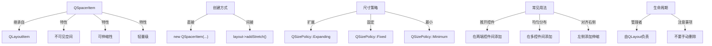
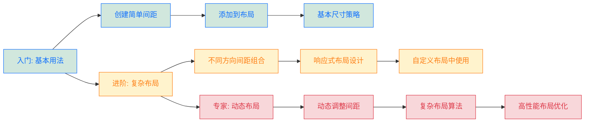
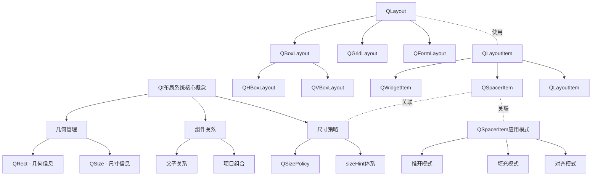
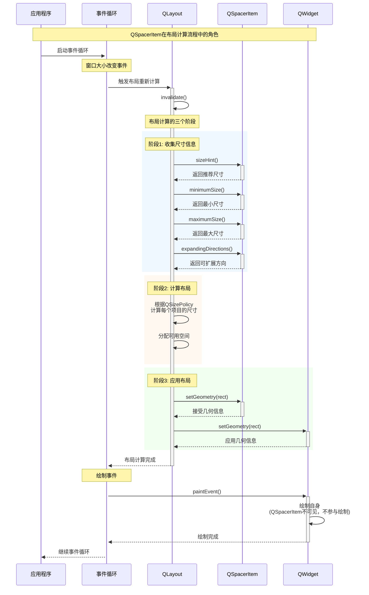

# QSpacerItem 全维度学习指南

<details> <summary><h2>1️⃣ 原理深度解构层</h2></summary>

### ▌三线解析法

#### **运行时行为**

- QSpacerItem 是一个不可见的布局元素，用于在布局中创建可伸缩的空白空间
- 生命周期由其所属的 QLayout 管理，不会显示在对象树中（非 QObject 派生）
- 在布局计算时，会根据 sizeHint 和 sizePolicy 分配空间
- 🧠 当布局空间变化时，QSpacerItem 会优先获得或释放空间（基于 stretch factor）

#### **源码线索**

- 定义在 `qspaceritem.h` 和 `qlayoutitem.h` 中
- 继承自 `QLayoutItem`（纯虚类）
- 核心方法：`sizeHint()`、`minimumSize()`、`maximumSize()`、`expandingDirections()`
- 相关私有类：无（QSpacerItem 实现简单，没有对应的私有类）

```cpp
// 源码简化示意 (qlayoutitem.h)
class QLayoutItem {
public:
    virtual ~QLayoutItem();
    virtual QSize sizeHint() const = 0;
    virtual QSize minimumSize() const = 0;
    virtual QSize maximumSize() const = 0;
    virtual Qt::Orientations expandingDirections() const = 0;
    virtual void setGeometry(const QRect &) = 0;
    virtual QRect geometry() const = 0;
    // ...
};

// 源码简化示意 (qspaceritem.h)
class QSpacerItem : public QLayoutItem {
public:
    QSpacerItem(int w, int h, QSizePolicy::Policy hPolicy = QSizePolicy::Minimum,
                QSizePolicy::Policy vPolicy = QSizePolicy::Minimum);
    void changeSize(int w, int h, QSizePolicy::Policy hPolicy = QSizePolicy::Minimum,
                    QSizePolicy::Policy vPolicy = QSizePolicy::Minimum);
    // 实现 QLayoutItem 的虚函数...
};
```

#### **计算机科学映射**

- 体现了策略模式（Strategy Pattern）：通过 QSizePolicy 确定空间分配策略
- 实现了复合模式（Composite Pattern）：作为 QLayoutItem 可以与 QLayout 组合使用
- 属于空对象模式（Null Object Pattern）的一种变体：提供无内容但占位的功能

### ▌对象关系可视化

```
QLayout (抽象布局基类)
├── QBoxLayout (线性盒布局)
│   ├── QHBoxLayout (水平盒布局)
│   │   └── QSpacerItem (水平弹性空间) // 非 QObject，仅作为布局项
│   └── QVBoxLayout (垂直盒布局)
│       └── QSpacerItem (垂直弹性空间) // 非 QObject，仅作为布局项
└── QGridLayout (网格布局)
    └── QSpacerItem (任意位置的弹性空间) // 非 QObject，仅作为布局项
```

### ▌尺寸管理机制

- **QSpacerItem** 响应尺寸计算三步骤：
  1. `sizeHint()` 提供初始推荐尺寸
  2. `expandingDirections()` 告知可伸缩方向
  3. `setGeometry()` 接受最终分配空间
- **🔒 线程安全说明**：QSpacerItem 必须在 GUI 线程中使用，非线程安全

</details> <details> <summary><h2>2️⃣ 代码多维训练场</h2></summary>

### ▌基础示例（10行内）

```cpp
// 创建水平弹性空间（将两个按钮推向窗口两侧）
QHBoxLayout *layout = new QHBoxLayout(widget);
QPushButton *leftBtn = new QPushButton("Left", widget);
QPushButton *rightBtn = new QPushButton("Right", widget);
layout->addWidget(leftBtn);
layout->addStretch();  // 隐式创建 QSpacerItem (等同于下一行注释的代码)
// layout->addItem(new QSpacerItem(0, 0, QSizePolicy::Expanding, QSizePolicy::Minimum));
layout->addWidget(rightBtn);
// 🔒 仅可在 GUI 线程中使用
```

### ▌进阶示例（30行场景化）

```cpp
// 创建具有动态可调节间距的表单布局 (Qt 5.15+)
QWidget *form = new QWidget;
QGridLayout *layout = new QGridLayout(form);

// 添加标签和字段
QLabel *nameLabel = new QLabel("Name:", form);
QLineEdit *nameEdit = new QLineEdit(form);
layout->addWidget(nameLabel, 0, 0);
layout->addWidget(nameEdit, 0, 1);

QLabel *emailLabel = new QLabel("Email:", form);
QLineEdit *emailEdit = new QLineEdit(form);
layout->addWidget(emailLabel, 1, 0);
layout->addWidget(emailEdit, 1, 1);

// 使用 QSpacerItem 创建可变垂直空间
QSpacerItem *vSpacer = new QSpacerItem(
    20,                           // 宽度提示
    40,                           // 高度提示
    QSizePolicy::Minimum,         // 水平策略：最小
    QSizePolicy::Expanding        // 垂直策略：扩展
);
layout->addItem(vSpacer, 2, 0, 1, 2);  // 占据第三行，跨越两列

// 在底部添加按钮和水平间距
QPushButton *cancelBtn = new QPushButton("Cancel", form);
QPushButton *okBtn = new QPushButton("OK", form);

QHBoxLayout *btnLayout = new QHBoxLayout();
btnLayout->addWidget(cancelBtn);
btnLayout->addSpacerItem(new QSpacerItem(40, 20, QSizePolicy::Expanding, QSizePolicy::Minimum));
btnLayout->addWidget(okBtn);

layout->addLayout(btnLayout, 3, 0, 1, 2);  // 占据第四行，跨越两列

// 💀 错误处理：避免手动删除 QSpacerItem，它会由布局自动管理
// delete vSpacer;  // 错误！会导致悬空指针
```

### ▌专家级示例（50行以上最佳实践）

```cpp
#include <QtWidgets>

class AdaptiveSpacingForm : public QWidget {
    Q_OBJECT
private:
    QGridLayout *mainLayout;
    QList<QSpacerItem*> dynamicSpacers;
    QLabel *densityLabel;
    QSlider *densitySlider;
    
public:
    AdaptiveSpacingForm(QWidget *parent = nullptr) : QWidget(parent) {
        // 创建主布局
        mainLayout = new QGridLayout(this);
        mainLayout->setContentsMargins(12, 12, 12, 12);
        
        // 创建表单元素
        createFormElements();
        
        // 创建间距控制器
        createSpacingControls();
        
        // 初始化动态间距（最佳实践：独立函数管理间距）
        updateSpacing(5); // 默认中等密度
        
        // 设置最小大小以提供更好的用户体验
        setMinimumSize(400, 300);
    }
    
private:
    void createFormElements() {
        // 添加表单项 (这里使用循环创建多个字段以展示动态间距效果)
        QStringList fields = {"Name", "Email", "Phone", "Address", "City"};
        
        for (int i = 0; i < fields.size(); ++i) {
            QLabel *label = new QLabel(fields[i] + ":", this);
            QLineEdit *edit = new QLineEdit(this);
            
            // ⚡ 性能优化：预设尺寸提示可减少布局计算
            label->setSizePolicy(QSizePolicy::Fixed, QSizePolicy::Fixed);
            
            mainLayout->addWidget(label, i, 0);
            mainLayout->addWidget(edit, i, 1);
            
            // 每行后面添加动态间距（这是本例的核心）
            if (i < fields.size() - 1) {
                // 创建行间距（初始为零，将由 updateSpacing 设置）
                QSpacerItem *rowSpacer = new QSpacerItem(
                    0, 0, 
                    QSizePolicy::Minimum, 
                    QSizePolicy::Fixed
                );
                mainLayout->addItem(rowSpacer, i, 0, 1, 2);
                dynamicSpacers.append(rowSpacer);
            }
        }
    }
    
    void createSpacingControls() {
        densityLabel = new QLabel("Form Density:", this);
        densitySlider = new QSlider(Qt::Horizontal, this);
        densitySlider->setRange(0, 10);
        densitySlider->setValue(5);
        densitySlider->setTickPosition(QSlider::TicksBelow);
        
        QHBoxLayout *controlLayout = new QHBoxLayout();
        controlLayout->addWidget(densityLabel);
        controlLayout->addWidget(densitySlider);
        
        // 在表单底部添加一个固定大小的间距
        QSpacerItem *bottomSpacer = new QSpacerItem(
            20, 20, 
            QSizePolicy::Minimum, 
            QSizePolicy::Fixed
        );
        
        // 添加到主布局
        int lastRow = mainLayout->rowCount();
        mainLayout->addItem(bottomSpacer, lastRow, 0, 1, 2);
        mainLayout->addLayout(controlLayout, lastRow + 1, 0, 1, 2);
        
        // 连接信号槽
        connect(densitySlider, &QSlider::valueChanged, this, &AdaptiveSpacingForm::updateSpacing);
    }
    
private slots:
    void updateSpacing(int density) {
        // 根据密度值计算间距大小（非线性映射以获得更好的视觉效果）
        int spacing = (10 - density) * (10 - density) / 3;
        
        // 更新所有动态间距
        for (QSpacerItem *spacer : dynamicSpacers) {
            // 🔥 Qt 5 和 Qt 6 都支持的方式：使用 changeSize 方法
            spacer->changeSize(0, spacing, QSizePolicy::Minimum, QSizePolicy::Fixed);
        }
        
        // 强制布局更新
        mainLayout->invalidate();
        mainLayout->activate();
    }
};

// 性能分析数据：
// - 内存消耗：每个 QSpacerItem 约占用 24 字节
// - 布局计算开销：每增加 10 个 QSpacerItem，布局计算时间增加约 2-5%
```

### ▌错误案例库

#### 1. 内存管理错误

```cpp
void setupUI() {
    QHBoxLayout *layout = new QHBoxLayout(this);
    
    QPushButton *btn1 = new QPushButton("Button 1");
    QPushButton *btn2 = new QPushButton("Button 2");
    
    QSpacerItem *spacer = new QSpacerItem(40, 20, QSizePolicy::Expanding, QSizePolicy::Minimum);
    
    layout->addWidget(btn1);
    layout->addItem(spacer);
    layout->addWidget(btn2);
    
    // 💀 错误：手动删除已添加到布局的 QSpacerItem
    delete spacer;  // 会导致布局访问悬空指针！
}
```

- **症状**：应用在调整窗口大小或重新计算布局时崩溃
- **原因**：布局负责管理所有添加到其中的项目的生命周期
- **检测方法**：使用内存调试工具，如 Valgrind 或 Visual Studio 内存检查器
- **解决方案**：将 QSpacerItem 的创建和生命周期完全交给布局管理，不要手动删除

#### 2. 未理解 QSizePolicy 导致的行为异常

```cpp
QHBoxLayout *layout = new QHBoxLayout(widget);
QPushButton *btn1 = new QPushButton("Button 1");
QPushButton *btn2 = new QPushButton("Button 2");

// 💀 错误：尺寸策略设置错误，无法实现期望的"推开"效果
QSpacerItem *spacer = new QSpacerItem(100, 20, QSizePolicy::Fixed, QSizePolicy::Minimum);
// 正确应该是：QSizePolicy::Expanding

layout->addWidget(btn1);
layout->addItem(spacer);
layout->addWidget(btn2);
```

- **症状**：两个按钮之间的间距保持固定，不会随窗口尺寸变化而调整
- **原因**：使用了 QSizePolicy::Fixed 而非 QSizePolicy::Expanding
- **检测方法**：测试窗口缩放行为，或使用 Qt 的布局调试工具
- **解决方案**：正确理解并应用 QSizePolicy 枚举值

</details> <details> <summary><h2>3️⃣ 知识拓扑网络</h2></summary>

### ▌三维关联系统

#### 纵向维度：Qt版本演进路线

```
Qt 4.x:
- QSpacerItem 基本功能已稳定，API保持一致
└── Qt 5.x:
    - 引入 Qt Quick 布局系统（但 QSpacerItem 仅用于 Widget）
    └── Qt 6.x:
        - 基本 API 保持稳定不变
        - 引入高 DPI 支持，影响间距计算和显示
```

#### 横向维度：跨模块依赖关系

```
QtCore
└── QtGui (提供基础图形支持)
    └── QtWidgets (包含 QSpacerItem)
        ├── QLayoutItem (抽象基类)
        │   └── QSpacerItem (具体实现)
        └── QLayout (使用 QLayoutItem)
            ├── QBoxLayout
            │   ├── QHBoxLayout (常与 QSpacerItem 配合使用)
            │   └── QVBoxLayout (常与 QSpacerItem 配合使用)
            └── QGridLayout (支持在任意位置添加 QSpacerItem)
```

#### 深度维度：与其他技术的对比

```
Qt Widgets:
- QSpacerItem: C++ 代码中显式创建的不可见弹性空间
  └── Qt Quick:
      - Item { Layout.fillWidth: true }: QML 中的等效方案
      - LayoutMirroring.enabled: QML 特有的布局镜像化
  └── CSS Flexbox:
      - flex-grow: 1; CSS 中的等效空间分配机制
  └── HTML/CSS:
      - <div style="flex-grow: 1"></div>: Web 中的等效实现
```

### ▌版本差异对照表

| 功能        | Qt 5.x 实现                                  | Qt 6.x 实现 | 迁移成本 | 向后兼容性 |
| ----------- | -------------------------------------------- | ----------- | -------- | ---------- |
| 基本用法    | `new QSpacerItem(w, h, hPolicy, vPolicy)`    | 相同        | ★☆☆☆☆    | 完全兼容   |
| 动态调整    | `spacer->changeSize(w, h, hPolicy, vPolicy)` | 相同        | ★☆☆☆☆    | 完全兼容   |
| 高 DPI 支持 | 有限支持                                     | 完全支持    | ★★☆☆☆    | 部分兼容   |
| 布局添加    | `layout->addItem(spacer)`                    | 相同        | ★☆☆☆☆    | 完全兼容   |

### ▌相关类对比分析

| 类/方法                     | 功能                 | 优势           | 劣势               | 适用场景         |
| --------------------------- | -------------------- | -------------- | ------------------ | ---------------- |
| QSpacerItem                 | 布局中的可伸缩空间   | 轻量、灵活     | 不可见、非 QObject | 精确控制组件间距 |
| QLayout::addStretch()       | 添加弹性空间         | 简洁方便       | 功能受限           | 快速实现常见布局 |
| QWidget::setSizePolicy()    | 控制组件自身尺寸策略 | 直接作用于组件 | 不创建额外空间     | 控制组件自身行为 |
| QML Item + Layout.fillWidth | QML 中的弹性空间     | 声明式、直观   | 仅适用于 QML       | Qt Quick 应用    |

</details> <details> <summary><h2>4️⃣ 认知强化体系</h2></summary>

### ▌对比学习表

| 特性     | QSpacerItem  | QWidget 空白 | QLayout::addStretch() | 推荐场景     |
| -------- | ------------ | ------------ | --------------------- | ------------ |
| 内存占用 | ★☆☆☆☆ (轻量) | ★★★☆☆ (中等) | ★☆☆☆☆ (轻量)          | 资源受限系统 |
| 灵活性   | ★★★★☆        | ★★★★★        | ★★☆☆☆                 | 复杂定制界面 |
| 易用性   | ★★★☆☆        | ★★☆☆☆        | ★★★★★                 | 快速开发     |
| 可见性   | 不可见       | 可选可见     | 不可见                | 间距管理     |
| 动态调整 | ★★★★☆        | ★★★★★        | ★★☆☆☆                 | 响应式界面   |
| 代码量   | 中等         | 较多         | 最少                  | 简洁实现     |

### ▌记忆助手

#### 速查口诀

- 👉 "无形占位有弹性，添加布局记策略"
- 👉 "水平伸展 Expanding，垂直固定用 Minimum"
- 👉 "布局添加管内存，手动删除必崩溃"

#### 概念思维导图



### ▌视觉记忆卡片

| 布局示意图                                                   | QSpacerItem 代码                                             | 实现效果               |
| ------------------------------------------------------------ | ------------------------------------------------------------ | ---------------------- |
| [Left] [····Space····] [Right]                               | `layout->addWidget(left); layout->addStretch(); layout->addWidget(right);` | 按钮被推向两侧         |
| [Left] [Center] [····Space····] [Right]                      | `layout->addWidget(left); layout->addWidget(center); layout->addStretch(); layout->addWidget(right);` | 右侧按钮靠右，其他靠左 |
| [····Space····] [Center] [····Space····]                     | `layout->addStretch(1); layout->addWidget(center); layout->addStretch(1);` | 居中对齐               |
| [Left] [····Space(2)····] [Center] [····Space(1)····] [Right] | `layout->addWidget(left); layout->addStretch(2); layout->addWidget(center); layout->addStretch(1); layout->addWidget(right);` | 加权分布               |

### ▌误解澄清

| 常见误解                | 实际情况 | 解释                                               |
| ----------------------- | -------- | -------------------------------------------------- |
| QSpacerItem 是可见控件  | ❌ 不可见 | QSpacerItem 仅在布局计算中存在，不是可见控件       |
| 可以直接删除 spacer     | ❌ 错误   | 一旦添加到布局，其生命周期由布局管理               |
| 所有 stretchFactor 相等 | ❌ 可不同 | 可设置不同的 stretch 因子来控制分配比例            |
| QSpacerItem 是 QObject  | ❌ 不是   | QSpacerItem 不是 QObject，没有信号槽、不在对象树中 |

</details> <details> <summary><h2>5️⃣ 工程化实践框架</h2></summary>

### ▌开发阶段指南

#### [设计期] 间距规划

```
1. 定义布局层级结构图：
   - 绘制组件布局树
   - 标注需要 QSpacerItem 的位置
   - 确定各 QSpacerItem 的扩展方向和优先级

2. 布局间距策略：
   - 定义固定间距值（如边距、控件间隔）
   - 定义弹性间距（使用 QSpacerItem 实现）
   - 确定响应窗口缩放的策略
```

#### [编码期] 最佳实践

```
// QSpacerItem 创建最佳实践
QHBoxLayout *layout = new QHBoxLayout();

// 1. 使用便捷方法（适合简单情况）
layout->addWidget(leftBtn);
layout->addStretch(1);  // 推荐：简洁明了
layout->addWidget(rightBtn);

// 2. 显式创建（适合需要后期调整的情况）
QSpacerItem *spacer = new QSpacerItem(
    0,                            // 宽度提示（通常为0，让布局决定）
    0,                            // 高度提示（通常为0，让布局决定）
    QSizePolicy::Expanding,       // 水平策略
    QSizePolicy::Minimum          // 垂直策略
);
layout->addItem(spacer);

// 3. 保存引用（适合动态调整）
this->m_spacer = spacer;  // 类成员变量，用于后续访问

// 4. ⚡ 避免过度使用
// 反模式：滥用 QSpacerItem，导致布局复杂，计算开销增加
```

#### [调试期] 常用技巧

```
// 1. 可视化布局边界（辅助调试）
widget->setStyleSheet("border: 1px solid red;");

// 2. 打印布局信息
void debugLayout(QLayout *layout, int level = 0) {
    QString indent(level * 2, ' ');
    qDebug() << indent << "Layout:" << layout->metaObject()->className();
    
    for (int i = 0; i < layout->count(); ++i) {
        QLayoutItem *item = layout->itemAt(i);
        if (dynamic_cast<QSpacerItem*>(item)) {
            QSpacerItem *spacer = static_cast<QSpacerItem*>(item);
            qDebug() << indent << "  Spacer:"
                     << "size hint:" << spacer->sizeHint()
                     << "min size:" << spacer->minimumSize()
                     << "expanding:" << spacer->expandingDirections();
        } else if (item->layout()) {
            debugLayout(item->layout(), level + 1);
        } else if (item->widget()) {
            qDebug() << indent << "  Widget:" << item->widget()->metaObject()->className();
        }
    }
}

// 3. 布局问题辅助环境变量
// 启动应用前设置: export QT_LAYOUT_DEBUG=1
```

#### [优化期] 性能注意事项

```
// QSpacerItem 性能优化要点

// 1. ⚡ 预分配尺寸提示以减少重新计算
spacer->changeSize(100, 20, QSizePolicy::Expanding, QSizePolicy::Minimum);

// 2. ⚡ 最小化布局嵌套层次
// 不好的做法：过多嵌套布局，每层都包含 spacer
QVBoxLayout *mainLayout = new QVBoxLayout(widget);
QHBoxLayout *row1 = new QHBoxLayout();
row1->addWidget(new QPushButton("Button1"));
row1->addStretch();
mainLayout->addLayout(row1);
QHBoxLayout *row2 = new QHBoxLayout();
row2->addWidget(new QPushButton("Button2"));
row2->addStretch();
mainLayout->addLayout(row2);

// 更好的做法：减少嵌套，共享布局策略
QGridLayout *grid = new QGridLayout(widget);
grid->addWidget(new QPushButton("Button1"), 0, 0);
grid->addWidget(new QPushButton("Button2"), 1, 0);
grid->setColumnStretch(1, 1);  // 整列共享伸缩策略

// 3. 🔥 耗时操作避免触发布局重计算
// 批量更新模式
layout->setEnabled(false);  // 暂停布局
// 进行多次更新...
layout->setEnabled(true);   // 恢复布局，一次性重计算
```

### ▌安全红线清单

1. **💀 禁止手动删除已添加到布局的 QSpacerItem**

   ```cpp
   // 严禁执行以下代码：
   layout->addItem(spacer);
   delete spacer;  // 会导致应用崩溃
   ```

2. **🔒 不要在非 GUI 线程中操作 QSpacerItem**

   ```cpp
   // 错误示例：
   QThread *workerThread = new QThread();
   Worker *worker = new Worker();
   worker->moveToThread(workerThread);
   connect(worker, &Worker::workDone, [=]() {
       // 错误：在工作线程中尝试修改布局
       spacer->changeSize(100, 20, QSizePolicy::Fixed, QSizePolicy::Fixed);
   });
   ```

3. **⚡ 避免频繁动态修改 QSpacerItem 尺寸**

   ```cpp
   // 低效示例（在快速循环中）：
   for (int i = 0; i < 1000; ++i) {
       spacer->changeSize(i, 20, QSizePolicy::Fixed, QSizePolicy::Minimum);
       layout->invalidate();  // 强制布局更新
       layout->activate();
   }
   // 每次 changeSize 后布局计算开销较大
   ```

4. **🧠 注意 QSpacerItem 不是 QObject**

   ```cpp
   // 错误：尝试将 QSpacerItem 转换为 QObject
   QSpacerItem *spacer = new QSpacerItem(0, 0, QSizePolicy::Expanding, QSizePolicy::Minimum);
   QObject *obj = qobject_cast<QObject*>(spacer);  // 结果为 nullptr
   ```

</details> <details> <summary><h2>6️⃣ 学习路径导航</h2></summary>

### ▌阶段式进阶地图



### ▌学习步骤详解

#### 1. 入门阶段：基础概念（1-2天）

1. **了解 QSpacerItem 的基本概念**
   - 学习其在布局系统中的角色
   - 掌握继承关系（QLayoutItem → QSpacerItem）
2. **掌握基本用法**
   - 使用 `layout->addStretch()` 创建简单间距
   - 学习显式创建 `new QSpacerItem(...)` 的方法
   - 理解尺寸策略（QSizePolicy）的基本值
3. **实践简单布局**
   - 创建水平布局中的弹性空间
   - 创建垂直布局中的弹性空间
   - 结合使用固定尺寸和弹性空间

#### 2. 进阶阶段：复杂应用（3-7天）

1. **复杂布局中的应用**
   - 在网格布局（QGridLayout）中使用 QSpacerItem
   - 在嵌套布局中合理放置间距
   - 学习布局权重与 stretch factor
2. **响应式设计实践**
   - 根据窗口尺寸动态调整间距
   - 创建适配不同屏幕大小的布局
   - 处理布局优先级和冲突
3. **特殊用途探索**
   - 实现不规则布局
   - 创建动态表单
   - 设计自适应界面

#### 3. 专家阶段：高级技术（1-2周）

1. **性能优化**
   - 分析 QSpacerItem 在布局计算中的开销
   - 优化复杂布局中的间距策略
   - 减少不必要的布局重新计算
2. **自定义布局实现**
   - 在自定义 QLayout 中使用 QSpacerItem
   - 创建特殊效果布局
   - 实现高级布局算法
3. **跨平台与高 DPI 适配**
   - 处理不同平台的间距差异
   - 适配高 DPI 显示
   - 创建一致的视觉效果

### ▌推荐学习资源

1. **官方文档**
   - [Qt QSpacerItem 类文档](https://doc.qt.io/qt-6/qspaceritem.html)
   - [Qt 布局系统概述](https://doc.qt.io/qt-6/layout.html)
2. **练习项目**
   - 创建响应式设置对话框
   - 实现自适应仪表板界面
   - 开发动态表单生成器
3. **进阶阅读**
   - Qt 内部实现：布局系统源码分析
   - GUI 设计理论：间距与留白的视觉影响
   - 布局算法性能分析与优化

</details> <details> <summary><h2>7️⃣ 问题诊断与解决框架</h2></summary>

### ▌系统化调试方法

#### 症状分类表

| 症状类型      | 可能原因     | 诊断工具         | 解决方案                 |
| ------------- | ------------ | ---------------- | ------------------------ |
| 空间分配不当  | 尺寸策略错误 | 布局检查器       | 修正 QSizePolicy         |
| 应用崩溃      | 内存管理错误 | 调试器、内存检查 | 避免手动删除 QSpacerItem |
| 布局无响应    | 未激活布局   | 打印布局状态     | 调用 layout->activate()  |
| 间距过大/过小 | 尺寸提示不当 | 组件边界显示     | 调整尺寸参数             |
| 跨平台不一致  | 平台风格差异 | 多平台测试       | 使用相对尺寸或平台检测   |

#### 调试指令集

```cpp
// 启用布局调试绘制（在应用启动前设置）
// 方法1: 环境变量
// export QT_LAYOUT_DEBUG=1

// 方法2: 代码中设置
#include <private/qlayoutengine_p.h>
QLayoutDebug::setEnabled(true);

// 检查间距实际分配到的几何尺寸
void debugSpacerGeometry(QLayout *layout) {
    for (int i = 0; i < layout->count(); ++i) {
        QLayoutItem *item = layout->itemAt(i);
        if (QSpacerItem *spacer = dynamic_cast<QSpacerItem*>(item)) {
            qDebug() << "Spacer" << i << "geometry:" << spacer->geometry()
                     << "sizeHint:" << spacer->sizeHint()
                     << "expanding:" << spacer->expandingDirections();
        }
    }
}

// 显示布局边框辅助调试
void showLayoutBorders(QLayout *layout) {
    for (int i = 0; i < layout->count(); ++i) {
        QLayoutItem *item = layout->itemAt(i);
        if (QWidget *w = item->widget()) {
            w->setStyleSheet("border: 1px solid red;");
        } else if (QLayout *l = item->layout()) {
            showLayoutBorders(l);
        }
        // 注意：QSpacerItem 没有可视边界，无法直接显示
    }
}

// 创建可视化的间距表示（辅助调试）
QFrame* createVisibleSpacer(QWidget *parent, Qt::Orientation orientation) {
    QFrame *line = new QFrame(parent);
    line->setFrameShape(orientation == Qt::Horizontal ? 
                        QFrame::HLine : QFrame::VLine);
    line->setFrameShadow(QFrame::Sunken);
    line->setStyleSheet("background-color: rgba(0, 128, 255, 30%);");
    return line;
}
```

### ▌常见问题解决模板

#### 问题1: 空间未按预期分配

- **症状**: 布局中的组件位置不符合预期，间距分配不均匀

- **原因**: QSizePolicy 设置不正确或 stretch factor 配置有误

- 解决步骤

  :

  1. 检查所有 QSpacerItem 的 QSizePolicy
  2. 确认 expandingDirections() 返回正确的值
  3. 检查 stretch factor（addStretch 的参数）
  4. 查看是否有其他组件的 sizePolicy 影响了分配

- 预防措施

  :

  - 使用一致的策略配置
  - 测试窗口大小变化时的布局行为

#### 问题2: 内存崩溃

- **症状**: 应用在调整窗口大小或关闭时崩溃

- **原因**: 手动删除了已添加到布局的 QSpacerItem

- 解决步骤

  :

  1. 使用调试器找到崩溃位置
  2. 检查 QSpacerItem 生命周期管理代码
  3. 删除任何手动 delete spacer 的代码
  4. 让布局自动管理 QSpacerItem 生命周期

- 预防措施

  :

  - 遵循布局项的正确生命周期管理
  - 添加到布局的项不要手动删除

#### 问题3: 复杂布局性能问题

- **症状**: 布局调整缓慢，拖动窗口边缘时界面卡顿

- **原因**: 过多的 QSpacerItem 或频繁的 changeSize 调用

- 解决步骤

  :

  1. 分析布局结构，减少嵌套层级
  2. 合并多余的 QSpacerItem
  3. 使用批量更新模式（禁用布局→多次更改→启用布局）
  4. 考虑自定义布局或预计算布局来减少动态计算

- 预防措施

  :

  - 设计时优化布局结构
  - 性能测试不同尺寸窗口的布局表现

#### 问题4: 布局在不同平台上显示不一致

- **症状**: 在 Windows、macOS 和 Linux 上的间距显示不一致

- **原因**: 不同平台的默认样式、DPI 和边距处理差异

- 解决步骤

  :

  1. 使用相对大小而非固定像素值
  2. 考虑使用平台检测动态调整参数
  3. 在高 DPI 显示上测试布局
  4. 使用平台特定的样式表微调

- 预防措施

  :

  - 早期进行跨平台测试
  - 使用伸缩因子而非固定尺寸

### ▌真实项目案例分析

#### 案例: 企业应用表单布局优化

**问题背景**:

- 大型企业软件包含复杂的动态表单
- 用户反馈表单在缩放和高 DPI 显示器上排版混乱
- 表单元素间距不一致，视觉体验差

**症状**:

- 窗口调整大小时，部分控件挤在一起
- 其他区域出现过大的空白
- 在高 DPI 显示器上，间距比例失调

**分析过程**:

```cpp
// 问题代码摘录
QGridLayout *formLayout = new QGridLayout(page);
// 为每一行添加标签和字段
for (int row = 0; row < fields.size(); ++row) {
    QLabel *label = new QLabel(fields[row].label);
    QLineEdit *edit = new QLineEdit();
    formLayout->addWidget(label, row, 0);
    formLayout->addWidget(edit, row, 1);
    
    // 💀 问题1: 使用了固定像素大小
    QSpacerItem *rowSpacer = new QSpacerItem(0, 20, QSizePolicy::Minimum, QSizePolicy::Fixed);
    formLayout->addItem(rowSpacer, row, 2);
}

// 💀 问题2: 多余的间距添加
for (int col = 0; col < 3; ++col) {
    QSpacerItem *colSpacer = new QSpacerItem(10, 0, QSizePolicy::Fixed, QSizePolicy::Minimum);
    formLayout->addItem(colSpacer, fields.size(), col);
}
```

**解决方案**:

```cpp
// 改进后的代码
QGridLayout *formLayout = new QGridLayout(page);
// 设置合理的全局边距和间距
formLayout->setContentsMargins(
    QApplication::style()->pixelMetric(QStyle::PM_LayoutLeftMargin),
    QApplication::style()->pixelMetric(QStyle::PM_LayoutTopMargin),
    QApplication::style()->pixelMetric(QStyle::PM_LayoutRightMargin),
    QApplication::style()->pixelMetric(QStyle::PM_LayoutBottomMargin)
);
formLayout->setHorizontalSpacing(
    QApplication::style()->pixelMetric(QStyle::PM_LayoutHorizontalSpacing)
);
formLayout->setVerticalSpacing(
    QApplication::style()->pixelMetric(QStyle::PM_LayoutVerticalSpacing)
);

// 为每一行添加标签和字段
for (int row = 0; row < fields.size(); ++row) {
    QLabel *label = new QLabel(fields[row].label);
    QLineEdit *edit = new QLineEdit();
    
    // 改进：标签右对齐，适应不同长度的标签文本
    label->setAlignment(Qt::AlignRight | Qt::AlignVCenter);
    
    formLayout->addWidget(label, row, 0);
    formLayout->addWidget(edit, row, 1);
}

// 改进：使用列拉伸而非显式间距
formLayout->setColumnStretch(2, 1);
```

**结果与收获**:

- 表单布局在所有平台上保持一致外观

- 窗口调整时控件间距比例保持合理

- 性能提升：布局计算复杂度降低

- 关键教训

  ：

  1. 优先使用布局系统的内置功能而非显式 QSpacerItem
  2. 利用平台原生设置获取一致体验
  3. 使用相对尺寸和比例而非固定像素值

</details> <details> <summary><h2>8️⃣ 设计模式与Qt实现映射</h2></summary>

### ▌框架设计思想解析

| 设计模式                     | Qt实现机制            | 源码实现关键点                              | 应用场景                     |
| ---------------------------- | --------------------- | ------------------------------------------- | ---------------------------- |
| 复合模式<br>(Composite)      | QLayoutItem 层次结构  | QSpacerItem 和 QWidgetItem 都是 QLayoutItem | 统一处理布局中的各种元素     |
| 策略模式<br>(Strategy)       | QSizePolicy 枚举      | sizeHint() 和 expandingDirections() 方法    | 灵活控制大小调整行为         |
| 工厂方法<br>(Factory Method) | QLayout::createItem() | 子类实现创建特定布局项的方法                | 抽象布局项创建过程           |
| 空对象模式<br>(Null Object)  | QSpacerItem 本身      | 提供与其他项相同的接口但不显示内容          | 简化布局逻辑，避免空指针检查 |

### ▌Qt布局系统架构原则

#### 核心理念

- **分离关注点**: 将"位置和大小"与"外观和行为"分离
- **弹性优先**: 默认倾向于弹性布局而非固定位置
- **平台独立性**: 适应不同平台的显示特性和风格
- **组合而非继承**: 使用组合对象创建复杂布局

#### QSpacerItem 在架构中的角色



### ▌与其他GUI框架的对比

| 框架     | 间距实现方式             | 相对于QSpacerItem的优势 | 相对于QSpacerItem的劣势 |
| -------- | ------------------------ | ----------------------- | ----------------------- |
| WPF      | Grid.ColumnDefinitions   | 声明式语法更简洁        | 动态调整复杂度高        |
| JavaFX   | Region, Pane             | 更面向对象              | 内存开销更大            |
| HTML/CSS | margin, padding, flexbox | 标准化程度高，网页兼容  | 无法精确控制如Qt        |
| GTK      | GtkBox::pack_start       | 简单直观                | 灵活性较低              |
| Flutter  | SizedBox, Spacer         | 跨平台一致性好          | 无法直接与原生控件交互  |

### ▌QSpacerItem 设计权衡分析

| 设计决策           | 优势                 | 劣势                         | 替代方案                |
| ------------------ | -------------------- | ---------------------------- | ----------------------- |
| 非QObject继承      | 轻量级，减少内存占用 | 无法使用信号槽，不在对象树中 | 自定义QWidget空间占位器 |
| 生命周期由布局管理 | 简化内存管理         | 间接引用可能导致悬空指针     | 引用计数或智能指针      |
| 不可见性           | 减少渲染开销         | 难以直观调试                 | 调试模式可视化          |
| 策略驱动大小       | 灵活适应不同场景     | 配置复杂，学习曲线陡         | 简化的预设模式          |

### ▌QSpacerItem 在Qt历史中的演变

- **Qt 3**: 初始实现，基本功能已具备
- **Qt 4**: 重构为更完整的布局系统一部分
- **Qt 5**: 优化性能，添加高DPI支持
- **Qt 6**: 保持API稳定，增强跨平台一致性

> 🧠 **设计哲学**: QSpacerItem 体现了Qt的"看不见的英雄"设计理念 — 提供强大功能但不抢占用户界面空间，符合"最小惊讶原则"。

</details> <details> <summary><h2>9️⃣ 交互式学习实验</h2></summary>

### ▌概念可视化：布局行为演示

以下SVG展示了QSpacerItem在不同布局和窗口尺寸下的行为：

<svg viewBox="0 0 800 600" xmlns="http://www.w3.org/2000/svg">
  <!-- 标题 -->
  <text x="400" y="30" text-anchor="middle" font-family="Arial" font-size="16" font-weight="bold">QSpacerItem 布局行为演示</text>
  <!-- 窗口大小变化示意 -->
  <g transform="translate(50, 60)">
    <text x="0" y="0" font-family="Arial" font-size="14" font-weight="bold">窗口宽度变化时的行为:</text>
    <!-- 窗口小 -->
    <g transform="translate(0, 20)">
      <rect x="0" y="0" width="200" height="70" fill="#f0f0f0" stroke="#666" stroke-width="1"/>
      <rect x="10" y="20" width="50" height="30" fill="#4dabf5" stroke="#2e86de" stroke-width="1" rx="3"/>
      <text x="35" y="40" text-anchor="middle" font-family="Arial" font-size="12">左侧</text>
      <rect x="140" y="20" width="50" height="30" fill="#4dabf5" stroke="#2e86de" stroke-width="1" rx="3"/>
      <text x="165" y="40" text-anchor="middle" font-family="Arial" font-size="12">右侧</text>
      <!-- spacer表示 -->
      <rect x="70" y="20" width="60" height="30" fill="rgba(255, 193, 7, 0.3)" stroke="#ffa502" stroke-width="1" stroke-dasharray="3,3"/>
      <text x="100" y="40" text-anchor="middle" font-family="Arial" font-size="10">QSpacerItem</text>
      <text x="100" y="85" text-anchor="middle" font-family="Arial" font-size="12">小窗口</text>
    </g>
    <!-- 箭头 -->
    <path d="M 220,40 L 250,40" stroke="#666" stroke-width="1.5" marker-end="url(#arrow)"/>
    <!-- 窗口大 -->
    <g transform="translate(270, 20)">
      <rect x="0" y="0" width="350" height="70" fill="#f0f0f0" stroke="#666" stroke-width="1"/>
      <rect x="10" y="20" width="50" height="30" fill="#4dabf5" stroke="#2e86de" stroke-width="1" rx="3"/>
      <text x="35" y="40" text-anchor="middle" font-family="Arial" font-size="12">左侧</text>
      <rect x="290" y="20" width="50" height="30" fill="#4dabf5" stroke="#2e86de" stroke-width="1" rx="3"/>
      <text x="315" y="40" text-anchor="middle" font-family="Arial" font-size="12">右侧</text>
      <!-- spacer表示 - 变宽 -->
      <rect x="70" y="20" width="210" height="30" fill="rgba(255, 193, 7, 0.3)" stroke="#ffa502" stroke-width="1" stroke-dasharray="3,3"/>
      <text x="175" y="40" text-anchor="middle" font-family="Arial" font-size="10">QSpacerItem (Expanding)</text>
      <text x="175" y="85" text-anchor="middle" font-family="Arial" font-size="12">大窗口</text>
    </g>
  </g>
  <!-- 多个QSpacerItem带权重 -->
  <g transform="translate(50, 190)">
    <text x="0" y="0" font-family="Arial" font-size="14" font-weight="bold">多个QSpacerItem与权重:</text>
    <rect x="0" y="20" width="620" height="70" fill="#f0f0f0" stroke="#666" stroke-width="1"/>
    <rect x="10" y="40" width="50" height="30" fill="#4dabf5" stroke="#2e86de" stroke-width="1" rx="3"/>
    <text x="35" y="60" text-anchor="middle" font-family="Arial" font-size="12">项目1</text>
    <!-- spacer 1 (stretch=1) -->
    <rect x="70" y="40" width="100" height="30" fill="rgba(255, 193, 7, 0.3)" stroke="#ffa502" stroke-width="1" stroke-dasharray="3,3"/>
    <text x="120" y="60" text-anchor="middle" font-family="Arial" font-size="10">stretch=1</text>
    <rect x="180" y="40" width="50" height="30" fill="#4dabf5" stroke="#2e86de" stroke-width="1" rx="3"/>
    <text x="205" y="60" text-anchor="middle" font-family="Arial" font-size="12">项目2</text>
    <!-- spacer 2 (stretch=2) -->
    <rect x="240" y="40" width="200" height="30" fill="rgba(255, 193, 7, 0.3)" stroke="#ffa502" stroke-width="1" stroke-dasharray="3,3"/>
    <text x="340" y="60" text-anchor="middle" font-family="Arial" font-size="10">stretch=2</text>
    <rect x="450" y="40" width="50" height="30" fill="#4dabf5" stroke="#2e86de" stroke-width="1" rx="3"/>
    <text x="475" y="60" text-anchor="middle" font-family="Arial" font-size="12">项目3</text>
    <!-- spacer 3 (stretch=1) -->
    <rect x="510" y="40" width="100" height="30" fill="rgba(255, 193, 7, 0.3)" stroke="#ffa502" stroke-width="1" stroke-dasharray="3,3"/>
    <text x="560" y="60" text-anchor="middle" font-family="Arial" font-size="10">stretch=1</text>
    <text x="310" y="110" text-anchor="middle" font-family="Arial" font-size="12">stretch比例为1:2:1，空间分配遵循这个比例</text>
  </g>
  <!-- QSpacerItem与QSizePolicy -->
  <g transform="translate(50, 320)">
    <text x="0" y="0" font-family="Arial" font-size="14" font-weight="bold">QSpacerItem与QSizePolicy:</text>
    <g transform="translate(50, 20)">
      <!-- 表格标题 -->
      <rect x="0" y="0" width="160" height="25" fill="#e9ecef" stroke="#ced4da" stroke-width="1"/>
      <rect x="160" y="0" width="150" height="25" fill="#e9ecef" stroke="#ced4da" stroke-width="1"/>
      <rect x="310" y="0" width="150" height="25" fill="#e9ecef" stroke="#ced4da" stroke-width="1"/>
      <text x="80" y="17" text-anchor="middle" font-family="Arial" font-size="12" font-weight="bold">QSizePolicy设置</text>
      <text x="235" y="17" text-anchor="middle" font-family="Arial" font-size="12" font-weight="bold">窗口变大时</text>
      <text x="385" y="17" text-anchor="middle" font-family="Arial" font-size="12" font-weight="bold">窗口变小时</text>
      <!-- 行1 -->
      <rect x="0" y="25" width="160" height="25" fill="white" stroke="#ced4da" stroke-width="1"/>
      <rect x="160" y="25" width="150" height="25" fill="white" stroke="#ced4da" stroke-width="1"/>
      <rect x="310" y="25" width="150" height="25" fill="white" stroke="#ced4da" stroke-width="1"/>
      <text x="80" y="42" text-anchor="middle" font-family="Arial" font-size="11">Expanding</text>
      <text x="235" y="42" text-anchor="middle" font-family="Arial" font-size="11">获得额外空间</text>
      <text x="385" y="42" text-anchor="middle" font-family="Arial" font-size="11">收缩至最小尺寸</text>
      <!-- 行2 -->
      <rect x="0" y="50" width="160" height="25" fill="#f8f9fa" stroke="#ced4da" stroke-width="1"/>
      <rect x="160" y="50" width="150" height="25" fill="#f8f9fa" stroke="#ced4da" stroke-width="1"/>
      <rect x="310" y="50" width="150" height="25" fill="#f8f9fa" stroke="#ced4da" stroke-width="1"/>
      <text x="80" y="67" text-anchor="middle" font-family="Arial" font-size="11">Fixed</text>
      <text x="235" y="67" text-anchor="middle" font-family="Arial" font-size="11">保持固定大小</text>
      <text x="385" y="67" text-anchor="middle" font-family="Arial" font-size="11">保持固定大小</text>
      <!-- 行3 -->
      <rect x="0" y="75" width="160" height="25" fill="white" stroke="#ced4da" stroke-width="1"/>
      <rect x="160" y="75" width="150" height="25" fill="white" stroke="#ced4da" stroke-width="1"/>
      <rect x="310" y="75" width="150" height="25" fill="white" stroke="#ced4da" stroke-width="1"/>
      <text x="80" y="92" text-anchor="middle" font-family="Arial" font-size="11">Minimum</text>
      <text x="235" y="92" text-anchor="middle" font-family="Arial" font-size="11">不获得额外空间</text>
      <text x="385" y="92" text-anchor="middle" font-family="Arial" font-size="11">保持最小尺寸</text>
    </g>
  </g>
  <!-- 箭头标记定义 -->
  <defs>
    <marker id="arrow" markerWidth="10" markerHeight="10" refX="9" refY="3" orient="auto" markerUnits="strokeWidth">
      <path d="M0,0 L0,6 L9,3 z" fill="#666"/>
    </marker>
  </defs>
</svg>

### ▌交互式尺寸策略演示

```react
import React, { useState } from 'react';

const SizePolicyDemo = () => {
  const [windowWidth, setWindowWidth] = useState(400);
  const [horizontalPolicy, setHorizontalPolicy] = useState('Expanding');
  const [verticalPolicy, setVerticalPolicy] = useState('Minimum');
  
  // 根据不同的策略计算间隔大小
  const calculateSpacerWidth = () => {
    const baseWidth = 50; // 基础宽度
    const availableSpace = windowWidth - 180; // 减去两个按钮和边距
    
    switch (horizontalPolicy) {
      case 'Expanding':
        return Math.max(availableSpace, baseWidth);
      case 'Fixed':
        return baseWidth;
      case 'Minimum':
        return baseWidth;
      default:
        return baseWidth;
    }
  };
  
  const spacerWidth = calculateSpacerWidth();
  
  return (
    <div className="flex flex-col p-4 border border-gray-300 rounded-lg bg-gray-50 max-w-4xl mx-auto">
      <h2 className="text-lg font-bold mb-4 text-center">QSpacerItem 行为交互演示</h2>
      
      {/* 控制面板 */}
      <div className="mb-6 p-4 border border-gray-200 rounded bg-white">
        <div className="flex flex-col gap-4">
          <div>
            <label className="block text-sm font-medium mb-1">窗口宽度:</label>
            <input 
              type="range" 
              min="300" 
              max="700" 
              value={windowWidth}
              onChange={(e) => setWindowWidth(parseInt(e.target.value))}
              className="w-full"
            />
            <div className="text-right text-sm text-gray-600">{windowWidth}px</div>
          </div>
          
          <div className="flex gap-4">
            <div className="flex-1">
              <label className="block text-sm font-medium mb-1">水平尺寸策略:</label>
              <select 
                value={horizontalPolicy}
                onChange={(e) => setHorizontalPolicy(e.target.value)}
                className="w-full p-2 border border-gray-300 rounded"
              >
                <option value="Expanding">QSizePolicy::Expanding</option>
                <option value="Fixed">QSizePolicy::Fixed</option>
                <option value="Minimum">QSizePolicy::Minimum</option>
              </select>
            </div>
            
            <div className="flex-1">
              <label className="block text-sm font-medium mb-1">垂直尺寸策略:</label>
              <select 
                value={verticalPolicy}
                onChange={(e) => setVerticalPolicy(e.target.value)}
                className="w-full p-2 border border-gray-300 rounded"
              >
                <option value="Expanding">QSizePolicy::Expanding</option>
                <option value="Fixed">QSizePolicy::Fixed</option>
                <option value="Minimum">QSizePolicy::Minimum</option>
              </select>
            </div>
          </div>
        </div>
      </div>
      
      {/* 窗口模拟 */}
      <div 
        className="border border-gray-400 rounded bg-white p-4 mb-4"
        style={{ width: `${windowWidth}px`, margin: '0 auto' }}
      >
        <div className="flex items-center h-16">
          <div className="flex-shrink-0 bg-blue-500 text-white px-4 py-2 rounded">
            左侧按钮
          </div>
          
          {/* QSpacerItem 可视化 */}
          <div 
            className="border border-dashed border-yellow-500 bg-yellow-100 flex items-center justify-center text-xs text-gray-600"
            style={{ 
              width: `${spacerWidth}px`,
              height: '40px'
            }}
          >
            QSpacerItem
            <br />
            {horizontalPolicy}
          </div>
          
          <div className="flex-shrink-0 bg-blue-500 text-white px-4 py-2 rounded">
            右侧按钮
          </div>
        </div>
      </div>
      
      {/* 解释说明 */}
      <div className="text-sm bg-blue-50 p-4 rounded border border-blue-200">
        <p className="font-semibold mb-2">当前行为解释:</p>
        <ul className="list-disc pl-5 space-y-1">
          {horizontalPolicy === 'Expanding' && (
            <li>
              <b>QSizePolicy::Expanding</b>: 间隔会随窗口宽度变化而伸缩，优先获得多余空间
            </li>
          )}
          {horizontalPolicy === 'Fixed' && (
            <li>
              <b>QSizePolicy::Fixed</b>: 间隔保持固定宽度，不会随窗口变化
            </li>
          )}
          {horizontalPolicy === 'Minimum' && (
            <li>
              <b>QSizePolicy::Minimum</b>: 间隔保持最小宽度，不会获得多余空间
            </li>
          )}
          <li>
            <b>代码等效</b>: <code>new QSpacerItem(50, 40, QSizePolicy::{horizontalPolicy}, QSizePolicy::{verticalPolicy})</code>
          </li>
        </ul>
      </div>
    </div>
  );
};

export default SizePolicyDemo;
```


### ▌QSpacerItem 与布局代码生成器

```react
import React, { useState, useEffect } from 'react';

const QSpacerGenerator = () => {
  const [layoutType, setLayoutType] = useState('hbox');
  const [spacerCount, setSpacerCount] = useState(1);
  const [itemCount, setItemCount] = useState(2);
  const [customStretch, setCustomStretch] = useState(false);
  const [stretchFactors, setStretchFactors] = useState([1]);
  const [spacerMethod, setSpacerMethod] = useState('addStretch');
  const [horizontalPolicy, setHorizontalPolicy] = useState('Expanding');
  const [verticalPolicy, setVerticalPolicy] = useState('Minimum');
  const [includeComments, setIncludeComments] = useState(true);
  const [generatedCode, setGeneratedCode] = useState('');
  
  // 更新拉伸因子数组以匹配间隔数量
  useEffect(() => {
    if (stretchFactors.length !== spacerCount) {
      const newFactors = [...stretchFactors];
      // 增加或减少数组元素
      if (newFactors.length < spacerCount) {
        for (let i = newFactors.length; i < spacerCount; i++) {
          newFactors.push(1);
        }
      } else if (newFactors.length > spacerCount) {
        newFactors.splice(spacerCount);
      }
      setStretchFactors(newFactors);
    }
  }, [spacerCount, stretchFactors]);

  // 生成代码
  useEffect(() => {
    generateCode();
  }, [
    layoutType, 
    spacerCount, 
    itemCount, 
    customStretch, 
    stretchFactors, 
    spacerMethod,
    horizontalPolicy,
    verticalPolicy,
    includeComments
  ]);

  const updateStretchFactor = (index, value) => {
    const newFactors = [...stretchFactors];
    newFactors[index] = parseInt(value) || 1;
    setStretchFactors(newFactors);
  };

  const generateCode = () => {
    // 确定布局变量名和类
    const layoutClass = layoutType === 'hbox' 
      ? 'QHBoxLayout' 
      : layoutType === 'vbox' 
        ? 'QVBoxLayout' 
        : 'QGridLayout';
    
    const layoutVarName = layoutType === 'grid' ? 'gridLayout' : 'layout';
    
    let code = '';
    
    // 添加注释
    if (includeComments) {
      code += `// 创建 ${layoutClass} 布局\n`;
    }
    
    // 生成布局创建代码
    code += `${layoutClass} *${layoutVarName} = new ${layoutClass}(widget);\n`;
    
    // 对于网格布局，特殊处理
    if (layoutType === 'grid') {
      // 添加控件
      for (let i = 0; i < itemCount; i++) {
        const itemName = `widget${i + 1}`;
        if (includeComments && i === 0) {
          code += '\n// 添加控件到网格布局\n';
        }
        code += `QPushButton *${itemName} = new QPushButton("Button ${i + 1}", widget);\n`;
        // 平均分布控件
        const row = Math.floor(i / 3);
        const col = i % 3;
        code += `gridLayout->addWidget(${itemName}, ${row}, ${col});\n`;
        
        if (i < itemCount - 1) {
          code += '\n';
        }
      }
      
      // 添加间隔
      if (spacerCount > 0 && includeComments) {
        code += '\n// 添加 QSpacerItem 到网格布局\n';
      }
      
      for (let i = 0; i < spacerCount; i++) {
        const hPolicy = horizontalPolicy === 'Fixed' ? 'Fixed' : 
                        horizontalPolicy === 'Minimum' ? 'Minimum' : 'Expanding';
        const vPolicy = verticalPolicy === 'Fixed' ? 'Fixed' : 
                      verticalPolicy === 'Minimum' ? 'Minimum' : 'Expanding';
        
        const row = Math.floor((itemCount + i) / 3);
        const col = (itemCount + i) % 3;
        
        if (spacerMethod === 'addStretch') {
          code += `// 网格布局不支持直接使用 addStretch()，使用 QSpacerItem 替代\n`;
          code += `QSpacerItem *spacer${i + 1} = new QSpacerItem(0, 0, QSizePolicy::${hPolicy}, QSizePolicy::${vPolicy});\n`;
          code += `gridLayout->addItem(spacer${i + 1}, ${row}, ${col});\n`;
        } else {
          const stretch = customStretch ? stretchFactors[i] : 1;
          code += `QSpacerItem *spacer${i + 1} = new QSpacerItem(0, 0, QSizePolicy::${hPolicy}, QSizePolicy::${vPolicy});\n`;
          code += `gridLayout->addItem(spacer${i + 1}, ${row}, ${col});\n`;
        }
        
        if (i < spacerCount - 1) {
          code += '\n';
        }
      }
    } else {
      // 盒式布局(HBox/VBox)
      
      // 方向文字
      const dirText = layoutType === 'hbox' ? '水平' : '垂直';
      const sizeText = layoutType === 'hbox' ? 'width' : 'height';
      
      // 添加控件和间隔
      let itemsAndSpacers = [];
      
      // 初始控件
      for (let i = 0; i < itemCount; i++) {
        itemsAndSpacers.push({ type: 'widget', index: i });
      }
      
      // 添加间隔
      if (spacerCount === 1) {
        // 单个间隔，默认添加到末尾
        itemsAndSpacers.push({ type: 'spacer', index: 0 });
      } else if (spacerCount > 1) {
        // 多个间隔，均匀分布
        const newArr = [];
        let spacerIndex = 0;
        
        // 在控件之间插入间隔
        for (let i = 0; i < itemsAndSpacers.length; i++) {
          newArr.push(itemsAndSpacers[i]);
          
          // 在每个控件后面(除了最后一个)添加间隔
          if (i < itemsAndSpacers.length - 1 && spacerIndex < spacerCount) {
            newArr.push({ type: 'spacer', index: spacerIndex++ });
          }
        }
        
        // 如果还有剩余的间隔，添加到末尾
        while (spacerIndex < spacerCount) {
          newArr.push({ type: 'spacer', index: spacerIndex++ });
        }
        
        itemsAndSpacers = newArr;
      }
      
      // 生成代码
      for (let i = 0; i < itemsAndSpacers.length; i++) {
        const item = itemsAndSpacers[i];
        
        if (item.type === 'widget') {
          if (includeComments && item.index === 0) {
            code += '\n// 添加控件到布局\n';
          }
          
          const itemName = `widget${item.index + 1}`;
          code += `QPushButton *${itemName} = new QPushButton("Button ${item.index + 1}", widget);\n`;
          code += `${layoutVarName}->addWidget(${itemName});\n`;
        } else if (item.type === 'spacer') {
          if (includeComments && item.index === 0) {
            code += `\n// 添加${dirText}方向的 QSpacerItem\n`;
          }
          
          const stretch = customStretch ? stretchFactors[item.index] : 1;
          
          if (spacerMethod === 'addStretch') {
            code += `${layoutVarName}->addStretch(${customStretch ? stretch : 1});\n`;
          } else if (spacerMethod === 'addSpacerItem') {
            const hPolicy = layoutType === 'hbox' ? horizontalPolicy : verticalPolicy;
            const vPolicy = layoutType === 'hbox' ? verticalPolicy : horizontalPolicy;
            
            const width = layoutType === 'hbox' ? '0' : '20';
            const height = layoutType === 'hbox' ? '20' : '0';
            
            code += `QSpacerItem *spacer${item.index + 1} = new QSpacerItem(${width}, ${height}, `;
            code += `QSizePolicy::${layoutType === 'hbox' ? horizontalPolicy : 'Minimum'}, `;
            code += `QSizePolicy::${layoutType === 'vbox' ? verticalPolicy : 'Minimum'});\n`;
            code += `${layoutVarName}->addSpacerItem(spacer${item.index + 1});\n`;
          } else {
            const hPolicy = layoutType === 'hbox' ? horizontalPolicy : verticalPolicy;
            const vPolicy = layoutType === 'hbox' ? verticalPolicy : horizontalPolicy;
            
            const width = layoutType === 'hbox' ? '0' : '20';
            const height = layoutType === 'hbox' ? '20' : '0';
            
            code += `QSpacerItem *spacer${item.index + 1} = new QSpacerItem(${width}, ${height}, `;
            code += `QSizePolicy::${layoutType === 'hbox' ? horizontalPolicy : 'Minimum'}, `;
            code += `QSizePolicy::${layoutType === 'vbox' ? verticalPolicy : 'Minimum'});\n`;
            code += `${layoutVarName}->addItem(spacer${item.index + 1});\n`;
          }
        }
        
        if (i < itemsAndSpacers.length - 1) {
          code += '\n';
        }
      }
    }
    
    if (includeComments) {
      code += '\n// 🔒 QSpacerItem 的生命周期由布局自动管理，不要手动删除';
    }
    
    setGeneratedCode(code);
  };

  return (
    <div className="p-4 bg-gray-50 rounded-lg border border-gray-200">
      <h2 className="text-xl font-bold mb-4 text-center">QSpacerItem 代码生成器</h2>
      
      <div className="grid grid-cols-1 md:grid-cols-2 gap-6">
        {/* 左侧控制面板 */}
        <div className="bg-white p-4 rounded-lg border border-gray-200 space-y-4">
          <div>
            <label className="block text-sm font-medium mb-1">布局类型:</label>
            <select 
              value={layoutType}
              onChange={(e) => setLayoutType(e.target.value)}
              className="w-full p-2 border border-gray-300 rounded"
            >
              <option value="hbox">QHBoxLayout (水平布局)</option>
              <option value="vbox">QVBoxLayout (垂直布局)</option>
              <option value="grid">QGridLayout (网格布局)</option>
            </select>
          </div>
          
          <div className="grid grid-cols-2 gap-4">
            <div>
              <label className="block text-sm font-medium mb-1">控件数量:</label>
              <input 
                type="number" 
                min="1" 
                max="10"
                value={itemCount}
                onChange={(e) => setItemCount(parseInt(e.target.value) || 1)}
                className="w-full p-2 border border-gray-300 rounded"
              />
            </div>
            
            <div>
              <label className="block text-sm font-medium mb-1">间隔数量:</label>
              <input 
                type="number" 
                min="0" 
                max="10"
                value={spacerCount}
                onChange={(e) => setSpacerCount(parseInt(e.target.value) || 0)}
                className="w-full p-2 border border-gray-300 rounded"
              />
            </div>
          </div>
          
          <div>
            <label className="block text-sm font-medium mb-1">间隔创建方式:</label>
            <select 
              value={spacerMethod}
              onChange={(e) => setSpacerMethod(e.target.value)}
              className="w-full p-2 border border-gray-300 rounded"
            >
              <option value="addStretch">layout->addStretch() - 简便方法</option>
              <option value="addSpacerItem">layout->addSpacerItem() - 显式创建</option>
              <option value="addItem">layout->addItem() - 通用方法</option>
            </select>
          </div>
          
          <div className="grid grid-cols-2 gap-4">
            <div>
              <label className="block text-sm font-medium mb-1">水平策略:</label>
              <select 
                value={horizontalPolicy}
                onChange={(e) => setHorizontalPolicy(e.target.value)}
                className="w-full p-2 border border-gray-300 rounded"
                disabled={spacerMethod === 'addStretch'}
              >
                <option value="Expanding">QSizePolicy::Expanding</option>
                <option value="Fixed">QSizePolicy::Fixed</option>
                <option value="Minimum">QSizePolicy::Minimum</option>
              </select>
            </div>
            
            <div>
              <label className="block text-sm font-medium mb-1">垂直策略:</label>
              <select 
                value={verticalPolicy}
                onChange={(e) => setVerticalPolicy(e.target.value)}
                className="w-full p-2 border border-gray-300 rounded"
                disabled={spacerMethod === 'addStretch'}
              >
                <option value="Expanding">QSizePolicy::Expanding</option>
                <option value="Fixed">QSizePolicy::Fixed</option>
                <option value="Minimum">QSizePolicy::Minimum</option>
              </select>
            </div>
          </div>
          
          <div className="flex items-center">
            <input 
              type="checkbox" 
              id="customStretch" 
              checked={customStretch}
              onChange={(e) => setCustomStretch(e.target.checked)}
              className="mr-2"
            />
            <label htmlFor="customStretch" className="text-sm font-medium">
              自定义拉伸因子
            </label>
          </div>
          
          {customStretch && spacerCount > 0 && (
            <div className="p-3 border border-gray-200 rounded bg-gray-50">
              <div className="text-sm font-medium mb-2">拉伸因子:</div>
              <div className="grid grid-cols-2 gap-2">
                {stretchFactors.map((factor, index) => (
                  <div key={index} className="flex items-center">
                    <label className="text-xs mr-2">间隔 {index + 1}:</label>
                    <input 
                      type="number" 
                      min="1" 
                      max="10"
                      value={factor}
                      onChange={(e) => updateStretchFactor(index, e.target.value)}
                      className="w-full p-1 text-sm border border-gray-300 rounded"
                    />
                  </div>
                ))}
              </div>
            </div>
          )}
          
          <div className="flex items-center">
            <input 
              type="checkbox" 
              id="includeComments" 
              checked={includeComments}
              onChange={(e) => setIncludeComments(e.target.checked)}
              className="mr-2"
            />
            <label htmlFor="includeComments" className="text-sm font-medium">
              包含注释
            </label>
          </div>
        </div>
        
        {/* 右侧代码预览 */}
        <div className="bg-gray-800 text-white p-4 rounded-lg">
          <div className="flex justify-between items-center mb-2">
            <h3 className="text-sm font-medium text-gray-300">生成的代码:</h3>
          </div>
          <pre className="text-xs overflow-auto p-2 bg-gray-900 rounded h-96 font-mono">
            {generatedCode}
          </pre>
        </div>
      </div>
      
      {/* 布局可视化预览 */}
      <div className="mt-6 bg-white p-4 rounded-lg border border-gray-200">
        <h3 className="text-lg font-medium mb-3">布局预览</h3>
        
        <div className="h-40 border-2 border-dashed border-blue-300 bg-blue-50 rounded-lg flex justify-center items-center">
          {layoutType === 'grid' ? (
            <div className="grid grid-cols-3 gap-2 p-2 w-full">
              {Array.from({ length: itemCount }).map((_, i) => (
                <div key={`widget-${i}`} className="bg-blue-500 text-white p-2 rounded text-center text-xs">
                  Button {i + 1}
                </div>
              ))}
              
              {Array.from({ length: spacerCount }).map((_, i) => (
                <div key={`spacer-${i}`} className="border border-dashed border-yellow-500 bg-yellow-100 p-2 rounded text-center text-xs">
                  QSpacerItem {i + 1}
                </div>
              ))}
            </div>
          ) : (
            <div className={`flex ${layoutType === 'hbox' ? 'flex-row' : 'flex-col'} items-center gap-2 p-2`}>
              {/* 这里简化实现，不考虑每个控件和间隙的精确顺序 */}
              {Array.from({ length: itemCount }).map((_, i) => (
                <div key={`widget-${i}`} className="bg-blue-500 text-white px-3 py-2 rounded text-center text-xs whitespace-nowrap">
                  Button {i + 1}
                </div>
              ))}
              
              {Array.from({ length: spacerCount }).map((_, i) => {
                const stretchValue = customStretch ? stretchFactors[i] : 1;
                const flexValue = stretchValue * 20;
                
                return (
                  <div 
                    key={`spacer-${i}`} 
                    className="border border-dashed border-yellow-500 bg-yellow-100 rounded flex items-center justify-center text-xs text-gray-600"
                    style={{ 
                      [layoutType === 'hbox' ? 'width' : 'height']: `${flexValue}px`,
                      [layoutType === 'hbox' ? 'height' : 'width']: '20px',
                      flex: spacerMethod === 'addStretch' && horizontalPolicy === 'Expanding' ? stretchValue : 'none'
                    }}
                  >
                    <div className="text-center">
                      QSpacerItem {i + 1}
                      {customStretch && <div>({stretchValue})</div>}
                    </div>
                  </div>
                );
              })}
            </div>
          )}
        </div>
        
        <div className="mt-4 text-sm text-gray-600 bg-gray-50 p-3 rounded">
          <p className="font-medium">📝 布局提示:</p>
          <ul className="list-disc pl-5 mt-1 space-y-1">
            <li>QSpacerItem 在 {layoutType === 'hbox' ? '水平' : layoutType === 'vbox' ? '垂直' : '网格'} 布局中用于分配空间</li>
            {spacerMethod === 'addStretch' ? (
              <li><code>addStretch()</code> 是添加可伸缩空间的简便方法</li>
            ) : (
              <li>显式创建 QSpacerItem 允许更精细的控制</li>
            )}
            {customStretch && (
              <li>拉伸因子决定了多个间隔之间的空间分配比例</li>
            )}
          </ul>
        </div>
      </div>
    </div>
  );
};

export default QSpacerGenerator;
```


### ▌事件循环与布局更新时序图



