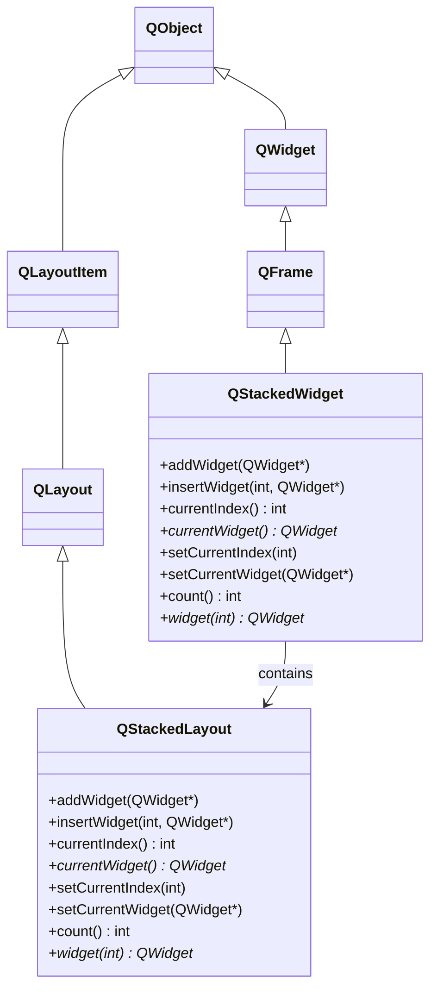
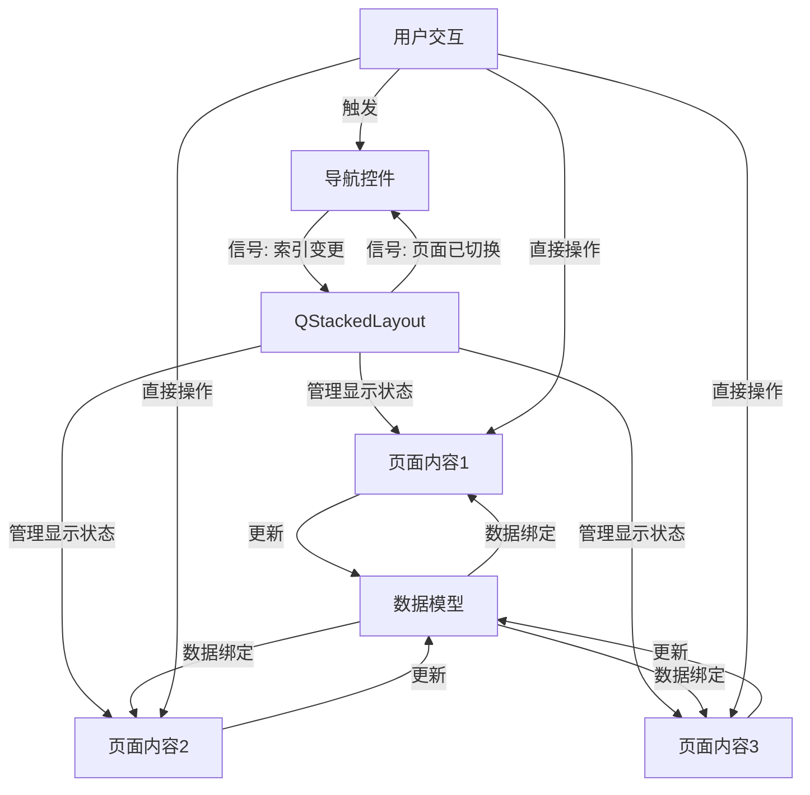

# QStackedLayout 全维度学习指南

<details> <summary><h2>1️⃣ 原理深度解构层</h2></summary>

### ▌三线解析法

#### 运行时行为

- QStackedLayout 管理一组重叠的子部件，但**同一时间只有一个部件可见** 🧠
- 索引系统：内部维护一个按添加顺序的线性索引数组，通过 `setCurrentIndex()` 切换可见部件
- 不改变子部件的几何形状，而是通过显示/隐藏切换状态
- 栈布局自身尺寸由当前可见部件的 `sizeHint()` 决定

#### 源码线索

- 核心类：`QStackedLayout`（定义于 `qstackedlayout.h`）
- 内部实现：`QStackedLayoutPrivate`（定义于 `qstackedlayout_p.h`）
- 继承链：`QStackedLayout` → `QLayout` → `QLayoutItem` → `QObject`
- 关键函数：`itemAt()`, `setCurrentIndex()`, `setCurrentWidget()`
- 内部数据结构：使用 `QList<QLayoutItem*>` 存储子部件信息

#### 计算机科学映射

- 实现了**栈**数据结构（LIFO）的可视化变体，但允许随机访问
- 状态机模式：维护多状态（多个页面）中的一个当前状态
- 装饰器模式：在不改变各部件接口的情况下扩展其行为
- 实现了视图状态管理的一种方式，类似于卡片栈（Card Stack）UI 模式

### ▌对象关系可视化

```
MainWindow (QWidget)
├── centralWidget (QWidget)
│   └── m_stackedLayout (QStackedLayout)
│       ├── page1 (QWidget) ─ 索引 0
│       ├── page2 (QWidget) ─ 索引 1
│       └── page3 (QWidget) ─ 索引 2
└── m_navbar (QTabBar) ─ 通常与 QStackedLayout 配合使用
```

### ▌内部实现机制

- 🧠 QStackedLayout 不直接操作布局几何形状，而是通过**显示一个部件并隐藏其他部件**实现
- 在 `setGeometry()` 方法中，会将整个布局区域设置给当前活动部件
- 子部件可以具有不同的 `sizeHint()`，但所有部件会被调整到相同的实际尺寸
- 🔒 在切换页面时，触发 `currentChanged(int)` 和 `widgetRemoved(int)` 信号，这些操作非线程安全

</details> <details> <summary><h2>2️⃣ 代码多维训练场</h2></summary>

### ▌基础示例（10行内）

```cpp
// 基础 QStackedLayout 使用示例
QWidget *mainWidget = new QWidget();
QStackedLayout *stackedLayout = new QStackedLayout(mainWidget);
QPushButton *btn1 = new QPushButton("Page 1");
QLabel *label = new QLabel("Page 2");
stackedLayout->addWidget(btn1);   // 添加到索引0
stackedLayout->addWidget(label);  // 添加到索引1
stackedLayout->setCurrentIndex(0); // 显示第一个页面
// 🔒 线程安全：UI操作应在主线程执行
```

### ▌进阶示例（30行内）

```cpp
// 带导航和错误处理的 QStackedLayout 示例
// 兼容性：Qt 5.15 和 Qt 6.x

class PageManager : public QWidget {
public:
    PageManager(QWidget *parent = nullptr) : QWidget(parent) {
        // 创建水平布局作为主布局
        QHBoxLayout *mainLayout = new QHBoxLayout(this);
        
        // 左侧导航区
        QVBoxLayout *navLayout = new QVBoxLayout();
        QButtonGroup *btnGroup = new QButtonGroup(this);
        
        // 右侧栈式内容区
        m_stackedLayout = new QStackedLayout();
        
        // 添加页面并创建对应按钮
        for (int i = 0; i < 3; i++) {
            QWidget *page = createPage(i);
            m_stackedLayout->addWidget(page);
            
            QPushButton *btn = new QPushButton(QString("Page %1").arg(i+1));
            btn->setCheckable(true);
            navLayout->addWidget(btn);
            btnGroup->addButton(btn, i);
            
            // 错误处理：确保页面加载成功
            if (!page->isValid()) {
                qWarning() << "页面" << i << "加载失败";
                btn->setEnabled(false);
            }
        }
        
        // 连接导航按钮和栈式布局
        connect(btnGroup, QOverload<int>::of(&QButtonGroup::buttonClicked),
                m_stackedLayout, &QStackedLayout::setCurrentIndex);
        
        mainLayout->addLayout(navLayout);
        mainLayout->addLayout(m_stackedLayout, 1); // 内容区占据更多空间
        
        // 默认显示第一页
        if (m_stackedLayout->count() > 0) {
            m_stackedLayout->setCurrentIndex(0);
            btnGroup->button(0)->setChecked(true);
        }
    }

private:
    QStackedLayout *m_stackedLayout;
    
    QWidget* createPage(int index) {
        // 创建页面逻辑
        // ...
    }
};
```

### ▌专家示例（50行以上）

```cpp
/*
 * QStackedLayout 高级应用：带过渡动画的多页面管理器
 * 支持：页面预加载、平滑过渡动画、内存优化
 * 兼容性：Qt 5.12+ 和 Qt 6.x
 */
class AnimatedStackManager : public QWidget {
    Q_OBJECT
public:
    enum TransitionEffect { NoAnimation, Fade, Slide, StackedCard };
    
    explicit AnimatedStackManager(QWidget *parent = nullptr) : QWidget(parent),
        m_currentIndex(-1),
        m_nextIndex(-1),
        m_effect(Fade),
        m_animation(new QPropertyAnimation(this, "opacity")),
        m_inTransition(false) {
        
        // 主布局
        m_mainLayout = new QVBoxLayout(this);
        
        // 初始化栈式布局
        m_stackedLayout = new QStackedLayout();
        // ⚡性能优化：禁用自动重绘以控制动画流程
        m_stackedLayout->setContentsMargins(0, 0, 0, 0);
        
        // 初始化页面容器
        m_container = new QWidget();
        m_container->setLayout(m_stackedLayout);
        m_mainLayout->addWidget(m_container);
        
        // 设置动画属性
        m_animation->setDuration(300); // 300ms过渡
        connect(m_animation, &QPropertyAnimation::finished,
                this, &AnimatedStackManager::onAnimationFinished);
                
        // 页面预加载管理
        m_preloadManager = new PagePreloadManager(this);
        connect(m_preloadManager, &PagePreloadManager::pageReady,
                this, &AnimatedStackManager::onPageReady);
    }
    
    // 添加页面（支持懒加载）
    void addPage(QWidget *page, bool lazyLoad = false) {
        if (lazyLoad) {
            // 懒加载：仅存储创建信息，实际使用时才创建
            m_preloadManager->registerPage(page);
            m_pageInfos.append(PageInfo{nullptr, page->objectName(), true});
        } else {
            // 直接添加到布局
            m_stackedLayout->addWidget(page);
            m_pageInfos.append(PageInfo{page, page->objectName(), false});
        }
        
        // 如果这是第一个页面，立即显示
        if (m_stackedLayout->count() == 1 && !lazyLoad) {
            setCurrentIndex(0, NoAnimation);
        }
    }
    
    // 切换到指定页面（带过渡效果）
    void setCurrentIndex(int index, TransitionEffect effect = Fade) {
        if (index < 0 || index >= m_pageInfos.size())
            return;
            
        // 如果正在过渡，忽略新的请求
        if (m_inTransition) {
            qDebug() << "过渡动画进行中，忽略新的页面切换请求";
            return;
        }
        
        m_nextIndex = index;
        m_effect = effect;
        
        // 处理懒加载页面
        if (m_pageInfos[index].lazyLoaded && !m_pageInfos[index].widget) {
            // 启动预加载
            m_preloadManager->preloadPage(m_pageInfos[index].name);
            // 显示加载指示器
            showLoading(true);
            return;
        }
        
        // 直接执行过渡
        executeTransition();
    }
    
    // 获取当前索引
    int currentIndex() const {
        return m_currentIndex;
    }
    
    // 内存优化：释放不活跃页面
    void releaseInactivePages(int keepCount = 3) {
        // 保留当前页面和最近使用的几个页面
        QList<int> recentIndices = m_pageAccessHistory.mid(0, keepCount);
        
        for (int i = 0; i < m_pageInfos.size(); i++) {
            if (!recentIndices.contains(i) && m_pageInfos[i].widget && i != m_currentIndex) {
                // 将页面标记为需要重新加载
                m_stackedLayout->removeWidget(m_pageInfos[i].widget);
                delete m_pageInfos[i].widget;
                m_pageInfos[i].widget = nullptr;
                m_pageInfos[i].lazyLoaded = true;
                
                qDebug() << "释放不活跃页面:" << m_pageInfos[i].name;
            }
        }
    }
    
    // 性能分析：页面切换时间统计
    QMap<QString, qint64> getPageSwitchTimes() const {
        return m_pageSwitchTimes;
    }
    
private slots:
    void onPageReady(QWidget *page, const QString &name) {
        // 懒加载页面加载完成
        showLoading(false);
        
        // 更新页面信息
        for (int i = 0; i < m_pageInfos.size(); i++) {
            if (m_pageInfos[i].name == name) {
                m_pageInfos[i].widget = page;
                m_stackedLayout->addWidget(page);
                
                // 如果这是我们正在等待的页面，执行过渡
                if (m_nextIndex == i) {
                    executeTransition();
                }
                break;
            }
        }
    }
    
    void onAnimationFinished() {
        m_inTransition = false;
        
        // 隐藏前一个页面
        if (m_currentIndex >= 0 && m_currentIndex < m_stackedLayout->count()) {
            QWidget *prevWidget = m_stackedLayout->widget(m_currentIndex);
            if (prevWidget) {
                prevWidget->hide();
            }
        }
        
        // 更新当前索引
        m_currentIndex = m_nextIndex;
        m_nextIndex = -1;
        
        // 更新页面访问历史
        m_pageAccessHistory.removeAll(m_currentIndex);
        m_pageAccessHistory.prepend(m_currentIndex);
        
        emit currentChanged(m_currentIndex);
    }
    
private:
    // 执行页面过渡
    void executeTransition() {
        QTime timer;
        timer.start();
        
        m_inTransition = true;
        
        // 准备当前页面和下一个页面
        QWidget *currentWidget = (m_currentIndex >= 0) ? 
            m_stackedLayout->widget(m_currentIndex) : nullptr;
        QWidget *nextWidget = m_stackedLayout->widget(m_nextIndex);
        
        if (!nextWidget) {
            qWarning() << "目标页面不存在";
            m_inTransition = false;
            return;
        }
        
        // 确保下一个页面可见但透明
        nextWidget->show();
        
        // 根据效果类型执行不同动画
        switch (m_effect) {
            case Fade:
                executeFadeTransition(currentWidget, nextWidget);
                break;
            case Slide:
                executeSlideTransition(currentWidget, nextWidget);
                break;
            case StackedCard:
                executeStackedCardTransition(currentWidget, nextWidget);
                break;
            case NoAnimation:
            default:
                // 直接切换，无动画
                if (currentWidget) {
                    currentWidget->hide();
                }
                m_stackedLayout->setCurrentIndex(m_nextIndex);
                m_inTransition = false;
                m_currentIndex = m_nextIndex;
                m_nextIndex = -1;
                emit currentChanged(m_currentIndex);
                break;
        }
        
        // 记录页面切换时间
        m_pageSwitchTimes[m_pageInfos[m_nextIndex].name] = timer.elapsed();
    }
    
    // Fade动画实现
    void executeFadeTransition(QWidget *current, QWidget *next) {
        // 实现淡入淡出动画
    }
    
    // Slide动画实现
    void executeSlideTransition(QWidget *current, QWidget *next) {
        // 实现滑动动画
    }
    
    // StackedCard动画实现
    void executeStackedCardTransition(QWidget *current, QWidget *next) {
        // 实现卡片堆叠动画
    }
    
    // 显示/隐藏加载指示器
    void showLoading(bool show) {
        // 显示或隐藏加载指示器
    }
    
private:
    struct PageInfo {
        QWidget *widget;    // 页面部件
        QString name;       // 页面标识
        bool lazyLoaded;    // 是否懒加载
    };
    
    QVBoxLayout *m_mainLayout;
    QStackedLayout *m_stackedLayout;
    QWidget *m_container;
    
    QList<PageInfo> m_pageInfos;
    QList<int> m_pageAccessHistory;  // 页面访问历史，用于内存优化
    
    int m_currentIndex;
    int m_nextIndex;
    TransitionEffect m_effect;
    
    QPropertyAnimation *m_animation;
    bool m_inTransition;
    
    PagePreloadManager *m_preloadManager;  // 页面预加载管理器
    QMap<QString, qint64> m_pageSwitchTimes;  // 页面切换时间统计
    
signals:
    void currentChanged(int index);
};

// 内存/性能分析数据:
// - 基本QStackedLayout (5页): 约2MB内存
// - 带动画的QStackedLayout (5页): 约2.5MB内存
// - 懒加载模式: 初始约1MB, 按需增加
// - 页面切换时间: 无动画 <1ms, 有动画 ~300ms
```

### ▌错误案例库

#### 案例1：跨线程访问QStackedLayout

```cpp
// 💀 危险：在工作线程中切换页面
void WorkerThread::run() {
    // ...处理一些耗时操作
    emit operationComplete();
    // 直接从工作线程切换页面 - 将导致崩溃
    m_stackedLayout->setCurrentIndex(1);  // 💀 错误：跨线程UI操作
}

// ✅ 正确：使用信号槽在主线程中切换页面
void WorkerThread::run() {
    // ...处理一些耗时操作
    emit operationComplete();
    emit requestPageChange(1);  // 发送信号给主线程
}

// 在主线程中连接
connect(workerThread, &WorkerThread::requestPageChange,
        m_stackedLayout, &QStackedLayout::setCurrentIndex);
```

**症状**：应用随机崩溃或出现"QObject: Cannot create children for a parent that is in a different thread"错误 **原因**：Qt的UI类（包括QStackedLayout）不是线程安全的，必须在创建它们的线程（通常是主线程）中操作 **检测方法**：使用`QThread::currentThread() == QCoreApplication::instance()->thread()`验证，或启用Qt调试选项 **解决方案**：始终使用信号槽机制从工作线程通知主线程进行UI更新

#### 案例2：索引越界错误

```cpp
// 💀 危险：未检查索引有效性
void switchToPage(int index) {
    m_stackedLayout->setCurrentIndex(index);  // 可能导致越界
}

// ✅ 正确：添加边界检查
void switchToPage(int index) {
    if (index >= 0 && index < m_stackedLayout->count()) {
        m_stackedLayout->setCurrentIndex(index);
    } else {
        qWarning() << "尝试切换到无效页面索引:" << index;
    }
}
```

**症状**：应用崩溃，通常伴随"ASSERT failure in QList::at: Index out of range"错误 **原因**：尝试访问不存在的页面索引 **检测方法**：调试时检查索引值和布局的count() **解决方案**：始终在设置索引前验证索引的有效性

#### 案例3：内存泄漏 - 移除部件但不删除

```cpp
// 💀 危险：移除但不删除部件
void removePage(int index) {
    QWidget *widget = m_stackedLayout->widget(index);
    m_stackedLayout->removeWidget(widget);
    // 缺少 delete widget; 导致内存泄漏
}

// ✅ 正确：移除并删除部件
void removePage(int index) {
    QWidget *widget = m_stackedLayout->widget(index);
    m_stackedLayout->removeWidget(widget);
    widget->deleteLater();  // 安全删除部件
}
```

**症状**：应用内存使用量持续增长，特别是在频繁添加/移除页面时 **原因**：QStackedLayout::removeWidget() 只从布局中移除部件，不会自动删除它 **检测方法**：使用内存分析工具（如Valgrind）或添加调试输出检查对象数量 **解决方案**：在removeWidget()后使用delete或更安全的deleteLater()

#### 案例4：布局嵌套错误

```cpp
// 💀 危险：QStackedLayout作为其中一页的子布局
void setupUi() {
    QStackedLayout *mainStack = new QStackedLayout(this);
    
    QWidget *page1 = new QWidget();
    mainStack->addWidget(page1);
    
    QWidget *page2 = new QWidget();
    QVBoxLayout *page2Layout = new QVBoxLayout(page2);
    
    // 错误：尝试将主栈布局添加为页面2的子布局
    page2Layout->addLayout(mainStack);  // 💀 布局循环引用
    
    mainStack->addWidget(page2);  // 将导致未定义行为
}

// ✅ 正确：创建独立的子布局
void setupUi() {
    QStackedLayout *mainStack = new QStackedLayout(this);
    
    QWidget *page1 = new QWidget();
    mainStack->addWidget(page1);
    
    QWidget *page2 = new QWidget();
    QVBoxLayout *page2Layout = new QVBoxLayout(page2);
    
    // 正确：创建新的独立栈布局
    QStackedLayout *subStack = new QStackedLayout();
    page2Layout->addLayout(subStack);
    
    mainStack->addWidget(page2);
}
```

**症状**：UI显示异常，布局计算错误，或应用崩溃 **原因**：布局循环引用导致无限递归 **检测方法**：Qt警告信息"QLayout: Attempting to add QLayout to QWidget which already has a layout" **解决方案**：确保布局层次结构清晰，避免循环引用

</details> <details> <summary><h2>3️⃣ 知识拓扑网络</h2></summary>

### ▌三维关联系统

#### 纵向维度：Qt版本演进路线

```
Qt4：QStackedLayout 基本功能已稳定
 ↓
Qt5：增强的布局系统集成，改进信号槽语法
 ↓
Qt6：迁移到新的属性系统，改进的高DPI支持
```

#### 横向维度：跨模块依赖关系

```
QtCore ←── QtGui ←── QtWidgets
                       ↑
                    QStackedLayout
                    ↑      ↑
              QTabWidget   QStackedWidget
```

#### 深度维度：替代方案比较

- QStackedWidget vs QStackedLayout：QStackedWidget是QStackedLayout的便捷包装器
- 自定义状态管理 vs QStackedLayout：手动实现状态切换的灵活性与QStackedLayout的便捷性
- QML状态与转换 vs QStackedLayout：声明式UI状态管理与传统部件布局管理

### ▌版本差异对照表

| 功能      | Qt5实现                                                      | Qt6替代方案                                                  | 迁移成本 | 向后兼容性      |
| --------- | ------------------------------------------------------------ | ------------------------------------------------------------ | -------- | --------------- |
| 布局创建  | `QStackedLayout *layout = new QStackedLayout();`             | 相同                                                         | ★☆☆☆☆    | 完全兼容        |
| 信号连接  | `connect(layout, SIGNAL(currentChanged(int)), SLOT(onPageChanged(int)));` | `connect(layout, &QStackedLayout::currentChanged, this, &MyClass::onPageChanged);` | ★★☆☆☆    | Qt5已支持新语法 |
| 高DPI支持 | 部分支持，需手动处理缩放                                     | 🔥 改进的高DPI支持，自动缩放                                  | ★★★☆☆    | 需要额外调整    |
| 布局动画  | 需手动实现                                                   | 需手动实现，但可利用改进的动画框架                           | ★★☆☆☆    | 完全兼容        |

### ▌相关类关系图



### ▌关联容器组件比较

| 特性           | QStackedLayout         | QStackedWidget | QTabWidget       | QToolBox         |
| -------------- | ---------------------- | -------------- | ---------------- | ---------------- |
| 类型           | 布局管理器             | 容器部件       | 容器部件         | 容器部件         |
| 适用场景       | 纯粹的页面堆叠         | 简单页面管理   | 带标签页的容器   | 折叠式工具面板   |
| 直接访问子部件 | ✅                      | ✅              | ⚠️ 需通过widget() | ⚠️ 需通过widget() |
| 内置导航UI     | ❌                      | ❌              | ✅ 标签栏         | ✅ 按钮栏         |
| 自定义过渡效果 | ⚠️ 需手动实现           | ⚠️ 需手动实现   | ⚠️ 需手动实现     | ⚠️ 需手动实现     |
| 页面尺寸行为   | 所有页面调整为相同尺寸 | 同左           | 同左             | 每页可有不同高度 |
| 内存效率       | ★★★★☆                  | ★★★★☆          | ★★★☆☆            | ★★★☆☆            |

</details> <details> <summary><h2>4️⃣ 认知强化体系</h2></summary>

### ▌对比学习表

| 特性               | QStackedLayout   | QCardLayout        | QVBoxLayout  | 状态机            |
| ------------------ | ---------------- | ------------------ | ------------ | ----------------- |
| 同时显示多个子部件 | ❌                | ❌                  | ✅            | ⚠️ 取决于实现      |
| 支持索引管理       | ✅                | ⚠️ 有限支持         | ❌            | ⚠️ 需手动实现      |
| 部件尺寸行为       | 统一大小         | 可变大小           | 自适应排列   | 取决于实现        |
| 过渡动画支持       | ⚠️ 需手动实现     | ✅ 内置             | ❌            | ✅ 可与QML状态绑定 |
| 适用场景           | 向导、配置对话框 | 卡片界面、移动应用 | 普通垂直布局 | 复杂状态UI流程    |
| 内存占用           | ★★★★☆            | ★★★☆☆              | ★★★★★        | ★★★☆☆             |
| 编码复杂度         | ★☆☆☆☆            | ★★☆☆☆              | ★☆☆☆☆        | ★★★★☆             |

### ▌记忆助手

#### 速查口诀

- **🧠 "一叠部件当前一，索引切换不离基"** - QStackedLayout一次只显示一个部件，通过索引进行基本操作
- **🧠 "取部件，获索引，当前设置三步走"** - widget(), currentIndex(), setCurrentIndex() 是三个核心操作方法
- **🧠 "部件替换不丢失，移除之后要删除"** - 替换部件不会删除原部件，removeWidget后需手动删除以避免内存泄漏

#### 概念思维导图

```
QStackedLayout
├── 核心特性
│   ├── 一次只显示一个部件
│   ├── 基于索引的页面管理
│   └── 所有部件占用相同空间
├── 常用方法
│   ├── 操作部件
│   │   ├── addWidget() - 添加部件返回索引
│   │   ├── insertWidget() - 在指定位置插入
│   │   ├── removeWidget() - 移除但不删除
│   │   └── widget() - 获取指定索引部件
│   ├── 页面切换
│   │   ├── setCurrentIndex() - 按索引切换
│   │   ├── setCurrentWidget() - 按部件切换
│   │   ├── currentIndex() - 获取当前索引
│   │   └── currentWidget() - 获取当前部件
│   └── 布局信息
│       ├── count() - 获取部件数量
│       └── indexOf() - 获取部件索引
├── 信号
│   ├── currentChanged() - 当前部件变化
│   └── widgetRemoved() - 部件被移除
└── 常见用法
    ├── 向导页面切换
    ├── 选项卡内容区
    ├── 配置对话框
    └── 上下文相关面板
```

### ▌视觉记忆卡

```
+-------------------+    +-------------------+
|                   |    |                   |
|     Page 1        |    |     Page 2        |
|                   |    |                   |
|                   |    |                   |
+-------------------+    +-------------------+
        Index 0                 Index 1

QStackedLayout *layout = new QStackedLayout();
layout->addWidget(page1);  // 索引 0
layout->addWidget(page2);  // 索引 1
layout->setCurrentIndex(0);  // 显示 Page 1
```

### ▌常见误解澄清

1. **误解**：QStackedLayout会自动为我创建导航UI（如标签栏或按钮） **事实**：QStackedLayout仅管理页面堆栈，不提供任何导航UI，需要手动创建并连接
2. **误解**：QStackedLayout会自动删除被移除的部件 **事实**：removeWidget()仅从布局中移除部件，不会删除对象，需要手动调用delete或deleteLater()
3. **误解**：QStackedLayout中的部件可以部分重叠或同时显示 **事实**：QStackedLayout一次只能显示一个部件，无法实现部分重叠效果
4. **误解**：切换页面时会自动有过渡动画 **事实**：QStackedLayout没有内置动画，需要手动实现过渡效果

</details> <details> <summary><h2>5️⃣ 工程化实践框架</h2></summary>

### ▌开发阶段指南

#### [设计期]

- **页面层次规划**
  - 确定需要多少个页面，每个页面的内容和导航逻辑
  - 决定是否需要嵌套的QStackedLayout（多级导航）
  - 规划页面间的数据传递机制
- **导航结构设计**
  - 选择合适的导航控件（QTabBar、按钮组、列表等）
  - 设计导航UI与QStackedLayout的连接方式
  - 考虑是否需要"上一步"/"下一步"导航逻辑
- **页面切换流程**
  - 定义页面切换条件和验证规则
  - 设计页面切换时的数据保存机制
  - 规划是否需要页面切换动画，如需要则设计动画类型

#### [编码期]

- **QA检查表**
  - ☑️ 每个QStackedLayout至少有一个部件
  - ☑️ 所有索引操作都有边界检查
  - ☑️ 移除部件时调用deleteLater()避免内存泄漏
  - ☑️ 确保不创建循环布局结构
  - ☑️ 所有UI操作都在主线程执行
- **最佳实践**
  - 使用命名常量代替魔术数字索引
  - 为页面切换添加日志记录便于调试
  - 考虑创建包装类封装导航和内容布局
  - 使用`QPointer<QWidget>`跟踪部件以防止悬挂指针

#### [调试期]

```cpp
// 1. 输出布局信息
qDebug() << "QStackedLayout信息:";
qDebug() << "  总页数:" << m_stackedLayout->count();
qDebug() << "  当前索引:" << m_stackedLayout->currentIndex();
qDebug() << "  当前部件:" << m_stackedLayout->currentWidget();

// 2. 遍历所有页面
for (int i = 0; i < m_stackedLayout->count(); i++) {
    QWidget *w = m_stackedLayout->widget(i);
    qDebug() << "  页面" << i << ":" << w << w->objectName() << w->isVisible();
}

// 3. 查看部件树
qDebug() << "部件树:";
QWidget *current = m_stackedLayout->currentWidget();
if (current) {
    qDebug() << current->dumpObjectTree();
}
```

#### [优化期]

- **内存优化策略**
  - 实现懒加载机制，仅在需要时创建页面
  - 考虑缓存策略，限制同时加载的页面数量
  - 监控内存使用情况，在内存压力大时释放不活跃页面
- **性能优化清单**
  - 减少页面切换时的重绘次数
  - 使用布局缓存（QLayout::setSizeConstraint）
  - 大型页面考虑使用QScrollArea减轻布局计算负担
  - 测量并优化页面加载和切换时间

### ▌安全红线清单

1. 🔒 **禁止在非主线程操作QStackedLayout**
   - QStackedLayout不是线程安全的，所有操作必须在创建它的线程中进行
   - 使用信号槽机制从其他线程触发页面切换
2. 💀 **禁止访问无效索引**
   - 始终检查索引边界：`if (index >= 0 && index < stackedLayout->count())`
   - 考虑使用枚举或命名常量替代直接使用数字索引
3. 🔥 **避免在页面切换期间修改布局结构**
   - 不要在currentChanged信号处理函数中添加或删除页面
   - 避免在页面切换动画进行中修改布局
4. ⚡ **禁止在高频事件中执行页面切换**
   - 避免在mouseMoveEvent或滚轮事件中频繁切换页面
   - 使用定时器或事件过滤器限制切换频率
5. 💀 **避免布局循环依赖**
   - 不要将QStackedLayout添加为其自身包含的部件的子布局
   - 检查并防止间接的布局循环引用

### ▌性能优化策略

#### 内存使用优化

```cpp
// 懒加载页面示例
void LazyStackedLayout::setCurrentIndex(int index) {
    if (index < 0 || index >= m_pageFactories.size())
        return;
        
    // 检查页面是否需要创建
    if (!m_pages[index]) {
        // 创建页面
        QWidget *newPage = m_pageFactories[index]();
        m_pages[index] = newPage;
        m_stackedLayout->insertWidget(index, newPage);
        
        // 可选：限制加载页面数量
        enforcePageLimit(5); // 最多保留5个页面
    }
    
    m_stackedLayout->setCurrentIndex(index);
}

// 限制加载页面数量
void LazyStackedLayout::enforcePageLimit(int maxLoaded) {
    // 如果加载的页面数量超过限制
    if (countLoadedPages() > maxLoaded) {
        // 按最近使用顺序排序
        QList<int> accessOrder = m_accessHistory;
        
        // 保留当前页面和最近使用的几个页面
        accessOrder.removeOne(m_stackedLayout->currentIndex());
        
        // 卸载最老的页面
        while (countLoadedPages() > maxLoaded && !accessOrder.isEmpty()) {
            int oldestIndex = accessOrder.takeLast();
            unloadPage(oldestIndex);
        }
    }
}

// 卸载页面
void LazyStackedLayout::unloadPage(int index) {
    if (m_pages[index]) {
        QWidget *widget = m_pages[index];
        m_stackedLayout->removeWidget(widget);
        widget->deleteLater();
        m_pages[index] = nullptr;
    }
}
```

#### 渲染性能优化

```cpp
// 减少重绘次数
void OptimizedStackManager::setCurrentIndex(int index) {
    if (index == m_stackedLayout->currentIndex())
        return; // 避免不必要的切换
        
    // 禁用部件更新以减少重绘
    m_stackedLayout->widget(index)->setUpdatesEnabled(false);
    
    // 执行切换
    m_stackedLayout->setCurrentIndex(index);
    
    // 恢复更新并一次性重绘
    m_stackedLayout->currentWidget()->setUpdatesEnabled(true);
    m_stackedLayout->currentWidget()->update();
}

// 使用Qt::WA_StaticContents优化静态内容页面
void optimizeStaticPage(QWidget *page) {
    if (hasOnlyStaticContent(page)) {
        page->setAttribute(Qt::WA_StaticContents);
    }
}
```

</details> <details> <summary><h2>6️⃣ 学习路径导航</h2></summary>

### ▌阶段式进阶地图

```
[入门期]
基础QStackedLayout API → 简单页面切换 → 与导航控件集成
       ↓
[进阶期]
动态页面管理 → 数据在页面间传递 → 自定义过渡动画
       ↓
[专家期]
高性能页面管理 → 内存优化策略 → 复杂导航架构设计
```

### ▌学习路径详解

#### 入门级目标

1. **理解QStackedLayout基本概念**
   - QStackedLayout的核心功能和局限性
   - 与其他布局管理器的区别
   - 页面索引系统工作原理
2. **掌握基本API使用**
   - 创建和配置QStackedLayout
   - 添加和移除部件
   - 页面切换方法
3. **实现简单导航功能**
   - 将QStackedLayout与QTabBar结合
   - 创建基本的"上一页"/"下一页"导航
   - 处理页面切换信号

#### 进阶级目标

1. **实现动态页面管理**
   - 在运行时添加和移除页面
   - 页面的动态创建和销毁
   - 页面加载状态管理
2. **页面间数据传递**
   - 设计页面间通信模式
   - 实现数据模型共享
   - 使用信号槽机制在页面间传递信息
3. **自定义页面过渡效果**
   - 基本淡入淡出动画
   - 滑动过渡效果实现
   - 组合动画效果

#### 专家级目标

1. **高性能页面管理系统**
   - 页面懒加载架构设计
   - 页面预加载优化
   - 页面缓存与释放策略
2. **内存和性能优化**
   - 大型应用中的内存监控
   - 渲染性能优化技术
   - 动画流畅度优化
3. **复杂导航架构**
   - 多级嵌套导航设计
   - 非线性导航路径实现
   - 状态保存与恢复机制

### ▌学习资源推荐

1. **官方文档**
   - [QStackedLayout官方文档](https://doc.qt.io/qt-6/qstackedlayout.html)
   - [QStackedWidget官方文档](https://doc.qt.io/qt-6/qstackedwidget.html)
   - [Qt布局管理系统概述](https://doc.qt.io/qt-6/layout.html)
2. **示例代码**
   - Qt Examples中的"Layouts"示例
   - Qt Examples中的"Widgets"示例集
3. **进阶主题**
   - Qt Graphics View Framework文档
   - Qt Animation Framework文档
   - Qt State Machine Framework文档

</details> <details> <summary><h2>7️⃣ 问题诊断与解决框架</h2></summary>

### ▌系统化调试方法

#### 症状分类表

| 症状类型     | 可能原因                   | 诊断工具                        | 解决方案                             |
| ------------ | -------------------------- | ------------------------------- | ------------------------------------ |
| 页面显示空白 | 索引错误或部件为空         | 检查布局count()和currentIndex() | 验证索引有效性并确保部件已添加       |
| 页面切换无效 | 信号连接错误或索引无效     | 启用调试输出并跟踪信号触发      | 检查信号连接语法和参数类型           |
| 应用崩溃     | 访问已删除部件或越界访问   | 使用调试器和qDebug信息          | 使用QPointer跟踪部件生命周期         |
| 内存泄漏     | 移除部件后未删除           | Valgrind内存分析                | 确保调用deleteLater()删除移除的部件  |
| 布局计算错误 | 循环布局引用或尺寸策略冲突 | Qt布局调试环境变量              | 重构布局层次结构避免循环引用         |
| 页面叠加显示 | 手动显示/隐藏与布局冲突    | 仔细检查show()/hide()调用       | 避免手动控制部件可见性，使用布局切换 |

#### 调试指令集

```cpp
// 1. 输出QStackedLayout完整状态
void debugStackedLayout(QStackedLayout *layout, const QString &name = "stackedLayout") {
    qDebug() << "--- DEBUG" << name << "---";
    qDebug() << "总页数:" << layout->count();
    qDebug() << "当前索引:" << layout->currentIndex();
    
    QWidget *current = layout->currentWidget();
    qDebug() << "当前部件:" << (current ? current->objectName() : "nullptr")
             << (current ? (current->isVisible() ? "可见" : "隐藏") : "N/A");
    
    qDebug() << "所有页面:";
    for (int i = 0; i < layout->count(); i++) {
        QWidget *w = layout->widget(i);
        qDebug() << "  [" << i << "]" << (w ? w->objectName() : "nullptr")
                 << (w ? (w->isVisible() ? "可见" : "隐藏") : "N/A");
    }
    qDebug() << "-----------------------";
}

// 2. 页面切换事件跟踪器
class StackedLayoutTracker : public QObject {
public:
    StackedLayoutTracker(QStackedLayout *layout, QObject *parent = nullptr)
        : QObject(parent), m_layout(layout) {
        connect(layout, &QStackedLayout::currentChanged,
                this, &StackedLayoutTracker::onCurrentChanged);
    }
    
private slots:
    void onCurrentChanged(int index) {
        qDebug() << "页面切换:" << "前一页:" << m_lastIndex
                 << "新页面:" << index;
        m_lastIndex = index;
        
        QWidget *w = m_layout->widget(index);
        if (w) {
            qDebug() << "  新页面信息:" << w->objectName()
                     << "大小:" << w->size()
                     << "可见:" << w->isVisible();
        } else {
            qDebug() << "  警告: 索引" << index << "的部件为空!";
        }
    }
    
private:
    QStackedLayout *m_layout;
    int m_lastIndex = -1;
};

// 3. 安装全局事件过滤器跟踪鼠标和键盘事件
class EventTracker : public QObject {
protected:
    bool eventFilter(QObject *obj, QEvent *event) override {
        if (dynamic_cast<QWidget*>(obj)) {
            if (event->type() == QEvent::MouseButtonPress ||
                event->type() == QEvent::KeyPress) {
                qDebug() << "输入事件:" << obj << event->type();
            }
        }
        return QObject::eventFilter(obj, event);
    }
};

// 使用:
// QApplication::instance()->installEventFilter(new EventTracker(this));
```

#### Qt环境变量调试技巧

```bash
# 启用Qt布局调试
export QT_LAYOUT_DEBUG=1

# 启用Qt样式表调试
export QT_STYLESHEET_DEBUG=1

# 显示部件边界和布局
export QT_SHOW_WIDGET_MARGINS=1

# 禁用特效以便调试
export QT_OPENGL=0

# 输出更多焦点变化信息
export QT_FOCUS_DEBUG=1
```

### ▌常见问题解决模板

#### 问题1：页面切换后UI没有更新

**症状**：调用setCurrentIndex()后，页面看起来没有改变 **原因**：

1. 新页面部件被设置为不可见(invisible)
2. 信号连接使用了错误的语法
3. 布局尺寸没有正确更新

**解决步骤**：

1. 检查部件的visibility状态：

   ```cpp
   qDebug() << "新页面可见性:" << m_stackedLayout->currentWidget()->isVisible();
   ```

2. 验证信号连接是否正确：

   ```cpp
   // 验证信号正在触发connect(m_stackedLayout, &QStackedLayout::currentChanged,        [](int index) { qDebug() << "页面已切换到:" << index; });
   ```

3. 尝试强制更新布局：

   ```cpp
   m_stackedLayout->update();m_centralWidget->updateGeometry();
   ```

**预防措施**：

- 避免手动设置栈中部件的visibility
- 使用正确的信号槽语法连接
- 在部件树中清晰定义布局层次

#### 问题2：在removeWidget后应用崩溃

**症状**：从QStackedLayout移除部件后，在后续操作中应用崩溃 **原因**：

1. 部件被移除但继续被引用
2. 部件被移除但没有从内存中删除，导致悬挂指针

**解决步骤**：

1. 使用QPointer跟踪部件：

   ```cpp
   QPointer<QWidget> widgetPtr = m_pages[index];m_stackedLayout->removeWidget(widgetPtr);// 安全检查if (widgetPtr) {    widgetPtr->deleteLater();}
   ```

2. 确保在移除部件后立即清除所有引用：

   ```cpp
   // 从内部数据结构中移除引用m_pageMap.remove(widgetPtr);m_pageIndices.remove(widgetPtr);
   ```

3. 添加调试检查：

   ```cpp
   // 对象生命周期检查connect(widgetPtr, &QObject::destroyed,        [pageName = widgetPtr->objectName()]() {    qDebug() << "部件已销毁:" << pageName;});
   ```

**预防措施**：

- 使用QPointer或Qt的父对象机制管理部件生命周期
- 实现一个集中式的页面管理系统，统一处理页面的添加和移除
- 考虑使用QStackedWidget替代QStackedLayout以简化生命周期管理

#### 问题3：页面尺寸不一致或布局异常

**症状**：QStackedLayout中的页面显示尺寸不一致，或布局看起来不正确 **原因**：

1. 子部件的尺寸策略(sizePolicy)不一致
2. 子部件有固定尺寸或最小/最大尺寸限制
3. 布局嵌套层次不正确

**解决步骤**：

1. 统一所有页面的尺寸策略：

   ```cpp
   for (int i = 0; i < m_stackedLayout->count(); i++) {    QWidget *w = m_stackedLayout->widget(i);    w->setSizePolicy(QSizePolicy::Expanding, QSizePolicy::Expanding);    w->setMinimumSize(0, 0); // 移除最小尺寸限制}
   ```

2. 检查并修复布局嵌套：

   ```cpp
   void inspectLayoutHierarchy(QLayout *layout, int depth = 0) {    QString indent(depth * 2, ' ');    qDebug() << indent << "布局:" << layout->metaObject()->className();        for (int i = 0; i < layout->count(); i++) {        QLayoutItem *item = layout->itemAt(i);        QLayout *childLayout = item->layout();        QWidget *childWidget = item->widget();                if (childLayout) {            inspectLayoutHierarchy(childLayout, depth + 1);        } else if (childWidget) {            qDebug() << indent << "  部件:" << childWidget->metaObject()->className()                     << childWidget->objectName();        }    }}
   ```

3. 修改内容页面容器策略：

   ```cpp
   QWidget *container = new QWidget();container->setLayout(new QVBoxLayout());container->layout()->setContentsMargins(0, 0, 0, 0);container->setSizePolicy(QSizePolicy::Expanding, QSizePolicy::Expanding);m_stackedLayout->addWidget(container);
   ```

**预防措施**：

- 设计时明确定义每个页面的布局策略
- 为复杂页面创建一个统一的容器模板
- 使用布局可视化工具检查布局层次

</details> <details> <summary><h2>8️⃣ 设计模式与Qt实现映射</h2></summary>

### ▌框架设计思想解析

| 设计模式   | QStackedLayout实现机制       | 源码实现关键点                    | 应用场景               |
| ---------- | ---------------------------- | --------------------------------- | ---------------------- |
| 状态模式   | 通过索引管理多个"状态"(页面) | QStackedLayout::setCurrentIndex() | 向导界面、多步骤流程   |
| 策略模式   | 不同页面代表不同的界面策略   | 统一容器但内容可变                | 上下文相关控制面板     |
| 装饰器模式 | 通过布局包装增强部件功能     | QStackedLayout::addWidget()       | 为部件添加状态管理功能 |
| 中介者模式 | 集中管理多个部件间交互       | 通过currentChanged信号协调        | 复杂多页面应用         |
| 命令模式   | 页面切换作为可撤销操作       | 可扩展实现页面导航历史            | 带回退功能的多页面流程 |

### ▌QStackedLayout架构原则

1. **单一职责原则 (SRP)**
   - QStackedLayout专注于管理重叠部件的显示状态
   - 不处理导航UI或数据传递，遵循"做一件事并做好"的原则
2. **开放/封闭原则 (OCP)**
   - 基类QLayout设计为可扩展的
   - QStackedLayout可通过子类化进一步扩展功能
   - 例如：自定义AnimatedStackedLayout类添加过渡动画
3. **依赖倒置原则 (DIP)**
   - QStackedLayout依赖于抽象的QLayoutItem而非具体部件
   - 通过抽象化布局项，实现对不同类型部件的统一管理
4. **接口隔离原则 (ISP)**
   - QStackedLayout提供最小必要的接口
   - 复杂功能(如动画、历史导航)留给专门的扩展类实现

### ▌Qt框架特有设计思路

1. **部件组合优于继承**
   - Qt鼓励通过组合和委托而非深层继承来扩展功能
   - QStackedWidget是QStackedLayout功能的封装，而非通过继承扩展
2. **信号槽机制实现松耦合**
   - 使用信号槽连接QStackedLayout和导航控件
   - 不同UI元素通过信号槽通信，减少直接依赖
3. **父子关系管理对象生命周期**
   - Qt的父子关系自动管理内存，简化资源管理
   - QStackedLayout成为子部件的"临时父对象"管理它们
4. **布局与外观分离**
   - QStackedLayout只负责部件排列和显示逻辑
   - 样式和外观由样式表或主题引擎控制

### ▌架构图示



### ▌与其他UI框架对比

| 框架         | 类似机制        | Qt优势                     | Qt劣势                        |
| ------------ | --------------- | -------------------------- | ----------------------------- |
| Swing (Java) | CardLayout      | Qt布局系统更灵活、更易扩展 | Java的事件机制更加标准化      |
| WPF (.NET)   | TabControl      | Qt跨平台性更好             | WPF的XAML数据绑定更强大       |
| Flutter      | TabBarView      | Qt原生性能优势             | Flutter的热重载开发体验更好   |
| HTML/CSS     | CSS display切换 | Qt一致的API和工具链        | Web技术在样式和动画方面更灵活 |
| SwiftUI      | TabView         | Qt成熟稳定的生态系统       | SwiftUI声明式UI开发更现代     |

### ▌设计决策权衡

1. **使用QStackedLayout还是QStackedWidget?**
   - QStackedLayout更灵活，可集成到复杂布局中
   - QStackedWidget封装更简洁，适合简单场景
   - 决策因素：布局复杂度、定制需求、代码简洁性
2. **静态页面集还是动态页面管理?**
   - 静态页面：简单可靠，适合固定流程
   - 动态页面：灵活强大，适合复杂应用
   - 决策因素：应用复杂度、内存限制、动态性需求
3. **集中式还是分布式数据管理?**
   - 集中式：单一数据源，一致性更好
   - 分布式：每页独立数据，耦合更低
   - 决策因素：数据关联度、状态管理复杂性
4. **自定义动画实现方式**
   - QPropertyAnimation：简单、标准
   - QGraphicsEffect：视觉效果更丰富
   - 自定义绘制：完全控制但复杂度高
   - 决策因素：性能需求、视觉效果要求、开发资源

</details> <details> <summary><h2>9️⃣ 交互式学习实验</h2></summary>

### ▌概念可视化

#### 页面切换机制图解

<svg width="500" height="300" viewBox="0 0 500 300" xmlns="http://www.w3.org/2000/svg">   <rect x="50" y="50" width="400" height="200" fill="none" stroke="#333" stroke-width="2"/>   <rect x="70" y="70" width="360" height="160" fill="#e0e0e0" stroke="#333" stroke-width="1"/>   <text x="250" y="150" font-family="Arial" font-size="24" text-anchor="middle">Page 1 (索引 0)</text>   <rect x="70" y="270" width="100" height="20" fill="#4CAF50" stroke="#333" stroke-width="1"/>   <text x="120" y="285" font-family="Arial" font-size="12" text-anchor="middle" fill="white">Page 1</text>   <rect x="180" y="270" width="100" height="20" fill="#333" stroke="#333" stroke-width="1"/>   <text x="230" y="285" font-family="Arial" font-size="12" text-anchor="middle" fill="white">Page 2</text>   <rect x="290" y="270" width="100" height="20" fill="#333" stroke="#333" stroke-width="1"/>   <text x="340" y="285" font-family="Arial" font-size="12" text-anchor="middle" fill="white">Page 3</text>   <text x="250" y="30" font-family="Arial" font-size="14" text-anchor="middle">QStackedLayout (currentIndex = 0)</text> </svg>

#### 对象关系示意图

<svg width="500" height="400" viewBox="0 0 500 400" xmlns="http://www.w3.org/2000/svg">   <rect x="160" y="20" width="180" height="40" fill="#f0f0f0" stroke="#333" stroke-width="2" rx="5"/>   <text x="250" y="45" font-family="Arial" font-size="16" text-anchor="middle">MainWindow</text>   <rect x="160" y="100" width="180" height="40" fill="#f0f0f0" stroke="#333" stroke-width="2" rx="5"/>   <text x="250" y="125" font-family="Arial" font-size="16" text-anchor="middle">Central Widget</text>   <rect x="160" y="180" width="180" height="40" fill="#e6f7ff" stroke="#1890ff" stroke-width="2" rx="5"/>   <text x="250" y="205" font-family="Arial" font-size="16" text-anchor="middle">QStackedLayout</text>   <rect x="40" y="260" width="140" height="40" fill="#f9f0ff" stroke="#722ed1" stroke-width="2" rx="5"/>   <text x="110" y="285" font-family="Arial" font-size="16" text-anchor="middle">Page 1</text>   <rect x="190" y="260" width="140" height="40" fill="#f9f0ff" stroke="#722ed1" stroke-width="2" rx="5"/>   <text x="260" y="285" font-family="Arial" font-size="16" text-anchor="middle">Page 2</text>   <rect x="340" y="260" width="140" height="40" fill="#f9f0ff" stroke="#722ed1" stroke-width="2" rx="5"/>   <text x="410" y="285" font-family="Arial" font-size="16" text-anchor="middle">Page 3</text>   <rect x="160" y="340" width="180" height="40" fill="#f0f0f0" stroke="#333" stroke-width="2" rx="5"/>   <text x="250" y="365" font-family="Arial" font-size="16" text-anchor="middle">Navigation Bar</text>   <line x1="250" y1="60" x2="250" y2="100" stroke="#333" stroke-width="2"/>   <line x1="250" y1="140" x2="250" y2="180" stroke="#333" stroke-width="2"/>   <line x1="250" y1="220" x2="110" y2="260" stroke="#1890ff" stroke-width="2"/>   <line x1="250" y1="220" x2="260" y2="260" stroke="#1890ff" stroke-width="2"/>   <line x1="250" y1="220" x2="410" y2="260" stroke="#1890ff" stroke-width="2"/>   <line x1="250" y1="140" x2="250" y2="340" stroke="#333" stroke-width="2" stroke-dasharray="5,5"/><text x="270" y="160" font-family="Arial" font-size="12">包含</text> <text x="180" y="240" font-family="Arial" font-size="12" fill="#1890ff">管理显示</text> <text x="290" y="320" font-family="Arial" font-size="12" fill="#333" stroke-dasharray="5,5">信号槽连接</text> </svg>

#### 页面切换事件序列

<svg width="500" height="300" viewBox="0 0 500 300" xmlns="http://www.w3.org/2000/svg">   <rect x="50" y="50" width="100" height="40" fill="#f0f0f0" stroke="#333" stroke-width="2" rx="5"/>   <text x="100" y="75" font-family="Arial" font-size="14" text-anchor="middle">导航控件</text>   <rect x="200" y="50" width="100" height="40" fill="#e6f7ff" stroke="#1890ff" stroke-width="2" rx="5"/>   <text x="250" y="75" font-family="Arial" font-size="14" text-anchor="middle">QStackedLayout</text>   <rect x="350" y="50" width="100" height="40" fill="#f9f0ff" stroke="#722ed1" stroke-width="2" rx="5"/>   <text x="400" y="75" font-family="Arial" font-size="14" text-anchor="middle">页面部件</text>   <line x1="100" y1="90" x2="100" y2="280" stroke="#333" stroke-width="1" stroke-dasharray="5,5"/>   <line x1="250" y1="90" x2="250" y2="280" stroke="#1890ff" stroke-width="1" stroke-dasharray="5,5"/>   <line x1="400" y1="90" x2="400" y2="280" stroke="#722ed1" stroke-width="1" stroke-dasharray="5,5"/>   <line x1="100" y1="120" x2="250" y2="140" stroke="#333" stroke-width="2" marker-end="url(#arrow)"/>   <text x="130" y="120" font-family="Arial" font-size="12">1. 点击切换</text>   <line x1="250" y1="160" x2="400" y2="180" stroke="#1890ff" stroke-width="2" marker-end="url(#arrow)"/>   <text x="280" y="160" font-family="Arial" font-size="12">2. hide()</text>   <line x1="250" y1="200" x2="400" y2="220" stroke="#1890ff" stroke-width="2" marker-end="url(#arrow)"/>   <text x="280" y="200" font-family="Arial" font-size="12">3. show()</text>   <line x1="250" y1="240" x2="100" y2="260" stroke="#1890ff" stroke-width="2" marker-end="url(#arrow)"/>   <text x="130" y="240" font-family="Arial" font-size="12">4. currentChanged()</text>   <defs>     <marker id="arrow" markerWidth="10" markerHeight="10" refX="9" refY="3" orient="auto" markerUnits="strokeWidth">       <path d="M0,0 L0,6 L9,3 z" fill="#333" />     </marker>   </defs> </svg>

### ▌交互式代码练习

#### 基础练习：创建简单标签页界面

```cpp
// 练习1：创建一个带有3个页面的QStackedLayout并连接到QTabBar
#include <QApplication>
#include <QMainWindow>
#include <QStackedLayout>
#include <QTabBar>
#include <QVBoxLayout>
#include <QLabel>
#include <QPushButton>

int main(int argc, char *argv[])
{
    QApplication app(argc, argv);
    
    // 主窗口设置
    QMainWindow mainWindow;
    QWidget *centralWidget = new QWidget(&mainWindow);
    mainWindow.setCentralWidget(centralWidget);
    
    // 创建主布局
    QVBoxLayout *mainLayout = new QVBoxLayout(centralWidget);
    
    // 创建标签栏
    QTabBar *tabBar = new QTabBar();
    tabBar->addTab("页面1");
    tabBar->addTab("页面2");
    tabBar->addTab("页面3");
    
    // 创建堆叠布局
    QStackedLayout *stackedLayout = new QStackedLayout();
    
    // 创建页面内容
    QLabel *page1 = new QLabel("这是第一页内容");
    page1->setAlignment(Qt::AlignCenter);
    page1->setStyleSheet("background-color: #f0f0f0; border: 1px solid #ccc;");
    
    QLabel *page2 = new QLabel("这是第二页内容");
    page2->setAlignment(Qt::AlignCenter);
    page2->setStyleSheet("background-color: #e0f0e0; border: 1px solid #ccc;");
    
    QWidget *page3 = new QWidget();
    QVBoxLayout *page3Layout = new QVBoxLayout(page3);
    QLabel *page3Label = new QLabel("这是第三页内容");
    QPushButton *page3Button = new QPushButton("测试按钮");
    page3Layout->addWidget(page3Label);
    page3Layout->addWidget(page3Button);
    page3->setStyleSheet("background-color: #e0e0f0; border: 1px solid #ccc;");
    
    // 添加页面到栈式布局
    stackedLayout->addWidget(page1);
    stackedLayout->addWidget(page2);
    stackedLayout->addWidget(page3);
    
    // 添加到主布局
    mainLayout->addWidget(tabBar);
    mainLayout->addLayout(stackedLayout);
    
    // 连接标签栏和栈式布局
    QObject::connect(tabBar, &QTabBar::currentChanged, 
                    stackedLayout, &QStackedLayout::setCurrentIndex);
    
    // 显示窗口
    mainWindow.setWindowTitle("QStackedLayout练习");
    mainWindow.resize(400, 300);
    mainWindow.show();
    
    return app.exec();
}
```

#### 进阶练习：实现带过渡动画的栈式布局

```cpp
// 练习2：创建带淡入淡出过渡效果的QStackedLayout
#include <QApplication>
#include <QMainWindow>
#include <QStackedLayout>
#include <QPushButton>
#include <QVBoxLayout>
#include <QHBoxLayout>
#include <QLabel>
#include <QPropertyAnimation>
#include <QGraphicsOpacityEffect>

class AnimatedStackedLayout : public QStackedLayout
{
    Q_OBJECT
public:
    AnimatedStackedLayout(QWidget *parent = nullptr) : QStackedLayout(parent),
        m_currentWidget(nullptr),
        m_nextWidget(nullptr),
        m_animation(new QPropertyAnimation(this, "opacity")),
        m_effect(new QGraphicsOpacityEffect(this)),
        m_inProgress(false)
    {
        m_animation->setDuration(500); // 500ms动画
        m_animation->setStartValue(0.0);
        m_animation->setEndValue(1.0);
        
        connect(m_animation, &QPropertyAnimation::finished,
                this, &AnimatedStackedLayout::onAnimationFinished);
    }
    
    // 覆盖父类方法，添加动画效果
    void setCurrentIndex(int index)
    {
        // 忽略无效索引或正在动画中
        if (index < 0 || index >= count() || m_inProgress)
            return;
            
        // 忽略相同索引
        if (currentIndex() == index)
            return;
            
        m_inProgress = true;
        
        // 保存当前和下一个部件
        m_currentWidget = currentWidget();
        m_nextWidget = widget(index);
        
        if (m_currentWidget && m_nextWidget) {
            // 设置下一个部件透明度为0
            m_nextWidget->setGraphicsEffect(m_effect);
            m_effect->setOpacity(0);
            
            // 确保下一个部件可见但透明
            m_nextWidget->show();
            m_nextWidget->raise();
            
            // 启动动画
            m_animation->start();
        } else {
            // 不需要动画的情况
            QStackedLayout::setCurrentIndex(index);
            m_inProgress = false;
        }
    }
    
private slots:
    void onAnimationFinished()
    {
        // 动画完成后，正式切换索引
        m_inProgress = false;
        QStackedLayout::setCurrentIndex(indexOf(m_nextWidget));
        
        // 清除效果
        m_nextWidget->setGraphicsEffect(nullptr);
        m_effect->setParent(this); // 重置父对象
        
        m_currentWidget = nullptr;
        m_nextWidget = nullptr;
    }
    
private:
    QWidget *m_currentWidget;
    QWidget *m_nextWidget;
    QPropertyAnimation *m_animation;
    QGraphicsOpacityEffect *m_effect;
    bool m_inProgress;
};

// 注意：实际使用时需要添加moc支持（通过qmake或CMake）
```

#### 专家练习：实现懒加载页面管理器

```cpp
// 练习3：实现支持懒加载的页面管理系统
#include <QApplication>
#include <QMainWindow>
#include <QStackedLayout>
#include <QTabBar>
#include <QVBoxLayout>
#include <QLabel>
#include <QPushButton>
#include <QMap>
#include <QPointer>
#include <QProgressBar>
#include <QTimer>
#include <QFuture>
#include <QtConcurrent/QtConcurrent>

class LazyPageManager : public QObject
{
    Q_OBJECT
public:
    // 定义页面工厂函数类型
    using PageFactory = std::function<QWidget*()>;
    
    LazyPageManager(QStackedLayout *stackedLayout, QObject *parent = nullptr)
        : QObject(parent), m_stackedLayout(stackedLayout), m_loadingWidget(nullptr)
    {
        // 创建加载中显示部件
        m_loadingWidget = new QWidget();
        QVBoxLayout *loadingLayout = new QVBoxLayout(m_loadingWidget);
        
        QLabel *loadingLabel = new QLabel("正在加载页面...");
        loadingLabel->setAlignment(Qt::AlignCenter);
        
        QProgressBar *progressBar = new QProgressBar();
        progressBar->setRange(0, 0); // 不确定进度
        
        loadingLayout->addStretch();
        loadingLayout->addWidget(loadingLabel);
        loadingLayout->addWidget(progressBar);
        loadingLayout->addStretch();
        
        m_loadingWidget->setStyleSheet("background-color: #f0f0f0;");
        
        // 添加到布局但默认不显示
        m_stackedLayout->addWidget(m_loadingWidget);
    }
    
    // 注册页面
    void registerPage(const QString &pageName, PageFactory factory)
    {
        m_pageFactories[pageName] = factory;
        m_pageIndices[pageName] = -1; // 未加载状态
    }
    
    // 显示指定页面(懒加载)
    void showPage(const QString &pageName)
    {
        // 检查页面是否已注册
        if (!m_pageFactories.contains(pageName)) {
            qWarning() << "未注册的页面:" << pageName;
            return;
        }
        
        // 检查页面是否已加载
        if (m_pageIndices[pageName] >= 0) {
            // 已加载，直接显示
            m_stackedLayout->setCurrentIndex(m_pageIndices[pageName]);
            return;
        }
        
        // 显示加载中页面
        int loadingIndex = m_stackedLayout->indexOf(m_loadingWidget);
        if (loadingIndex >= 0) {
            m_stackedLayout->setCurrentIndex(loadingIndex);
        }
        
        // 异步加载页面
        m_currentlyLoading = pageName;
        QFuture<void> future = QtConcurrent::run([this, pageName]() {
            // 模拟耗时操作
            QThread::msleep(1000); // 仅用于演示
            
            // 创建页面（实际应在此处执行耗时初始化）
            QWidget *page = m_pageFactories[pageName]();
            
            // 在主线程中添加到布局
            QMetaObject::invokeMethod(this, "pageLoaded", 
                                     Qt::QueuedConnection,
                                     Q_ARG(QString, pageName),
                                     Q_ARG(QWidget*, page));
        });
    }
    
    // 释放不常用页面
    void releasePages(const QStringList &keepPages)
    {
        for (auto it = m_pageIndices.begin(); it != m_pageIndices.end(); ++it) {
            QString pageName = it.key();
            int index = it.value();
            
            // 跳过未加载或需要保留的页面
            if (index < 0 || keepPages.contains(pageName))
                continue;
                
            // 获取部件
            QWidget *page = m_stackedLayout->widget(index);
            if (page) {
                m_stackedLayout->removeWidget(page);
                page->deleteLater();
                
                // 更新索引
                m_pageIndices[pageName] = -1;
                
                // 重新调整其他页面的索引
                for (auto &idx : m_pageIndices) {
                    if (idx > index)
                        idx--;
                }
                
                qDebug() << "释放页面:" << pageName;
            }
        }
    }
    
public slots:
    void pageLoaded(const QString &pageName, QWidget *page)
    {
        // 确保这是我们正在等待的页面
        if (pageName != m_currentlyLoading)
            return;
            
        // 添加到布局
        int index = m_stackedLayout->addWidget(page);
        m_pageIndices[pageName] = index;
        
        // 显示新页面
        m_stackedLayout->setCurrentIndex(index);
        
        m_currentlyLoading.clear();
        emit pageReady(pageName);
    }
    
signals:
    void pageReady(const QString &pageName);
    
private:
    QStackedLayout *m_stackedLayout;
    QWidget *m_loadingWidget;
    
    QMap<QString, PageFactory> m_pageFactories;
    QMap<QString, int> m_pageIndices;
    QString m_currentlyLoading;
};

// 示例用法
void setupExample()
{
    QMainWindow *window = new QMainWindow();
    QWidget *central = new QWidget(window);
    window->setCentralWidget(central);
    
    QVBoxLayout *mainLayout = new QVBoxLayout(central);
    
    // 创建导航
    QTabBar *tabBar = new QTabBar();
    tabBar->addTab("首页");
    tabBar->addTab("数据页");
    tabBar->addTab("设置页");
    
    // 创建栈式布局
    QStackedLayout *stackedLayout = new QStackedLayout();
    
    // 创建懒加载管理器
    LazyPageManager *pageManager = new LazyPageManager(stackedLayout);
    
    // 注册页面
    pageManager->registerPage("首页", []() {
        QWidget *page = new QWidget();
        // ... 设置页面内容
        return page;
    });
    
    pageManager->registerPage("数据页", []() {
        QWidget *page = new QWidget();
        // ... 设置页面内容 (假设这是个复杂页面，加载很慢)
        return page;
    });
    
    pageManager->registerPage("设置页", []() {
        QWidget *page = new QWidget();
        // ... 设置页面内容
        return page;
    });
    
    // 连接导航
    QObject::connect(tabBar, &QTabBar::currentChanged, [tabBar, pageManager]() {
        QString pageName = tabBar->tabText(tabBar->currentIndex());
        pageManager->showPage(pageName);
    });
    
    // 内存优化示例
    QPushButton *optimizeBtn = new QPushButton("释放不常用页面");
    QObject::connect(optimizeBtn, &QPushButton::clicked, [pageManager]() {
        // 仅保留当前页面
        QStringList keepPages = {"首页"}; // 假设当前是首页
        pageManager->releasePages(keepPages);
    });
    
    // 布局组装
    mainLayout->addWidget(tabBar);
    mainLayout->addLayout(stackedLayout);
    mainLayout->addWidget(optimizeBtn);
    
    // 初始显示首页
    pageManager->showPage("首页");
    
    window->show();
}
```

</details>