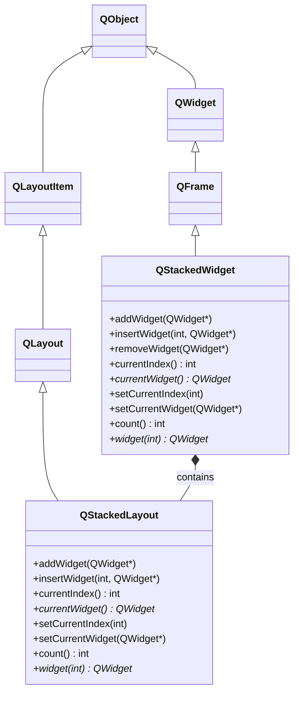
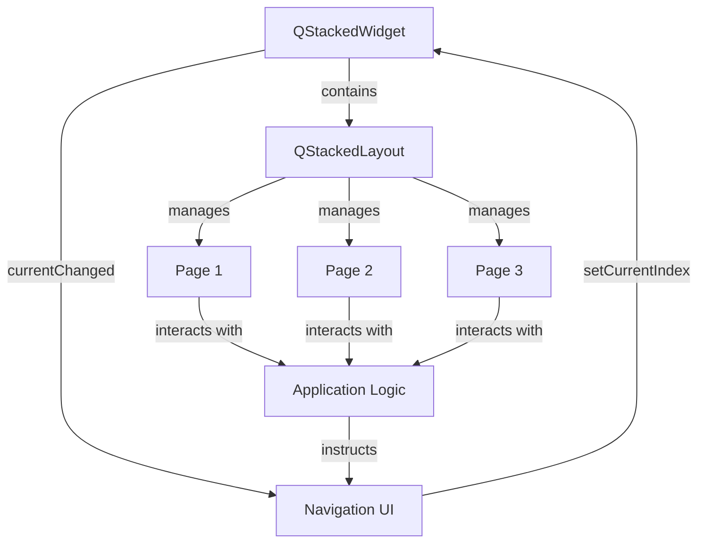

# QStackedWidget 全维度学习指南

<details> <summary><h2>1️⃣ 原理深度解构层</h2></summary>

### ▌三线解析法

#### 运行时行为

- QStackedWidget 是一个容器部件，管理多个子部件堆栈，同一时间只有一个可见 🧠
- 底层使用 QStackedLayout 实现页面管理功能，但提供了更便捷的面向部件的 API
- 子部件添加顺序决定其索引，通过索引或指针切换当前显示的部件
- 作为容器部件，自动处理父子关系，删除 QStackedWidget 会自动删除所有子部件

#### 源码线索

- 核心类：`QStackedWidget`（定义于 `qstackedwidget.h`）
- 内部实现：`QStackedWidgetPrivate`（定义于 `qstackedwidget_p.h`）
- 继承链：`QStackedWidget` → `QFrame` → `QWidget` → `QObject` → `QPaintDevice`
- 内部使用 `QStackedLayout *layout` 存储和管理子部件
- 关键函数实现：多数方法只是对内部 QStackedLayout 的简单封装

#### 计算机科学映射

- 适配器模式：将 QStackedLayout 接口转换为更面向部件的接口
- 组合优于继承：通过组合 QStackedLayout 实现功能复用
- 外观模式：简化了复杂的布局操作，提供简洁的部件 API
- 封装了栈数据结构：提供类似栈的接口（push/insert/remove）但允许随机访问

### ▌对象关系可视化

```
MainWindow (QWidget)
└── m_stackedWidget (QStackedWidget)
    ├── 内部 m_layout (QStackedLayout) - 隐藏实现
    │   ├── page1 (QWidget) ─ 索引 0
    │   ├── page2 (QWidget) ─ 索引 1
    │   └── page3 (QWidget) ─ 索引 2
    └── 信号: currentChanged(int)、widgetRemoved(int)
```

### ▌内部实现机制

- 🧠 QStackedWidget 本质上是一个**带有 QStackedLayout 的框架部件**
- 在构造函数中创建内部 QStackedLayout 并设置为自己的布局管理器
- 大多数方法直接转发给内部 QStackedLayout，如 `addWidget()`、`currentIndex()` 等
- 信号连接：内部将 QStackedLayout 的信号重新发射为自己的信号
- 作为 QFrame 子类，支持边框和框架样式，可与普通部件一样使用

</details> <details> <summary><h2>2️⃣ 代码多维训练场</h2></summary>

### ▌基础示例（10行内）

```cpp
// 基础 QStackedWidget 使用示例
QStackedWidget *stackedWidget = new QStackedWidget();
QPushButton *btn1 = new QPushButton("Page 1");
QLabel *label = new QLabel("Page 2");
stackedWidget->addWidget(btn1);   // 添加到索引0
stackedWidget->addWidget(label);  // 添加到索引1
stackedWidget->setCurrentIndex(0); // 显示第一个页面
// 🔒 线程安全：UI操作应在主线程执行
```

### ▌进阶示例（30行内）

```cpp
// 带导航的 QStackedWidget 示例 - 适用于 Qt 5.15 和 Qt 6.x
#include <QApplication>
#include <QStackedWidget>
#include <QListWidget>
#include <QHBoxLayout>
#include <QLabel>
#include <QPushButton>

int main(int argc, char *argv[])
{
    QApplication app(argc, argv);
    
    // 创建主部件
    QWidget *mainWidget = new QWidget();
    QHBoxLayout *mainLayout = new QHBoxLayout(mainWidget);
    
    // 创建左侧导航列表
    QListWidget *listWidget = new QListWidget();
    listWidget->addItem("首页");
    listWidget->addItem("设置");
    listWidget->addItem("帮助");
    listWidget->setMaximumWidth(150);
    
    // 创建右侧内容区域
    QStackedWidget *stackedWidget = new QStackedWidget();
    
    // 创建三个不同页面
    QWidget *homePage = new QWidget();
    QVBoxLayout *homeLayout = new QVBoxLayout(homePage);
    homeLayout->addWidget(new QLabel("欢迎使用应用"));
    homeLayout->addWidget(new QPushButton("开始"));
    
    QWidget *settingsPage = new QWidget();
    settingsPage->setLayout(new QVBoxLayout());
    settingsPage->layout()->addWidget(new QLabel("设置页面"));
    
    QLabel *helpPage = new QLabel("帮助页面内容");
    
    // 添加页面到 QStackedWidget
    stackedWidget->addWidget(homePage);
    stackedWidget->addWidget(settingsPage);
    stackedWidget->addWidget(helpPage);
    
    // 连接导航和内容区域
    QObject::connect(listWidget, &QListWidget::currentRowChanged,
                    stackedWidget, &QStackedWidget::setCurrentIndex);
    
    // 布局组装
    mainLayout->addWidget(listWidget);
    mainLayout->addWidget(stackedWidget, 1); // 内容区域占据更多空间
    
    // 显示窗口
    mainWidget->resize(600, 400);
    mainWidget->show();
    listWidget->setCurrentRow(0); // 默认选择首页
    
    return app.exec();
}
```

### ▌专家示例（50行以上）

```cpp
/*
 * 高级 QStackedWidget 应用 - 包含动画过渡效果、懒加载和内存管理
 * 兼容 Qt 5.12+ 和 Qt 6.x
 */
#include <QApplication>
#include <QStackedWidget>
#include <QTabBar>
#include <QVBoxLayout>
#include <QLabel>
#include <QPushButton>
#include <QPointer>
#include <QPropertyAnimation>
#include <QParallelAnimationGroup>
#include <QGraphicsOpacityEffect>
#include <QTimer>
#include <QDebug>
#include <QFuture>
#include <QtConcurrent>

// 扩展 QStackedWidget 添加动画过渡效果
class AnimatedStackedWidget : public QStackedWidget
{
    Q_OBJECT
public:
    enum TransitionEffect { Fade, Slide, None };
    
    AnimatedStackedWidget(QWidget *parent = nullptr)
        : QStackedWidget(parent),
          m_effect(None),
          m_animationInProgress(false),
          m_animationDuration(300),
          m_fadeEffect(nullptr),
          m_slideAnim(nullptr),
          m_opacityAnim(nullptr)
    {
        m_fadeEffect = new QGraphicsOpacityEffect(this);
        m_slideAnim = new QPropertyAnimation(this, "pos");
        m_opacityAnim = new QPropertyAnimation(m_fadeEffect, "opacity");
        
        connect(m_slideAnim, &QPropertyAnimation::finished, 
                this, &AnimatedStackedWidget::onTransitionFinished);
        connect(m_opacityAnim, &QPropertyAnimation::finished, 
                this, &AnimatedStackedWidget::onTransitionFinished);
        
        // 创建加载指示器页面
        m_loadingIndicator = new QWidget();
        QVBoxLayout *loadingLayout = new QVBoxLayout(m_loadingIndicator);
        QLabel *loadingLabel = new QLabel("加载中...");
        loadingLabel->setAlignment(Qt::AlignCenter);
        loadingLayout->addWidget(loadingLabel);
        
        // 将加载指示器添加到内部索引
        QStackedWidget::addWidget(m_loadingIndicator);
        m_loadingIndex = QStackedWidget::count() - 1;
    }
    
    // 设置过渡效果类型
    void setTransitionEffect(TransitionEffect effect, int duration = 300)
    {
        m_effect = effect;
        m_animationDuration = duration;
    }
    
    // 设置当前索引 - 重写以添加动画
    void setCurrentIndex(int index) override
    {
        // 如果动画正在进行，忽略新请求
        if (m_animationInProgress) {
            qDebug() << "过渡动画进行中，忽略新的切换请求";
            return;
        }
        
        // 检查索引有效性
        if (index >= count() || index < 0 || index == currentIndex()) {
            return;
        }
        
        // 检查该页面是否需要懒加载
        if (m_lazyLoadPages.contains(index) && !m_lazyLoadPages[index].isLoaded) {
            showLoadingIndicator();
            loadPageAsync(index);
            return;
        }
        
        // 如果不需要过渡效果
        if (m_effect == None) {
            QStackedWidget::setCurrentIndex(index);
            return;
        }
        
        // 保存目标索引
        m_nextIndex = index;
        
        // 保存当前部件状态
        m_currentWidget = currentWidget();
        m_nextWidget = widget(index);
        
        // 应用过渡效果
        switch (m_effect) {
            case Fade:
                applyFadeTransition();
                break;
            case Slide:
                applySlideTransition();
                break;
            default:
                QStackedWidget::setCurrentIndex(index);
                break;
        }
    }
    
    // 添加部件（支持懒加载）
    int addWidget(QWidget *widget, bool lazyLoad = false) 
    {
        if (lazyLoad) {
            // 为懒加载创建占位符
            QWidget *placeholder = new QWidget();
            int index = QStackedWidget::addWidget(placeholder);
            
            // 存储真实部件信息
            LazyLoadInfo info;
            info.widget = widget;
            info.placeholder = placeholder;
            info.isLoaded = false;
            m_lazyLoadPages[index] = info;
            
            qDebug() << "添加懒加载页面，索引:" << index;
            return index;
        } else {
            // 正常添加
            return QStackedWidget::addWidget(widget);
        }
    }
    
    // 释放不活跃页面内存
    void releaseInactivePages(int keepCount = 3)
    {
        // 如果页面总数小于保留数，不执行任何操作
        if (count() <= keepCount + 1) // +1 是加载指示器
            return;
            
        // 获取当前索引和最近访问的页面
        int current = currentIndex();
        QList<int> recentIndices = m_pageAccessHistory.mid(0, keepCount);
        
        // 确保当前页面在保留列表中
        if (!recentIndices.contains(current) && current != m_loadingIndex) {
            recentIndices.removeAt(recentIndices.size() - 1);
            recentIndices.insert(0, current);
        }
        
        // 遍历所有懒加载页面
        QMutableMapIterator<int, LazyLoadInfo> i(m_lazyLoadPages);
        while (i.hasNext()) {
            i.next();
            int index = i.key();
            LazyLoadInfo &info = i.value();
            
            // 如果页面已加载但不在保留列表中，释放内存
            if (info.isLoaded && !recentIndices.contains(index) && index != current) {
                qDebug() << "释放页面索引:" << index;
                
                // 移除真实部件，保留占位符
                if (widget(index) == info.widget) {
                    // 如果当前显示的是这个部件，先切换
                    if (currentIndex() == index) {
                        QStackedWidget::setCurrentIndex(recentIndices.first());
                    }
                    
                    QStackedWidget::removeWidget(info.widget);
                    QStackedWidget::insertWidget(index, info.placeholder);
                }
                
                // 标记为未加载
                info.isLoaded = false;
                
                // 需要在函数调用后执行删除操作
                info.widget->deleteLater();
                info.widget = nullptr; // 将指针置空，等待重新创建
            }
        }
    }
    
    // 获取性能统计信息
    QMap<int, qint64> getPageLoadTimes() const
    {
        return m_pageLoadTimes;
    }
    
private slots:
    // 过渡动画完成后的处理
    void onTransitionFinished()
    {
        // 清理动画状态
        m_animationInProgress = false;
        
        // 设置索引，不会再触发动画
        m_skipAnimation = true;
        QStackedWidget::setCurrentIndex(m_nextIndex);
        m_skipAnimation = false;
        
        // 重置效果
        if (m_nextWidget) {
            m_nextWidget->setGraphicsEffect(nullptr);
            m_nextWidget->move(0, 0);
        }
        
        // 更新访问历史
        m_pageAccessHistory.removeAll(m_nextIndex);
        m_pageAccessHistory.prepend(m_nextIndex);
        
        // 发射自定义信号
        emit transitionFinished();
    }
    
    // 异步页面加载完成
    void onPageLoaded(int index, QWidget *loadedWidget)
    {
        if (!m_lazyLoadPages.contains(index) || !loadedWidget)
            return;
            
        LazyLoadInfo &info = m_lazyLoadPages[index];
        
        // 替换占位符
        QStackedWidget::removeWidget(info.placeholder);
        QStackedWidget::insertWidget(index, loadedWidget);
        
        // 更新状态
        info.widget = loadedWidget;
        info.isLoaded = true;
        
        // 记录加载时间
        m_pageLoadTimes[index] = m_loadTimer.elapsed();
        
        qDebug() << "页面" << index << "加载完成，用时:" << m_pageLoadTimes[index] << "ms";
        
        // 切换到请求的页面
        setCurrentIndex(index);
    }
    
signals:
    void transitionFinished();
    void pageLoadStarted(int index);
    void pageLoadFinished(int index, qint64 loadTimeMs);
    
private:
    // 应用淡入淡出过渡效果
    void applyFadeTransition()
    {
        m_animationInProgress = true;
        
        // 设置下一个部件透明度为0
        m_nextWidget->setGraphicsEffect(m_fadeEffect);
        m_fadeEffect->setOpacity(0);
        
        // 显示下一个部件但透明
        m_nextWidget->show();
        m_nextWidget->raise();
        
        // 配置动画
        m_opacityAnim->setDuration(m_animationDuration);
        m_opacityAnim->setStartValue(0.0);
        m_opacityAnim->setEndValue(1.0);
        
        // 启动动画
        m_opacityAnim->start();
    }
    
    // 应用滑动过渡效果
    void applySlideTransition()
    {
        m_animationInProgress = true;
        
        // 获取当前部件的宽度
        int width = this->width();
        
        // 准备下一个部件
        m_nextWidget->show();
        m_nextWidget->move(width, 0);
        
        // 配置动画
        m_slideAnim->setDuration(m_animationDuration);
        m_slideAnim->setTargetObject(m_nextWidget);
        m_slideAnim->setStartValue(QPoint(width, 0));
        m_slideAnim->setEndValue(QPoint(0, 0));
        
        // 启动动画
        m_slideAnim->start();
    }
    
    // 显示加载指示器
    void showLoadingIndicator()
    {
        QStackedWidget::setCurrentIndex(m_loadingIndex);
    }
    
    // 异步加载页面
    void loadPageAsync(int index)
    {
        if (!m_lazyLoadPages.contains(index) || m_lazyLoadPages[index].isLoaded)
            return;
            
        emit pageLoadStarted(index);
        m_loadTimer.start();
        
        // 创建页面工厂函数
        auto createPage = [this, index]() {
            LazyLoadInfo &info = m_lazyLoadPages[index];
            
            // 模拟耗时的页面创建
            QThread::msleep(1000); // 仅作演示，实际应用中替换为真实的页面创建代码
            
            // 创建新的页面部件
            QWidget *page = new QWidget();
            QVBoxLayout *layout = new QVBoxLayout(page);
            QLabel *label = new QLabel(QString("页面 %1 (懒加载)").arg(index));
            layout->addWidget(label);
            
            // 在主线程中发送信号
            QMetaObject::invokeMethod(this, "onPageLoaded", Qt::QueuedConnection,
                                     Q_ARG(int, index), Q_ARG(QWidget*, page));
            
            return page;
        };
        
        // 在线程池中执行页面创建
        QFuture<QWidget*> future = QtConcurrent::run(createPage);
    }
    
private:
    // 懒加载信息结构
    struct LazyLoadInfo {
        QPointer<QWidget> widget;       // 实际部件（可能为空）
        QPointer<QWidget> placeholder;  // 占位符部件
        bool isLoaded;                  // 是否已加载
    };
    
    TransitionEffect m_effect;
    bool m_animationInProgress;
    bool m_skipAnimation = false;
    int m_animationDuration;
    int m_nextIndex;
    QPointer<QWidget> m_currentWidget;
    QPointer<QWidget> m_nextWidget;
    
    QGraphicsOpacityEffect *m_fadeEffect;
    QPropertyAnimation *m_slideAnim;
    QPropertyAnimation *m_opacityAnim;
    
    QPointer<QWidget> m_loadingIndicator;
    int m_loadingIndex;
    
    QMap<int, LazyLoadInfo> m_lazyLoadPages;
    QList<int> m_pageAccessHistory;
    
    QElapsedTimer m_loadTimer;
    QMap<int, qint64> m_pageLoadTimes;
};

// 使用示例 (main函数)
int main(int argc, char *argv[])
{
    QApplication app(argc, argv);
    
    QWidget *mainWindow = new QWidget();
    QVBoxLayout *layout = new QVBoxLayout(mainWindow);
    
    // 创建自定义堆叠部件
    AnimatedStackedWidget *stackedWidget = new AnimatedStackedWidget();
    stackedWidget->setTransitionEffect(AnimatedStackedWidget::Fade, 500);
    
    // 创建导航栏
    QTabBar *tabBar = new QTabBar();
    tabBar->addTab("页面 1");
    tabBar->addTab("页面 2");
    tabBar->addTab("懒加载页面");
    tabBar->addTab("另一懒加载页面");
    
    // 添加普通页面
    QWidget *page1 = new QWidget();
    page1->setLayout(new QVBoxLayout());
    page1->layout()->addWidget(new QLabel("这是页面 1"));
    
    QWidget *page2 = new QWidget();
    page2->setLayout(new QVBoxLayout());
    page2->layout()->addWidget(new QLabel("这是页面 2"));
    
    stackedWidget->addWidget(page1);
    stackedWidget->addWidget(page2);
    
    // 添加懒加载页面
    stackedWidget->addWidget(nullptr, true);  // 索引2，懒加载
    stackedWidget->addWidget(nullptr, true);  // 索引3，懒加载
    
    // 添加内存管理按钮
    QPushButton *memButton = new QPushButton("释放不活跃页面");
    QObject::connect(memButton, &QPushButton::clicked,
                    stackedWidget, &AnimatedStackedWidget::releaseInactivePages);
    
    // 连接导航和页面切换
    QObject::connect(tabBar, &QTabBar::currentChanged,
                    stackedWidget, &AnimatedStackedWidget::setCurrentIndex);
                    
    // 显示加载进度
    QLabel *statusLabel = new QLabel("就绪");
    QObject::connect(stackedWidget, &AnimatedStackedWidget::pageLoadStarted,
                    [statusLabel](int index) {
                        statusLabel->setText(QString("开始加载页面 %1...").arg(index));
                    });
                    
    QObject::connect(stackedWidget, &AnimatedStackedWidget::pageLoadFinished,
                    [statusLabel](int index, qint64 time) {
                        statusLabel->setText(QString("页面 %1 加载完成，用时: %2 ms").arg(index).arg(time));
                    });
    
    // 布局组装
    layout->addWidget(tabBar);
    layout->addWidget(stackedWidget);
    layout->addWidget(memButton);
    layout->addWidget(statusLabel);
    
    // 显示窗口
    mainWindow->resize(800, 600);
    mainWindow->show();
    
    return app.exec();
}

// 注：此代码需要使用 qmake/moc 编译或在 CMake 项目中使用
```

### ▌错误案例库

#### 案例1：在非主线程中操作 QStackedWidget

```cpp
// 💀 危险：在工作线程中直接操作 QStackedWidget
void WorkerThread::run() {
    // ...执行一些操作
    
    // 直接从工作线程操作 UI - 将导致崩溃
    m_stackedWidget->setCurrentIndex(1);  // 💀 错误：跨线程UI操作
}

// ✅ 正确：使用信号槽在主线程中操作
void WorkerThread::run() {
    // ...执行一些操作
    
    // 发送信号到主线程
    emit requestPageChange(1);
}

// 在主线程中连接
connect(workerThread, &WorkerThread::requestPageChange,
        m_stackedWidget, &QStackedWidget::setCurrentIndex);
```

**症状**：应用程序崩溃，日志显示"QObject: Cannot create children for a parent that is in a different thread" **原因**：Qt GUI类（包括QStackedWidget）不是线程安全的，必须在它们的创建线程（通常是主线程）中访问 **检测方法**：使用调试器检查调用栈，或添加 `qDebug() << QThread::currentThread() == qApp->thread();` **解决方案**：使用信号槽机制在线程间通信，由主线程操作UI元素

#### 案例2：移除部件后悬空指针

```cpp
// 💀 危险：存储指向 QStackedWidget 中部件的裸指针
QWidget *currentPage = m_stackedWidget->currentWidget();
m_stackedWidget->removeWidget(currentPage);

// 稍后访问这个部件 - 可能发生崩溃
void someFunction() {
    currentPage->update();  // 💀 错误：访问可能无效的指针
}

// ✅ 正确：使用 QPointer 跟踪部件生命周期
QPointer<QWidget> currentPage = m_stackedWidget->currentWidget();
m_stackedWidget->removeWidget(currentPage);

void someFunction() {
    if (currentPage) {  // 安全检查
        currentPage->update();
    }
}
```

**症状**：应用随机崩溃，通常显示段错误或访问违规 **原因**：从QStackedWidget移除部件后，如果没有保留其他引用，部件可能被删除 **检测方法**：使用调试器监控指针，或添加对象销毁信号的连接以跟踪生命周期 **解决方案**：使用QPointer或部件的父子关系管理生命周期，始终在使用前检查指针有效性

#### 案例3：对齐问题和大小策略

```cpp
// 💀 问题：不同部件的大小策略不一致导致的布局问题
void setupStackedWidget() {
    QStackedWidget *stack = new QStackedWidget();
    
    // 第一个页面使用固定大小
    QWidget *page1 = new QWidget();
    page1->setFixedSize(300, 200);
    
    // 第二个页面使用扩展策略
    QWidget *page2 = new QWidget();
    page2->setSizePolicy(QSizePolicy::Expanding, QSizePolicy::Expanding);
    
    stack->addWidget(page1);
    stack->addWidget(page2);
    
    // 当切换页面时，布局可能会突然变化 💀
}

// ✅ 正确：统一所有页面的大小策略
void setupStackedWidget() {
    QStackedWidget *stack = new QStackedWidget();
    
    // 为所有页面设置一致的大小策略
    QWidget *page1 = new QWidget();
    QWidget *page2 = new QWidget();
    
    // 统一策略
    QSizePolicy policy(QSizePolicy::Expanding, QSizePolicy::Expanding);
    page1->setSizePolicy(policy);
    page2->setSizePolicy(policy);
    
    stack->addWidget(page1);
    stack->addWidget(page2);
}
```

**症状**：切换页面时窗口大小跳变，部件不居中或对齐不正确 **原因**：QStackedWidget 的 sizeHint 会根据当前可见部件变化，不同的大小策略会导致布局问题 **检测方法**：检查每个页面的大小策略和 sizeHint() 返回值 **解决方案**：统一所有页面的大小策略，或在父布局中设置适当的拉伸因子控制 QStackedWidget 的行为

#### 案例4：无法拦截鼠标事件

```cpp
// 💀 问题：希望 QStackedWidget 拦截鼠标事件但未生效
class CustomStackedWidget : public QStackedWidget {
protected:
    void mousePressEvent(QMouseEvent *event) override {
        qDebug() << "鼠标按下";  // 这个通常不会被调用
        QStackedWidget::mousePressEvent(event);
    }
};

// ✅ 正确：安装事件过滤器或设置属性
class CustomStackedWidget : public QStackedWidget {
public:
    CustomStackedWidget(QWidget *parent = nullptr) : QStackedWidget(parent) {
        // 方法1: 安装事件过滤器
        installEventFilter(this);
        
        // 方法2: 阻止事件传递到子部件
        setAttribute(Qt::WA_TransparentForMouseEvents, false);
    }
    
    bool eventFilter(QObject *watched, QEvent *event) override {
        if (watched == this && event->type() == QEvent::MouseButtonPress) {
            qDebug() << "鼠标按下 (通过事件过滤器)";
        }
        return QStackedWidget::eventFilter(watched, event);
    }
};
```

**症状**：鼠标事件处理函数不被调用，无法拦截鼠标事件 **原因**：QStackedWidget 默认将事件传递给当前可见的子部件 **检测方法**：添加调试输出或安装事件过滤器跟踪事件流 **解决方案**：使用事件过滤器、改变事件传递属性或在透明覆盖层上处理事件

</details> <details> <summary><h2>3️⃣ 知识拓扑网络</h2></summary>

### ▌三维关联系统

#### 纵向维度：Qt版本演进路线

```
Qt4：QStackedWidget 基础功能已稳定
 ↓
Qt5：改进了信号槽语法，添加了 currentWidget() 信号
 ↓
Qt6：迁移到新属性系统，高DPI支持改进
```

#### 横向维度：跨模块依赖关系

```
QtCore ←── QtGui ←── QtWidgets
                       ↑
                    QStackedWidget
                    ↑      ↑
                 QTabWidget  QWizard
```

#### 深度维度：替代方案比较

- QStackedWidget vs QStackedLayout：封装层次不同，前者更便于直接使用
- QStackedWidget vs QTabWidget：后者内置了标签导航UI
- QStackedWidget vs QToolBox：不同的视觉展现和折叠逻辑

### ▌版本差异对照表

| 功能      | Qt5实现                                                      | Qt6替代方案                                                  | 迁移成本 | 向后兼容性      |
| --------- | ------------------------------------------------------------ | ------------------------------------------------------------ | -------- | --------------- |
| 创建方式  | `new QStackedWidget()`                                       | 相同                                                         | ★☆☆☆☆    | 完全兼容        |
| 信号连接  | `connect(stack, SIGNAL(currentChanged(int)), SLOT(onPageChanged(int)));` | `connect(stack, &QStackedWidget::currentChanged, this, &MyClass::onPageChanged);` | ★★☆☆☆    | Qt5已支持新语法 |
| 高DPI支持 | 部分支持，需手动处理缩放                                     | 🔥 改进的高DPI支持，自动缩放                                  | ★★★☆☆    | 需要额外调整    |
| 动画支持  | 需手动实现                                                   | 需手动实现，但可利用QML与QtWidgets的混合技术                 | ★★★☆☆    | 完全兼容        |

### ▌相关类关系图



### ▌相关容器部件比较表

| 特性             | QStackedWidget   | QTabWidget         | QToolBox           | QScrollArea    |
| ---------------- | ---------------- | ------------------ | ------------------ | -------------- |
| 主要用途         | 通用页面堆栈     | 标签页面           | 可折叠分组部件     | 可滚动内容区域 |
| 导航UI           | ❌ 需手动添加     | ✅ 内置标签栏       | ✅ 内置按钮栏       | ❌ 自动滚动条   |
| 同时可见子部件数 | 仅1个            | 仅1个              | 仅1个展开段        | 全部(可滚动)   |
| 子部件添加方法   | addWidget()      | addTab()           | addItem()          | setWidget()    |
| 访问当前部件     | currentWidget()  | currentWidget()    | currentWidget()    | widget()       |
| 自定义框架       | ✅ 支持           | ✅ 支持             | ✅ 支持             | ✅ 支持         |
| 内存效率         | ★★★★☆            | ★★★☆☆              | ★★★☆☆              | ★★★★★          |
| 适用场景         | 向导、多页面应用 | 设置对话框、浏览器 | 工具面板、折叠菜单 | 大型文档、地图 |

</details> <details> <summary><h2>4️⃣ 认知强化体系</h2></summary>

### ▌对比学习表

| 特性       | QStackedWidget | QStackedLayout       | QTabWidget   | 手动页面管理         |
| ---------- | -------------- | -------------------- | ------------ | -------------------- |
| 代码简洁度 | ★★★★★          | ★★★☆☆                | ★★★★☆        | ★★☆☆☆                |
| 灵活性     | ★★★☆☆          | ★★★★☆                | ★★☆☆☆        | ★★★★★                |
| 部件所有权 | 自动管理       | 仅管理布局           | 自动管理     | 需手动管理           |
| 内置导航   | ❌              | ❌                    | ✅            | ❌                    |
| 适用场景   | 通用多页面     | 复杂布局中的页面堆栈 | 有标签的页面 | 高度自定义的页面管理 |
| 记忆负担   | ★☆☆☆☆          | ★★☆☆☆                | ★☆☆☆☆        | ★★★★☆                |
| 性能开销   | ★★☆☆☆          | ★☆☆☆☆                | ★★★☆☆        | ★☆☆☆☆                |

### ▌记忆助手

#### 速查口诀

- **🧠 "部件栈中一显示，索引查询两方法"** - QStackedWidget同时只显示一个部件，可通过索引或部件指针访问
- **🧠 "增添移除皆部件，无需担忧布局事"** - 直接对QStackedWidget添加和移除部件，布局管理自动处理
- **🧠 "父亡子灭要铭记，移出不删需谨慎"** - QStackedWidget作为父对象删除时子部件自动删除，但removeWidget不会自动删除子部件

#### 概念思维导图

```
QStackedWidget
├── 基础结构
│   ├── 继承自QFrame
│   ├── 内部包含QStackedLayout
│   └── 作为容器部件管理子部件堆栈
├── 核心功能
│   ├── 页面管理
│   │   ├── addWidget() - 添加页面到堆栈末尾
│   │   ├── insertWidget() - 在指定位置插入页面
│   │   ├── removeWidget() - 移除页面但不删除
│   │   └── count() - 获取页面总数
│   ├── 页面切换
│   │   ├── setCurrentIndex() - 按索引切换页面
│   │   ├── setCurrentWidget() - 按部件指针切换
│   │   ├── currentIndex() - 获取当前页面索引
│   │   └── currentWidget() - 获取当前页面指针
│   └── 信号系统
│       ├── currentChanged() - 当前页面改变
│       └── widgetRemoved() - 部件被移除
└── 常见用法
    ├── 简单页面切换
    ├── 与导航栏/按钮组组合使用
    ├── 向导页面流程
    └── 设置对话框
```

### ▌视觉记忆卡

```
+-------------------+    +-------------------+
|                   |    |                   |
|  QStackedWidget   |    |  QStackedWidget   |
|                   |    |                   |
|  【页面内容1】      |    |  【页面内容2】      |
|                   |    |                   |
+-------------------+    +-------------------+
    currentIndex=0           currentIndex=1

// 核心操作流程
QStackedWidget *stack = new QStackedWidget();
stack->addWidget(page1);         // 添加页面，返回索引0
stack->addWidget(page2);         // 添加页面，返回索引1
stack->setCurrentIndex(1);       // 切换到页面2
QWidget *current = stack->currentWidget();  // 获取当前页面
```

### ▌常见误解澄清

1. **误解**：QStackedWidget就是一个带有切换标签的容器 **事实**：QStackedWidget只提供堆叠页面功能，不包含任何导航UI，需要另外添加如QTabBar或按钮
2. **误解**：从QStackedWidget中移除部件会自动删除它 **事实**：removeWidget()只是将部件从堆栈中移除，不会删除对象，需要手动调用deleteLater()
3. **误解**：QStackedWidget可以同时显示多个页面 **事实**：QStackedWidget一次只能显示一个页面，如需并排显示多个页面需使用其他布局
4. **误解**：QStackedWidget的页面自动适应各自的尺寸 **事实**：所有页面会被调整为相同的尺寸，由QStackedWidget控制
5. **误解**：QStackedWidget上直接处理鼠标事件很容易 **事实**：事件通常被传递给当前可见的子部件，需要特殊处理才能在QStackedWidget层面捕获

</details> <details> <summary><h2>5️⃣ 工程化实践框架</h2></summary>

### ▌开发阶段指南

#### [设计期]

- **页面层次规划**
  - 确定应用需要多少个页面，每个页面的用途和切换条件
  - 设计页面导航结构（标签栏、按钮、侧边栏等）
  - 规划页面间数据传递机制
- **部件层次设计**
  - 选择合适的父容器部件
  - 决定是使用QStackedWidget还是QTabWidget
  - 考虑是否需要嵌套的页面结构
- **交互模型设计**
  - 确定页面切换触发方式（点击、手势、快捷键等）
  - 设计切换动画和过渡效果
  - 规划错误处理和异常流程

#### [编码期]

- **QA检查表**
  - ☑️ 每个页面设置正确的对象名称便于调试
  - ☑️ 所有索引操作都有有效性检查
  - ☑️ 使用QPointer跟踪可能被删除的部件
  - ☑️ 所有信号槽连接使用新式语法（函数指针）
  - ☑️ UI操作确保在主线程执行
- **编码实践**
  - 为页面索引定义有名常量代替魔术数字
  - 使用命名规范区分页面部件和常规部件
  - 实现页面延迟加载机制减少启动时间
  - 考虑内存管理策略处理大量或复杂页面

#### [调试期]

```cpp
// 1. 打印 QStackedWidget 信息
void debugStackedWidget(QStackedWidget *stack, const QString &name = "stackedWidget") {
    if (!stack) return;
    
    qDebug() << "=== QStackedWidget调试:" << name << "===";
    qDebug() << "总页数:" << stack->count();
    qDebug() << "当前索引:" << stack->currentIndex();
    qDebug() << "当前部件:" << (stack->currentWidget() ? 
                           stack->currentWidget()->objectName() : "nullptr");
    
    // 遍历所有页面
    for (int i = 0; i < stack->count(); i++) {
        QWidget *w = stack->widget(i);
        qDebug() << i << ":" << (w ? w->objectName() : "nullptr")
                 << (w ? (w->isVisible() ? "可见" : "隐藏") : "N/A");
    }
    qDebug() << "===========================";
}

// 2. 安装事件跟踪器
class StackedWidgetTracker : public QObject {
public:
    explicit StackedWidgetTracker(QStackedWidget *target, QObject *parent = nullptr)
        : QObject(parent), m_target(target) {
        
        if (!target) return;
        
        // 连接信号
        connect(target, &QStackedWidget::currentChanged,
                this, &StackedWidgetTracker::onCurrentChanged);
        connect(target, &QStackedWidget::widgetRemoved,
                this, &StackedWidgetTracker::onWidgetRemoved);
                
        // 安装事件过滤器
        target->installEventFilter(this);
        
        qDebug() << "已安装 QStackedWidget 跟踪器到" << target->objectName();
    }
    
protected:
    bool eventFilter(QObject *watched, QEvent *event) override {
        if (watched == m_target) {
            if (event->type() == QEvent::Resize) {
                QResizeEvent *e = static_cast<QResizeEvent*>(event);
                qDebug() << "QStackedWidget 大小变化:"
                         << e->oldSize() << "->" << e->size();
            }
        }
        return QObject::eventFilter(watched, event);
    }
    
private slots:
    void onCurrentChanged(int index) {
        qDebug() << "页面切换:" << m_lastIndex << "->" << index;
        QWidget *w = m_target->widget(index);
        qDebug() << "  新页面:" << (w ? w->objectName() : "nullptr");
        m_lastIndex = index;
    }
    
    void onWidgetRemoved(int index) {
        qDebug() << "部件被移除:" << "索引" << index;
    }
    
private:
    QPointer<QStackedWidget> m_target;
    int m_lastIndex = -1;
};

// 使用：new StackedWidgetTracker(ui->stackedWidget, this);
```

#### [优化期]

- **内存优化策略**
  - 实现页面懒加载机制仅在需要时创建
  - 使用页面缓存池重用常用页面
  - 监控内存使用情况，在内存压力下释放不活跃页面
- **性能优化清单**
  - 避免频繁页面切换时的重复创建和销毁
  - 使用 `setAttribute(Qt::WA_DeleteOnClose, false)` 防止误删
  - 大页面考虑使用 `QScrollArea` 包装减轻布局压力
  - 使用 `setUpdatesEnabled(false)` 减少切换时的重绘

### ▌安全红线清单

1. 🔒 **禁止在非主线程访问 QStackedWidget**
   - 所有UI操作必须在主线程中执行
   - 使用信号槽或QMetaObject::invokeMethod跨线程通信
2. 💀 **禁止在析构流程中进行页面切换**
   - 可能导致悬空指针和崩溃
   - 使用destroyed信号而不是析构函数中操作UI
3. 🔥 **禁止保存和使用可能失效的部件指针**
   - 使用QPointer替代裸指针存储部件引用
   - 每次使用前检查指针有效性
4. ⚡ **禁止在页面切换信号处理函数中执行耗时操作**
   - 保持UI响应性能，避免界面卡死
   - 长时间操作应移动到工作线程
5. 💀 **避免循环引用和交叉依赖**
   - QStackedWidget与页面间不应相互持有指针
   - 使用信号槽和弱引用解耦组件

### ▌性能优化策略

#### 内存管理

```cpp
// 页面懒加载实现示例
class LazyStackedWidget : public QStackedWidget {
    Q_OBJECT
public:
    LazyStackedWidget(QWidget *parent = nullptr) : QStackedWidget(parent),
        m_loadingPage(nullptr) {
        // 创建加载中页面
        m_loadingPage = new QWidget();
        QVBoxLayout *loadingLayout = new QVBoxLayout(m_loadingPage);
        loadingLayout->addWidget(new QLabel("加载中..."));
        QProgressBar *progress = new QProgressBar();
        progress->setRange(0, 0); // 不确定进度
        loadingLayout->addWidget(progress);
        
        QStackedWidget::addWidget(m_loadingPage);
    }
    
    // 注册懒加载页面
    int registerPage(const QString &id, std::function<QWidget*()> factory) {
        int index = m_factories.size() + 1; // +1 因为索引0是加载页面
        m_factories[id] = factory;
        m_pageIndices[id] = index;
        
        // 添加占位符
        QWidget *placeholder = new QWidget();
        QStackedWidget::addWidget(placeholder);
        
        return index;
    }
    
    // 显示页面（按需加载）
    void showPage(const QString &id) {
        if (!m_factories.contains(id)) {
            qWarning() << "未注册的页面ID:" << id;
            return;
        }
        
        int index = m_pageIndices[id];
        
        // 检查页面是否已加载
        if (m_loadedPages.contains(id)) {
            QStackedWidget::setCurrentIndex(index);
            return;
        }
        
        // 显示加载中页面
        QStackedWidget::setCurrentIndex(0);
        
        // 创建实际页面（可考虑移至工作线程）
        QWidget *page = m_factories[id]();
        if (!page) {
            qWarning() << "页面创建失败:" << id;
            return;
        }
        
        // 替换占位符
        QStackedWidget::removeWidget(widget(index));
        QStackedWidget::insertWidget(index, page);
        
        // 记录并切换
        m_loadedPages.insert(id);
        QStackedWidget::setCurrentIndex(index);
    }
    
    // 内存优化：卸载不活跃页面
    void unloadInactivePages(int keepCount = 3) {
        QStringList keepList;
        
        // 保留当前页面
        int currentIdx = currentIndex();
        for (auto it = m_pageIndices.begin(); it != m_pageIndices.end(); ++it) {
            if (it.value() == currentIdx) {
                keepList << it.key();
                break;
            }
        }
        
        // 添加最近访问页面
        for (int i = 0; i < qMin(keepCount - 1, m_accessHistory.size()); i++) {
            if (!keepList.contains(m_accessHistory[i])) {
                keepList << m_accessHistory[i];
            }
        }
        
        // 卸载不在保留列表中的页面
        for (const QString &id : m_loadedPages) {
            if (!keepList.contains(id)) {
                int idx = m_pageIndices[id];
                QWidget *oldPage = widget(idx);
                
                // 创建新占位符
                QWidget *placeholder = new QWidget();
                removeWidget(oldPage);
                insertWidget(idx, placeholder);
                
                // 删除旧页面
                oldPage->deleteLater();
                
                // 从已加载集合中移除
                m_loadedPages.remove(id);
                
                qDebug() << "已卸载页面:" << id;
            }
        }
    }
    
    // 覆盖setCurrentIndex以更新访问历史
    void setCurrentIndex(int index) override {
        QStackedWidget::setCurrentIndex(index);
        
        // 更新访问历史
        QString id = pageIdFromIndex(index);
        if (!id.isEmpty()) {
            m_accessHistory.removeAll(id);
            m_accessHistory.prepend(id);
        }
    }
    
private:
    // 根据索引查找页面ID
    QString pageIdFromIndex(int index) {
        for (auto it = m_pageIndices.begin(); it != m_pageIndices.end(); ++it) {
            if (it.value() == index) {
                return it.key();
            }
        }
        return QString();
    }
    
private:
    QWidget *m_loadingPage;
    QMap<QString, std::function<QWidget*()>> m_factories;
    QMap<QString, int> m_pageIndices;
    QSet<QString> m_loadedPages;
    QStringList m_accessHistory;
};
```

#### 切换性能优化

```cpp
// 优化页面切换性能
void optimizedPageSwitch(QStackedWidget *stack, int targetIndex) {
    if (!stack || targetIndex < 0 || targetIndex >= stack->count())
        return;
        
    // 获取目标部件
    QWidget *nextWidget = stack->widget(targetIndex);
    if (!nextWidget)
        return;
        
    // 暂停更新避免闪烁
    stack->setUpdatesEnabled(false);
    
    // 如果目标页面有复杂布局，考虑延迟布局计算
    nextWidget->setAttribute(Qt::WA_DontCreateNativeAncestors, true);
    
    // 执行切换
    stack->setCurrentIndex(targetIndex);
    
    // 使用单次计时器确保页面完全就绪后再恢复更新
    QTimer::singleShot(0, stack, [stack]() {
        stack->setUpdatesEnabled(true);
    });
}
```

</details> <details> <summary><h2>6️⃣ 学习路径导航</h2></summary>

### ▌阶段式进阶地图

```
[入门期]
QStackedWidget基础API → 基本页面切换 → 与导航部件集成
       ↓
[进阶期]
页面间数据传递 → 自定义过渡效果 → 高级页面管理
       ↓
[专家期]
内存优化策略 → 复杂应用架构 → 性能调优与监控
```

### ▌学习路径详解

#### 入门级目标

1. **理解QStackedWidget基础概念**
   - QStackedWidget的目的和使用场景
   - 与QStackedLayout和其他容器部件的区别
   - 页面索引和部件基础操作
2. **掌握基本页面切换**
   - 添加、插入和移除页面
   - 索引管理和页面切换方法
   - 信号和槽的基本连接
3. **实现导航集成**
   - 与QTabBar关联
   - 创建按钮导航栏
   - 使用列表或树形视图作为导航

#### 进阶级目标

1. **页面间数据传递**
   - 使用属性系统在页面间共享数据
   - 实现页面间的信号槽通信
   - 使用中央数据模型同步状态
2. **自定义过渡效果**
   - 实现基本的淡入淡出过渡
   - 创建滑动和翻页效果
   - 组合多种动画和效果
3. **高级页面管理**
   - 动态创建和销毁页面
   - 实现页面预加载和缓存
   - 基于权限或条件的页面访问控制

#### 专家级目标

1. **内存优化策略**
   - 实现智能懒加载系统
   - 开发内存压力监测与释放机制
   - 页面生命周期优化
2. **复杂应用架构**
   - 设计多级嵌套页面结构
   - 实现模块化和可扩展页面系统
   - 与应用状态管理集成
3. **性能调优与监控**
   - 使用Qt性能分析工具优化页面切换
   - 实现页面加载和切换时间监控
   - 优化大型复杂页面的渲染性能

### ▌学习资源推荐

1. **官方文档**
   - [QStackedWidget官方文档](https://doc.qt.io/qt-6/qstackedwidget.html)
   - [QStackedLayout官方文档](https://doc.qt.io/qt-6/qstackedlayout.html)
   - [QTabWidget官方文档](https://doc.qt.io/qt-6/qtabwidget.html)
2. **示例代码**
   - Qt Examples中的"Widgets"示例
   - Qt Examples中的"Layouts"示例
3. **进阶主题**
   - Qt Animation Framework文档
   - Qt Graphics View Framework文档
   - Qt Model/View编程文档

</details> <details> <summary><h2>7️⃣ 问题诊断与解决框架</h2></summary>

### ▌系统化调试方法

#### 症状分类表

| 症状类型       | 可能原因                 | 诊断工具                          | 解决方案                       |
| -------------- | ------------------------ | --------------------------------- | ------------------------------ |
| 页面不显示     | 索引错误、未设置当前索引 | 输出count()和currentIndex()       | 确保页面添加后设置有效索引     |
| 页面显示空白   | 部件为空或未正确初始化   | 使用QWidget::dumpObjectTree()     | 检查部件初始化和布局设置       |
| 部件被意外删除 | removeWidget后部件被删除 | QPointer追踪、destroyed信号       | 使用QPointer，确保清晰的所有权 |
| 内存泄漏       | 部件从堆栈移除但未删除   | Valgrind、QObject::dumpObjectInfo | 确保调用deleteLater()清理      |
| 页面尺寸异常   | 子部件大小策略不一致     | 打印sizeHint()和大小策略          | 统一所有页面的大小策略         |
| 页面切换崩溃   | 访问无效索引或已删除部件 | 调试器断点、日志跟踪              | 添加边界检查和空指针检查       |

#### 调试指令集

```cpp
// 1. 显示 QStackedWidget 完整状态
void dumpStackedWidget(QStackedWidget *stack) {
    if (!stack) {
        qDebug() << "QStackedWidget 为空!";
        return;
    }
    
    qDebug() << "====== QStackedWidget 状态 ======";
    qDebug() << "对象名:" << stack->objectName();
    qDebug() << "总页数:" << stack->count();
    qDebug() << "当前索引:" << stack->currentIndex();
    
    QWidget *current = stack->currentWidget();
    if (current) {
        qDebug() << "当前部件:" << current->objectName() 
                 << "类型:" << current->metaObject()->className()
                 << "可见性:" << (current->isVisible() ? "可见" : "隐藏");
    } else {
        qDebug() << "当前部件: <空>";
    }
    
    qDebug() << "所有页面:";
    for (int i = 0; i < stack->count(); i++) {
        QWidget *w = stack->widget(i);
        if (w) {
            qDebug() << " [" << i << "]"
                     << "名称:" << w->objectName()
                     << "类型:" << w->metaObject()->className()
                     << "大小:" << w->size()
                     << "可见:" << (w->isVisible() ? "可见" : "隐藏")
                     << "有效:" << (w->isEnabled() ? "有效" : "无效");
        } else {
            qDebug() << " [" << i << "] <空页面>";
        }
    }
    
    qDebug() << "部件几何信息:";
    qDebug() << "  部件大小:" << stack->size();
    qDebug() << "  最小尺寸:" << stack->minimumSize();
    qDebug() << "  最大尺寸:" << stack->maximumSize();
    qDebug() << "  首选尺寸:" << stack->sizeHint();
    qDebug() << "=================================";
}

// 2. 跟踪当前索引变化
void trackCurrentIndex(QStackedWidget *stack) {
    static QMap<QStackedWidget*, int> lastIndices;
    
    int currentIndex = stack->currentIndex();
    int lastIndex = lastIndices.value(stack, -1);
    
    if (currentIndex != lastIndex) {
        qDebug() << "堆栈" << stack->objectName() 
                 << "索引变化:" << lastIndex << "->" << currentIndex;
        
        lastIndices[stack] = currentIndex;
    }
}

// 3. 安装事件监视器
class StackDebugger : public QObject {
public:
    explicit StackDebugger(QStackedWidget *target) : QObject(target) {
        target->installEventFilter(this);
        
        // 连接信号
        connect(target, &QStackedWidget::currentChanged, this, [=](int index) {
            qDebug() << "信号: currentChanged(" << index << ")";
        });
        
        connect(target, &QStackedWidget::widgetRemoved, this, [=](int index) {
            qDebug() << "信号: widgetRemoved(" << index << ")";
        });
    }
    
protected:
    bool eventFilter(QObject *obj, QEvent *event) override {
        // 监控关键事件
        switch (event->type()) {
            case QEvent::ChildAdded:
            case QEvent::ChildRemoved:
            case QEvent::Show:
            case QEvent::Hide:
            case QEvent::Resize:
                qDebug() << "事件:" << obj->objectName() 
                         << event->type();
                break;
            default:
                break;
        }
        return QObject::eventFilter(obj, event);
    }
};

// 使用: new StackDebugger(ui->stackedWidget);
```

#### Qt环境变量调试

```bash
# 启用布局调试
export QT_LAYOUT_DEBUG=1

# 显示窗口部件创建和销毁信息
export QT_WIDGET_RIT=1

# 显示焦点变化
export QT_FOCUS_DEBUG=1

# 启用事件压缩调试
export QT_COMPRESS_EVENTS=0

# 显示绘制区域
export QT_FLUSH_PAINT=1
```

### ▌常见问题解决模板

#### 问题1：添加部件后页面为空白

**症状**：成功添加部件到QStackedWidget，但切换后显示空白页面 **原因**：

1. 未设置当前索引或索引无效
2. 部件未设置内容或布局
3. 部件可能被隐藏或禁用

**解决步骤**：

1. 检查部件初始化与内容：

   ```cpp
   QWidget *page = new QWidget();
   QVBoxLayout *layout = new QVBoxLayout(page);
   layout->addWidget(new QLabel("测试内容")); // 添加可见内容
   ```

2. 确认部件正确添加和切换：

   ```cpp
   int index = ui->stackedWidget->addWidget(page);
   qDebug() << "添加页面，索引:" << index;
   ui->stackedWidget->setCurrentIndex(index);
   ```

3. 验证部件状态：

   ```cpp
   QWidget *current = ui->stackedWidget->currentWidget();
   qDebug() << "当前部件:" << current 
            << "可见:" << current->isVisible()
            << "尺寸:" << current->size();
   ```

**预防措施**：

- 使用助手函数确保正确添加和切换
- 为所有页面设置明确的objectName便于调试
- 使用布局管理器而非固定位置确保内容可见

#### 问题2：切换页面导致应用崩溃

**症状**：调用setCurrentIndex()或setCurrentWidget()后应用崩溃 **原因**：

1. 尝试访问无效索引
2. 部件已被销毁但仍尝试引用
3. 在非主线程操作UI

**解决步骤**：

1. 添加索引有效性检查：

   ```cpp
   void safeSetCurrentIndex(QStackedWidget *stack, int index) {
       if (!stack) return;
       if (index < 0 || index >= stack->count()) {
           qWarning() << "尝试设置无效索引:" << index 
                      << "有效范围: 0-" << (stack->count() - 1);
           return;
       }
       stack->setCurrentIndex(index);
   }
   ```

2. 使用QPointer安全引用部件：

   ```cpp
   QPointer<QWidget> pagePtr = createPage();
   ui->stackedWidget->addWidget(pagePtr);
   
   // 稍后使用前检查
   if (pagePtr) {
       ui->stackedWidget->setCurrentWidget(pagePtr);
   } else {
       qWarning() << "部件已被销毁";
   }
   ```

3. 确保在主线程操作UI：

   ```cpp
   // 从工作线程安全切换页面
   QMetaObject::invokeMethod(ui->stackedWidget, "setCurrentIndex",
                            Qt::QueuedConnection,
                            Q_ARG(int, targetIndex));
   ```

**预防措施**：

- 始终检查索引边界
- 使用QPointer跟踪部件
- 利用信号槽机制在线程间通信
- 建立中央页面管理器集中处理页面切换

#### 问题3：页面大小不一致或布局错乱

**症状**：切换页面时窗口大小变化或内容显示不全 **原因**：

1. 不同页面的大小策略(sizePolicy)不一致
2. 页面内部布局问题
3. 未设置适当的最小/推荐大小

**解决步骤**：

1. 统一所有页面的大小策略：

   ```cpp
   // 创建统一的大小策略
   QSizePolicy policy(QSizePolicy::Expanding, QSizePolicy::Expanding);
   
   // 应用到所有页面
   for (int i = 0; i < ui->stackedWidget->count(); i++) {
       QWidget *page = ui->stackedWidget->widget(i);
       if (page) {
           page->setSizePolicy(policy);
           
           // 可选：设置一致的最小尺寸
           page->setMinimumSize(300, 200);
       }
   }
   ```

2. 检查内部布局设置：

   ```cpp
   // 确保每个页面使用布局管理器
   QWidget *page = new QWidget();
   QVBoxLayout *layout = new QVBoxLayout(page);
   layout->setContentsMargins(0, 0, 0, 0); // 统一边距
   layout->setSpacing(10); // 统一间距
   ```

3. 为QStackedWidget设置适当约束：

   ```cpp
   // 设置固定尺寸避免调整
   ui->stackedWidget->setFixedSize(400, 300);
   
   // 或设置最小尺寸
   ui->stackedWidget->setMinimumSize(400, 300);
   ```

**预防措施**：

- 为所有页面使用通用的页面模板
- 明确设置QStackedWidget自身的大小约束
- 使用布局而非绝对坐标定位
- 测试不同页面切换的影响

</details> <details> <summary><h2>8️⃣ 设计模式与Qt实现映射</h2></summary>

### ▌框架设计思想解析

| 设计模式   | QStackedWidget实现机制               | 源码实现关键点                       | 应用场景       |
| ---------- | ------------------------------------ | ------------------------------------ | -------------- |
| 装饰器模式 | 包装QStackedLayout提供更高级部件接口 | QStackedWidget内部封装QStackedLayout | 页面堆栈容器   |
| 组合模式   | 作为容器管理多个子部件               | 通过addWidget等方法管理子部件        | 层次化UI结构   |
| 状态模式   | 不同页面代表不同UI状态               | setCurrentIndex切换当前可见状态      | 有状态UI流程   |
| 策略模式   | 不同页面实现不同UI策略               | 各页面独立实现但使用统一容器         | 上下文相关界面 |
| 命令模式   | 页面切换可视为UI命令                 | 可扩展实现历史导航和回退功能         | 支持撤销的流程 |

### ▌Qt设计思想特性

1. **组合优于继承**
   - QStackedWidget通过组合QStackedLayout实现功能，而非继承
   - 类似的，QTabWidget也组合使用QStackedWidget而非继承它
2. **对象树与内存管理**
   - 利用Qt父子对象关系自动管理内存
   - 删除QStackedWidget会自动删除所有子页面
3. **信号槽解耦**
   - 使用信号槽机制实现页面与导航的解耦
   - 允许多个UI元素响应页面变化而不形成紧耦合
4. **接口与实现分离**
   - 公共API简洁明了
   - 内部实现细节封装在Private类中

### ▌架构图示



### ▌与其他UI框架对比

| 框架         | 类似结构             | Qt优势               | Qt劣势                   |
| ------------ | -------------------- | -------------------- | ------------------------ |
| Swing (Java) | CardLayout + JPanel  | Qt集成度更高，更简洁 | Java Bean规范更标准      |
| WPF (.NET)   | TabControl           | Qt跨平台性更好       | WPF绑定更强大            |
| Flutter      | TabBarView           | Qt与原生系统集成更好 | Flutter布局更灵活        |
| HTML/CSS     | Tabs (CSS/JS)        | Qt开发工具链更完整   | Web技术标准更开放        |
| iOS UIKit    | UIPageViewController | Qt一致的API跨平台    | 原生控件在移动平台更自然 |

### ▌设计决策权衡

1. **QStackedWidget vs QStackedLayout**
   - QStackedWidget优势：
     - 自动处理部件所有权和内存管理
     - 作为部件可直接添加到其他布局中
     - 可设置框架和样式
   - QStackedLayout优势：
     - 更灵活，可嵌入复杂布局
     - 对布局层次控制更精细
     - 内存开销略小
   - 决策考量：
     - 简单应用选择QStackedWidget
     - 复杂布局需求时选择QStackedLayout
2. **静态vs动态页面管理**
   - 静态页面（预创建所有页面）:
     - 实现简单，代码清晰
     - 内存使用固定可预测
     - 页面切换速度快
   - 动态页面（按需创建）:
     - 初始内存使用小
     - 支持无限量页面
     - 可根据条件决定页面类型
   - 决策考量：
     - 页面数量、复杂度和内存限制
     - 应用启动时间要求
     - 页面依赖条件的复杂度
3. **导航UI选择**
   - 标签栏(QTabBar):
     - 直观、标准、需要较少空间
     - 适合并列的同级页面
   - 列表/树形(QListWidget/QTreeWidget):
     - 支持层次化导航
     - 可显示更多导航信息
     - 适合复杂的多级页面
   - 按钮组(QPushButton组):
     - 完全自定义的外观
     - 可实现非标准导航模式
   - 决策考量：
     - 页面层次结构
     - 导航空间限制
     - UI一致性要求

</details> <details> <summary><h2>9️⃣ 交互式学习实验</h2></summary>

### ▌概念可视化

#### 基本部件堆栈图解

<svg width="500" height="300" viewBox="0 0 500 300" xmlns="http://www.w3.org/2000/svg">   <rect x="50" y="30" width="400" height="240" fill="#f0f0f0" stroke="#333" stroke-width="2" rx="5"/>   <text x="250" y="20" font-family="Arial" font-size="16" text-anchor="middle">QStackedWidget</text>   <rect x="70" y="60" width="360" height="190" fill="#e0e0e0" stroke="#333" stroke-width="1"/>   <text x="250" y="155" font-family="Arial" font-size="24" text-anchor="middle">当前页面 (索引 0)</text>   <rect x="120" y="270" width="60" height="20" fill="#4CAF50" stroke="#333" stroke-width="1" rx="3"/>   <text x="150" y="285" font-family="Arial" font-size="12" text-anchor="middle" fill="white">页面 1</text>   <rect x="190" y="270" width="60" height="20" fill="#333" stroke="#333" stroke-width="1" rx="3"/>   <text x="220" y="285" font-family="Arial" font-size="12" text-anchor="middle" fill="white">页面 2</text>   <rect x="260" y="270" width="60" height="20" fill="#333" stroke="#333" stroke-width="1" rx="3"/>   <text x="290" y="285" font-family="Arial" font-size="12" text-anchor="middle" fill="white">页面 3</text>   <path d="M150,270 L150,250 L250,250 L250,200" stroke="#4CAF50" stroke-width="2" fill="none" marker-end="url(#arrow)"/>   <defs>     <marker id="arrow" markerWidth="10" markerHeight="10" refX="9" refY="3" orient="auto" markerUnits="strokeWidth">       <path d="M0,0 L0,6 L9,3 z" fill="#4CAF50" />     </marker>   </defs> </svg>

#### QStackedWidget类层次结构

<svg width="500" height="400" viewBox="0 0 500 400" xmlns="http://www.w3.org/2000/svg">   <rect x="200" y="30" width="100" height="40" fill="#f0f0f0" stroke="#333" stroke-width="2" rx="5"/>   <text x="250" y="55" font-family="Arial" font-size="14" text-anchor="middle">QObject</text>   <rect x="200" y="110" width="100" height="40" fill="#f0f0f0" stroke="#333" stroke-width="2" rx="5"/>   <text x="250" y="135" font-family="Arial" font-size="14" text-anchor="middle">QWidget</text>   <rect x="200" y="190" width="100" height="40" fill="#f0f0f0" stroke="#333" stroke-width="2" rx="5"/>   <text x="250" y="215" font-family="Arial" font-size="14" text-anchor="middle">QFrame</text>   <rect x="200" y="270" width="100" height="40" fill="#e6f7ff" stroke="#1890ff" stroke-width="2" rx="5"/>   <text x="250" y="295" font-family="Arial" font-size="14" text-anchor="middle">QStackedWidget</text>   <line x1="250" y1="70" x2="250" y2="110" stroke="#333" stroke-width="2" marker-end="url(#arrow)"/>   <line x1="250" y1="150" x2="250" y2="190" stroke="#333" stroke-width="2" marker-end="url(#arrow)"/>   <line x1="250" y1="230" x2="250" y2="270" stroke="#333" stroke-width="2" marker-end="url(#arrow)"/>   <rect x="50" y="270" width="100" height="40" fill="#fffbe6" stroke="#faad14" stroke-width="2" rx="5"/>   <text x="100" y="295" font-family="Arial" font-size="14" text-anchor="middle">QStackedLayout</text>   <rect x="350" y="270" width="100" height="40" fill="#f9f0ff" stroke="#722ed1" stroke-width="2" rx="5"/>   <text x="400" y="295" font-family="Arial" font-size="14" text-anchor="middle">QTabWidget</text>   <line x1="200" y1="290" x2="150" y2="290" stroke="#1890ff" stroke-width="2" stroke-dasharray="5,5"/>   <text x="175" y="280" font-family="Arial" font-size="12">使用</text>   <line x1="300" y1="215" x2="400" y2="270" stroke="#333" stroke-width="2" marker-end="url(#arrow)"/>   <text x="350" y="235" font-family="Arial" font-size="12">继承</text>   <rect x="200" y="350" width="100" height="40" fill="#f0f0f0" stroke="#333" stroke-width="2" rx="5" stroke-dasharray="5,5"/>   <text x="250" y="375" font-family="Arial" font-size="14" text-anchor="middle">自定义扩展</text>   <line x1="250" y1="310" x2="250" y2="350" stroke="#333" stroke-width="2" marker-end="url(#arrow)" stroke-dasharray="5,5"/> </svg>

#### 页面切换序列图

<svg width="600" height="400" viewBox="0 0 600 400" xmlns="http://www.w3.org/2000/svg">   <rect x="50" y="30" width="120" height="40" fill="#f0f0f0" stroke="#333" stroke-width="2" rx="5"/>   <text x="110" y="55" font-family="Arial" font-size="14" text-anchor="middle">Navigation</text>   <rect x="250" y="30" width="120" height="40" fill="#e6f7ff" stroke="#1890ff" stroke-width="2" rx="5"/>   <text x="310" y="55" font-family="Arial" font-size="14" text-anchor="middle">QStackedWidget</text>   <rect x="450" y="30" width="120" height="40" fill="#f9f0ff" stroke="#722ed1" stroke-width="2" rx="5"/>   <text x="510" y="55" font-family="Arial" font-size="14" text-anchor="middle">Pages</text>   <line x1="110" y1="70" x2="110" y2="380" stroke="#333" stroke-width="1" stroke-dasharray="5,5"/>   <line x1="310" y1="70" x2="310" y2="380" stroke="#1890ff" stroke-width="1" stroke-dasharray="5,5"/>   <line x1="510" y1="70" x2="510" y2="380" stroke="#722ed1" stroke-width="1" stroke-dasharray="5,5"/>   <rect x="105" y="100" width="10" height="30" fill="#333"/>   <rect x="305" y="130" width="10" height="60" fill="#1890ff"/>   <rect x="505" y="160" width="10" height="30" fill="#722ed1"/>   <rect x="505" y="220" width="10" height="30" fill="#722ed1"/>   <rect x="305" y="250" width="10" height="30" fill="#1890ff"/>   <rect x="105" y="280" width="10" height="30" fill="#333"/>   <line x1="115" y1="115" x2="305" y2="145" stroke="#333" stroke-width="1" marker-end="url(#arrow)"/>   <text x="200" y="135" font-family="Arial" font-size="12">1. setCurrentIndex(2)</text>   <line x1="315" y1="175" x2="505" y2="175" stroke="#1890ff" stroke-width="1" marker-end="url(#arrow)"/>   <text x="400" y="165" font-family="Arial" font-size="12">2. hide() 当前页面</text>   <line x1="315" y1="235" x2="505" y2="235" stroke="#1890ff" stroke-width="1" marker-end="url(#arrow)"/>   <text x="400" y="225" font-family="Arial" font-size="12">3. show() 新页面</text>   <line x1="315" y1="265" x2="115" y2="295" stroke="#1890ff" stroke-width="1" marker-end="url(#arrow)"/>   <text x="190" y="285" font-family="Arial" font-size="12">4. currentChanged(2)</text>   <rect x="50" y="320" width="510" height="30" fill="#f6ffed" stroke="#52c41a" stroke-width="1" rx="5"/>   <text x="305" y="340" font-family="Arial" font-size="14" text-anchor="middle">新页面(索引2)现在可见</text> </svg>

### ▌交互式代码练习

#### 练习1：创建基本标签页界面

```cpp
// 创建一个带有3个页面和标签栏的简单应用
#include <QApplication>
#include <QMainWindow>
#include <QStackedWidget>
#include <QTabBar>
#include <QVBoxLayout>
#include <QLabel>
#include <QPushButton>

int main(int argc, char *argv[])
{
    QApplication app(argc, argv);
    
    // 创建主窗口
    QMainWindow window;
    QWidget *centralWidget = new QWidget();
    window.setCentralWidget(centralWidget);
    
    // 创建主布局
    QVBoxLayout *mainLayout = new QVBoxLayout(centralWidget);
    
    // 创建标签栏
    QTabBar *tabBar = new QTabBar();
    tabBar->addTab("首页");
    tabBar->addTab("设置");
    tabBar->addTab("帮助");
    
    // 创建堆叠部件
    QStackedWidget *stackedWidget = new QStackedWidget();
    
    // 创建页面
    QWidget *homePage = new QWidget();
    QVBoxLayout *homeLayout = new QVBoxLayout(homePage);
    QLabel *welcomeLabel = new QLabel("欢迎使用本应用！");
    welcomeLabel->setAlignment(Qt::AlignCenter);
    QPushButton *startButton = new QPushButton("开始");
    homeLayout->addWidget(welcomeLabel);
    homeLayout->addWidget(startButton);
    homeLayout->addStretch();
    
    QLabel *settingsPage = new QLabel("设置页面内容");
    settingsPage->setAlignment(Qt::AlignCenter);
    
    QLabel *helpPage = new QLabel("帮助和支持内容");
    helpPage->setAlignment(Qt::AlignCenter);
    
    // 添加页面到堆叠部件
    stackedWidget->addWidget(homePage);
    stackedWidget->addWidget(settingsPage);
    stackedWidget->addWidget(helpPage);
    
    // 连接标签栏和堆叠部件
    QObject::connect(tabBar, &QTabBar::currentChanged,
                    stackedWidget, &QStackedWidget::setCurrentIndex);
    
    // 添加到主布局
    mainLayout->addWidget(tabBar);
    mainLayout->addWidget(stackedWidget);
    
    // 显示窗口
    window.setWindowTitle("QStackedWidget 示例");
    window.resize(400, 300);
    window.show();
    
    return app.exec();
}
```

#### 练习2：添加页面切换动画

```cpp
// 为QStackedWidget添加淡入淡出动画效果
#include <QApplication>
#include <QMainWindow>
#include <QStackedWidget>
#include <QPushButton>
#include <QHBoxLayout>
#include <QVBoxLayout>
#include <QLabel>
#include <QGraphicsOpacityEffect>
#include <QPropertyAnimation>

class FadeStackedWidget : public QStackedWidget
{
public:
    FadeStackedWidget(QWidget *parent = nullptr)
        : QStackedWidget(parent), m_inProgress(false)
    {
        // 初始化淡入淡出效果和动画
        m_effect = new QGraphicsOpacityEffect(this);
        m_animation = new QPropertyAnimation(m_effect, "opacity");
        m_animation->setDuration(500); // 500ms过渡
        
        connect(m_animation, &QPropertyAnimation::finished,
                this, &FadeStackedWidget::onFadeFinished);
    }
    
    // 重写setCurrentIndex添加动画
    void setCurrentIndex(int index) override
    {
        if (index == currentIndex() || m_inProgress || index < 0 || index >= count())
            return;
            
        // 记录要切换的索引
        m_nextIndex = index;
        
        // 获取当前和目标部件
        QWidget *currentWidget = widget(currentIndex());
        QWidget *nextWidget = widget(index);
        
        if (!currentWidget || !nextWidget)
            return;
            
        // 设置初始状态
        m_inProgress = true;
        nextWidget->setGraphicsEffect(m_effect);
        m_effect->setOpacity(0.0);
        
        // 显示下一个部件但完全透明
        QStackedWidget::setCurrentIndex(index);
        
        // 启动淡入动画
        m_animation->setStartValue(0.0);
        m_animation->setEndValue(1.0);
        m_animation->start();
    }
    
private slots:
    void onFadeFinished()
    {
        // 动画完成后清理状态
        m_inProgress = false;
        widget(m_nextIndex)->setGraphicsEffect(nullptr);
        
        // 发射自定义信号
        emit fadeFinished(m_nextIndex);
    }
    
signals:
    void fadeFinished(int index);
    
private:
    QGraphicsOpacityEffect *m_effect;
    QPropertyAnimation *m_animation;
    bool m_inProgress;
    int m_nextIndex;
};

int main(int argc, char *argv[])
{
    QApplication app(argc, argv);
    
    QMainWindow window;
    QWidget *centralWidget = new QWidget();
    window.setCentralWidget(centralWidget);
    
    QVBoxLayout *mainLayout = new QVBoxLayout(centralWidget);
    
    // 创建自定义堆叠部件
    FadeStackedWidget *stackedWidget = new FadeStackedWidget();
    
    // 创建导航按钮
    QHBoxLayout *navLayout = new QHBoxLayout();
    QPushButton *prevButton = new QPushButton("上一页");
    QPushButton *nextButton = new QPushButton("下一页");
    QLabel *pageLabel = new QLabel("页面 1 / 3");
    pageLabel->setAlignment(Qt::AlignCenter);
    
    navLayout->addWidget(prevButton);
    navLayout->addWidget(pageLabel);
    navLayout->addWidget(nextButton);
```