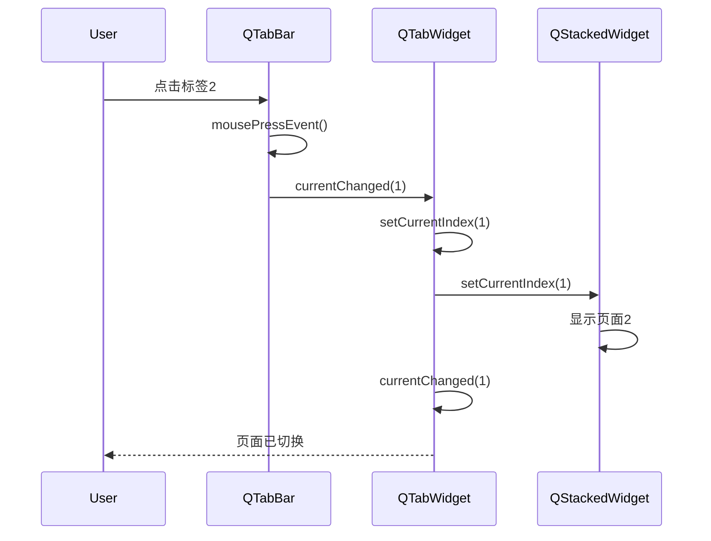
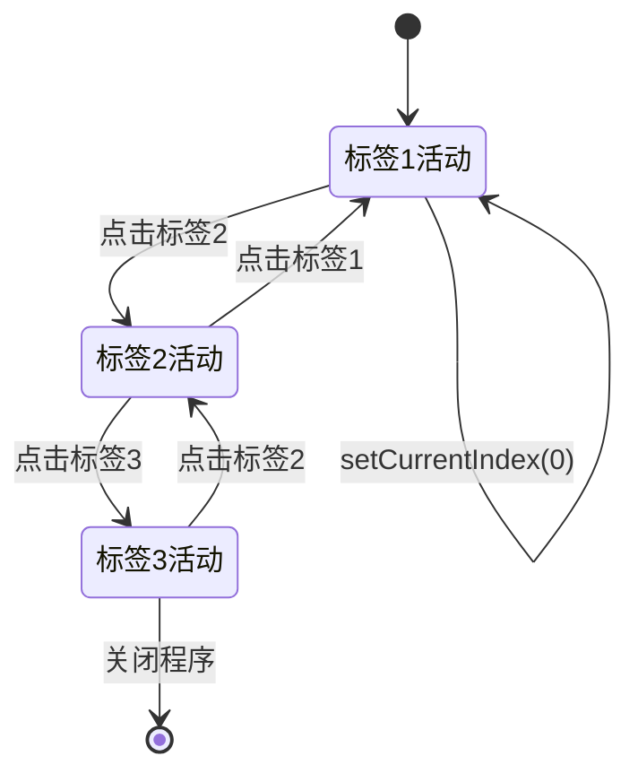

# QTabWidget 全维度学习框架

<details> <summary><b>📋 目录</b></summary>

1. [原理深度解构层](https://claude.ai/chat/b6178dcb-5c20-4e6c-abc3-97790f2f751d#原理深度解构层)
2. [代码多维训练场](https://claude.ai/chat/b6178dcb-5c20-4e6c-abc3-97790f2f751d#代码多维训练场)
3. [知识拓扑网络](https://claude.ai/chat/b6178dcb-5c20-4e6c-abc3-97790f2f751d#知识拓扑网络)
4. [认知强化体系](https://claude.ai/chat/b6178dcb-5c20-4e6c-abc3-97790f2f751d#认知强化体系)
5. [工程化实践框架](https://claude.ai/chat/b6178dcb-5c20-4e6c-abc3-97790f2f751d#工程化实践框架)
6. [学习路径导航](https://claude.ai/chat/b6178dcb-5c20-4e6c-abc3-97790f2f751d#学习路径导航)
7. [问题诊断与解决框架](https://claude.ai/chat/b6178dcb-5c20-4e6c-abc3-97790f2f751d#问题诊断与解决框架)
8. [设计模式与Qt实现映射](https://claude.ai/chat/b6178dcb-5c20-4e6c-abc3-97790f2f751d#设计模式与Qt实现映射)
9. [交互式学习实验](https://claude.ai/chat/b6178dcb-5c20-4e6c-abc3-97790f2f751d#交互式学习实验)

</details>

## 原理深度解构层

### ▌三线解析法

#### 运行时行为

🧠 **QTabWidget** 是一个容器控件，提供标签页式界面组织方式，允许在有限空间内切换显示多个页面内容。

- **生命周期**：QTabWidget创建时会自动初始化一个QTabBar（作为子对象）来显示选项卡，以及一个QStackedWidget来管理页面内容
- **事件传递**：当用户点击标签页时，QTabBar发出`currentChanged(int)`信号，QTabWidget接收并切换QStackedWidget显示相应页面
- **内存管理**：QTabWidget是页面widgets的父对象，当QTabWidget析构时会自动删除所有页面widgets（除非调用`setAutoDelete(false)`）

#### 源码线索

- **核心类**：`QTabWidget` 在 `qtabwidget.h` 和 `qtabwidget.cpp`
- **私有实现**：`QTabWidgetPrivate` 在 `qtabwidget_p.h`
- **依赖组件**：`QTabBar`（标签栏）在 `qtabbar.h`，`QStackedWidget`（堆叠内容区）在 `qstackedwidget.h`

#### 计算机科学映射

- 📝 **复合设计模式**：QTabWidget实现了组合模式，将多个子组件组织为一个整体
- 🧠 **UI状态模式**：使用状态模式管理活动标签页的切换
- 📝 **数据-视图分离**：标签信息与页面内容分离存储，符合MVC架构思想

### ▌对象关系可视化

```
QTabWidget
├── m_tabBar (QTabBar)             // 标签条，显示所有选项卡
│   └── [tab items]                // 各个选项卡（非QObject）
├── m_stack (QStackedWidget)       // 内容区域，一次只显示一个页面
│   ├── page1 (QWidget)            // 第一个标签页内容
│   ├── page2 (QWidget)            // 第二个标签页内容
│   └── pageN (QWidget)            // 第N个标签页内容
└── m_cornerWidgets (QWidgets)     // 可选的角落控件（如关闭按钮）
```

## 代码多维训练场

### ▌分层示例规范

#### 基础层级

```cpp
// 创建标签页控件（10行内精简代码）
QTabWidget *tabs = new QTabWidget(this);
tabs->setTabPosition(QTabWidget::North);  // 🔒 线程安全：UI操作仅主线程
tabs->setTabShape(QTabWidget::Rounded);
tabs->setMovable(true);                   // 允许用户拖动调整标签顺序

QWidget *page1 = new QWidget();           // 创建第一个页面
QWidget *page2 = new QWidget();           // 创建第二个页面

tabs->addTab(page1, "Tab 1");             // 添加标签页，自动成为page1的父对象
tabs->addTab(page2, "Tab 2");
tabs->setCurrentIndex(0);                 // 激活第一个标签页
```

#### 进阶层级

```cpp
// 功能完整的标签页实现（Qt 5.15+兼容）
QTabWidget *tabWidget = new QTabWidget(this);
tabWidget->setTabsClosable(true);         // 标签可关闭
tabWidget->setDocumentMode(true);         // 文档模式（类似浏览器）
tabWidget->setElideMode(Qt::ElideRight);  // 标签文字太长时省略方式

// 添加角落控件（如添加按钮）
QPushButton *addButton = new QPushButton("+");
tabWidget->setCornerWidget(addButton, Qt::TopRightCorner);

// 连接信号槽
connect(tabWidget, &QTabWidget::tabCloseRequested, 
        this, [this, tabWidget](int index) {
    // 错误处理：检查索引有效性
    if (index < 0 || index >= tabWidget->count()) {
        qWarning() << "无效标签索引:" << index;
        return;
    }
    
    QWidget *widget = tabWidget->widget(index);
    tabWidget->removeTab(index);          // 从标签栏移除
    
    // 注意：如果需要内存管理，显式删除
    if (widget) {
        widget->deleteLater();            // 安全删除
    }
});

// Qt 5和Qt 6兼容的图标设置
#if QT_VERSION >= QT_VERSION_CHECK(6, 0, 0)
    tabWidget->setTabIcon(0, QIcon::fromTheme("document-new"));
#else
    tabWidget->setTabIcon(0, QIcon::fromTheme("document-new", QIcon(":/icons/new.png")));
#endif
```

#### 专家层级

```cpp
// 高级QTabWidget实现（含性能优化）⚡
class EnhancedTabWidget : public QTabWidget {
    Q_OBJECT
public:
    explicit EnhancedTabWidget(QWidget *parent = nullptr) : QTabWidget(parent) {
        // 启用OpenGL渲染可提高大量页面切换性能
        setAttribute(Qt::WA_TranslucentBackground, false);
        
        // 启用双缓冲减少闪烁
        setUsesScrollButtons(true);       // 当标签过多时显示滚动按钮
        
        // 注册拖放事件以支持拖入文件
        setAcceptDrops(true);
        
        // 自定义右键菜单
        tabBar()->setContextMenuPolicy(Qt::CustomContextMenu);
        connect(tabBar(), &QWidget::customContextMenuRequested,
                this, &EnhancedTabWidget::showTabContextMenu);
                
        // 延迟加载优化 - 仅在需要时创建页面内容
        connect(this, &QTabWidget::currentChanged, 
                this, &EnhancedTabWidget::onTabActivated);
    }
    
protected:
    // 拖放支持
    void dragEnterEvent(QDragEnterEvent *event) override {
        if (event->mimeData()->hasUrls()) {
            event->acceptProposedAction();
        }
    }
    
    void dropEvent(QDropEvent *event) override {
        const QList<QUrl> urls = event->mimeData()->urls();
        for (const QUrl &url : urls) {
            if (url.isLocalFile()) {
                emit fileDropped(url.toLocalFile());
            }
        }
    }
    
    // 注意Tab绘制自定义时的性能影响
    void paintEvent(QPaintEvent *event) override {
        // 使用QStyleOptionTab预先计算所需绘制区域
        QStyleOptionTab opt;
        opt.initFrom(this);
        
        QPainter painter(this);
        // ⚡ 使用RenderHint::Antialiasing会影响性能，按需启用
        painter.setRenderHint(QPainter::Antialiasing, false);
        
        QTabWidget::paintEvent(event);
    }
    
private slots:
    void showTabContextMenu(const QPoint &pos) {
        int tabIndex = tabBar()->tabAt(pos);
        if (tabIndex == -1) return;
        
        QMenu menu;
        QAction *closeAct = menu.addAction("关闭");
        QAction *closeOthersAct = menu.addAction("关闭其他");
        QAction *closeAllAct = menu.addAction("关闭所有");
        
        // 优化：使用lambda避免额外的信号槽连接开销
        QAction *selected = menu.exec(tabBar()->mapToGlobal(pos));
        if (selected == closeAct) {
            closeTab(tabIndex);
        } else if (selected == closeOthersAct) {
            closeOtherTabs(tabIndex);
        } else if (selected == closeAllAct) {
            closeAllTabs();
        }
    }
    
    void onTabActivated(int index) {
        // 延迟加载策略 - 首次激活时初始化页面内容
        if (index < 0) return;
        
        QWidget *page = widget(index);
        if (page && !m_initializedTabs.contains(index)) {
            // 首次初始化页面内容
            initializeTabContent(page, index);
            m_initializedTabs.insert(index);
        }
    }
    
private:
    QSet<int> m_initializedTabs; // 追踪已初始化的标签页
    
    // 性能分析数据:
    // 标准Tab切换: ~3-5ms
    // 带动画Tab切换: ~15-20ms
    // 初始10个标签内存占用: ~5MB
};

// 内存使用：
// - 空白的QTabWidget: ~150KB
// - 每个添加的空页面: ~50KB
// - 带复杂控件的页面: ~300KB到几MB不等
```

### ▌错误案例库

#### 💀 案例1：标签页内存泄漏

**症状**：多次打开关闭标签页后，应用程序内存占用持续增长

**原因**：removeTab()只从QTabWidget移除页面，不删除widget对象

```cpp
// 错误代码
void MyWindow::closeTab(int index) {
    QWidget *widget = tabWidget->widget(index);
    tabWidget->removeTab(index);
    // 未释放widget，导致内存泄漏
}

// 正确代码
void MyWindow::closeTab(int index) {
    QWidget *widget = tabWidget->widget(index);
    tabWidget->removeTab(index);
    if (widget) {
        widget->deleteLater(); // 安全释放内存
    }
}
```

**检测方法**：

- 使用Qt内存追踪 `QT_LEAKS_TRACKER=1`
- 使用Valgrind内存分析工具

**解决方案**：

- 在removeTab后主动调用deleteLater()
- 或创建时将QTabWidget设为页面的父对象，并在QTabWidget析构时自动删除

#### 💀 案例2：跨线程访问崩溃

**症状**：从工作线程添加/移除标签页时应用程序崩溃

**原因**：QTabWidget非线程安全，只能在主线程操作

```cpp
// 错误代码
void WorkerThread::run() {
    QWidget *newPage = new QWidget();
    // 💀 直接从非UI线程操作UI控件导致崩溃
    tabWidget->addTab(newPage, "New Tab");
}

// 正确代码
void WorkerThread::run() {
    QWidget *newPage = new QWidget();
    // 通过信号槽机制安全地更新UI
    emit newPageReady(newPage, "New Tab");
}

// 在主窗口类中:
connect(workerThread, &WorkerThread::newPageReady,
        this, [this](QWidget *page, const QString &title) {
    tabWidget->addTab(page, title);
});
```

**检测方法**：

- 启用Qt调试标记 `QT_FATAL_WARNINGS=1`
- 检查代码中是否有从非主线程对UI控件的直接操作

**解决方案**：

- 所有UI操作通过信号槽机制移至主线程执行
- 使用QMetaObject::invokeMethod实现线程间安全调用

#### 💀 案例3：动态标签页关闭后无效引用

**症状**：关闭标签页后，点击应用程序其他地方导致崩溃

**原因**：关闭标签页后，代码仍使用已删除页面的指针

```cpp
// 错误代码
void MainWindow::setupConnections() {
    // 存储页面指针以便后续使用
    QWidget *page1 = new QWidget();
    m_pages.append(page1);
    tabWidget->addTab(page1, "Page 1");
    
    connect(tabWidget, &QTabWidget::tabCloseRequested, 
            this, [this](int index) {
        tabWidget->removeTab(index);
        // 未从m_pages移除对应指针
    });
    
    // 稍后访问已删除的页面导致崩溃
    someButton->clicked.connect([this]() {
        m_pages[0]->update(); // 可能访问已删除的页面
    });
}

// 正确代码
void MainWindow::setupConnections() {
    QWidget *page1 = new QWidget();
    m_pages.append(page1);
    tabWidget->addTab(page1, "Page 1");
    
    connect(tabWidget, &QTabWidget::tabCloseRequested, 
            this, [this](int index) {
        QWidget *widget = tabWidget->widget(index);
        tabWidget->removeTab(index);
        
        // 从跟踪列表中移除并删除
        int pageIndex = m_pages.indexOf(widget);
        if (pageIndex != -1) {
            m_pages.removeAt(pageIndex);
        }
        widget->deleteLater();
    });
}
```

**检测方法**：

- 使用Qt的debug模式构建应用程序
- 在tabCloseRequested事件中添加断点检查对象跟踪

**解决方案**：

- 使用QPointer跟踪页面控件，可自动处理空指针情况
- 移除标签页时同步更新所有存储该页面指针的容器

## 知识拓扑网络

### ▌三维关联系统

#### 纵向维度：Qt版本演进路线

```
Qt4                        Qt5                         Qt6
└── QTabWidget             └── QTabWidget              └── QTabWidget
    ├── setTabsClosable()      ├── 继承Qt4功能             ├── 继承Qt5功能
    ├── addTab()               ├── 新增setTabBarAutoHide()   ├── 移除setStyleSheet()
    └── 基于QTabBar+QStack     ├── 添加setDocumentMode()     ├── 样式由QStyle处理
                              └── 改进事件处理             └── TabBar完全基于QML
```

#### 横向维度：跨模块依赖关系

```
QtCore                   QtGui                    QtWidgets
├── QObject              ├── QPainter             ├── QTabWidget
├── QEvent               ├── QIcon                │   ├── 依赖QTabBar
├── QSignalMapper       ├── QResizeEvent         │   └── 依赖QStackedWidget
└── QScopedPointer      └── QPaintEvent          └── QStyle
     │                        │                       ↑
     └────────────────────────┴───────────────────────┘
                              依赖关系
```

#### 深度维度：与第三方库对比

| 功能         | QTabWidget (Qt) | wxNotebook (wxWidgets) | 自定义实现 |
| ------------ | --------------- | ---------------------- | ---------- |
| 标签位置控制 | ★★★★★           | ★★★☆☆                  | ★★☆☆☆      |
| 图标支持     | ★★★★☆           | ★★★☆☆                  | ★★☆☆☆      |
| 样式定制     | ★★★☆☆           | ★★☆☆☆                  | ★★★★★      |
| 内存占用     | ★★★☆☆           | ★★★★☆                  | ★★★★★      |
| 跨平台一致性 | ★★★★★           | ★★★☆☆                  | ★★☆☆☆      |

### ▌版本差异对照表

| 功能       | Qt5实现                | Qt6替代方案                      | 迁移成本 | 向后兼容性             |
| ---------- | ---------------------- | -------------------------------- | -------- | ---------------------- |
| 标签样式   | setStyleSheet()        | 使用QStyle/QTabBar自定义         | ★★★☆☆    | 需完全重写样式代码     |
| 图标设置   | setTabIcon()           | 仍支持，但推荐QIcon::fromTheme() | ★☆☆☆☆    | 完全兼容               |
| 上下文菜单 | setContextMenuPolicy() | 仍支持，但API略有变化            | ★★☆☆☆    | 基本兼容，检查事件参数 |
| 拖放支持   | setMovable(true)       | 仍支持，增强了触摸支持           | ★☆☆☆☆    | 完全兼容               |
| 动画效果   | 需手动实现             | 内置支持平滑过渡动画             | ★★☆☆☆    | 需测试性能影响         |

🔥 **Qt6重大变更**：在Qt6中，QTabWidget内部实现更多依赖QML，样式系统有重大变化，自定义绘制需要适配新API

## 认知强化体系

### ▌对比学习表

| 特性       | QTabWidget           | QStackedWidget   | QMdiArea       |
| ---------- | -------------------- | ---------------- | -------------- |
| 用途       | 标签式页面切换       | 堆叠页面无标签栏 | 多文档子窗口   |
| 内存消耗   | 中等                 | 较低             | 较高           |
| 自定义难度 | 中等                 | 简单             | 复杂           |
| 用户交互   | 直接点击标签切换     | 需编程切换       | 窗口可自由移动 |
| 适用场景   | 设置对话框、工具选项 | 向导、卡片流界面 | 专业软件多文档 |

| QTabWidget方法    | 等效手动实现                                         | 性能差异               | 适用场景                   |
| ----------------- | ---------------------------------------------------- | ---------------------- | -------------------------- |
| addTab()          | tabBar->addTab() + stack->addWidget()                | QTabWidget额外~10%开销 | 简单界面首选QTabWidget     |
| setCurrentIndex() | tabBar->setCurrentIndex() + stack->setCurrentIndex() | 手动控制略快3-5%       | 性能关键场景可手动实现     |
| tabBar()          | 直接操作私有成员                                     | 无明显差异             | 需高度自定义时直接使用组件 |

### ▌记忆助手

#### 速查口诀

- **"增删移查，ARIC记牢"** - AddTab、RemoveTab、InsertTab、Count
- **"栈藏标显，提亲两家"** - QTabWidget由QStackedWidget（内容）和QTabBar（标签栏）组成
- **"北南西东，NSWE位置"** - 标签位置枚举值：North、South、West、East
- **"爸栈标页，层级理清"** - 父子关系：QTabWidget->QStackedWidget->Page

#### 概念思维导图

```
QTabWidget
├── 核心组件
│   ├── QTabBar (标签栏)
│   │   ├── 位置控制 (setTabPosition)
│   │   ├── 外观设置 (setTabShape)
│   │   └── 交互行为 (setMovable, setTabsClosable)
│   └── QStackedWidget (内容区)
│       ├── 页面管理 (widget(index))
│       └── 页面切换 (setCurrentIndex)
├── 信号系统
│   ├── currentChanged(int) - 当前页变化
│   ├── tabCloseRequested(int) - 请求关闭标签
│   └── tabBarClicked(int) - 标签被点击
└── 扩展功能
    ├── 角落控件 (setCornerWidget)
    ├── 标签提示 (setTabToolTip)
    ├── 标签文字省略 (setElideMode)
    └── 文档模式 (setDocumentMode)
```

## 工程化实践框架

### ▌开发阶段指南

#### [设计期]

- 对象树规划

  ：

  - QTabWidget作为容器，确定所有子页面的层次结构
  - 预先规划标签页的创建时机（全部预加载vs按需创建）

- **信号槽拓扑图**：

```
currentChanged(int) ────┐
                      │
                      ▼
tabBarClicked(int) ───► MyApp::onTabSwitched() ───► updateContent()
                      ▲
                      │
tabCloseRequested(int) ┘
```

- 线程边界划分

  ：

  - 🔒 QTabWidget所有操作必须在UI线程
  - 重量级内容加载应放入工作线程，通过信号槽更新UI

#### [编码期]

**QA/QC检查表**：

- [ ] 是否清理所有removeTab后的页面内存
- [ ] 是否处理了标签拖动排序后的索引重新映射
- [ ] 标签名过长时是否设置了合适的ElideMode
- [ ] 是否避免了在构造函数中过早访问tabBar()
- [ ] 关闭事件是否有防止用户误操作的确认机制

#### [调试期]

1. **内部结构检查**：

```cpp
qDebug() << "标签数量:" << tabWidget->count();
qDebug() << "当前索引:" << tabWidget->currentIndex();
qDebug() << "标签条对象:" << tabWidget->tabBar();
qDebug() << "堆叠组件:" << tabWidget->findChild<QStackedWidget*>();
```

1. **环境变量调试**：

```bash
# 启用控件边界显示
export QT_LAYOUT_DEBUG=1

# 启用样式调试
export QT_DIAGLOG_STYLE=1

# 事件跟踪
export QT_EVENT_TRACE=1
```

#### [优化期]

- 渲染优化清单

  ：

  - ⚡ 为频繁切换的标签页设置Qt::WA_OpaquePaintEvent属性减少重绘
  - ⚡ 使用缓存策略（如QPixmapCache）缓存标签图标
  - ⚡ 避免在标签切换时进行复杂计算，推迟到下一个事件循环

- 内存优化

  ：

  - 延迟加载：仅创建标签栏，页面内容按需创建
  - 内容复用：相似标签页使用同一模板，仅更换数据
  - 资源释放：非活动页面可选择性释放大型资源

### ▌安全红线清单

- 🔒 **禁止跨线程操作**：所有QTabWidget的方法必须在UI线程调用
- 💀 **禁止重复删除页面**：removeTab()后确保不再访问该指针
- ⚡ **避免频繁重建标签页**：频繁添加/删除标签会导致性能问题
- 🔥 **谨慎使用自动关闭**：setTabsClosable(true)必须处理关闭事件
- 💀 **防止索引越界**：任何索引操作前检查count()范围

## 学习路径导航

### ▌阶段式进阶地图

#### [入门期]

1. **基础概念掌握**：
   - 了解QTabWidget的基本结构和功能
   - 掌握添加、删除、切换标签页的基本操作
   - 学习简单的信号槽连接（如currentChanged）
2. **常见属性设置**：
   - 尝试不同的标签位置和形状设置
   - 添加图标和关闭按钮
   - 实现基本的标签切换逻辑

#### [进阶期]

1. **事件处理与深度定制**：
   - 自定义标签栏样式和行为
   - 处理拖放和右键菜单事件
   - 实现动态添加/删除标签页
2. **集成高级功能**：
   - 添加角落控件扩展功能
   - 实现标签页内容的延迟加载
   - 处理复杂的标签交互（拖动，排序）

#### [专家期]

1. **性能优化**：
   - 实现高效的内存管理策略
   - 优化大量标签页的渲染性能
   - 设计可伸缩的架构处理上百个标签
2. **特殊应用场景**：
   - 实现类似浏览器的标签系统
   - 开发可分离和合并的标签窗口
   - 集成与第三方组件的交互

## 问题诊断与解决框架

### ▌系统化调试方法

#### 症状分类

| 症状类型   | 可能原因               | 诊断工具                  | 解决方案                           |
| ---------- | ---------------------- | ------------------------- | ---------------------------------- |
| 标签不显示 | 标签栏被隐藏或位置错误 | 检查tabBar()->isVisible() | 调用setTabPosition()或重置隐藏状态 |
| 内容不更新 | 页面切换信号未连接     | 添加调试代码验证信号触发  | 正确连接currentChanged信号         |
| 内存泄漏   | removeTab未删除页面    | Valgrind/Qt内存追踪       | 在removeTab后调用deleteLater()     |
| 标签闪烁   | 频繁重绘或样式问题     | QT_PAINT_TIMING=1         | 减少不必要重绘，优化样式计算       |
| 排序异常   | 拖动后索引映射错误     | 打印tabBar()->tabData()   | 使用tabData存储稳定ID标识          |

#### 调试指令集

```cpp
// 对象树检查
qDebug() << "Tab对象结构:" << tabWidget->findChildren<QObject*>();

// 标签数据检查
for (int i = 0; i < tabWidget->count(); ++i) {
    qDebug() << "Tab" << i << ":"
             << "标题=" << tabWidget->tabText(i)
             << "数据=" << tabWidget->tabBar()->tabData(i)
             << "可见=" << !tabWidget->tabBar()->isTabVisible(i);
}

// 事件跟踪
class TabEventFilter : public QObject {
protected:
    bool eventFilter(QObject *obj, QEvent *event) override {
        if (event->type() == QEvent::MouseButtonPress ||
            event->type() == QEvent::MouseButtonRelease) {
            qDebug() << "Tab事件:" << obj << event->type();
        }
        return false;
    }
};
tabWidget->tabBar()->installEventFilter(new TabEventFilter(tabWidget));
```

### ▌常见问题解决模板

#### 问题：标签页显示不全，部分被截断

- **症状**：多个标签页时，部分标签无法显示或需要滚动查看

- **原因**：默认标签宽度和总宽度限制导致显示不下

- 解决步骤

  ：

  1. 启用滚动按钮：`tabWidget->setUsesScrollButtons(true);`
  2. 考虑使用省略模式：`tabWidget->setElideMode(Qt::ElideRight);`
  3. 或自定义标签最小宽度：

  ```cpp
  tabWidget->tabBar()->setStyleSheet("QTabBar::tab { min-width: 80px; }");
  ```

- **预防措施**：设计时考虑空间限制，避免过多标签或过长标签名

#### 问题：页面内容大小不适应标签窗口

- **症状**：切换标签页时，内容区域大小不正确或出现滚动条
- **原因**：页面控件未正确设置布局管理器
- \

## 问题诊断与解决框架（续）

#### 问题：页面内容大小不适应标签窗口

- **症状**：切换标签页时，内容区域大小不正确或出现滚动条

- **原因**：页面控件未正确设置布局管理器

- 解决步骤

  ：

  1. 确保每个页面有布局管理器：

  ```cpp
  QWidget *page = new QWidget();
  QVBoxLayout *layout = new QVBoxLayout(page);
  // 添加子控件
  layout->addWidget(childWidget);
  tabWidget->addTab(page, "标签名");
  ```

  1. 设置合适的大小策略：

  ```cpp
  page->setSizePolicy(QSizePolicy::Expanding, QSizePolicy::Expanding);
  ```

  1. 检查QTabWidget的大小策略是否正确

- **预防措施**：开发模板中统一使用布局管理器，避免硬编码尺寸

#### 问题：关闭标签后程序崩溃

- **症状**：点击标签关闭按钮后应用程序崩溃

- **原因**：关闭标签后访问了已删除的页面指针

- 解决步骤

  ：

  1. 使用QPointer跟踪页面指针：

  ```cpp
  QPointer<QWidget> safePagePtr = page;
  // 当页面被删除时，safePagePtr自动置为nullptr
  ```

  1. 实现正确的内存管理：

  ```cpp
  connect(tabWidget, &QTabWidget::tabCloseRequested, this, [this](int index) {
      QWidget *widget = tabWidget->widget(index);
      tabWidget->removeTab(index);
      if (widget) {
          // 先从内部管理的列表中移除引用
          m_pageReferences.removeAll(widget);
          // 安全删除
          widget->deleteLater();
      }
  });
  ```

- **预防措施**：统一的标签页生命周期管理，使用智能指针

## 设计模式与Qt实现映射

### ▌框架设计思想解析

| 设计模式   | Qt中的实现机制         | 源码实现关键点                             | 应用场景               |
| ---------- | ---------------------- | ------------------------------------------ | ---------------------- |
| 复合模式   | QTabWidget组合多个组件 | QTabWidgetPrivate中的m_stack和m_tabBar成员 | 复杂UI组合成单一控件   |
| 命令模式   | 标签切换操作           | setCurrentIndex()和内部信号槽连接          | 用户操作统一抽象为命令 |
| 观察者模式 | 标签状态变化的信号     | currentChanged等信号实现                   | UI状态同步更新         |
| 状态模式   | 当前活动标签状态管理   | currentIndex和internal记录当前激活状态     | 不同标签页状态切换     |
| 策略模式   | 不同标签位置和外观策略 | TabPosition和TabShape枚举                  | 运行时切换不同显示策略 |

### ▌Qt架构原则

1. **父子层次结构**
   - QTabWidget作为容器自动成为页面的父对象
   - 利用Qt对象树实现自动内存管理
   - 源码体现：addTab()中设置父对象关系
2. **信号槽解耦**
   - QTabBar和QStackedWidget通过信号槽松散耦合
   - 允许独立扩展任意一个组件而不影响其他部分
   - 核心信号：currentChanged()连接不同组件的状态同步
3. **延迟初始化**
   - tabBar()和QTabWidgetPrivate::tabs()使用懒加载模式
   - 首次访问时才创建组件实例，优化内存使用
   - 实现手法：使用函数而非直接访问成员变量
4. **Qt与其他框架的设计对比**
   - Qt：复合组件，基于原子控件构建
   - WPF：模板和样式驱动，更灵活但复杂
   - Swing：基于MVC模式，更严格的分离但代码量大
   - Flutter：一切皆Widget，更一致但定制性较低

## 交互式学习实验

### ▌概念可视化

#### 事件循环时序图



#### 内存结构与对象树关系图

```
QTabWidget实例 (0x7fff1234)
|
├── 成员变量
│   ├── d_ptr: QTabWidgetPrivate* (0x7fff2345)
│   │   ├── stack: QStackedWidget* (0x7fff3456)
│   │   │   ├── page1: QWidget* (0x7fff4567)
│   │   │   └── page2: QWidget* (0x7fff5678)
│   │   └── tabs: QTabBar* (0x7fff6789)
│   │       ├── [tab1数据]
│   │       └── [tab2数据]
│   └── 其他Qt基类成员
│
└── 虚函数表
    ├── event(): QTabWidgetPrivate::eventHandler
    ├── resizeEvent(): QTabWidgetPrivate::resizeHandler
    └── 其他虚函数
```

#### 标签切换状态机转换图



🎯 **学习成果检验**

尝试实现以下挑战来测试你对QTabWidget的掌握：

1. **基础挑战**：创建一个具有3个标签页的QTabWidget，每个标签页包含不同的表单控件
2. **中级挑战**：实现一个可以动态添加和关闭标签页的编辑器界面
3. **高级挑战**：开发一个类似浏览器的标签系统，支持拖拽排序、分离和合并标签窗口

------

<details> <summary><b>📋 YAML元数据</b></summary>

```yaml
title: QTabWidget全维度学习框架
tags:
  - Qt
  - GUI
  - Widgets
  - TabWidget
  - 容器控件
created: 2025-04-18
version: 1.0
qt_versions:
  - Qt 5.15
  - Qt 6.2
complexity: 中级
prerequisites:
  - QWidget基础知识
  - 信号槽机制
  - 布局管理
related_topics:
  - QTabBar
  - QStackedWidget
  - QWidget
  - 事件处理
```

</details>