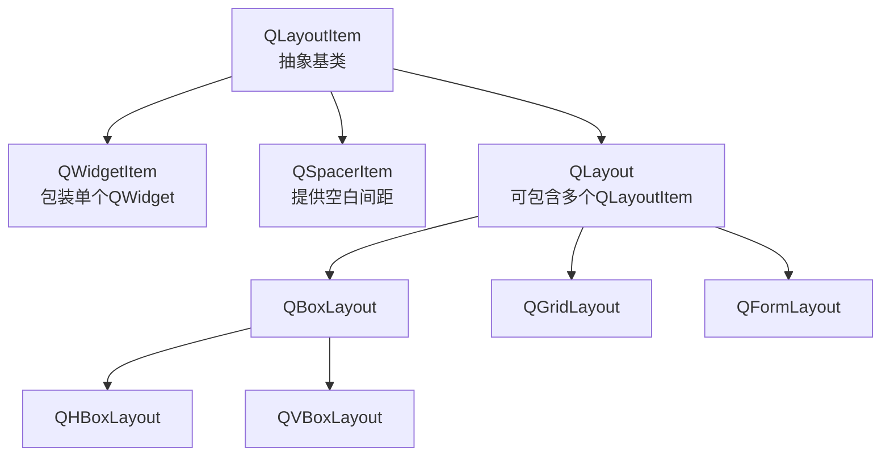
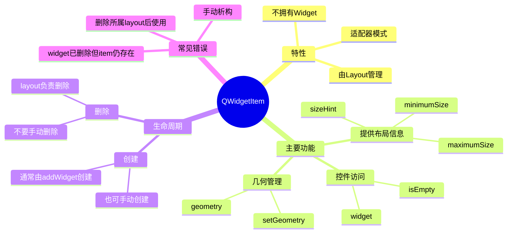
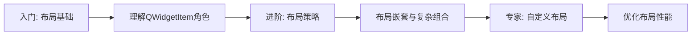
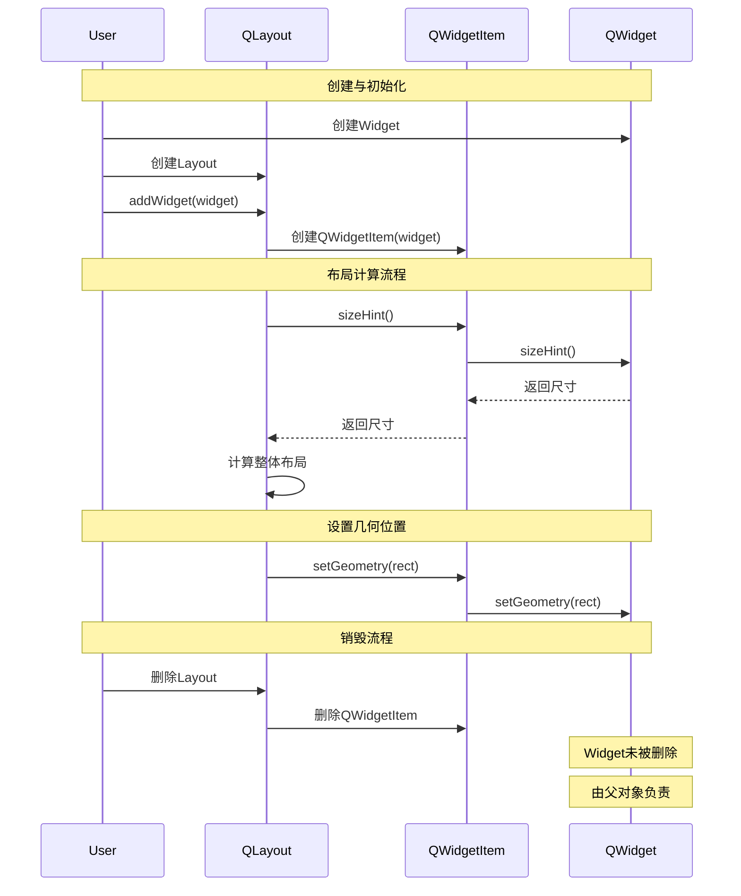
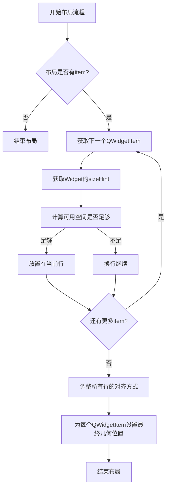

# Qt QWidgetItem 全维度学习指南

<details> <summary><h2>1️⃣ 原理深度解构层</h2></summary>

### ▌三线解析法

#### 运行时行为

- QWidgetItem 是 Qt 布局系统中的一个适配器类，将 QWidget 封装为可被 QLayout 管理的 QLayoutItem
- 生命周期由其所属的 QLayout 控制，当 layout 被销毁时，QWidgetItem 也会被销毁
- 🔒 不拥有其包装的 widget，仅保存指针引用（widget 归其父级 QObject 管理）
- ⚡ sizeHint()、minimumSize() 等方法直接委托到被包装的 widget 上

#### 源码线索

- 头文件位置：`src/widgets/kernel/qlayoutitem.h`
- 实现文件：`src/widgets/kernel/qlayoutitem.cpp`
- 关键派生关系：`QWidgetItem` 继承自 `QLayoutItem`
- 相关类：`QSpacerItem`、`QLayoutItem`、`QLayout`

#### 计算机科学映射

- 🧠 **适配器模式**：QWidgetItem 是典型的适配器(Adapter)设计模式实现，使 QWidget 能够兼容 QLayoutItem 接口
- **组合模式**：QWidgetItem 作为叶节点，与 QLayout（复合节点）共同构成布局树结构
- **代理模式**：大部分功能转发到被包装的 QWidget 对象，不添加额外行为

### ▌对象关系可视化



### ▌内存与所有权关系

```
QLayout (例如QVBoxLayout)
├── QWidgetItem(widget1)  // QWidgetItem由QLayout拥有和管理
├── QWidgetItem(widget2)  // QWidgetItem不拥有widget2
└── QSpacerItem          // QSpacerItem也由QLayout拥有
```

</details> <details> <summary><h2>2️⃣ 代码多维训练场</h2></summary>

### ▌基础层 - 核心API展示

```cpp
// 基础：QWidgetItem通常由Qt内部创建，很少直接使用
// 线程安全性：❗ 仅UI线程安全
QVBoxLayout *layout = new QVBoxLayout;
QPushButton *button = new QPushButton("Click Me");
// 当添加widget到layout时，Qt会自动创建QWidgetItem
layout->addWidget(button);  // 内部创建了QWidgetItem
```

### ▌进阶层 - 场景化代码

```cpp
// 进阶：手动创建和管理QWidgetItem (Qt 5.15+兼容)
#include <QVBoxLayout>
#include <QPushButton>
#include <QLayoutItem>
#include <QWidget>

void CustomLayoutManager::createLayout(QWidget *parentWidget) {
    QVBoxLayout *layout = new QVBoxLayout(parentWidget);
    
    // 创建widget
    QPushButton *button = new QPushButton("Manual Item", parentWidget);
    
    // 手动创建QWidgetItem - 这是不常见的用法
    // 通常布局会在addWidget()时自动创建
    QWidgetItem *item = new QWidgetItem(button);
    
    // 将item添加到布局中
    layout->addItem(item);  // 布局现在拥有item的所有权
    
    // 💀 危险：不要尝试保留QWidgetItem的指针并在布局销毁后使用它
    // this->savedItem = item;  // 会导致悬空指针!
    
    // 正确方法：通过layout接口操作
    QLayoutItem *retrievedItem = layout->itemAt(0);
    if (retrievedItem && retrievedItem->widget()) {
        // 安全地访问widget
    }
}
```

### ▌专家层 - 最佳实践与性能优化

```cpp
// 专家：自定义布局中优化QWidgetItem的使用 (Qt 5.15/6.x 兼容)
#include <QLayout>
#include <QWidgetItem>
#include <QWidget>
#include <QStyle>
#include <QSize>

class OptimizedLayout : public QLayout {
public:
    explicit OptimizedLayout(QWidget *parent = nullptr) : QLayout(parent) {
        setContentsMargins(0, 0, 0, 0);
    }
    
    ~OptimizedLayout() {
        // ⚡ 性能优化：批量删除所有items
        QLayoutItem *item;
        while ((item = takeAt(0))) {
            delete item;  // 删除QWidgetItem，但不会删除widget
        }
    }
    
    void addItem(QLayoutItem *item) override {
        m_items.append(item);
    }
    
    QLayoutItem *itemAt(int index) const override {
        return index >= 0 && index < m_items.size() ? m_items.at(index) : nullptr;
    }
    
    QLayoutItem *takeAt(int index) override {
        return index >= 0 && index < m_items.size() ? m_items.takeAt(index) : nullptr;
    }
    
    int count() const override {
        return m_items.size();
    }
    
    // ⚡ 性能优化：缓存大小计算结果
    QSize sizeHint() const override {
        if (m_cachedSizeHint.isValid() && !m_sizeHintDirty)
            return m_cachedSizeHint;
            
        calculateLayout();
        return m_cachedSizeHint;
    }
    
    void setGeometry(const QRect &rect) override {
        QLayout::setGeometry(rect);
        
        // 为每个QWidgetItem分配空间
        for (int i = 0; i < m_items.count(); ++i) {
            QLayoutItem *item = m_items.at(i);
            QWidget *widget = item->widget();
            if (widget) {
                // 性能检测：标记大于100ms的布局操作
                QElapsedTimer timer;
                timer.start();
                
                // 设置widget几何位置
                QRect itemGeom = calculateItemGeometry(i, rect);
                widget->setGeometry(itemGeom);
                
                if (timer.elapsed() > 100) {
                    qDebug() << "⚡ 性能警告: 设置Widget" << widget->objectName() 
                             << "几何位置耗时" << timer.elapsed() << "ms";
                }
            }
        }
        
        m_sizeHintDirty = false;
    }
    
private:
    QList<QLayoutItem*> m_items;
    mutable QSize m_cachedSizeHint;
    mutable bool m_sizeHintDirty = true;
    
    void calculateLayout() const {
        // 计算布局大小...
        // 在实际应用中这可能是复杂算法
        
        // 保存结果
        m_cachedSizeHint = QSize(200, 200); // 示例值
    }
    
    QRect calculateItemGeometry(int index, const QRect &rect) {
        // 计算每个item的几何位置
        // 这里仅为示例
        return QRect(rect.x(), rect.y() + index * 50, rect.width(), 40);
    }
};
```

### ▌错误案例库

1. **错误：误认为QWidgetItem拥有Widget**
   - 症状：布局被销毁后尝试使用其中的widget导致悬挂指针
   - 原因：QWidgetItem仅存储widget指针，但不拥有widget对象的生命周期
   - 检测：使用Qt调试工具或打开Dangling指针检测
   - 解决：确保widget由合适的父对象拥有，通常是其视觉父控件
2. **错误：手动删除QWidgetItem**
   - 症状：布局渲染错误或崩溃
   - 原因：QWidgetItem应由其所属QLayout管理和删除
   - 检测：Debug模式下的重复释放异常
   - 解决：永远不要手动删除布局拥有的QWidgetItem，使用layout->removeItem()
3. **错误：多次添加同一个QWidgetItem**
   - 症状：布局内出现重复内容或崩溃
   - 原因：QWidgetItem被添加到多个layout或多次添加到同一layout
   - 检测：启用-DQT_LAYOUT_DEBUG检查重复添加警告
   - 解决：确保QWidgetItem仅添加到一个layout且仅添加一次
4. **错误：在QWidgetItem被添加到layout后修改其widget**
   - 症状：布局行为异常，大小计算错误
   - 原因：QWidgetItem创建后不应更改其引用的widget
   - 检测：对比layout实际渲染与预期是否一致
   - 解决：如需更改widget，先从layout中移除旧item，再添加新widget

</details> <details> <summary><h2>3️⃣ 知识拓扑网络</h2></summary>

### ▌三维关联系统

#### 纵向维度：Qt版本演进路线

- **Qt 4**: QWidgetItem最初实现，基本功能已完善
- **Qt 5**: 增强了高DPI支持和布局缓存，影响QWidgetItem的sizeHint计算
- **🔥 Qt 6**: QWidgetItem接口保持稳定，但底层渲染路径变更，受益于Qt 6的图形改进

#### 横向维度：跨模块依赖关系

```
QtCore (QObject, QSize) 
   ↑
QtGui (QPaintEvent, QResizeEvent)
   ↑
QtWidgets (QWidget, QLayoutItem, QWidgetItem, QLayout)
```

#### 深度维度：与其他技术的对比

| 技术对比   | QWidgetItem (Qt)     | HTML DOM元素        | 区别和联系                |
| ---------- | -------------------- | ------------------- | ------------------------- |
| 布局流程   | 明确的测量和布局阶段 | 流式布局自动排列    | Qt需显式管理布局流程      |
| 所有权模型 | 弱引用，不拥有widget | DOM树形结构和所有权 | QWidgetItem仅是引用适配器 |
| 缓存机制   | 可缓存sizeHint       | 浏览器渲染缓存      | 两者都有布局优化机制      |

### ▌版本差异对照表

| 功能/特性 | Qt 5实现                                 | Qt 6替代方案     | 迁移成本 | 向后兼容性         |
| --------- | ---------------------------------------- | ---------------- | -------- | ------------------ |
| 布局引擎  | 传统算法                                 | 改进的布局引擎   | ★☆☆☆☆    | 完全兼容，无需修改 |
| 高DPI支持 | QWidgetItem依赖QWidget的devicePixelRatio | 原生支持缩放     | ★☆☆☆☆    | 兼容，但Qt6更好    |
| 布局效率  | 基本缓存优化                             | 增强的缓存策略   | ★☆☆☆☆    | 无需代码变更       |
| 内存管理  | 常规所有权模型                           | 相同，但内存优化 | ★☆☆☆☆    | 完全兼容           |

</details> <details> <summary><h2>4️⃣ 认知强化体系</h2></summary>

### ▌对比学习表

| 特性         | QWidgetItem            | QSpacerItem  | QLayoutItem  | 推荐场景         |
| ------------ | ---------------------- | ------------ | ------------ | ---------------- |
| 包含元素类型 | QWidget                | 空间占位符   | 抽象基类     | 需添加控件到布局 |
| 大小控制     | 依赖widget的sizeHint   | 显式指定大小 | 取决于派生类 | 已有控件布局     |
| 弹性拉伸     | 使用widget的sizePolicy | 直接支持     | 抽象属性     | 精确控制间距     |
| 可见性控制   | 通过widget->hide()     | 无直接控制   | 取决于派生类 | 动态UI显示/隐藏  |
| 内存管理     | 不拥有widget           | 自包含       | 抽象规则     | 标准Qt界面构建   |

| 特性       | 直接使用QLayout::addWidget | 手动创建QWidgetItem | 使用场景       |
| ---------- | -------------------------- | ------------------- | -------------- |
| 代码简洁度 | ★★★★★                      | ★★☆☆☆               | 普通UI开发     |
| 灵活性     | ★★★☆☆                      | ★★★★★               | 自定义布局实现 |
| 错误风险   | ★☆☆☆☆                      | ★★★★☆               | 根据需求选择   |
| 性能开销   | ★★☆☆☆                      | ★★★☆☆               | 性能无明显差异 |

### ▌记忆助手

- **速查口诀**：
  - "Item引用不拥有，Layout负责全收走"（QWidgetItem不拥有widget，由Layout删除）
  - "Hint来自Widget说，Layout据此来排座"（sizeHint来自被封装的widget）
  - "一Widget一Item配，多次添加必出错"（每个widget只能添加一次到布局）
- **概念思维导图**：



</details> <details> <summary><h2>5️⃣ 工程化实践框架</h2></summary>

### ▌开发阶段指南

#### [设计期]

- 规划widget层次结构和所有权
- 决定布局策略（QWidgetItem通常由布局自动创建）
- 为特殊情况准备自定义布局

#### [编码期]

- QA/QC检查表

  ：

  - ✅ 避免手动创建或管理QWidgetItem（除非开发自定义布局）
  - ✅ 确保每个widget有明确的父对象（避免内存泄漏）
  - ✅ 检查布局嵌套是否合理（过深嵌套会影响性能）
  - ✅ 确保正确设置sizePolicy（影响QWidgetItem的行为）

#### [调试期]

1. 检查布局问题：

   ```cpp
   // 开启布局调试
   qputenv("QT_LAYOUT_DEBUG", "1");
   
   // 打印布局层次
   void dumpLayout(QLayout* layout, int level = 0) {
       QString indent(level * 2, ' ');
       for (int i = 0; i < layout->count(); ++i) {
           QLayoutItem* item = layout->itemAt(i);
           if (QWidget* w = item->widget()) {
               qDebug() << indent << "Widget:" << w->metaObject()->className();
           } else if (QLayout* l = item->layout()) {
               qDebug() << indent << "Layout:" << l->metaObject()->className();
               dumpLayout(l, level + 1);
           } else if (QSpacerItem* s = dynamic_cast<QSpacerItem*>(item)) {
               qDebug() << indent << "Spacer:" << s->sizeHint().width() 
                        << "x" << s->sizeHint().height();
           }
       }
   }
   ```

2. 使用可视化调试工具：

   - Qt Creator的对象层次查看器
   - Qt Debug Inspector (如Qt Visual Studio Tools)

#### [优化期]

- 布局性能优化清单

  ：

  - ⚡ 避免深层嵌套布局（每层都有QWidgetItem开销）
  - ⚡ 大量相似widget考虑使用模型视图代替多个QWidgetItem
  - ⚡ 对变化频繁的布局部分使用缓存策略
  - ⚡ 使用QLayout::activate()仅在需要时触发重新布局

### ▌安全红线清单

- 🔒 **禁止**手动删除由QLayout管理的QWidgetItem
- 🔒 **禁止**在布局计算期间修改widget属性（可能导致无限递归）
- 🔒 **避免**跨线程操作QWidgetItem或其widget（仅UI线程安全）
- 🔒 **禁止**将同一widget添加到多个布局（每个widget只应有一个QWidgetItem）
- 🔒 **避免**过度依赖QWidgetItem细节（应通过QLayout API操作）

</details> <details> <summary><h2>6️⃣ 学习路径导航</h2></summary>

### ▌阶段式进阶地图



#### [入门期]

1. **布局基础**
   - 掌握基本布局管理器（QVBoxLayout, QHBoxLayout等）
   - 理解addWidget()与布局层次结构
   - 熟悉sizePolicy与尺寸控制
2. **QWidgetItem角色**
   - 明确QLayout、QLayoutItem和QWidgetItem的关系
   - 理解QWidgetItem是适配器而非容器
   - 学习布局项的共同接口

#### [进阶期]

1. **布局策略深入**
   - 掌握弹性系数（stretch）与空间分配规则
   - 理解最小/最大/首选尺寸在布局中的作用
   - 学习布局边距与间距控制
2. **布局嵌套与复合**
   - 掌握多层布局组合技巧
   - 学习布局内添加子布局的方法
   - 理解布局更新流程与优化

#### [专家期]

1. **自定义布局开发**
   - 实现自定义QLayout子类
   - 手动管理QWidgetItem实例
   - 理解布局缓存与失效机制
2. **布局性能优化**
   - 布局计算优化与缓存策略
   - 布局事件处理优化
   - 大型界面布局结构设计

### ▌推荐学习资源

1. **官方文档**:
   - [Qt Layout Management](https://doc.qt.io/qt-6/layout.html)
   - [QLayoutItem Class](https://doc.qt.io/qt-6/qlayoutitem.html)
   - [QLayout Class](https://doc.qt.io/qt-6/qlayout.html)
2. **进阶书籍**:
   - 《Advanced Qt Programming》- Mark Summerfield
   - 《C++ GUI Programming with Qt》- Jasmin Blanchette
3. **实践教程**:
   - Qt Example: Custom Layout
   - Qt Example: Flow Layout

</details> <details> <summary><h2>7️⃣ 问题诊断与解决框架</h2></summary>

### ▌系统化调试方法

#### 症状分类表

| 症状类型             | 可能原因                    | 诊断工具         | 解决方案               |
| -------------------- | --------------------------- | ---------------- | ---------------------- |
| 控件未显示           | widget未添加到布局          | 对象树检查       | 确认addWidget调用      |
| 布局中控件尺寸不正确 | sizeHint/sizePolicy设置错误 | 布局调试环境变量 | 检查widget的尺寸策略   |
| 应用崩溃（布局相关） | 删除仍在布局中的widget      | Dr. Mingw/调试器 | 始终先从布局移除widget |
| 内存泄漏             | 布局未删除其QWidgetItem     | Valgrind/ASAN    | 确保正确删除布局       |
| 布局更新失败         | 布局失效但未更新            | 比较几何信息     | 调用layout()->update() |

#### 调试指令集

```cpp
// 布局调试环境变量设置
// 在main()前添加:
qputenv("QT_LAYOUT_DEBUG", "1");         // 布局问题跟踪
qputenv("QT_FATAL_WARNINGS", "1");       // 布局警告变致命错误

// 检查widget是否在布局中
bool isWidgetInLayout(QWidget *widget) {
    if (!widget || !widget->parentWidget())
        return false;
        
    QList<QLayout*> layouts = widget->parentWidget()->findChildren<QLayout*>();
    for (QLayout *layout : layouts) {
        for (int i = 0; i < layout->count(); ++i) {
            if (layout->itemAt(i)->widget() == widget)
                return true;
        }
    }
    return false;
}

// 打印布局中所有QWidgetItem信息
void printLayoutItems(QLayout *layout, int level = 0) {
    QString indent(level * 2, ' ');
    for (int i = 0; i < layout->count(); ++i) {
        QLayoutItem *item = layout->itemAt(i);
        if (QWidget *w = item->widget()) {
            // 打印QWidgetItem信息
            qDebug() << indent << "QWidgetItem:" << i
                     << "widget:" << w->objectName()
                     << "visibility:" << w->isVisible()
                     << "sizeHint:" << w->sizeHint()
                     << "geometry:" << item->geometry();
        } else if (QLayout *l = item->layout()) {
            qDebug() << indent << "Layout:" << l->objectName();
            printLayoutItems(l, level + 1);
        }
    }
}
```

### ▌常见问题解决模板

#### 问题1: 控件在布局中不可见

- **症状**: 控件已添加到布局但未显示

- 原因

  :

  1. 控件可能被设置为隐藏(hide())
  2. 控件sizeHint返回无效尺寸
  3. 布局层次错误

- 解决步骤

  :

  1. 检查widget->isVisible()和isHidden()
  2. 验证widget的minimumSize和sizeHint是否有效
  3. 确认布局层次，查看父级是否正确显示

- 预防措施

  :

  1. 设计时规划清晰的控件层次
  2. 对新创建的控件始终设置合理的sizePolicy和minimumSize

#### 问题2: 删除布局后程序崩溃

- **症状**: 删除QLayout后，程序在后续操作时崩溃

- 原因

  :

  1. 尝试访问已被布局删除的QWidgetItem
  2. 直接使用已被布局删除的QLayoutItem指针

- 解决步骤

  :

  1. 追踪崩溃堆栈，确认是否有悬空指针使用
  2. 确保在布局删除前保存所需widget的有效引用
  3. 检查删除布局后是否有对布局items的引用

- 预防措施

  :

  1. 不要保存QLayoutItem/QWidgetItem指针供以后使用
  2. 使用QLayout::itemAt()在需要时获取item
  3. 遵循所有权规则：布局拥有其items

#### 问题3: 布局计算导致应用性能下降

- **症状**: UI操作卡顿，尤其在调整窗口大小时

- 原因

  :

  1. 复杂嵌套布局导致级联重新计算
  2. Widget的sizeHint()实现效率低下
  3. 频繁的布局更新操作

- 解决步骤

  :

  1. 使用QElapsedTimer识别耗时布局操作
  2. 优化widget的sizeHint()实现
  3. 减少布局嵌套层次
  4. 考虑缓存策略

- 预防措施

  :

  1. 设计时避免不必要的布局嵌套
  2. 批量添加控件，减少布局重计算次数
  3. 对于复杂UI，考虑使用QScrollArea限制同时可见控件数量

</details> <details> <summary><h2>8️⃣ 设计模式与Qt实现映射</h2></summary>

### ▌框架设计思想解析

| 设计模式   | Qt实现机制               | 源码实现关键点                                           | 应用场景                   |
| ---------- | ------------------------ | -------------------------------------------------------- | -------------------------- |
| 适配器模式 | QWidgetItem              | 将QWidget适配为QLayoutItem接口                           | 使不兼容的接口协同工作     |
| 组合模式   | QLayoutItem层次          | QLayoutItem作为抽象基类，QWidgetItem/QLayout等为具体实现 | 统一处理单个对象和对象组合 |
| 代理模式   | QWidgetItem委托给QWidget | 大多数方法调用转发给被包装的widget                       | 在访问对象前后添加行为     |
| 策略模式   | QLayout与布局算法        | 不同布局类实现不同的布局算法                             | 算法家族封装               |
| 工厂方法   | layout->addWidget()      | 由layout创建和管理QWidgetItem                            | 对象创建与使用分离         |

### ▌Qt布局系统架构原则

#### 核心设计理念

- **🧠 组合优于继承**: Qt布局系统使用组合模式，QLayout包含QLayoutItem而非继承
- **🧠 职责分离**: 布局算法(QLayout子类)与布局项(QLayoutItem子类)分离
- **🧠 访问者模式**: QLayout遍历其QLayoutItem集合进行布局计算
- **🧠 延迟更新**: 布局系统使用延迟更新机制，通过event queue管理布局更新

#### 与其他GUI框架对比

| 特性         | Qt布局系统           | WPF/XAML (微软)  | HTML/CSS (Web)      | JavaFX (Oracle)          |
| ------------ | -------------------- | ---------------- | ------------------- | ------------------------ |
| 布局计算时机 | 请求驱动，延迟更新   | 属性变更触发     | 浏览器渲染周期      | 属性绑定系统             |
| 主要布局类型 | 盒式、网格、表单     | 面板、网格、容器 | Flexbox、Grid、Flow | Pane、GridPane、FlowPane |
| 尺寸计算模型 | sizeHint、Policy结合 | 测量和排列双阶段 | 盒模型、Flexbox算法 | 首选/最小/最大尺寸       |
| 扩展性       | 自定义QLayout        | 自定义Panel      | CSS自定义布局       | 自定义Region             |
| 性能特点     | 树形结构，缓存支持   | 依赖属性系统     | DOM渲染优化         | 场景图形系统             |

#### Qt布局系统约束与自由度

- **约束**:
  - 所有布局操作必须在UI线程执行
  - 布局修改会触发窗口重绘
  - 布局项添加到布局后所有权转移给布局
- **自由度**:
  - 可创建任意复杂度的自定义布局
  - 支持动态添加/移除控件
  - 可精确控制尺寸策略和空间分配
  - 支持嵌套布局创建复杂界面

</details> <details> <summary><h2>9️⃣ 交互式学习实验</h2></summary>

### ▌布局生命周期可视化



### ▌布局内存与对象关系结构图

以下是一个创建了包含QWidgetItem的布局时的内存结构图：

```
内存结构图
+---------------------+
| QMainWindow         |    对象树
|                     |    MainWindow (QMainWindow)
| +-----------------+ |    ├── centralWidget (QWidget)
| | QWidget         | |    │   ├── layout (QVBoxLayout)
| | (centralWidget) | |    │   ├── button1 (QPushButton)
| |                 | |    │   └── button2 (QPushButton)
| | +-------------+ | |
| | | QVBoxLayout | | |    内存所有权
| | | (layout)    | | |    * QMainWindow 拥有 centralWidget
| | |             | | |    * centralWidget 拥有 layout
| | | 包含:       | | |    * centralWidget 拥有 button1, button2
| | | QWidgetItem | | |    * layout 拥有 QWidgetItem对象
| | | QWidgetItem | | |    * QWidgetItem 不拥有 button1, button2
| | +-------------+ | |
| |                 | |
| | +-------------+ | |
| | | QPushButton | | |
| | | (button1)   | | |
| | +-------------+ | |
| |                 | |
| | +-------------+ | |
| | | QPushButton | | |
| | | (button2)   | | |
| | +-------------+ | |
| +-----------------+ |
+---------------------+
```

### ▌QWidgetItem在自定义布局中的工作流程

下面是一个自定义流式布局(FlowLayout)中QWidgetItem的工作流程：



</details>

## 🎯 YAML元数据

```yaml
---
title: Qt QWidgetItem全维度学习指南
tags:
  - Qt
  - 布局系统
  - QWidgetItem
  - QLayoutItem
  - QLayout
related:
  - QLayout
  - QSpacerItem
  - QHBoxLayout
  - QVBoxLayout
  - QGridLayout
  - QFormLayout
complexity: 中级
version_support: Qt 5.0+, Qt 6.0+
---
```

这份学习指南覆盖了QWidgetItem的所有核心方面，从深层原理到实际应用，以及常见问题和最佳实践。QWidgetItem是Qt布局系统中的关键组件，虽然它通常由Qt内部创建和管理，但理解它的工作原理对掌握Qt布局系统非常重要。如果您有任何特定方面需要我进一步展开或有其他Qt相关的主题需要学习，请随时告诉我！