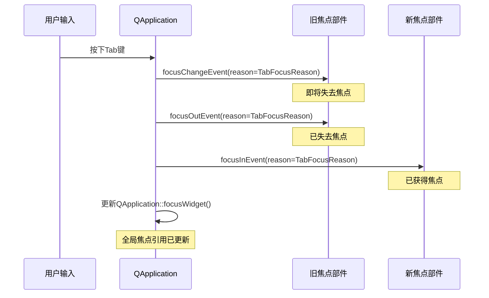
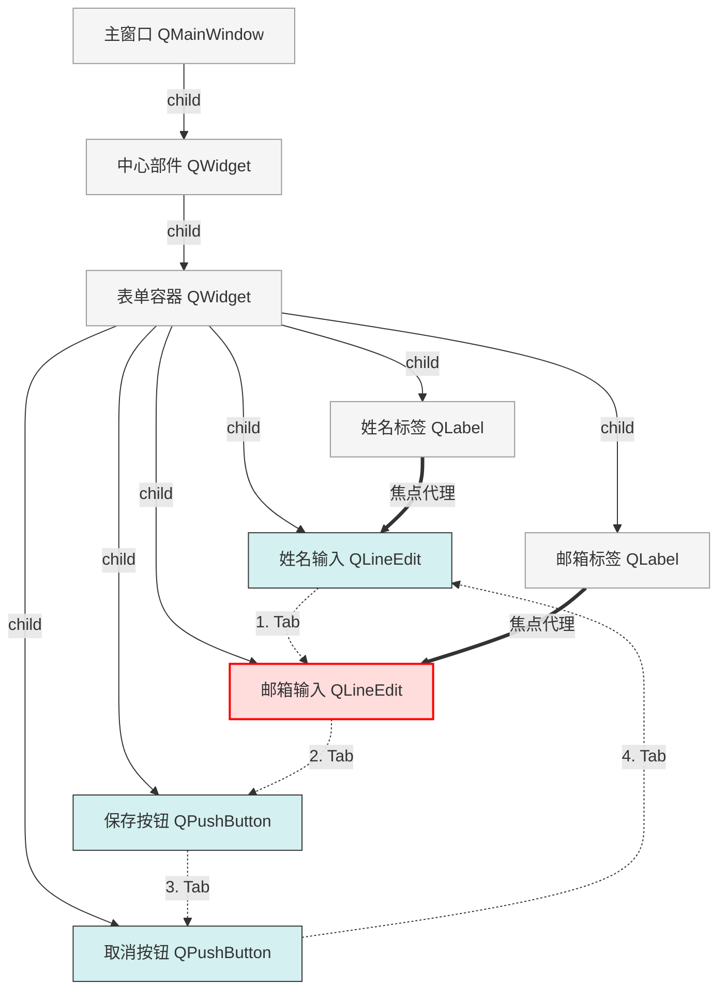

# 📝 Qt焦点系统全维度学习笔记

<details> <summary>🧠 原理深度解构层</summary>

## 原理深度解构层

### ▌三线解析法

#### 运行时行为

- **焦点传递链路**：当用户按下Tab键时，Qt会查询当前焦点部件的`nextInFocusChain()`确定下一个焦点部件，然后触发焦点转移过程：先向旧部件发送 `focusChangeEvent`，再发送`focusOutEvent`，最后向新部件发送`focusInEvent`
- **部件焦点状态**：部件的焦点状态由`QWidget::hasFocus()`管理，并通过`focusInEvent()`和`focusOutEvent()`通知部件焦点变化
- **焦点代理委派**：焦点代理通过指针重定向实现，当一个部件设置了焦点代理，所有焦点相关操作都会重定向到代理部件上

#### 源码线索

- **QFocusEvent**：定义在`qevent.h`中，包含焦点变化原因`Qt::FocusReason`
- **焦点链实现**：核心实现在`QWidget`私有类`QWidgetPrivate`（定义于`qwidget_p.h`）中维护链表结构
- **QApplicationPrivate**：在`qapplication_p.h`中，维护全局的活动焦点窗口和焦点部件

#### 计算机科学映射

- **部件焦点链**：实现为双向循环链表，允许前向和后向遍历（Tab和Shift+Tab）
- **状态转移模型**：焦点变化遵循有限状态机模型，通过事件触发状态转移
- **委托模式**：焦点代理（Focus Proxy）实现了委托设计模式，允许委托部件将焦点操作转发给代理部件

### ▌对象关系可视化

```
QWidget (基类)
├── focusPolicy: Qt::FocusPolicy (焦点策略枚举)
├── hasFocus(): bool (焦点状态)
│   
QFocusFrame (焦点框视觉组件)
├── widget(): QWidget* (关联的部件)
│   
焦点链路关系 (循环链表结构)
Widget1 ──→ Widget2 ──→ Widget3 ──→ Widget4
  ↑                                   │
  └───────────────────────────────────┘

焦点代理关系
Label ──→ [focusProxy] ──→ LineEdit (实际接收焦点)
```

</details> <details> <summary>💻 代码多维训练场</summary>

## 代码多维训练场

### ▌基础层级：核心API演示

```cpp
// 基础焦点链演示
QWidget *mainWidget = new QWidget();
QPushButton *button1 = new QPushButton("Button 1", mainWidget);
QPushButton *button2 = new QPushButton("Button 2", mainWidget);
QLineEdit *edit = new QLineEdit(mainWidget);

// 设置自定义焦点顺序：button1 -> edit -> button2
QWidget::setTabOrder(button1, edit);  // 🔒 线程安全：必须在UI线程中调用
QWidget::setTabOrder(edit, button2);  // 默认是按创建顺序构建焦点链
```

### ▌进阶层级：焦点代理与自定义控制

```cpp
// 进阶：焦点代理与自定义焦点框
class CustomWidget : public QWidget {
public:
    CustomWidget(QWidget *parent = nullptr) : QWidget(parent) {
        // 创建内部控件
        m_edit = new QLineEdit(this);
        m_label = new QLabel("Focus Label:", this);
        
        // 设置焦点代理 - 标签获得焦点时会自动转移到编辑框
        m_label->setFocusPolicy(Qt::StrongFocus);  // 标签本身可以获得焦点
        m_label->setFocusProxy(m_edit);  // 但焦点会被代理到编辑框
        
        // 创建自定义焦点框
        m_focusFrame = new QFocusFrame(this);
        m_focusFrame->setWidget(m_edit);  // 关联到编辑框
        
        // 布局
        QHBoxLayout *layout = new QHBoxLayout(this);
        layout->addWidget(m_label);
        layout->addWidget(m_edit);
    }

protected:
    // Qt6兼容：在Qt6中这个函数的行为略有变化
    bool focusNextPrevChild(bool next) override {
        // 自定义焦点循环逻辑
        if (m_edit->hasFocus() && next) {
            // 自定义下一个焦点控件行为
            return QWidget::focusNextPrevChild(next);
        }
        return QWidget::focusNextPrevChild(next);
    }

private:
    QLineEdit *m_edit;
    QLabel *m_label;
    QFocusFrame *m_focusFrame;
};
```

### ▌专家层级：焦点事件与优化处理

```cpp
class OptimizedFocusWidget : public QWidget {
public:
    OptimizedFocusWidget(QWidget *parent = nullptr) : QWidget(parent) {
        setFocusPolicy(Qt::StrongFocus);  // 启用所有焦点获取方式
        
        // 创建多个子控件
        for (int i = 0; i < 5; ++i) {
            auto *button = new QPushButton(QString("Button %1").arg(i), this);
            button->setObjectName(QString("button%1").arg(i));
            m_childWidgets.append(button);
            
            // 记录焦点遍历的顺序
            if (i > 0) {
                QWidget::setTabOrder(m_childWidgets[i-1], button);
            }
            
            // 连接焦点变化信号，用于性能分析
            connect(button, &QPushButton::clicked, this, [this, i]() {
                // 性能优化: 避免不必要的焦点切换
                if (!m_childWidgets[i]->hasFocus()) {
                    m_childWidgets[i]->setFocus();
                }
            });
        }
        
        // 布局
        QVBoxLayout *layout = new QVBoxLayout(this);
        for (auto *widget : m_childWidgets) {
            layout->addWidget(widget);
        }
        
        // 创建自定义焦点跟踪框架
        m_customFocusFrame = new QFocusFrame(this);
        m_currentFocusedWidget = nullptr;
        
        // 安装事件过滤器以跟踪焦点变化
        qApp->installEventFilter(this);
    }
    
protected:
    bool eventFilter(QObject *watched, QEvent *event) override {
        // 跟踪应用程序范围内的焦点变化
        if (event->type() == QEvent::FocusIn) {
            QWidget *widget = qobject_cast<QWidget*>(watched);
            if (widget && m_childWidgets.contains(widget)) {
                // 更新焦点框位置
                updateFocusFramePosition(widget);
                
                // 记录性能数据: 焦点变化的时间戳
                m_focusChangeTimestamps.append(QDateTime::currentMSecsSinceEpoch());
                
                // 如果焦点变化过于频繁，可能导致性能问题
                if (m_focusChangeTimestamps.size() > 10) {
                    m_focusChangeTimestamps.removeFirst();
                    
                    // 计算平均焦点变化频率
                    qint64 duration = m_focusChangeTimestamps.last() - 
                                     m_focusChangeTimestamps.first();
                    double frequency = m_focusChangeTimestamps.size() / 
                                     (duration / 1000.0);
                    
                    // 如果焦点变化过于频繁，记录警告
                    if (frequency > 5.0) { // 每秒5次以上
                        qWarning() << "⚡ Focus changes too frequent:" << frequency 
                                  << "per second, may cause performance issues";
                    }
                }
            }
        }
        return QWidget::eventFilter(watched, event);
    }
    
    // 自定义Tab键导航逻辑
    bool focusNextPrevChild(bool next) override {
        // 🧠 记住当前焦点控件
        QWidget *currentFocus = QApplication::focusWidget();
        
        // 找到当前焦点控件在我们列表中的位置
        int currentIndex = -1;
        for (int i = 0; i < m_childWidgets.size(); ++i) {
            if (m_childWidgets[i] == currentFocus) {
                currentIndex = i;
                break;
            }
        }
        
        // 如果找到当前焦点控件，自定义下一个焦点控件
        if (currentIndex != -1) {
            int nextIndex;
            if (next) {
                nextIndex = (currentIndex + 1) % m_childWidgets.size();
            } else {
                nextIndex = (currentIndex - 1 + m_childWidgets.size()) % m_childWidgets.size();
            }
            
            // 设置下一个焦点控件
            m_childWidgets[nextIndex]->setFocus();
            updateFocusFramePosition(m_childWidgets[nextIndex]);
            return true;
        }
        
        // 默认行为
        return QWidget::focusNextPrevChild(next);
    }
    
    void focusInEvent(QFocusEvent *event) override {
        // 调试日志，记录焦点获取原因
        qDebug() << "Widget" << objectName() << "got focus, reason:" 
                << focusReasonToString(event->reason());
        
        // 将焦点传递给第一个子控件（如果有）
        if (!m_childWidgets.isEmpty()) {
            m_childWidgets.first()->setFocus(Qt::OtherFocusReason);
        }
        
        QWidget::focusInEvent(event);
    }
    
private:
    void updateFocusFramePosition(QWidget *widget) {
        if (m_currentFocusedWidget != widget) {
            m_currentFocusedWidget = widget;
            m_customFocusFrame->setWidget(widget);
        }
    }
    
    // 调试辅助：将焦点原因枚举转换为字符串
    QString focusReasonToString(Qt::FocusReason reason) {
        switch (reason) {
            case Qt::MouseFocusReason: return "Mouse";
            case Qt::TabFocusReason: return "Tab";
            case Qt::BacktabFocusReason: return "Backtab";
            case Qt::ActiveWindowFocusReason: return "ActiveWindow";
            case Qt::PopupFocusReason: return "Popup";
            case Qt::ShortcutFocusReason: return "Shortcut";
            case Qt::MenuBarFocusReason: return "MenuBar";
            case Qt::OtherFocusReason: return "Other";
            case Qt::NoFocusReason: return "NoFocus";
            default: return "Unknown";
        }
    }
    
    QList<QPushButton*> m_childWidgets;
    QFocusFrame *m_customFocusFrame;
    QWidget *m_currentFocusedWidget;
    QList<qint64> m_focusChangeTimestamps; // 用于性能分析
};
```

### ▌错误案例库

```cpp
// 🔥 错误1: 焦点代理循环引用导致死锁
void setupCircularFocusProxy() {
    QLineEdit *edit1 = new QLineEdit();
    QLineEdit *edit2 = new QLineEdit();
    
    // 💀 严重错误：创建焦点代理循环引用
    edit1->setFocusProxy(edit2);
    edit2->setFocusProxy(edit1);  // 会导致焦点无法正确传递
    
    // 症状：Tab无法正常工作，焦点被锁在这两个控件之间
    // 解决方案：确保焦点代理是单向的，不形成循环
}

// 🔥 错误2: 在非UI线程中修改焦点
void wrongThreadFocusChange() {
    QLineEdit *edit = new QLineEdit();
    
    // 💀 错误：在后台线程中修改UI焦点
    QThread *workerThread = new QThread();
    QObject::connect(workerThread, &QThread::started, [edit]() {
        edit->setFocus();  // 🔒 线程安全问题：在非UI线程修改焦点
    });
    workerThread->start();
    
    // 症状：应用程序不稳定，可能崩溃
    // 解决方案：使用信号槽机制，在UI线程中设置焦点
    // QMetaObject::invokeMethod(edit, "setFocus", Qt::QueuedConnection);
}

// 🔥 错误3: QFocusFrame使用后控件被删除
void dangleFocusFrameUse() {
    QWidget *containerWidget = new QWidget();
    QLineEdit *edit = new QLineEdit(containerWidget);
    
    // 创建焦点框
    QFocusFrame *focusFrame = new QFocusFrame(containerWidget);
    focusFrame->setWidget(edit);
    
    // 💀 错误：删除了正被QFocusFrame引用的控件
    delete edit;  // edit被删除，但focusFrame仍然引用它
    
    // 此时focusFrame包含悬空指针，可能导致崩溃
    
    // 症状：应用程序在访问焦点框时崩溃
    // 解决方案：在删除控件前，先重置焦点框引用
    // focusFrame->setWidget(nullptr);
}
```

</details> <details> <summary>🌐 知识拓扑网络</summary>

## 知识拓扑网络

### ▌三维关联系统

```
纵向维度：焦点系统版本演进
Qt4 → Qt5 → Qt6
 │      │      │
 ├──────┼──────┤ focusNextPrevChild() API变更
 │      │      │ QWidget::focusNextPrevChild()在Qt6中行为略有调整
 │      │      │
 ├──────┼──────┤ 焦点策略枚举变化
 │      │      │ Qt::TabFocus和Qt::ClickFocus在不同版本解释不同
 │      │      │
 └──────┴──────┘

横向维度：焦点相关模块交互
QtCore ←──────→ QtWidgets ←──────→ QtGui
 │               │                │
事件系统         焦点链管理        焦点视觉效果
QEvent          QWidget系列       QPalette
FocusEvent      QFocusFrame      样式系统

深度维度：与现代UI框架对比
Qt焦点系统 ←──→ Web焦点 (document.activeElement)
   │             │
   │             ├── 区别：Web使用DOM树线性遍历
   │             └── 相似：都支持Tab导航和焦点样式
   │
   └────────→ Qt Quick焦点
               │
               ├── 使用activeFocus属性替代hasFocus()
               └── FocusScope组件用于焦点范围控制
```

### ▌版本差异对照表

| 功能         | Qt5实现                          | Qt6替代方案                          | 迁移成本 | 向后兼容性   |
| ------------ | -------------------------------- | ------------------------------------ | -------- | ------------ |
| 焦点链自定义 | focusNextPrevChild()<br>返回bool | focusNextPrevChild()<br>行为略有变化 | ★☆☆☆☆    | 大部分兼容   |
| 焦点原因枚举 | Qt::FocusReason<br>9个枚举值     | Qt::FocusReason<br>增加了新枚举值    | ★☆☆☆☆    | 完全兼容     |
| 焦点代理     | setFocusProxy()                  | 相同API                              | ★☆☆☆☆    | 完全兼容     |
| 焦点框样式   | QFocusFrame                      | QFocusFrame + QStyle                 | ★★☆☆☆    | 样式系统变化 |
| 焦点策略检查 | testAttribute()<br>内部实现      | testAttribute()<br>某些内部实现变化  | ★★☆☆☆    | 需小心处理   |

</details> <details> <summary>🧠 认知强化体系</summary>

## 认知强化体系

### ▌对比学习表

| 特性         | QWidget焦点系统          | Qt Quick焦点系统 | Web焦点系统      | 推荐场景     |
| ------------ | ------------------------ | ---------------- | ---------------- | ------------ |
| 焦点可视化   | QFocusFrame + 样式系统   | 活动焦点高亮     | outline + :focus | 传统桌面应用 |
| 焦点链自定义 | setTabOrder() + 重写方法 | FocusScope嵌套   | tabindex属性     | 复杂表单     |
| 键盘导航     | ★★★★★                    | ★★★☆☆            | ★★☆☆☆            | 无鼠标操作   |
| 焦点代理     | ★★★★★                    | ★★★☆☆            | ★☆☆☆☆            | 复合控件     |
| 实现复杂度   | ★★★☆☆                    | ★★☆☆☆            | ★☆☆☆☆            | 功能优先     |

### ▌焦点系统思维导图

```
Qt焦点系统
├── 核心概念
│   ├── 焦点链 (Tab顺序)
│   │   ├── 自动生成的默认顺序
│   │   └── setTabOrder()自定义顺序
│   ├── 焦点策略 (FocusPolicy)
│   │   ├── Qt::TabFocus - 只接受Tab键焦点
│   │   ├── Qt::ClickFocus - 只接受鼠标点击焦点
│   │   ├── Qt::StrongFocus - 接受所有焦点
│   │   ├── Qt::WheelFocus - 包含鼠标滚轮
│   │   └── Qt::NoFocus - 禁止获取焦点
│   └── 焦点代理 (FocusProxy)
│       ├── 一对一代理关系
│       └── 委托设计模式实现
├── 焦点事件流
│   ├── focusInEvent
│   ├── focusOutEvent
│   └── focusChangeEvent
├── QFocusFrame类
│   ├── 焦点可视化
│   └── 与部件关联
└── 高级技术
    ├── 自定义焦点循环
    ├── 焦点策略动态调整
    └── 焦点链调试技术
```

### ▌记忆助手

**焦点系统速查口诀**：

- "焦点链，Tab顺序，设置代理放首位"
- "策略强，全接收；策略无，永不获"
- "先入先焦，后出慢转，焦点传递有规律"
- "代理委托，一呼百应，不可循环成死锁"

</details> <details> <summary>⚙️ 工程化实践框架</summary>

## 工程化实践框架

### ▌焦点系统开发阶段指南

```
[设计期]
  1. 焦点链规划
     - 确定Tab键的逻辑导航路径
     - 设计焦点循环闭环图
     - 决定哪些控件需要焦点，哪些不需要

  2. 焦点代理设计
     - 复合控件的焦点委托关系设计
     - 避免形成循环代理链

  3. 焦点视觉反馈设计
     - 决定使用QFocusFrame还是自定义样式
     - 设计不同状态下的焦点视觉效果

[编码期] 
  1. 焦点链实现检查清单：
     □ 使用setTabOrder()设置正确的Tab顺序
     □ 为每个控件设置合适的焦点策略
     □ 实现焦点代理关系

  2. 焦点事件处理：
     □ 处理焦点进入/离开事件
     □ 在复合控件中正确传递焦点

  3. 焦点视觉效果：
     □ 实现QFocusFrame或自定义样式
     □ 确保焦点状态有清晰的视觉反馈

[调试期]
  1. 焦点链验证：
     - 使用Tab键检查所有控件的焦点顺序
     - 验证Shift+Tab反向焦点链
     
  2. 焦点调试工具：
     - 使用qDebug() << QApplication::focusWidget()->objectName()
     - 打印焦点事件sequence验证顺序
     
  3. 焦点可视化调试：
     - 临时加强焦点框样式使其更明显
     - 将焦点控件背景改为特殊颜色以便观察

[优化期]
  1. 焦点链性能优化：
     - 减少不必要的焦点变化事件
     - 避免焦点事件处理中的耗时操作
     
  2. 用户体验优化：
     - 确保焦点顺序符合用户直觉
     - 为复杂表单提供快捷键焦点跳转
```

### ▌焦点系统安全红线清单

```
[严禁行为]
❌ 在非UI线程中修改焦点状态
❌ 创建焦点代理循环引用
❌ 在焦点事件处理器中执行耗时操作（>16ms）
❌ 删除仍被QFocusFrame引用的部件
❌ 通过修改内部焦点链结构更改Tab顺序（应使用setTabOrder）

[最佳实践]
✅ 为所有可交互控件设置合适的焦点策略
✅ 在复合控件中正确实现焦点代理
✅ 为自定义控件实现正确的焦点事件处理
✅ 在焦点事件中使用reason()来区分焦点获取原因
✅ 保持UI响应性，避免焦点切换时的UI卡顿
```

</details> <details> <summary>🗺️ 学习路径导航</summary>

## 学习路径导航

### ▌焦点系统阶段式进阶地图

```
[入门期]
  1. 基础焦点概念
     - 理解焦点的基本概念和作用
     - 掌握Tab键和方向键导航
     - 学习焦点策略（FocusPolicy）枚举值
  
  2. 基本焦点API
     - hasFocus(), setFocus()
     - focusWidget(), focusPolicy()
     - 焦点策略设置和读取

  3. 焦点事件基础
     - focusInEvent(), focusOutEvent()
     - 焦点原因（FocusReason）枚举理解

[进阶期]
  1. 焦点链管理
     - nextInFocusChain(), previousInFocusChain()
     - setTabOrder()自定义Tab顺序
     - 焦点链调试技术
  
  2. 焦点代理模式
     - setFocusProxy()实现控件焦点委托
     - 焦点代理在复合控件中的应用
     - 处理焦点代理链中的事件传递
  
  3. 焦点框架定制
     - QFocusFrame基本使用
     - 自定义焦点视觉效果
     - 动态焦点跟踪技术

[专家期]
  1. 自定义焦点循环
     - 重写focusNextPrevChild()
     - 实现复杂表单的分组焦点导航
     - 处理特殊控件的焦点行为（如文本编辑器）
  
  2. 焦点性能优化
     - 减少不必要的焦点变化触发
     - 优化焦点事件处理
     - 通过事件过滤器实现全局焦点控制
  
  3. 高级焦点技术
     - 键盘无障碍访问
     - 焦点链与快捷键的集成
     - 在不同平台上一致的焦点体验
```

</details> <details> <summary>🔍 问题诊断与解决框架</summary>

## 问题诊断与解决框架

### ▌焦点系统常见问题解决模板

#### 问题1：Tab键无法在控件间移动焦点

**症状**：

- 按Tab键后焦点没有移动到下一个控件
- 某些控件被跳过不会获得焦点

**原因**：

1. 控件的焦点策略设置不正确（如Qt::NoFocus）
2. 焦点链断裂或顺序不正确
3. 焦点代理配置错误导致焦点传递异常

**诊断步骤**：

```cpp
// 1. 检查控件焦点策略
qDebug() << "Focus Policy:" << widget->focusPolicy();

// 2. 验证焦点链完整性
QWidget *current = someWidget;
QWidget *next = current->nextInFocusChain();
while (next != current) {
    qDebug() << "Focus chain:" << next->objectName();
    next = next->nextInFocusChain();
}

// 3. 检查焦点代理
if (widget->focusProxy()) {
    qDebug() << "Has focus proxy:" << widget->focusProxy()->objectName();
}
```

**解决方案**：

1. 确保所有需要Tab焦点的控件设置了Qt::TabFocus或Qt::StrongFocus
2. 使用QWidget::setTabOrder()修复焦点链顺序
3. 检查并修正焦点代理设置，避免循环引用

**预防措施**：

- 制定焦点策略一致性规范
- 在UI测试中加入Tab键导航测试用例
- 使用工具函数验证焦点链完整性

#### 问题2：QFocusFrame不跟随焦点控件移动

**症状**：

- 自定义的焦点框不随焦点变化而移动
- 焦点框停留在最初设置的控件上

**原因**：

1. 未实现焦点变化事件的监听机制
2. 焦点框未随焦点控件更新

**诊断步骤**：

```cpp
// 安装事件过滤器监控焦点变化
class FocusMonitor : public QObject {
protected:
    bool eventFilter(QObject *obj, QEvent *event) override {
        if (event->type() == QEvent::FocusIn) {
            qDebug() << "Focus in:" << obj->objectName();
        }
        return false;
    }
};

// 使用方式
FocusMonitor *monitor = new FocusMonitor(this);
qApp->installEventFilter(monitor);
```

**解决方案**：

```cpp
// 在应用程序层面跟踪焦点变化
void MainWindow::setupFocusTracking() {
    m_focusFrame = new QFocusFrame(this);
    
    // 使用事件过滤器跟踪焦点变化
    qApp->installEventFilter(this);
}

bool MainWindow::eventFilter(QObject *obj, QEvent *event) {
    if (event->type() == QEvent::FocusIn) {
        QWidget *widget = qobject_cast<QWidget*>(obj);
        if (widget && widget->window() == this) {
            // 焦点框跟随焦点移动
            m_focusFrame->setWidget(widget);
        }
    }
    return QMainWindow::eventFilter(obj, event);
}
```

**预防措施**：

- 创建可复用的焦点跟踪组件
- 使用更高级的框架对焦点变化进行管理
- 考虑使用样式表实现焦点视觉效果而非QFocusFrame

#### 问题3：复合控件的焦点行为不正确

**症状**：

- 复合控件内的子控件焦点顺序混乱
- 焦点在进入复合控件时行为异常

**原因**：

1. 未正确设置子控件之间的Tab顺序
2. 未处理复合控件的焦点进入/离开事件
3. 焦点代理配置不正确

**诊断步骤**：

```cpp
// 打印复合控件内的所有子控件及其焦点策略
void debugCompositeWidgetFocus(QWidget *composite) {
    qDebug() << "Composite widget:" << composite->objectName();
    QList<QWidget*> children = composite->findChildren<QWidget*>();
    for (QWidget *child : children) {
        qDebug() << "Child:" << child->objectName()
                 << "FocusPolicy:" << child->focusPolicy()
                 << "FocusProxy:" << (child->focusProxy() ? 
                                     child->focusProxy()->objectName() : "none");
    }
}
```

**解决方案**：

```cpp
class CompositeWidget : public QWidget {
public:
    CompositeWidget(QWidget *parent = nullptr) : QWidget(parent) {
        // 创建子控件
        m_edit1 = new QLineEdit(this);
        m_edit2 = new QLineEdit(this);
        m_button = new QPushButton("Submit", this);
        
        // 设置Tab顺序
        QWidget::setTabOrder(m_edit1, m_edit2);
        QWidget::setTabOrder(m_edit2, m_button);
        
        // 布局
        QVBoxLayout *layout = new QVBoxLayout(this);
        layout->addWidget(m_edit1);
        layout->addWidget(m_edit2);
        layout->addWidget(m_button);
        
        // 确保复合控件本身可以获得焦点
        setFocusPolicy(Qt::StrongFocus);
    }
    
protected:
    // 处理复合控件获得焦点的情况
    void focusInEvent(QFocusEvent *event) override {
        // 将焦点转发给第一个子控件
        if (!m_edit1->hasFocus()) {
            m_edit1->setFocus();
        }
        QWidget::focusInEvent(event);
    }
    
private:
    QLineEdit *m_edit1;
    QLineEdit *m_edit2;
    QPushButton *m_button;
};
```

**预防措施**：

- 为复合控件创建可复用的焦点管理模板
- 标准化复合控件的焦点行为
- 在复合控件创建后立即设置Tab顺序

### ▌系统化调试方法

| 症状类型           | 可能原因                            | 诊断工具                        | 解决方案                              |
| ------------------ | ----------------------------------- | ------------------------------- | ------------------------------------- |
| Tab不移动焦点      | 焦点策略/焦点链问题                 | 检查焦点策略<br>遍历焦点链      | 设置正确焦点策略<br>重新设置Tab顺序   |
| 控件无法获得焦点   | 焦点策略为NoFocus<br>父控件拦截焦点 | 检查焦点策略<br>监视焦点事件    | 修改焦点策略<br>调整事件处理          |
| 焦点视觉效果异常   | 样式问题<br>焦点框配置错误          | 检查样式属性<br>QFocusFrame设置 | 更新样式表<br>重新配置焦点框          |
| 焦点在特定场景丢失 | 窗口激活问题<br>隐藏控件获得焦点    | 监控焦点变化<br>调试窗口事件    | 处理窗口激活事件<br>修正焦点保存/恢复 |

**调试指令集**：

```cpp
// 1. 输出当前焦点控件
qDebug() << "Current focus:" << QApplication::focusWidget()->objectName();

// 2. 验证控件是否可以获得焦点
qDebug() << widget->objectName() << "can focus:" << widget->focusPolicy() != Qt::NoFocus;

// 3. 遍历并打印完整焦点链
void dumpFocusChain(QWidget *start) {
    QWidget *w = start;
    QStringList chain;
    do {
        chain << w->objectName();
        w = w->nextInFocusChain();
    } while (w != start);
    qDebug() << "Focus chain:" << chain.join(" -> ");
}

// 4. 全局焦点变化监控
class FocusDebugger : public QObject {
public:
    FocusDebugger(QObject *parent = nullptr) : QObject(parent) {
        connect(qApp, &QApplication::focusChanged,
                this, &FocusDebugger::onFocusChanged);
    }
    
private slots:
    void onFocusChanged(QWidget *old, QWidget *now) {
        qDebug() << "Focus changed from:" 
                << (old ? old->objectName() : "null")
                << "to:" 
                << (now ? now->objectName() : "null");
    }
};

// 5. 检查焦点代理链
void checkFocusProxyChain(QWidget *widget) {
    QWidget *w = widget;
    QStringList chain;
    chain << w->objectName();
    
    // 遍历焦点代理链
    while (w->focusProxy()) {
        w = w->focusProxy();
        chain << w->objectName();
        
        // 检测循环引用
        if (chain.count(w->objectName()) > 1) {
            qWarning() << "Circular focus proxy detected!" << chain.join(" -> ");
            break;
        }
    }
    
    qDebug() << "Focus proxy chain:" << chain.join(" -> ");
}
```

</details> <details> <summary>🏗️ 设计模式与Qt实现映射</summary>

## 设计模式与Qt实现映射

### ▌焦点系统的设计模式分析

| 设计模式   | Qt焦点系统实现 | 源码实现关键点                          | 应用场景                             |
| ---------- | -------------- | --------------------------------------- | ------------------------------------ |
| 责任链模式 | 焦点链的实现   | QWidget类中维护<br>双向链表结构         | Tab键焦点传递<br>按键事件分发        |
| 委托模式   | 焦点代理机制   | setFocusProxy()<br>将焦点操作委托给代理 | 复合控件焦点管理<br>标签与编辑框关联 |
| 观察者模式 | 焦点变化事件   | focusInEvent()<br>focusOutEvent()       | UI响应焦点状态变化<br>更新视觉样式   |
| 状态模式   | 焦点状态管理   | Qt::FocusReason<br>焦点状态转换         | 根据焦点原因<br>不同的行为处理       |
| 访问者模式 | 部件树遍历     | nextInFocusChain()<br>遍历算法          | 构建焦点链<br>Tab顺序确定            |

### ▌焦点系统架构原则

**1. 焦点单一性原则**

- 在应用程序中同一时间只能有一个控件拥有键盘焦点
- 焦点是排他性资源，获取焦点意味着其他控件失去焦点
- 实现机制：通过QApplication维护全局focusWidget指针

**2. 焦点层次结构**

- 焦点管理遵循部件树的层次结构
- 子部件获得焦点意味着所有父部件处于"焦点链路"上
- 体现在源码中：focusWidget()递归向上查找活动窗口

**3. 可视/可用原则**

- 控件必须可见(isVisible())且可用(isEnabled())才能获得焦点
- focusPolicy是控件能否获得焦点的标志
- 隐藏或禁用的控件会自动释放焦点

**4. 事件驱动机制**

- 焦点系统完全基于事件驱动架构
- 焦点变化通过事件通知相关控件
- 与Qt整体事件系统紧密集成

**5. 与其他框架对比**

```
| 框架 | 焦点管理特点 | Qt焦点系统的优势 |
|------|------------|----------------|
| MFC | 基于消息的焦点管理<br>需手动管理Tab顺序 | 自动Tab顺序生成<br>更强的分层控制 |
| WPF | 逻辑焦点/键盘焦点分离<br>基于路由事件 | 更简单直观<br>更轻量实现 |
| HTML/DOM | tabindex属性<br>document.activeElement | 更强的编程控制<br>原生支持焦点代理 |
| Java Swing | FocusManager统一管理<br>基于焦点遍历策略 | 更紧凑的API<br>更快的响应速度 |
```

</details> <details> <summary>📊 交互式学习实验</summary>

## 交互式学习实验

### ▌焦点系统事件流时序图



### ▌焦点链与对象树关系图



### ▌焦点策略状态转换图

```mermaid
stateDiagram-v2
    [*] --> NoFocus: 创建控件默认
    NoFocus --> TabFocus: 设置为Tab可聚焦
    NoFocus --> ClickFocus: 设置为鼠标点击可聚焦
    NoFocus --> StrongFocus: 设置为强焦点
    
    TabFocus --> StrongFocus: 增加鼠标点击响应
    ClickFocus --> StrongFocus: 增加Tab键响应
    
    StrongFocus --> WheelFocus: 增加滚轮响应
    
    TabFocus --> Focused: 按Tab键
    ClickFocus --> Focused: 鼠标点击
    StrongFocus --> Focused: Tab键或鼠标点击
    WheelFocus --> Focused: Tab键/鼠标/滚轮
    
    Focused --> Unfocused: 失去焦点
    Unfocused --> Focused: 重新获得焦点
    
    note right of NoFocus Qt::NoFocus\n完全不接受焦点
    note right of TabFocus Qt::TabFocus\n只接受Tab焦点
    note right of ClickFocus Qt::ClickFocus\n只接受鼠标焦点
    note right of StrongFocus Qt::StrongFocus\nTab+鼠标焦点
    note right of WheelFocus Qt::WheelFocus\n包含滚轮焦点
```

</details>

这份Qt焦点系统的学习笔记全面涵盖了从基础概念到高级应用的内容。通过深入解析焦点链、焦点代理、焦点事件以及QFocusFrame等关键组件，您可以系统地掌握Qt焦点系统的核心知识和应用技巧。笔记中包含丰富的代码示例、常见问题分析、调试技巧和最佳实践，能帮助您从原理层面理解Qt焦点系统的设计思想，并在工程实践中有效应用这些知识。

希望这份详细的笔记能够帮助您构建完整的Qt焦点系统知识体系！如果您对某个具体领域需要更深入的内容，或者有任何其他Qt主题的学习需求，请随时告诉我。