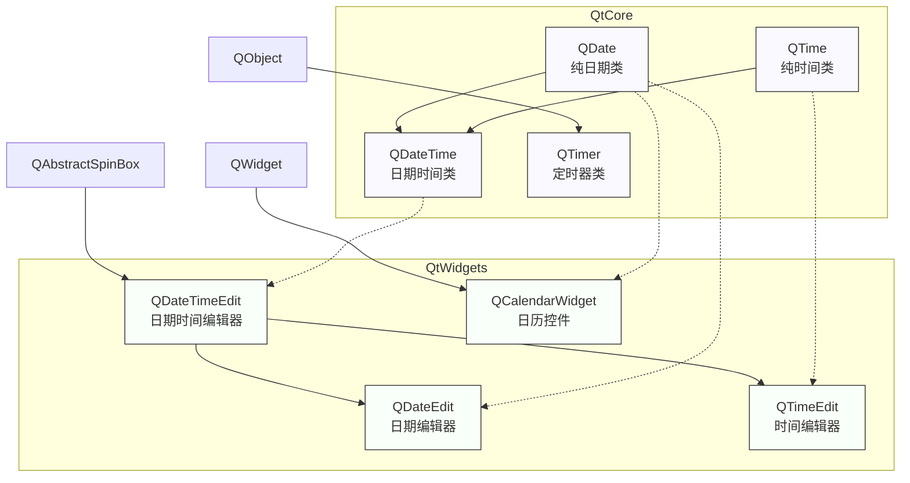

# Qt 日期与时间类总结：联系与区别

<details> <summary>#### 1️⃣ 原理深度解构层</summary>

## 时间日期类体系

### 类别划分与继承关系

**▌数据存储类（QtCore模块）**

- ```
  QDate
  ```

  、

  ```
  QTime
  ```

  、

  ```
  QDateTime
  ```

   \- 继承自无父类

  - 纯数据类，不含UI元素
  - 共享时间运算与转换能力

**▌UI交互类**

- ```
  QDateTimeEdit
  ```

  、

  ```
  QDateEdit
  ```

  、

  ```
  QTimeEdit
  ```

   \- 继承自 

  ```
  QAbstractSpinBox
  ```

  - 用于显示和编辑日期/时间
  - 共享微调框行为

**▌功能类**

- ```
  QTimer
  ```

   \- 继承自 

  ```
  QObject
  ```

  - 支持定时触发

- ```
  QCalendarWidget
  ```

   \- 继承自 

  ```
  QWidget
  ```

  - 日历UI组件

### 三线解析法

#### ① 运行时行为

**生命周期与事件传递：**

```
QDateTime (值对象)
├── 创建：构造函数/静态方法如currentDateTime()
├── 数据修改：非破坏性，返回新实例
└── 销毁：自动栈释放或堆上手动delete

QDateTimeEdit (UI对象)
├── 创建：构造函数，通常需指定父对象
├── 事件流：用户交互 → 内部值变更 → dateTimeChanged信号
└── 销毁：父对象析构链或手动delete
```

#### ② 框架源码线索

- 数据类: `qdate.h`, `qtime.h`, `qdatetime.h` 在 `QtCore` 模块
- 计时器: `qtimer.h` 在 `QtCore` 中，内部使用 `QTimerEvent`（在 `qcoreevent.h`）
- 编辑类: `qdatetimeedit.h` 在 `QtWidgets` 模块，派生自 `QAbstractSpinBox`（`qabstractspinbox.h`）

#### ③ 计算机科学映射

- 日期时间处理 ≈ 不可变值对象模式（immutable value object）
- 时间计算 ≈ 算术运算符重载 + 特化单位转换
- 日期时区 ≈ 地理位置感知的时间状态机

### 内存可视化

```
QMainWindow
├── dateTimeEdit (QDateTimeEdit)  // 父对象析构时自动删除
│   └── [内含QDateTimePrivate数据]
├── timer (QTimer)               // 需关联父对象或deleteLater
└── calendarWidget (QCalendarWidget) // 父对象析构时自动删除
```

</details> <details> <summary>#### 2️⃣ 知识拓扑网络</summary>

## 类关系映射

### 横向依赖关系

```
[QtCore]                                [QtWidgets]
QDate ────┐                       QDateEdit
          │                            ↑
QTime ────┼─→ QDateTime ─────────→ QDateTimeEdit ←── QCalendarWidget
          │       ↑                    ↑              (选择日期)
QTimer ───┘       │                    │
                  └────────────── QTimeEdit
```

### 纵向版本演进

| 功能     | Qt5实现                    | Qt6变更              | 迁移成本 |
| -------- | -------------------------- | -------------------- | -------- |
| 日期范围 | QDate有min/max静态成员标识 | 保持一致             | ★☆☆☆☆    |
| 时区支持 | QTimeZone类独立            | 增强与QDateTime集成  | ★★☆☆☆    |
| 日历系统 | 仅支持公历                 | 🔥 添加多日历系统支持 | ★★★☆☆    |

### 深度对比

| 特性     | Qt时间类                | C++标准库 (C++20)      | 选择建议        |
| -------- | ----------------------- | ---------------------- | --------------- |
| 序列化   | 自带toString/fromString | 需自行实现             | UI应用首选Qt    |
| 浮点精度 | 毫秒级整数表示          | 纳秒级浮点表示         | 高精度计算用std |
| 国际化   | 自带本地化              | 需额外处理             | 多语言应用用Qt  |
| 时区处理 | QTimeZone               | std::chrono::time_zone | 跨平台用Qt      |

</details> <details> <summary>#### 3️⃣ 认知强化体系</summary>

## 对比与记忆增强

### 数据类对比表

| 类名      | 存储内容       | 精度 | 范围                          | 主要用途   |
| --------- | -------------- | ---- | ----------------------------- | ---------- |
| QDate     | 年月日         | 天   | 公元前4713年~公元11,379,551年 | 日历日期   |
| QTime     | 时分秒毫秒     | 毫秒 | 0:00:00.000~23:59:59.999      | 时钟时间   |
| QDateTime | 日期+时间+时区 | 毫秒 | QDate范围×QTime范围           | 完整时间戳 |

### UI类对比表

| 类名            | 基类             | 显示内容   | 特有功能           |
| --------------- | ---------------- | ---------- | ------------------ |
| QDateEdit       | QDateTimeEdit    | 仅日期     | setCalendarPopup() |
| QTimeEdit       | QDateTimeEdit    | 仅时间     | setDisplayFormat() |
| QDateTimeEdit   | QAbstractSpinBox | 日期和时间 | 完整日期时间编辑   |
| QCalendarWidget | QWidget          | 月历视图   | 可视化日期选择     |

### 速查口诀

- "日期时区换算难，`toTimeSpec()`来解难"
- "增减日期用`addDays()`，不可直接加天数"
- "时间比对用`secsTo()`，精确计算不出错"
- "计时一次用`singleShot()`，重复触发设`interval()`"

</details> <details> <summary>#### 4️⃣ 工程化实践框架</summary>

## 开发实践指南

### 设计期考量

- **日期时间类选择决策树**：

  ```
  需要UI显示编辑? → 是 → QDateTimeEdit系列
                  → 否 → 需要定时触发? → 是 → QTimer
                                     → 否 → QDateTime系列
  ```

- **性能与内存考量**：

  - QDate/QTime为轻量值对象，适合大量实例
  - QDateTime较重，包含时区信息
  - QTimer创建过多会增加事件循环负担

### 安全红线清单

- 💀 避免在非主线程中直接访问日期编辑控件
- 💀 禁止使用数值直接构造时间（如`QTime(24, 0, 0)`）而应使用验证函数（如`QTime::isValid(24, 0, 0)`）
- 💀 避免依赖系统时钟进行关键业务逻辑，应考虑时钟漂移

### 调试技巧

- 使用`qDebug() << dateTime`可直接打印格式化时间
- 设置`QT_FORCE_TIMEZONE_UTC=1`环境变量强制UTC时区测试
- 通过`QDateTime::toString("yyyy-MM-dd hh:mm:ss.zzz t")`检查毫秒和时区信息

</details> <details> <summary>#### 5️⃣ 实用功能总结</summary>

## 功能特性总结

### 时间系统与概念

- **Epoch**：Qt与Unix相同，使用1970年1月1日UTC作为纪元起点
- **内部表示**：Qt使用qint64（毫秒数）存储从Epoch算起的偏移量
- **时区处理**：支持本地时间、UTC和自定义时区转换
- **Julian Day**：支持通过`QDate::toJulianDay()`和`QDate::fromJulianDay()`转换

### 核心类功能概述

**QDate**：纯日期类

- 日期算术：增加/减少天、月、年
- 日历信息：获取星期几、月天数、年天数
- 有效性验证：检查日期合法性

**QTime**：纯时间类

- 精确到毫秒：提供毫秒级精度
- 时间算术：增加/减少小时、分钟、秒
- 计时功能：计算时间差值

**QDateTime**：完整日期时间类

- 组合功能：整合QDate和QTime功能
- 时区转换：在不同时区间转换
- 时间戳：Unix时间戳转换

**QTimer**：计时器类

- 单次触发：`singleShot()`静态方法
- 重复触发：设置`interval`属性
- 精确控制：`start()`、`stop()`控制

**时间编辑控件**：

- 格式化显示：自定义日期/时间显示格式
- 范围限制：设置最小/最大可选日期时间
- 弹出日历：支持日历快速选择

</details>




这个总结提供了Qt日期和时间相关类的全面概览，重点展示了它们之间的联系与区别。我创建了一个关系图来直观展示这些类的层次结构。

## 核心区别与联系总结

### 按功能划分

1. **数据存储类** (QDate, QTime, QDateTime)
   - 纯数据类，不含UI元素
   - 作为值对象，可安全复制
   - 提供时间计算、转换和格式化能力
2. **UI交互类** (QDateTimeEdit, QDateEdit, QTimeEdit, QCalendarWidget)
   - 用于用户界面展示和编辑时间日期
   - 通过信号槽机制通知数据变更
3. **功能类** (QTimer)
   - 专注于定时器功能，提供时间事件

### 主要联系

- 数据类与UI类相互配合：UI类内部使用数据类存储实际值
- 所有类共享同一时间体系与格式化机制
- 共同支持国际化和时区处理

### 关键区别

- **精度不同**：QTime精确到毫秒，而编辑控件可配置显示精度
- **生命周期管理**：数据类为值对象，编辑类遵循Qt对象树管理
- **功能侧重**：数据类专注计算，UI类关注交互，QTimer专注定时

### 使用场景选择

- 仅需后台处理时间数据：使用QDate、QTime或QDateTime
- 需要用户编辑时间：使用QDateTimeEdit家族
- 需要定时执行任务：使用QTimer
- 需要完整日历选择：使用QCalendarWidget

通过这个简明的总结，您可以更系统地理解Qt中日期和时间相关类的整体结构和应用场景。